# Macro-Driven Entity Family Refactor

## Direction (confirmed)

- **Code-first**: a single `entity_family!` macro per entity emits Rust types AND a static SDL fragment string. `crate::gql::sdl()` concatenates collected fragments with the executable schema's Query/Mutation/Subscription. `semio/graphql/target.schema.graphql` becomes a regenerated golden file.
- **Full family scope**: 12-type ladder per entity as real Rust types backed by macros, plus owner-slot enums, owner unions, and `#[Object]` shells. Operations get a sibling `operation_family!` macro.

## Architecture

```mermaid
flowchart TD
    EntityDsl["entity_family! { name, kind, owners, owns, fields, hash_tag }"]
    OpDsl["operation_family! { name, scope_kind, input?, output, hash_tag }"]
    NavDsl["command_nav! { name, artifact, owner_id_field, methods }"]
    InputDsl["entity_input! { name, fields }"]
    Roster["register_entities! / register_operations!"]

    EntityDsl --> Struct["X struct + Default + Constructors"]
    EntityDsl --> Object["#[Object] impl X { id, hash, owner, ownerEntity, ownedEntities, fields }"]
    EntityDsl --> OwnerSlot["XOwnerSlot enum + XOwnerUnion"]
    EntityDsl --> Relay["XEdge / XConnection"]
    EntityDsl --> Diff["XDiff / XDiffEdge / XDiffConnection"]
    EntityDsl --> Mod["XModification / Edge / Connection"]
    EntityDsl --> Mods["XModifications / Edge / Connection"]
    EntityDsl --> Hash["compute_hash() with sorted child digests"]

    OpDsl --> OpStruct["X (Operation) + XInput? + XEdge + XConnection"]
    OpDsl --> KitOp["KitOperation::X variant + Scope arm + Input arm"]
    OpDsl --> Apply["apply_to(kit) skeleton"]

    NavDsl --> NavStruct["XOperationNav struct + Object impl + dispatch_wip plumbing"]

    InputDsl --> InputStruct["XInput InputObject + into_x() + into_x_with_id()"]

    Roster --> OwnerUnions["entity_owner_unions! generates OwnerEntity / OwnedEntity / OwnedEntityConnection"]
    Roster --> IfaceEnums["entity_interface_enums! generates Node / Entity / WeakEntity / StrongEntity / Artifact / Diff / Modification / Operation / EntityEdge / EntityConnection ifaces"]
    Roster --> Push["push_all_fragments(out)"]

    EntityDsl --> SDLReg["sdl_registry::all_fragments()"]
    OpDsl --> SDLReg
    NavDsl --> SDLReg
    IfaceEnums --> SDLReg
    OwnerUnions --> SDLReg

    SDLReg --> SdlFn["gql::sdl()"]
    SdlFn --> Golden["semio/graphql/target.schema.graphql (regenerated golden)"]
    SdlFn --> Test["schema_matches_target_graphql_file (real round-trip)"]
```




## Key files

- [semio/rs/lib.rs](semio/rs/lib.rs) — single source for all macros and entities (workspace rule: keep code in existing files)
- [semio/graphql/target.schema.graphql](semio/graphql/target.schema.graphql) — regenerated golden after refactor
- [semio/rs/Cargo.toml](semio/rs/Cargo.toml) — already has `paste = "1.0"`; we'll lean on `paste::paste!` for ident concatenation. No new deps needed.

## Macro surface — what gets derived

This is **not just about schema generation**. Every repeated pattern in `lib.rs` becomes a macro. After the refactor, the only hand-written code per entity is its `entity_family!` declaration; everything else is derived.

What the macros derive (per category):

- **Schema / SDL**: type definitions, edge types, connection types, diff types, modification types, modifications collection types, interface implementations, owner/owned unions, input objects, scalars header.
- **Rust types**: entity structs, owner-slot enums, owner unions, edge structs, connection structs, diff structs, modification structs, modifications structs, input structs, default impls, debug impls.
- **Constructors**: `new(..) -> Arc<Self>`, `new_with_id(..) -> Arc<Self>`, `from_rows(..) -> Self` for connections.
- **Hashing**: `compute_hash()` (async, walks RwLocks), `compute_entity_hash()` (sync DTO leaves), connection hash via `merkle_collection`, diff/modification hash via `merkle_node_str` with sorted children. All hash tags follow `semio:<region>:<TypeName>` strictly via the macro.
- **Object impls**: `id`, `hash`, `owner`, `owner_entity`, `owned_entities`, plus one typed accessor per owner variant (`kitOwner`, `typeOwner`, ...), plus one resolver per data field (clones `RwLock` value), plus one resolver per child collection (returns relay `XConnection`).
- **Operations**: `KitOperation` enum + variants, `OperationKind` parallel enum, `OperationIface` union, per-op `Scope` and `Input` enum arms, per-op `to_diff()` and `apply_to(kit)` skeletons, GraphQL Operation entity (`CreatedTag`, `RenamedKit`, ...) + its `XInput` companion + Edge/Connection.
- **Mutation nav**: the `KitOperationNav` / `TagOperationNav` / `ConceptOperationNav` / ... structs that today repeat the same `change_id` + `Object` plumbing become a single `command_nav!` macro per artifact.
- **Inputs**: GraphQL `XInput` structs (`TagInput`, `ConceptInput`, ...) with `into_X` / `into_X_with_id` constructors auto-derived from the entity field list.
- **Owner mega-unions**: `iface::OwnerEntity` and `iface::OwnedEntity` are auto-grown from the registered entity roster.
- **Interface enums**: every GraphQL interface (`Entity`, `WeakEntity`, `StrongEntity`, `RichStrongEntity`, `Artifact`, `Document`, `Event`, `Version`, `Input`, `Diff`, `Modification`, `Operation`, `EntityEdge`, `EntityConnection`) becomes an `async_graphql::Interface` enum auto-populated from the entity roster.

## Macro surface — code blueprints

Everything below lives in a new `//#region 🧬 entity_dsl` section of [semio/rs/lib.rs](semio/rs/lib.rs).

### 1. SDL fragment registry (no new deps)

Each entity emits a `pub const SDL_FRAGMENT: &'static str`. A single bottom-of-file `register_entities!` invocation collects them into one slice:

```rust
pub mod sdl_registry {
    pub trait HasSdlFragment {
        const SDL_FRAGMENT: &'static str;
    }

    /// 📜 Concatenate all entity + operation + interface fragments + the
    /// executable schema's root-only SDL into one canonical string.
    pub fn all_fragments() -> Vec<&'static str> {
        let mut v = Vec::new();
        crate::entity_dsl::push_all_fragments(&mut v);
        v
    }
}
```

`push_all_fragments` is itself generated by the bottom-of-file roster macro:

```rust
register_entities! {
    geom:   [Vector, Point, Coordinate, Offset, Plane, Position, Location, Place],
    meta:   [Attribute, Author, File, Folder, Prop, Benchmark, Quality, Tag,
             Concept, Stat, Layer, Group, Family],
    type_:  [Type, Port, Connector, Representation],
    design: [Design, Piece, Side, Connection, Clump],
    root:   [Kit],
    vcs:    [Edit, Change, Checkpoint, TheKit, Alternative, Graph, Session, Conflict],
}

register_operations! {
    tag:        [CreatedTag, CreatedTags, RenamedTag, UpdatedTagDescription,
                 UpdatedTagIcon, AddedAttributeToTag, AddedAttributesToTag,
                 RemovedAttributeFromTag, RemovedAttributesFromTag,
                 DeletedTag, DeletedTags],
    concept:    [CreatedConcept, /* ...same shape... */ DeletedConcepts],
    quality:    [/* same shape */],
    port:       [/* same shape */],
    type_:      [/* same shape */],
    design:     [CreatedDesign, CreatedDesigns, DeletedDesign, DeletedDesigns,
                 FlattenedDesign, AddedAttributeToDesign, AddedAttributesToDesign,
                 RemovedAttributeFromDesign, RemovedAttributesFromDesign],
    piece:      [CreatedFixedPiece, FixedPiece, FixedPieces,
                 DraggedPieces, DraggedPiece,
                 AddedChildPieceWithParentConnection,
                 AddedChildPiecesWithParentConnections,
                 AddedHangingChildPieceWithParentConnection,
                 AddedHangingChildPiecesWithParentConnections,
                 RenamedPiece, UpdatedPieceDescription, MovedPiece, MovedPieces,
                 ChangedPieceToType, ChangedPiecesToType,
                 AddedAttributeToPiece, AddedAttributesToPiece,
                 RemovedAttributeFromPiece, RemovedAttributesFromPiece,
                 DeletedPiece, DeletedPieces, DeletedPiecesAndConnections],
    kit:        [RenamedKit, ChangedDescription],
    connector:  [AddedConnector, AddedConnectors, RenamedConnector,
                 UpdatedConnectorDescription, UpdatedConnectorIcon,
                 RemovedConnector, RemovedConnectors],
}
```

`register_entities!` expands to (sketch):

```rust
macro_rules! register_entities {
    ( $( $region:ident : [ $( $name:ident ),* $(,)? ] ),* $(,)? ) => {
        pub(crate) fn push_all_fragments(out: &mut Vec<&'static str>) {
            $( $( out.push(<$name as crate::sdl_registry::HasSdlFragment>::SDL_FRAGMENT); )* )*
        }

        // Auto-grow owner / owned mega-unions from the same roster.
        entity_owner_unions! { $( $( $name ),* ),* }

        // Auto-grow interface enums for Entity / WeakEntity / Artifact / ...
        entity_interface_enums! { $( $( $name ),* ),* }
    };
}
```

**Example.** A roster invocation:

```rust
register_entities! {
    geom: [Vector, Point, Coordinate],
    meta: [Tag, Concept, Quality],
    vcs:  [Edit, Change, Checkpoint],
}
```

expands to:

```rust
pub(crate) fn push_all_fragments(out: &mut Vec<&'static str>) {
    out.push(<Vector     as crate::sdl_registry::HasSdlFragment>::SDL_FRAGMENT);
    out.push(<Point      as crate::sdl_registry::HasSdlFragment>::SDL_FRAGMENT);
    out.push(<Coordinate as crate::sdl_registry::HasSdlFragment>::SDL_FRAGMENT);
    out.push(<Tag        as crate::sdl_registry::HasSdlFragment>::SDL_FRAGMENT);
    out.push(<Concept    as crate::sdl_registry::HasSdlFragment>::SDL_FRAGMENT);
    out.push(<Quality    as crate::sdl_registry::HasSdlFragment>::SDL_FRAGMENT);
    out.push(<Edit       as crate::sdl_registry::HasSdlFragment>::SDL_FRAGMENT);
    out.push(<Change     as crate::sdl_registry::HasSdlFragment>::SDL_FRAGMENT);
    out.push(<Checkpoint as crate::sdl_registry::HasSdlFragment>::SDL_FRAGMENT);
}
entity_owner_unions!  { Vector, Point, Coordinate, Tag, Concept, Quality, Edit, Change, Checkpoint }
entity_interface_enums!{ Vector, Point, Coordinate, Tag, Concept, Quality, Edit, Change, Checkpoint }
```

### 2. The workhorse: `entity_family!`

```rust
/// 🧬 Emit the full 12-type ladder for one entity:
///   X, XEdge, XConnection,
///   XDiff, XDiffEdge, XDiffConnection,
///   XModification, XModificationEdge, XModificationConnection,
///   XModifications, XModificationsEdge, XModificationsConnection
/// plus XOwnerSlot enum, XOwnerUnion, full Object impl, hashing, and SDL_FRAGMENT.
macro_rules! entity_family {
    (
        name: $name:ident,
        kind: $kind:ident,                             // weak | strong | rich | artifact | document | event | version
        sdl_implements: $iface:literal,                // exact `implements ...` clause
        owners: [$($owner:ident),* $(,)?],              // -> XOwnerSlot variants + XOwnerUnion
        owns:   [$($owned:ident),* $(,)?],              // -> appears in OwnedEntity union for this X
        fields: { $( $fname:ident : $fty:ty @ $fclass:ident $(($($extra:tt)*))? ),* $(,)? },
        hash_tag: $tag:literal $(,)?
    ) => {
        paste::paste! {
            // ── 🪪 Owner slot enum + Default ────────────────────────────────
            #[derive(Debug)]
            pub enum [<$name OwnerSlot>] {
                Unset,
                $( $owner(std::sync::Weak<$crate::__owner_ty!($owner)>), )*
            }
            impl Default for [<$name OwnerSlot>] {
                fn default() -> Self { Self::Unset }
            }

            // ── 🔗 Owner async-graphql Union ────────────────────────────────
            #[derive(Clone, async_graphql::Union)]
            pub enum [<$name OwnerUnion>] {
                $( $owner(std::sync::Arc<$crate::__owner_ty!($owner)>), )*
            }

            // ── 🏷️ Entity struct + Default + Constructors ───────────────────
            #[derive(Debug)]
            pub struct $name {
                pub id: $crate::id::Id,
                pub owner: async_lock::RwLock<[<$name OwnerSlot>]>,
                $( pub $fname: async_lock::RwLock<$fty>, )*
            }

            impl Default for $name {
                fn default() -> Self {
                    Self {
                        id: $crate::id::Id::default(),
                        owner: async_lock::RwLock::new(Default::default()),
                        $( $fname: async_lock::RwLock::new(Default::default()), )*
                    }
                }
            }

            impl $name {
                pub async fn new(
                    owner: [<$name OwnerSlot>],
                    $( $fname: $fty, )*
                ) -> std::sync::Arc<Self> {
                    std::sync::Arc::new(Self {
                        id: $crate::id::Id::new().await,
                        owner: async_lock::RwLock::new(owner),
                        $( $fname: async_lock::RwLock::new($fname), )*
                    })
                }

                pub fn new_with_id(
                    owner: [<$name OwnerSlot>],
                    id: $crate::id::Id,
                    $( $fname: $fty, )*
                ) -> std::sync::Arc<Self> {
                    std::sync::Arc::new(Self {
                        id,
                        owner: async_lock::RwLock::new(owner),
                        $( $fname: async_lock::RwLock::new($fname), )*
                    })
                }

                /// 🪪 Merkle leaf: type tag + id + each data field + sorted child digests.
                pub async fn compute_hash(&self) -> String {
                    let mut own: Vec<String> = vec![$tag.into(), self.id.0.clone()];
                    let mut children: Vec<String> = Vec::new();
                    $( $crate::__entity_field_to_hash!(self, own, children, $fname : $fty @ $fclass $(($($extra)*))?); )*
                    let own_refs: Vec<&str> = own.iter().map(String::as_str).collect();
                    $crate::hash::merkle_node_str(&own_refs, children)
                }
            }

            // ── 🧷 Object impl ──────────────────────────────────────────────
            #[async_graphql::Object(name = stringify!($name))]
            impl $name {
                pub async fn id(&self) -> $crate::id::Id { self.id.clone() }
                pub async fn hash(&self) -> String { self.compute_hash().await }

                pub async fn owner(&self) -> async_graphql::Result<[<$name OwnerUnion>]> {
                    match &*self.owner.read().await {
                        $( [<$name OwnerSlot>]::$owner(w) =>
                            w.upgrade()
                              .map([<$name OwnerUnion>]::$owner)
                              .ok_or_else(|| async_graphql::Error::new(
                                  concat!(stringify!($name), ".", stringify!($owner), " owner dropped"))), )*
                        [<$name OwnerSlot>]::Unset =>
                            Err(async_graphql::Error::new(concat!(stringify!($name), ".owner unset"))),
                    }
                }

                $( $crate::__typed_owner_resolver!($name, $owner); )*

                #[graphql(name = "ownerEntity")]
                pub async fn owner_entity(&self) -> Option<std::sync::Arc<$crate::iface::OwnerEntity>> {
                    let raw = match &*self.owner.read().await {
                        $( [<$name OwnerSlot>]::$owner(w) =>
                            w.upgrade().map($crate::iface::OwnerEntity::$owner), )*
                        [<$name OwnerSlot>]::Unset => None,
                    };
                    raw.map($crate::iface::owner_entity_arc)
                }

                #[graphql(name = "ownedEntities")]
                pub async fn owned_entities(&self) -> Option<std::sync::Arc<$crate::iface::OwnedEntityConnection>> {
                    Some($crate::iface::empty_owned_entity_connection())
                }

                $( $crate::__entity_field_resolver!($name, $fname : $fty @ $fclass $(($($extra)*))?); )*
            }

            // ── 🪢 Relay Edge / Connection ─────────────────────────────────
            $crate::__entity_relay!($name);

            // ── 📐 Diff / DiffEdge / DiffConnection ─────────────────────────
            $crate::__entity_diff!($name, $tag, { $( $fname : $fty @ $fclass ),* });

            // ── ✏️ Modification / Edge / Connection ─────────────────────────
            $crate::__entity_modification!($name, $tag);

            // ── 📚 Modifications / Edge / Connection ────────────────────────
            $crate::__entity_modifications!($name, $tag);

            // ── 📜 SDL fragment ─────────────────────────────────────────────
            impl crate::sdl_registry::HasSdlFragment for $name {
                const SDL_FRAGMENT: &'static str =
                    $crate::__build_sdl_fragment!($name, $iface, { $( $fname : $fty @ $fclass ),* });
            }
        }
    };
}
```

**Example.** A minimal `Coordinate` invocation:

```rust
entity_family! {
    name: Coordinate,
    kind: weak,
    sdl_implements: "WeakEntity",
    owners: [Position, PositionDiff],
    owns:   [],
    fields: { u: f64 @data, v: f64 @data },
    hash_tag: "semio:geom:Coordinate",
}
```

expands to (sketch):

```rust
pub enum CoordinateOwnerSlot { Unset, Position(Weak<Position>), PositionDiff(Weak<PositionDiff>) }
impl Default for CoordinateOwnerSlot { fn default() -> Self { Self::Unset } }

#[derive(Clone, async_graphql::Union)]
pub enum CoordinateOwnerUnion {
    Position(Arc<Position>),
    PositionDiff(Arc<PositionDiff>),
}

pub struct Coordinate {
    pub id: Id,
    pub owner: RwLock<CoordinateOwnerSlot>,
    pub u: RwLock<f64>,
    pub v: RwLock<f64>,
}

impl Coordinate {
    pub async fn new(owner: CoordinateOwnerSlot, u: f64, v: f64) -> Arc<Self> { /* … */ }
    pub fn new_with_id(owner: CoordinateOwnerSlot, id: Id, u: f64, v: f64) -> Arc<Self> { /* … */ }
    pub async fn compute_hash(&self) -> String {
        let own = vec!["semio:geom:Coordinate".into(), self.id.0.clone(),
                       format!("{:.9}", *self.u.read().await),
                       format!("{:.9}", *self.v.read().await)];
        crate::hash::merkle_node_str(&own.iter().map(String::as_str).collect::<Vec<_>>(), Vec::new())
    }
}

#[async_graphql::Object(name = "Coordinate")]
impl Coordinate {
    pub async fn id(&self) -> Id { self.id.clone() }
    pub async fn hash(&self) -> String { self.compute_hash().await }
    pub async fn owner(&self) -> async_graphql::Result<CoordinateOwnerUnion> { /* … */ }
    #[graphql(name = "positionOwner")]      pub async fn position_owner(&self)      -> Option<Arc<Position>>     { /* … */ }
    #[graphql(name = "positionDiffOwner")]  pub async fn position_diff_owner(&self) -> Option<Arc<PositionDiff>> { /* … */ }
    #[graphql(name = "ownerEntity")]        pub async fn owner_entity(&self) -> Option<Arc<OwnerEntity>> { /* … */ }
    #[graphql(name = "ownedEntities")]      pub async fn owned_entities(&self) -> Option<Arc<OwnedEntityConnection>> { /* … */ }
    pub async fn u(&self) -> f64 { *self.u.read().await }
    pub async fn v(&self) -> f64 { *self.v.read().await }
}

// + CoordinateEdge, CoordinateConnection (via __entity_relay!)
// + CoordinateDiff, CoordinateDiffEdge, CoordinateDiffConnection (via __entity_diff!)
// + CoordinateModification, CoordinateModificationEdge, CoordinateModificationConnection (via __entity_modification!)
// + CoordinateModifications, CoordinateModificationsEdge, CoordinateModificationsConnection (via __entity_modifications!)
// + impl HasSdlFragment for Coordinate { const SDL_FRAGMENT: &str = "type Coordinate implements WeakEntity { … }" }
```

### 3. Helper macros: relay / diff / modification / modifications

```rust
#[doc(hidden)]
#[macro_export]
macro_rules! __entity_relay {
    ($name:ident) => {
        paste::paste! {
            #[derive(Clone, async_graphql::SimpleObject)]
            pub struct [<$name Edge>] {
                pub cursor: String,
                pub node: std::sync::Arc<$name>,
            }

            #[derive(Clone, async_graphql::SimpleObject)]
            pub struct [<$name Connection>] {
                pub edges: Vec<[<$name Edge>]>,
                #[graphql(name = "pageInfo")]
                pub page_info: std::sync::Arc<$crate::gql_relay::PageInfo>,
                pub hash: String,
            }

            impl [<$name Connection>] {
                pub async fn from_rows(rows: Vec<std::sync::Arc<$name>>) -> Self {
                    let mut child_hashes = Vec::with_capacity(rows.len());
                    for r in &rows { child_hashes.push(r.compute_hash().await); }
                    let hash = $crate::hash::merkle_collection(child_hashes);
                    let edges = rows.into_iter().enumerate()
                        .map(|(i, n)| [<$name Edge>] { cursor: $crate::gql_relay::edge_cursor(i), node: n })
                        .collect();
                    Self { edges, page_info: std::sync::Arc::new($crate::gql_relay::PageInfo::default()), hash }
                }
                pub fn empty() -> Self {
                    Self {
                        edges: Vec::new(),
                        page_info: std::sync::Arc::new($crate::gql_relay::PageInfo::default()),
                        hash: $crate::hash::merkle_collection(Vec::new()),
                    }
                }
            }
        }
    };
}

#[doc(hidden)]
#[macro_export]
macro_rules! __entity_diff {
    ($name:ident, $tag:literal, { $( $fname:ident : $fty:ty @ $fclass:ident ),* }) => {
        paste::paste! {
            #[derive(Clone, Debug, Default, async_graphql::SimpleObject)]
            #[graphql(complex)]
            pub struct [<$name Diff>] {
                pub id: $crate::id::Id,
                $( pub $fname: $crate::__diff_field_ty!($fty @ $fclass), )*
            }

            #[async_graphql::ComplexObject]
            impl [<$name Diff>] {
                pub async fn hash(&self) -> String {
                    $crate::hash::merkle_node_str(
                        &[concat!($tag, ":Diff"), self.id.0.as_str()],
                        Vec::new(),
                    )
                }
                #[graphql(name = "ownerEntity")]
                pub async fn owner_entity(&self) -> Option<std::sync::Arc<$crate::iface::OwnerEntity>> { None }
                #[graphql(name = "ownedEntities")]
                pub async fn owned_entities(&self) -> Option<std::sync::Arc<$crate::iface::OwnedEntityConnection>> {
                    Some($crate::iface::empty_owned_entity_connection())
                }
            }

            $crate::__simple_relay!([<$name DiffEdge>], [<$name DiffConnection>], [<$name Diff>]);
        }
    };
}

#[doc(hidden)]
#[macro_export]
macro_rules! __entity_modification {
    ($name:ident, $tag:literal) => {
        paste::paste! {
            #[derive(Clone, async_graphql::SimpleObject)]
            #[graphql(complex)]
            pub struct [<$name Modification>] {
                pub id: $crate::id::Id,
                pub before: std::sync::Arc<$name>,
                pub diff:   std::sync::Arc<[<$name Diff>]>,
                pub after:  std::sync::Arc<$name>,
            }
            #[async_graphql::ComplexObject]
            impl [<$name Modification>] {
                pub async fn hash(&self) -> String {
                    let parts = [concat!($tag, ":Modification"), self.id.0.as_str()];
                    let children = vec![
                        self.before.compute_hash().await,
                        self.diff.hash().await,
                        self.after.compute_hash().await,
                    ];
                    $crate::hash::merkle_node_str(&parts, children)
                }
            }
            $crate::__simple_relay!([<$name ModificationEdge>], [<$name ModificationConnection>], [<$name Modification>]);
        }
    };
}

#[doc(hidden)]
#[macro_export]
macro_rules! __entity_modifications {
    ($name:ident, $tag:literal) => {
        paste::paste! {
            #[derive(Clone, async_graphql::SimpleObject)]
            #[graphql(complex)]
            pub struct [<$name Modifications>] {
                pub id: $crate::id::Id,
                pub removed:       std::sync::Arc<[<$name Connection>]>,
                pub modifications: std::sync::Arc<[<$name ModificationConnection>]>,
                pub added:         std::sync::Arc<[<$name Connection>]>,
            }
            #[async_graphql::ComplexObject]
            impl [<$name Modifications>] {
                pub async fn hash(&self) -> String {
                    let parts = [concat!($tag, ":Modifications"), self.id.0.as_str()];
                    let children = vec![
                        self.removed.hash.clone(),
                        self.modifications.hash.clone(),
                        self.added.hash.clone(),
                    ];
                    $crate::hash::merkle_node_str(&parts, children)
                }
            }
            $crate::__simple_relay!([<$name ModificationsEdge>], [<$name ModificationsConnection>], [<$name Modifications>]);
        }
    };
}

#[doc(hidden)]
#[macro_export]
macro_rules! __simple_relay {
    ($edge:ident, $conn:ident, $node:ident) => {
        #[derive(Clone, async_graphql::SimpleObject)]
        pub struct $edge {
            pub cursor: String,
            pub node: std::sync::Arc<$node>,
        }
        #[derive(Clone, async_graphql::SimpleObject)]
        pub struct $conn {
            pub edges: Vec<$edge>,
            #[graphql(name = "pageInfo")]
            pub page_info: std::sync::Arc<$crate::gql_relay::PageInfo>,
            pub hash: String,
        }
    };
}
```

**Examples (helper macros).**

`__entity_relay!(Tag);` produces:

```rust
pub struct TagEdge      { pub cursor: String, pub node: Arc<Tag> }
pub struct TagConnection {
    pub edges: Vec<TagEdge>,
    #[graphql(name = "pageInfo")] pub page_info: Arc<PageInfo>,
    pub hash: String,
}
impl TagConnection {
    pub async fn from_rows(rows: Vec<Arc<Tag>>) -> Self { /* hashes children, builds edges */ }
    pub fn empty() -> Self { /* … */ }
}
```

`__entity_diff!(Tag, "semio:meta:Tag", { name: String @data, order: Option<i32> @data, attributes: Vec<Attribute> @children(AttributeConnection) });` produces:

```rust
pub struct TagDiff {
    pub id: Id,
    pub name:        Option<String>,
    pub order:       Option<i32>,
    pub attributes:  Option<AttributeConnection>,
}
#[ComplexObject] impl TagDiff {
    pub async fn hash(&self) -> String { /* merkle leaf "semio:meta:Tag:Diff" + id */ }
    /* + ownerEntity / ownedEntities */
}
__simple_relay!(TagDiffEdge, TagDiffConnection, TagDiff);
```

`__entity_modification!(Tag, "semio:meta:Tag");` produces:

```rust
pub struct TagModification { pub id: Id, pub before: Arc<Tag>, pub diff: Arc<TagDiff>, pub after: Arc<Tag> }
#[ComplexObject] impl TagModification { pub async fn hash(&self) -> String { /* merkle of before+diff+after */ } }
__simple_relay!(TagModificationEdge, TagModificationConnection, TagModification);
```

`__entity_modifications!(Tag, "semio:meta:Tag");` produces:

```rust
pub struct TagModifications {
    pub id: Id,
    pub removed:       Arc<TagConnection>,
    pub modifications: Arc<TagModificationConnection>,
    pub added:         Arc<TagConnection>,
}
#[ComplexObject] impl TagModifications { pub async fn hash(&self) -> String { /* merkle of three sub-conn hashes */ } }
__simple_relay!(TagModificationsEdge, TagModificationsConnection, TagModifications);
```

`__simple_relay!(MyFooEdge, MyFooConnection, MyFoo);` produces a 2-struct `Edge` + `Connection` pair (no `from_rows` constructor — that's an entity-relay concern).

### 4. Field DSL — accessor + hash + diff dispatchers

The `@class` annotation per field controls what's emitted:


| Annotation                      | GraphQL type   | Hash contribution            | Resolver                                             |
| ------------------------------- | -------------- | ---------------------------- | ---------------------------------------------------- |
| `String @data`                  | `String!`      | raw value                    | `read().await.clone()`                               |
| `Option<String> @data`          | `String`       | unwrap_or_default            | `read().await.clone()`                               |
| `i32 @data`                     | `Int!`         | `to_string()`                | `*read().await`                                      |
| `Option<i32> @data`             | `Int`          | `map.to_string`              | `*read().await`                                      |
| `f64 @data`                     | `Float!`       | `format!("{:.9}")`           | `*read().await`                                      |
| `bool @data`                    | `Boolean!`     | `"1"/"0"`                    | `*read().await`                                      |
| `Timestamp @data`               | `Timestamp`    | inner string                 | clone                                                |
| `Vec<X> @children(XConnection)` | `XConnection!` | sorted child hashes          | `XConnection::from_rows(read().await.clone()).await` |
| `Arc<X> @entity`                | `X!`           | child `compute_hash().await` | clone Arc                                            |
| `Option<Arc<X>> @entity`        | `X`            | child hash if present        | clone Arc                                            |
| `Vec<Id> @ids`                  | `[ID!]!`       | sorted id strings            | clone                                                |


```rust
#[doc(hidden)]
#[macro_export]
macro_rules! __entity_field_resolver {
    ($host:ident, $f:ident : String @ data)         => { pub async fn $f(&self) -> String          { self.$f.read().await.clone() } };
    ($host:ident, $f:ident : Option<String> @ data) => { pub async fn $f(&self) -> Option<String>  { self.$f.read().await.clone() } };
    ($host:ident, $f:ident : i32 @ data)            => { pub async fn $f(&self) -> i32             { *self.$f.read().await } };
    ($host:ident, $f:ident : Option<i32> @ data)    => { pub async fn $f(&self) -> Option<i32>     { *self.$f.read().await } };
    ($host:ident, $f:ident : f64 @ data)            => { pub async fn $f(&self) -> f64             { *self.$f.read().await } };
    ($host:ident, $f:ident : bool @ data)           => { pub async fn $f(&self) -> bool            { *self.$f.read().await } };
    ($host:ident, $f:ident : $t:ty @ entity)        => { pub async fn $f(&self) -> $t              { self.$f.read().await.clone() } };
    ($host:ident, $f:ident : Vec<$child:ty> @ children($conn:ident)) => {
        pub async fn $f(&self) -> $crate::gql_relay::$conn {
            $crate::gql_relay::$conn::from_rows(self.$f.read().await.clone()).await
        }
    };
}

#[doc(hidden)]
#[macro_export]
macro_rules! __entity_field_to_hash {
    ($self:ident, $own:ident, $ch:ident, $f:ident : String @ data) => {
        $own.push($self.$f.read().await.clone());
    };
    ($self:ident, $own:ident, $ch:ident, $f:ident : Option<String> @ data) => {
        $own.push($self.$f.read().await.clone().unwrap_or_default());
    };
    ($self:ident, $own:ident, $ch:ident, $f:ident : i32 @ data) => {
        $own.push((*$self.$f.read().await).to_string());
    };
    ($self:ident, $own:ident, $ch:ident, $f:ident : Option<i32> @ data) => {
        $own.push($self.$f.read().await.map(|v| v.to_string()).unwrap_or_default());
    };
    ($self:ident, $own:ident, $ch:ident, $f:ident : f64 @ data) => {
        $own.push(format!("{:.9}", *$self.$f.read().await));
    };
    ($self:ident, $own:ident, $ch:ident, $f:ident : bool @ data) => {
        $own.push(if *$self.$f.read().await { "1".into() } else { "0".into() });
    };
    ($self:ident, $own:ident, $ch:ident, $f:ident : Vec<$child:ty> @ children($conn:ident)) => {{
        let rows = $self.$f.read().await;
        let mut h: Vec<String> = Vec::with_capacity(rows.len());
        for r in rows.iter() { h.push(r.compute_entity_hash()); }
        h.sort();
        $ch.extend(h);
    }};
    ($self:ident, $own:ident, $ch:ident, $f:ident : $t:ty @ entity) => {{
        let v = $self.$f.read().await.clone();
        $ch.push(v.compute_hash().await);
    }};
}

#[doc(hidden)]
#[macro_export]
macro_rules! __diff_field_ty {
    (String @ data)           => { Option<String> };
    (Option<String> @ data)   => { Option<String> };
    (i32 @ data)              => { Option<i32> };
    (Option<i32> @ data)      => { Option<i32> };
    (f64 @ data)              => { Option<f64> };
    (bool @ data)             => { Option<bool> };
    (Timestamp @ data)        => { Option<$crate::timestamp::Timestamp> };
    (Vec<$c:ty> @ children($conn:ident)) => { Option<$crate::gql_relay::$conn> };
    ($t:ty @ entity)          => { Option<$t> };
}

#[doc(hidden)]
#[macro_export]
macro_rules! __typed_owner_resolver {
    ($host:ident, $owner:ident) => {
        paste::paste! {
            #[graphql(name = "" $owner:lower "Owner")]
            pub async fn [<$owner:snake _owner>](&self) -> Option<std::sync::Arc<$crate::__owner_ty!($owner)>> {
                match &*self.owner.read().await {
                    [<$host OwnerSlot>]::$owner(w) => w.upgrade(),
                    _ => None,
                }
            }
        }
    };
}

#[doc(hidden)]
#[macro_export]
macro_rules! __owner_ty {
    (Kit)            => { $crate::kit::Kit };
    (Type)           => { $crate::kit::r#type::Type };
    (Port)           => { $crate::kit::r#type::Port };
    (Connector)      => { $crate::kit::r#type::Connector };
    (Representation) => { $crate::kit::r#type::Representation };
    (Design)         => { $crate::kit::design::Design };
    (Piece)          => { $crate::kit::design::piece::Piece };
    (Connection)     => { $crate::kit::design::connection::Connection };
    // ... one arm per entity in the roster, generated alongside register_entities!
    ($other:ident)   => { $crate::__autoresolved_owner!($other) };
}
```

**Examples (field DSL).**

`__entity_field_resolver!(Tag, name: String @data);` produces:

```rust
pub async fn name(&self) -> String { self.name.read().await.clone() }
```

`__entity_field_resolver!(Tag, attributes: Vec<Attribute> @children(AttributeConnection));` produces:

```rust
pub async fn attributes(&self) -> crate::gql_relay::AttributeConnection {
    crate::gql_relay::AttributeConnection::from_rows(self.attributes.read().await.clone()).await
}
```

`__entity_field_to_hash!(self, own, children, name: String @data);` expands to:

```rust
own.push(self.name.read().await.clone());
```

`__entity_field_to_hash!(self, own, children, attributes: Vec<Attribute> @children(AttributeConnection));` expands to:

```rust
{
    let rows = self.attributes.read().await;
    let mut h: Vec<String> = Vec::with_capacity(rows.len());
    for r in rows.iter() { h.push(r.compute_entity_hash()); }
    h.sort();
    children.extend(h);
}
```

`__diff_field_ty!(String @ data)` evaluates to the type token `Option<String>`; `__diff_field_ty!(Vec<Attribute> @ children(AttributeConnection))` evaluates to `Option<crate::gql_relay::AttributeConnection>`.

`__typed_owner_resolver!(Tag, Kit);` produces:

```rust
#[graphql(name = "kitOwner")]
pub async fn kit_owner(&self) -> Option<std::sync::Arc<crate::kit::Kit>> {
    match &*self.owner.read().await {
        TagOwnerSlot::Kit(w) => w.upgrade(),
        _ => None,
    }
}
```

`__owner_ty!(Connector)` evaluates to the type path `crate::kit::r#type::Connector`. The fallback `($other:ident)` arm exists so freshly added entities with no explicit arm route through `__autoresolved_owner!`, which (as a sibling generated by `register_entities!`) provides `($EntityName) => { crate::path::to::EntityName }` arms for every entity in the roster.

### 5. SDL fragment builder

```rust
#[doc(hidden)]
#[macro_export]
macro_rules! __build_sdl_fragment {
    ($name:ident, $iface:literal, { $( $fname:ident : $fty:ty @ $fclass:ident ),* }) => {
        concat!(
            "type ", stringify!($name), " implements ", $iface, " {\n",
            "  id: ID!\n",
            "  hash: String!\n",
            "  owner: Entity\n",
            "  owns: EntityConnection\n",
            $( $crate::__sdl_field_line!($fname : $fty @ $fclass), )*
            "}\n\n",
            $crate::__sdl_relay_block!($name),
            $crate::__sdl_diff_block!($name, { $( $fname : $fty @ $fclass ),* }),
            $crate::__sdl_mod_block!($name),
            $crate::__sdl_mods_block!($name),
        )
    };
}

#[doc(hidden)]
#[macro_export]
macro_rules! __sdl_field_line {
    ($f:ident : String @ data)            => { concat!("  ", stringify!($f), ": String!\n") };
    ($f:ident : Option<String> @ data)    => { concat!("  ", stringify!($f), ": String\n") };
    ($f:ident : i32 @ data)               => { concat!("  ", stringify!($f), ": Int!\n") };
    ($f:ident : Option<i32> @ data)       => { concat!("  ", stringify!($f), ": Int\n") };
    ($f:ident : f64 @ data)               => { concat!("  ", stringify!($f), ": Float!\n") };
    ($f:ident : bool @ data)              => { concat!("  ", stringify!($f), ": Boolean!\n") };
    ($f:ident : $t:ty @ entity)           => { concat!("  ", stringify!($f), ": ", stringify!($t), "!\n") };
    ($f:ident : Vec<$c:ty> @ children($conn:ident)) => {
        concat!("  ", stringify!($f), ": ", stringify!($conn), "!\n")
    };
}

#[doc(hidden)]
#[macro_export]
macro_rules! __sdl_relay_block {
    ($name:ident) => {
        concat!(
            "type ", stringify!($name), "Edge implements EntityEdge {\n",
            "  cursor: String!\n",
            "  node: ", stringify!($name), "!\n",
            "}\n\n",
            "type ", stringify!($name), "Connection implements EntityConnection {\n",
            "  edges: [", stringify!($name), "Edge!]!\n",
            "  pageInfo: PageInfo!\n",
            "  hash: String!\n",
            "}\n\n",
        )
    };
}

#[doc(hidden)]
#[macro_export]
macro_rules! __sdl_diff_block {
    ($name:ident, { $( $fname:ident : $fty:ty @ $fclass:ident ),* }) => {
        concat!(
            "type ", stringify!($name), "Diff implements Diff {\n",
            "  id: ID!\n",
            "  hash: String!\n",
            "  owner: Entity\n",
            "  owns: EntityConnection\n",
            $( $crate::__sdl_diff_field_line!($fname : $fty @ $fclass), )*
            "}\n\n",
            "type ", stringify!($name), "DiffEdge implements EntityEdge {\n",
            "  cursor: String!\n",
            "  node: ", stringify!($name), "Diff!\n",
            "}\n\n",
            "type ", stringify!($name), "DiffConnection implements EntityConnection {\n",
            "  edges: [", stringify!($name), "DiffEdge!]!\n",
            "  pageInfo: PageInfo!\n",
            "  hash: String!\n",
            "}\n\n",
        )
    };
}

#[doc(hidden)]
#[macro_export]
macro_rules! __sdl_diff_field_line {
    ($f:ident : String @ data)         => { concat!("  ", stringify!($f), ": String\n") };
    ($f:ident : Option<String> @ data) => { concat!("  ", stringify!($f), ": String\n") };
    ($f:ident : i32 @ data)            => { concat!("  ", stringify!($f), ": Int\n") };
    ($f:ident : Option<i32> @ data)    => { concat!("  ", stringify!($f), ": Int\n") };
    ($f:ident : f64 @ data)            => { concat!("  ", stringify!($f), ": Float\n") };
    ($f:ident : bool @ data)           => { concat!("  ", stringify!($f), ": Boolean\n") };
    ($f:ident : $t:ty @ entity)        => { concat!("  ", stringify!($f), ": ", stringify!($t), "\n") };
    ($f:ident : Vec<$c:ty> @ children($conn:ident)) => {
        concat!("  ", stringify!($f), ": ", stringify!($conn), "\n")
    };
}

#[doc(hidden)]
#[macro_export]
macro_rules! __sdl_mod_block {
    ($name:ident) => { concat!(
        "type ", stringify!($name), "Modification implements Modification {\n",
        "  id: ID!\n  hash: String!\n  owner: Entity\n  owns: EntityConnection\n",
        "  before: Entity!\n  diff: Diff!\n  after: Entity!\n",
        "}\n\n",
        "type ", stringify!($name), "ModificationEdge implements EntityEdge {\n",
        "  cursor: String!\n  node: ", stringify!($name), "Modification!\n",
        "}\n\n",
        "type ", stringify!($name), "ModificationConnection implements EntityConnection {\n",
        "  edges: [", stringify!($name), "ModificationEdge!]!\n",
        "  pageInfo: PageInfo!\n  hash: String!\n",
        "}\n\n",
    ) };
}

#[doc(hidden)]
#[macro_export]
macro_rules! __sdl_mods_block {
    ($name:ident) => { concat!(
        "type ", stringify!($name), "Modifications implements WeakEntity {\n",
        "  id: ID!\n  hash: String!\n  owner: Entity\n  owns: EntityConnection\n",
        "  removed: EntityConnection\n",
        "  modifications: ", stringify!($name), "ModificationConnection\n",
        "  added: EntityConnection\n",
        "}\n\n",
        "type ", stringify!($name), "ModificationsEdge implements EntityEdge {\n",
        "  cursor: String!\n  node: ", stringify!($name), "Modifications!\n",
        "}\n\n",
        "type ", stringify!($name), "ModificationsConnection implements EntityConnection {\n",
        "  edges: [", stringify!($name), "ModificationsEdge!]!\n",
        "  pageInfo: PageInfo!\n  hash: String!\n",
        "}\n\n",
    ) };
}
```

**Examples (SDL builders).**

`__sdl_field_line!(name: String @data)` evaluates to the literal:

```text
  name: String!
```

`__sdl_field_line!(attributes: Vec<Attribute> @children(AttributeConnection))` evaluates to:

```text
  attributes: AttributeConnection!
```

`__sdl_diff_field_line!(name: String @data)` evaluates to:

```text
  name: String
```

(All diff fields drop the `!` — the diff carries an `Option`.)

`__sdl_relay_block!(Tag)` evaluates to:

```text
type TagEdge implements EntityEdge {
  cursor: String!
  node: Tag!
}

type TagConnection implements EntityConnection {
  edges: [TagEdge!]!
  pageInfo: PageInfo!
  hash: String!
}
```

`__sdl_mod_block!(Tag)` evaluates to the `TagModification`/`TagModificationEdge`/`TagModificationConnection` SDL trio (see §18 for the full Tag fragment).

`__sdl_mods_block!(Tag)` evaluates to the `TagModifications`/`TagModificationsEdge`/`TagModificationsConnection` SDL trio.

`__build_sdl_fragment!(Tag, "Artifact", { name: String @data, description: Option<String> @data, attributes: Vec<Attribute> @children(AttributeConnection) })` glues `__sdl_field_line!` × N + `__sdl_relay_block!` + `__sdl_diff_block!` + `__sdl_mod_block!` + `__sdl_mods_block!` into one `&'static str` — the canonical Tag fragment shown verbatim in §18.

### 6. Operations: `operation_family!`

```rust
/// 🎬 Emit XInput (optional), X (Operation), XEdge, XConnection,
/// plus Scope/Input enum arms feeding into the central KitOperation enum,
/// plus apply_to(kit) skeleton wired through `Kit::apply_diff`.
macro_rules! operation_family {
    (
        name: $name:ident,
        scope_kind: $scope:ident,                        // SDL `scope: Entity! # reference // <scope>`
        owns: [$($owned:ident),* $(,)?],
        $( input: { $( $iname:ident : $ity:ty @ $iclass:ident ),* $(,)? }, )?
        output: { $( $oname:ident : $oty:ty @ $oclass:ident ),* $(,)? } ,
        hash_tag: $tag:literal $(,)?
    ) => {
        paste::paste! {
            // ── Optional XInput type ────────────────────────────────────────
            $(
                #[derive(Clone, async_graphql::SimpleObject)]
                pub struct [<$name Input>] {
                    pub id: $crate::id::Id,
                    pub hash: String,
                    $( pub $iname: $ity, )*
                }
                impl [<$name Input>] {
                    pub fn compute_hash(&self) -> String {
                        $crate::hash::merkle_node_str(
                            &[concat!($tag, ":Input"), self.id.0.as_str()],
                            Vec::new(),
                        )
                    }
                }
                impl crate::sdl_registry::HasSdlFragment for [<$name Input>] {
                    const SDL_FRAGMENT: &'static str =
                        $crate::__build_input_sdl!([<$name Input>], { $( $iname : $ity @ $iclass ),* });
                }
            )?

            // ── Operation entity ────────────────────────────────────────────
            #[derive(Clone, async_graphql::SimpleObject)]
            pub struct $name {
                pub id: $crate::id::Id,
                pub hash: String,
                pub scope: std::sync::Arc<$crate::iface::OwnerEntity>,
                $( pub input: Option<std::sync::Arc<[<$name Input>]>>, )?
                pub modification: std::sync::Arc<$crate::operation::OperationModification>,
                $( pub $oname: $oty, )*
            }

            impl $name {
                /// 🧮 Default no-op apply; concrete operations override via `kit_op_apply!`.
                pub async fn apply_to(&self, _kit: &std::sync::Arc<$crate::kit::Kit>) -> $crate::error::Result<()> {
                    Ok(())
                }
            }

            $crate::__simple_relay!([<$name Edge>], [<$name Connection>], $name);

            impl crate::sdl_registry::HasSdlFragment for $name {
                const SDL_FRAGMENT: &'static str = $crate::__build_op_sdl!(
                    $name, $scope,
                    { $( $( $iname : $ity @ $iclass ),* )? },
                    { $( $oname : $oty @ $oclass ),* }
                );
            }
        }
    };
}
```

**Example.** A single-input op:

```rust
operation_family! {
    name: RenamedTag,
    scope_kind: Tag,
    owns: [RenamedTagInput],
    input: { new_name: String @data },
    output: { tag: std::sync::Arc<Tag> @entity },
    hash_tag: "semio:op:RenamedTag",
}
```

expands to:

```rust
pub struct RenamedTagInput { pub id: Id, pub hash: String, pub new_name: String }
impl RenamedTagInput {
    pub fn compute_hash(&self) -> String { merkle_node_str(&["semio:op:RenamedTag:Input", self.id.0.as_str()], vec![]) }
}
impl HasSdlFragment for RenamedTagInput {
    const SDL_FRAGMENT: &str = "type RenamedTagInput implements Input { … new_name: String! }";
}

pub struct RenamedTag {
    pub id: Id,
    pub hash: String,
    pub scope: Arc<OwnerEntity>,
    pub input: Option<Arc<RenamedTagInput>>,
    pub modification: Arc<OperationModification>,
    pub tag: Arc<Tag>,
}
impl RenamedTag {
    pub async fn apply_to(&self, _kit: &Arc<Kit>) -> Result<()> { Ok(()) /* overridden via kit_op_apply! */ }
}
__simple_relay!(RenamedTagEdge, RenamedTagConnection, RenamedTag);
impl HasSdlFragment for RenamedTag { const SDL_FRAGMENT: &str = "type RenamedTag implements Operation { … }"; }
```

A no-input op (`output` only) keeps the same shape but skips the `XInput` struct and renders `input: null` at runtime:

```rust
operation_family! {
    name: DeletedTag, scope_kind: Tag, owns: [], output: { },
    hash_tag: "semio:op:DeletedTag",
}
```

### 7. Centralized `KitOperation` enum from operation roster

Today `pub enum KitOperation` is hand-written with one variant per operation, plus a parallel `OperationKind` and `OperationIface`. Replace all three with one macro fed by `register_operations!`:

```rust
macro_rules! kit_operation_enum {
    ( $( $variant:ident { scope: $scope_arm:ident, input: $input_arm:ident } ),* $(,)? ) => {
        /// 🎛️ Normalized command surface for the worker; one variant per operation type.
        #[derive(Debug, Clone, serde::Serialize, serde::Deserialize)]
        #[serde(tag = "kind")]
        pub enum KitOperation {
            $( $variant { scope: Scope, input: Input }, )*
        }

        /// 🏷️ String discriminator parallel to `KitOperation` (used by `OperationIface`).
        #[derive(Debug, Clone, Copy, PartialEq, Eq, async_graphql::Enum)]
        pub enum OperationKind {
            $( $variant, )*
        }

        impl KitOperation {
            pub fn kind(&self) -> OperationKind {
                match self {
                    $( Self::$variant { .. } => OperationKind::$variant, )*
                }
            }

            pub fn to_diff(&self) -> $crate::operation::SemanticDiff {
                match self {
                    $( Self::$variant { scope, input } =>
                        $crate::operation::diff_for::$variant(scope, input), )*
                }
            }
        }

        /// 🔗 Async-graphql Interface enum exposing each concrete operation as a node.
        #[derive(Clone, async_graphql::Interface)]
        #[graphql(
            name = "Operation",
            field(name = "id",   ty = "$crate::id::Id"),
            field(name = "hash", ty = "String"),
            field(name = "scope", ty = "std::sync::Arc<$crate::iface::OwnerEntity>"),
            field(name = "input", ty = "Option<std::sync::Arc<$crate::iface::OperationInputUnion>>"),
            field(name = "modification", ty = "std::sync::Arc<$crate::operation::OperationModification>"),
        )]
        pub enum OperationIface {
            $( $variant(std::sync::Arc<$variant>), )*
        }
    };
}
```

The `Scope` and `Input` enums get the same treatment:

```rust
macro_rules! scope_enum {
    ( $( $variant:ident $({ $( $field:ident : $fty:ty ),* $(,)? })? ),* $(,)? ) => {
        #[derive(Debug, Clone, serde::Serialize, serde::Deserialize)]
        #[serde(tag = "scope")]
        pub enum Scope {
            $( $variant $({ $( $field : $fty ),* })? , )*
        }
    };
}

macro_rules! input_enum {
    ( $( $variant:ident { $( $field:ident : $fty:ty ),* $(,)? } ),* $(,)? ) => {
        #[derive(Debug, Clone, serde::Serialize, serde::Deserialize)]
        #[serde(tag = "input")]
        pub enum Input {
            $( $variant { $( $field : $fty ),* } , )*
        }
    };
}
```

**Examples (central enums).**

`kit_operation_enum! { RenamedTag { scope: Tag, input: Tag }, DeletedTag { scope: Tag, input: Empty } }` produces:

```rust
#[derive(Debug, Clone, Serialize, Deserialize)]
#[serde(tag = "kind")]
pub enum KitOperation {
    RenamedTag { scope: Scope, input: Input },
    DeletedTag { scope: Scope, input: Input },
}

#[derive(Copy, Enum)]
pub enum OperationKind { RenamedTag, DeletedTag }

impl KitOperation {
    pub fn kind(&self) -> OperationKind { match self { Self::RenamedTag {..} => OperationKind::RenamedTag, Self::DeletedTag {..} => OperationKind::DeletedTag } }
    pub fn to_diff(&self) -> SemanticDiff { match self {
        Self::RenamedTag { scope, input } => crate::operation::diff_for::RenamedTag(scope, input),
        Self::DeletedTag { scope, input } => crate::operation::diff_for::DeletedTag(scope, input),
    }}
}

#[derive(Clone, Interface)]
#[graphql(name = "Operation", field(name = "id", ty = "Id"), …)]
pub enum OperationIface { RenamedTag(Arc<RenamedTag>), DeletedTag(Arc<DeletedTag>) }
```

`scope_enum! { Kit, Tag { tag_id: Id }, CreateTag { owner_id: Id, tag_id: Id, attribute_ids: Vec<Id> } }` produces:

```rust
#[derive(Debug, Clone, Serialize, Deserialize)]
#[serde(tag = "scope")]
pub enum Scope {
    Kit,
    Tag { tag_id: Id },
    CreateTag { owner_id: Id, tag_id: Id, attribute_ids: Vec<Id> },
}
```

`input_enum! { Name { name: String }, Tag { tag: TagInput }, Empty {} }` produces:

```rust
#[derive(Debug, Clone, Serialize, Deserialize)]
#[serde(tag = "input")]
pub enum Input {
    Name { name: String },
    Tag  { tag: TagInput },
    Empty {},
}
```

### 8. Mutation command nav: `command_nav!`

Today every artifact has its own hand-rolled `XOperationNav` struct + `#[Object]` impl with the same change-id routing pattern (`9626:9700:semio/rs/lib.rs` shows `KitOperationNav`, with similar blocks for `TagOperationNav`, `ConceptOperationNav`, etc.). Replace with:

```rust
/// 🎛️ Generate `XOperationNav` (struct + Object impl) for one artifact.
///
///   command_nav! {
///       name: TagOperationNav,
///       sdl_name: "TagOperationInput",
///       artifact: Tag,
///       owner_id_field: tag_id,
///       methods: [
///           rename(new_name: String -> RenameTag),
///           change_description(new_description: String -> ChangeTagDescription),
///           change_icon(new_icon: String -> ChangeTagIcon),
///           add_attribute(key: String, value: String, definition: String -> AddAttributeToTag),
///           remove_attribute(id: Id -> RemoveAttributeFromTag),
///           remove_attributes(ids: [Id] -> RemoveAttributesFromTag),
///       ],
///   }
macro_rules! command_nav {
    (
        name: $nav:ident,
        sdl_name: $sdl:literal,
        artifact: $art:ident,
        owner_id_field: $oid:ident,
        methods: [ $( $mname:ident ( $( $arg:ident : $aty:ty ),* $(,)? -> $op:ident ) ),* $(,)? ]
        $(,)?
    ) => {
        pub struct $nav {
            pub change_id: $crate::id::Id,
            pub $oid:      $crate::id::Id,
        }

        #[async_graphql::Object(name = $sdl)]
        impl $nav {
            $( $crate::__nav_method!($art, $oid, $mname ( $( $arg : $aty ),* -> $op )); )*
        }
    };
}

// Example (the macro itself): see §17 for full TagOperationNav / ConceptOperationNav / QualityOperationNav blocks.
// A minimal `command_nav!` invocation:
//
//   command_nav! {
//       name: PortOperationNav,  sdl_name: "PortOperationInput",
//       artifact: Port,           owner_id_field: port_id,
//       methods: [ rename(new_code: String, new_label: String -> RenamedPort) ],
//   }
//
// expands to:
//
//   pub struct PortOperationNav { pub change_id: Id, pub port_id: Id }
//   #[async_graphql::Object(name = "PortOperationInput")]
//   impl PortOperationNav {
//       async fn rename(&self, ctx: &Context<'_>, new_code: String, new_label: String) -> Result<Id> {
//           /* dispatch_wip with KitOperation::RenamedPort { scope: Scope::Port { port_id: self.port_id }, input: Input::RenamedPort { new_code, new_label } } */
//       }
//   }

#[doc(hidden)]
#[macro_export]
macro_rules! __nav_method {
    ($art:ident, $oid:ident, $mname:ident ( $( $arg:ident : $aty:ty ),* -> $op:ident )) => {
        paste::paste! {
            async fn $mname(
                &self,
                ctx: &async_graphql::Context<'_>,
                $( $arg: $aty ),*
            ) -> async_graphql::Result<$crate::id::Id> {
                let rt = ctx.data::<std::sync::Arc<$crate::worker::ParentRuntime>>()?;
                let (draft_id, transaction_id) = rt.wip_kit_scope.read().await.clone()
                    .ok_or_else(|| async_graphql::Error::new("no active kit scope"))?;
                if transaction_id != self.change_id {
                    return Err(async_graphql::Error::new("change id mismatch for kit operation"));
                }
                let request_id = $crate::id::Id::new().await;
                let cmd = $crate::operation::Command::ApplyKitOperation {
                    request_id: request_id.clone(),
                    draft_id, transaction_id,
                    operation: $crate::operation::KitOperation::$op {
                        scope: $crate::operation::Scope::$art { $oid: self.$oid.clone() },
                        input: $crate::operation::Input::$op { $( $arg ),* },
                    },
                };
                Ok(rt.dispatch_wip(cmd).await)
            }
        }
    };
}
```

**Example.** A single nav method:

```rust
__nav_method!(Tag, tag_id, rename(new_name: String -> RenamedTag));
```

expands to:

```rust
async fn rename(
    &self,
    ctx: &async_graphql::Context<'_>,
    new_name: String,
) -> async_graphql::Result<Id> {
    let rt = ctx.data::<Arc<ParentRuntime>>()?;
    let (draft_id, transaction_id) = rt.wip_kit_scope.read().await.clone()
        .ok_or_else(|| async_graphql::Error::new("no active kit scope"))?;
    if transaction_id != self.change_id {
        return Err(async_graphql::Error::new("change id mismatch for kit operation"));
    }
    let request_id = Id::new().await;
    let cmd = Command::ApplyKitOperation {
        request_id: request_id.clone(),
        draft_id, transaction_id,
        operation: KitOperation::RenamedTag {
            scope: Scope::Tag { tag_id: self.tag_id.clone() },
            input: Input::RenamedTag { new_name },
        },
    };
    Ok(rt.dispatch_wip(cmd).await)
}
```

A full `command_nav!` invocation collapses what's today ~80 lines of hand-rolled `TagOperationNav` into a single declaration (see §17).

### 9. Owner / OwnedEntity unions

```rust
macro_rules! entity_owner_unions {
    ( $( $name:ident ),* $(,)? ) => {
        #[derive(Clone, async_graphql::Union)]
        pub enum OwnerEntity {
            $( $name(std::sync::Arc<$crate::__owner_ty!($name)>), )*
        }

        #[derive(Clone, async_graphql::Union)]
        pub enum OwnedEntity {
            $( $name(std::sync::Arc<$crate::__owner_ty!($name)>), )*
        }

        $crate::__simple_relay!(OwnedEntityEdge, OwnedEntityConnection, OwnedEntity);

        impl OwnedEntityConnection {
            pub fn empty() -> std::sync::Arc<Self> {
                std::sync::Arc::new(Self {
                    edges: Vec::new(),
                    page_info: std::sync::Arc::new($crate::gql_relay::PageInfo::default()),
                    hash: $crate::hash::merkle_collection(Vec::new()),
                })
            }
        }

        pub fn empty_owned_entity_connection() -> std::sync::Arc<OwnedEntityConnection> {
            OwnedEntityConnection::empty()
        }

        pub fn owner_entity_arc(e: OwnerEntity) -> std::sync::Arc<OwnerEntity> {
            std::sync::Arc::new(e)
        }
    };
}
```

**Example.** Given the roster `Vector, Tag, Kit`:

```rust
entity_owner_unions! { Vector, Tag, Kit }
```

expands to:

```rust
#[derive(Clone, async_graphql::Union)]
pub enum OwnerEntity {
    Vector(Arc<Vector>),
    Tag(Arc<Tag>),
    Kit(Arc<Kit>),
}

#[derive(Clone, async_graphql::Union)]
pub enum OwnedEntity {
    Vector(Arc<Vector>),
    Tag(Arc<Tag>),
    Kit(Arc<Kit>),
}

__simple_relay!(OwnedEntityEdge, OwnedEntityConnection, OwnedEntity);

impl OwnedEntityConnection { pub fn empty() -> Arc<Self> { /* … */ } }
pub fn empty_owned_entity_connection() -> Arc<OwnedEntityConnection> { OwnedEntityConnection::empty() }
pub fn owner_entity_arc(e: OwnerEntity) -> Arc<OwnerEntity> { Arc::new(e) }
```

The full roster (~40 entities) yields a single 40-arm union, eliminating today's drift between `iface::OwnerEntity` (`6128:6151:semio/rs/lib.rs`) and the actual live entities.

### 10. Interface enums

```rust
macro_rules! entity_interface_enums {
    ( $( $name:ident ),* $(,)? ) => {
        // Node — every entity exposes id.
        #[derive(Clone, async_graphql::Interface)]
        #[graphql(name = "Node", field(name = "id", ty = "$crate::id::Id"))]
        pub enum NodeIface {
            $( $name(std::sync::Arc<$crate::__owner_ty!($name)>), )*
        }

        // Entity — adds hash, owner, owns.
        #[derive(Clone, async_graphql::Interface)]
        #[graphql(
            name = "Entity",
            field(name = "id",   ty = "$crate::id::Id"),
            field(name = "hash", ty = "String"),
            field(name = "owner", ty = "Option<std::sync::Arc<OwnerEntity>>", method = "owner_entity"),
            field(name = "owns",  ty = "Option<std::sync::Arc<OwnedEntityConnection>>", method = "owned_entities"),
        )]
        pub enum EntityIface {
            $( $name(std::sync::Arc<$crate::__owner_ty!($name)>), )*
        }

        // EntityEdge — shared by every XEdge.
        #[derive(Clone, async_graphql::Interface)]
        #[graphql(name = "EntityEdge", field(name = "cursor", ty = "String"))]
        pub enum EntityEdgeIface {
            $( $name(crate::gql_relay::[<$name Edge>]), )*
        }

        // EntityConnection — shared by every XConnection.
        #[derive(Clone, async_graphql::Interface)]
        #[graphql(
            name = "EntityConnection",
            field(name = "pageInfo", ty = "std::sync::Arc<$crate::gql_relay::PageInfo>", method = "page_info"),
            field(name = "hash",     ty = "String"),
        )]
        pub enum EntityConnectionIface {
            $( $name(crate::gql_relay::[<$name Connection>]), )*
        }
    };
}
```

**Example.** Given the roster `Vector, Tag, Kit`:

```rust
entity_interface_enums! { Vector, Tag, Kit }
```

expands to (sketch — only `NodeIface` shown in full):

```rust
#[derive(Clone, async_graphql::Interface)]
#[graphql(name = "Node", field(name = "id", ty = "Id"))]
pub enum NodeIface {
    Vector(Arc<Vector>),
    Tag(Arc<Tag>),
    Kit(Arc<Kit>),
}

#[derive(Clone, Interface)]
#[graphql(name = "Entity", field(name = "id", ty = "Id"), field(name = "hash", ty = "String"), …)]
pub enum EntityIface { Vector(Arc<Vector>), Tag(Arc<Tag>), Kit(Arc<Kit>) }

#[derive(Clone, Interface)]
#[graphql(name = "EntityEdge", field(name = "cursor", ty = "String"))]
pub enum EntityEdgeIface { Vector(VectorEdge), Tag(TagEdge), Kit(KitEdge) }

#[derive(Clone, Interface)]
#[graphql(name = "EntityConnection", field(name = "pageInfo", ty = "Arc<PageInfo>"), field(name = "hash", ty = "String"))]
pub enum EntityConnectionIface { Vector(VectorConnection), Tag(TagConnection), Kit(KitConnection) }
```

`WeakEntity`/`StrongEntity`/`RichStrongEntity`/`Artifact`/`Document`/`Event`/`Version`/`Input`/`Diff`/`Modification`/`Operation` get the same treatment, parameterized by which entities the `kind:` field matches (companion macros `entity_interface_enums_weak!`, `entity_interface_enums_strong!`, etc., emitted alongside).

### 11. Inputs: `entity_input!`

GraphQL input objects (`TagInput`, `ConceptInput`, `QualityInput`, `LayerInput`, ...) today are hand-rolled at `1117:1153:semio/rs/lib.rs`. Derive them from the entity field list:

```rust
/// 🧾 Generate `XInput` (async-graphql InputObject) and `into_X` / `into_X_with_id`
/// from the entity field declaration. Drops `id`/`owner`; required fields stay required;
/// `Vec<Child>` fields turn into `Option<Vec<ChildInput>>`.
macro_rules! entity_input {
    (
        name: $name:ident,
        fields: { $( $fname:ident : $fty:ty @ $fclass:ident $(($($extra:tt)*))? ),* $(,)? } $(,)?
    ) => {
        paste::paste! {
            #[derive(Clone, Debug, Default, serde::Serialize, serde::Deserialize, async_graphql::InputObject)]
            pub struct [<$name Input>] {
                $( pub $fname: $crate::__input_field_ty!($fty @ $fclass), )*
            }

            impl [<$name Input>] {
                pub async fn [<into_ $name:snake>](self) -> $name {
                    $name {
                        id: $crate::id::Id::new().await,
                        owner: async_lock::RwLock::new(Default::default()),
                        $( $fname: async_lock::RwLock::new($crate::__input_field_unwrap!(self, $fname : $fty @ $fclass)), )*
                    }
                }
                pub fn [<into_ $name:snake _with_id>](self, id: $crate::id::Id) -> $name {
                    $name {
                        id,
                        owner: async_lock::RwLock::new(Default::default()),
                        $( $fname: async_lock::RwLock::new($crate::__input_field_unwrap!(self, $fname : $fty @ $fclass)), )*
                    }
                }
            }
        }
    };
}

#[doc(hidden)]
#[macro_export]
macro_rules! __input_field_ty {
    (String @ data)         => { String };
    (Option<String> @ data) => { Option<String> };
    (i32 @ data)            => { i32 };
    (Option<i32> @ data)    => { Option<i32> };
    (Vec<$child:ty> @ children($conn:ident)) => { paste::paste! { Option<Vec<[<$child Input>]>> } };
}

#[doc(hidden)]
#[macro_export]
macro_rules! __input_field_unwrap {
    ($self:ident, $f:ident : String @ data)         => { $self.$f };
    ($self:ident, $f:ident : Option<String> @ data) => { $self.$f };
    ($self:ident, $f:ident : Vec<$c:ty> @ children($conn:ident)) => {{
        let mut out = Vec::new();
        for x in $self.$f.unwrap_or_default() { out.push(paste::paste!{ x.[<into_ $c:snake>]() }.await); }
        out
    }};
}
```

**Examples (inputs).**

```rust
entity_input! {
    name: Tag,
    fields: {
        name:        String          @data,
        description: Option<String>  @data,
        icon:        Option<String>  @data,
        order:       Option<i32>     @data,
        attributes:  Vec<Attribute>  @children(AttributeConnection),
    },
}
```

expands to:

```rust
#[derive(Clone, Default, Serialize, Deserialize, async_graphql::InputObject)]
pub struct TagInput {
    pub name:        String,
    pub description: Option<String>,
    pub icon:        Option<String>,
    pub order:       Option<i32>,
    pub attributes:  Option<Vec<AttributeInput>>,
}

impl TagInput {
    pub async fn into_tag(self) -> Tag {
        Tag {
            id: Id::new().await,
            owner: RwLock::new(Default::default()),
            name:        RwLock::new(self.name),
            description: RwLock::new(self.description),
            icon:        RwLock::new(self.icon),
            order:       RwLock::new(self.order),
            attributes:  RwLock::new({
                let mut out = Vec::new();
                for x in self.attributes.unwrap_or_default() { out.push(x.into_attribute().await); }
                out
            }),
        }
    }
    pub fn into_tag_with_id(self, id: Id) -> Tag { /* same body, no `Id::new` */ }
}
```

`__input_field_ty!(Vec<Attribute> @ children(AttributeConnection))` evaluates to the type token `Option<Vec<AttributeInput>>`.

`__input_field_unwrap!(self, attributes: Vec<Attribute> @ children(AttributeConnection))` evaluates to the block:

```rust
{
    let mut out = Vec::new();
    for x in self.attributes.unwrap_or_default() { out.push(x.into_attribute().await); }
    out
}
```

### 12. Default impls

Today every entity has its own multi-line `impl Default`. The `entity_family!` macro emits a uniform one:

```rust
impl Default for Tag {
    fn default() -> Self {
        Self {
            id: Id::default(),
            owner: RwLock::new(Default::default()),
            name: RwLock::new(Default::default()),
            description: RwLock::new(Default::default()),
            icon: RwLock::new(Default::default()),
            order: RwLock::new(Default::default()),
            attributes: RwLock::new(Default::default()),
        }
    }
}
```

Since every `RwLock::new(Default::default())` works as long as the inner type is `Default`, no per-entity Default impl survives the refactor.

### 13. The `relay_collection!` helper for unions

```rust
/// 🪢 Relay shells whose `node` is a Union (Blueprint, OperationIface, OwnedEntity).
macro_rules! relay_collection {
    (name: $name:ident, node: $node:ty, hash_arm: |$arg:ident| $hash:expr $(,)?) => {
        paste::paste! {
            #[derive(Clone, async_graphql::SimpleObject)]
            pub struct [<$name Edge>] {
                pub cursor: String,
                pub node: $node,
            }
            #[derive(Clone, async_graphql::SimpleObject)]
            pub struct [<$name Connection>] {
                pub edges: Vec<[<$name Edge>]>,
                #[graphql(name = "pageInfo")]
                pub page_info: std::sync::Arc<$crate::gql_relay::PageInfo>,
                pub hash: String,
            }
            impl [<$name Connection>] {
                pub async fn from_rows(rows: Vec<$node>) -> Self {
                    let mut child_hashes = Vec::with_capacity(rows.len());
                    for $arg in &rows { child_hashes.push($hash); }
                    let hash = $crate::hash::merkle_collection(child_hashes);
                    let edges = rows.into_iter().enumerate()
                        .map(|(i, node)| [<$name Edge>] { cursor: $crate::gql_relay::edge_cursor(i), node })
                        .collect();
                    Self { edges, page_info: std::sync::Arc::new($crate::gql_relay::PageInfo::default()), hash }
                }
            }
        }
    };
}

relay_collection! {
    name: Blueprint,
    node: $crate::kit::r#type::Blueprint,
    hash_arm: |b| match b {
        $crate::kit::r#type::Blueprint::Type(t)   => t.compute_hash().await,
        $crate::kit::r#type::Blueprint::Design(d) => d.compute_hash().await,
    },
}
```

**Examples (other relay-collection invocations).**

```rust
relay_collection! {
    name: Operation,
    node: std::sync::Arc<crate::operation::OperationIface>,
    hash_arm: |o| crate::hash::h(&[o.row_id().as_str()]),
}

relay_collection! {
    name: OwnedEntity,
    node: crate::iface::OwnedEntity,
    hash_arm: |e| match e {
        crate::iface::OwnedEntity::Tag(t)         => t.compute_hash().await,
        crate::iface::OwnedEntity::Concept(c)     => c.compute_hash().await,
        crate::iface::OwnedEntity::Quality(q)     => q.compute_hash().await,
        /* … one arm per OwnedEntity variant … */
    },
}
```

The first replaces the hand-written `OperationEdge` / `OperationConnection` at `844:868:semio/rs/lib.rs`; the second replaces the hand-written shells in `iface` mod (`6163:6181:semio/rs/lib.rs`).

### 14. Real `gql::sdl()`

Replace `10386:10410:semio/rs/lib.rs`:

```rust
/// 📜 Canonical SDL = static header + interface fragments + entity fragments
/// + operation fragments + executable schema (Query/Mutation/Subscription).
pub async fn sdl() -> String {
    let mut out = String::with_capacity(64 * 1024);
    out.push_str(SDL_HEADER);
    for frag in crate::sdl_registry::all_fragments() {
        out.push_str(frag);
    }
    let exec = build_schema().await.sdl();
    out.push_str(&extract_root_types(&exec));
    normalize_target_sdl(&out)
}

const SDL_HEADER: &str = "\
# Custom semio merkle-tree extension of the relay specs
# Regenerated by `cargo test export_semio_graphql_schema_file -- --ignored`.
scalar Timestamp
scalar Json
";

/// 🔎 Pull `type Query`, `type Mutation`, `type Subscription`, `schema { ... }` only
/// from the executable SDL — the rest is already in fragments above.
fn extract_root_types(full: &str) -> String { /* ... */ String::new() }
```

### 15. Sample `entity_family!` invocations

Every entity collapses to one declarative block. After the refactor, this is the entire surface area for `Tag`, replacing ~250 lines of struct/impl/`#[Object]`/relay/diff hand-rolling:

```rust
entity_family! {
    name: Tag,
    kind: artifact,
    sdl_implements: "Artifact",
    owners: [Kit, Type, Representation],
    owns:   [Attribute],
    fields: {
        name:        String          @data,
        description: Option<String>  @data,
        icon:        Option<String>  @data,
        order:       Option<i32>     @data,
        attributes:  Vec<Attribute>  @children(AttributeConnection),
    },
    hash_tag: "semio:meta:Tag",
}

entity_input! { name: Tag, fields: { /* same as above minus id */ } }
```

Geometry leaves use `kind: weak`:

```rust
entity_family! {
    name: Vector,
    kind: weak,
    sdl_implements: "WeakEntity",
    owners: [Plane, PlaneDiff],
    owns:   [],
    fields: { x: f64 @data, y: f64 @data, z: f64 @data },
    hash_tag: "semio:geom:Vector",
}
```

Composite geometry uses `@entity` for child Arcs:

```rust
entity_family! {
    name: Plane,
    kind: weak,
    sdl_implements: "WeakEntity",
    owners: [Piece, PieceDiff, PlaneModification],
    owns:   [Point, Vector],
    fields: {
        origin: std::sync::Arc<Point>  @entity,
        x_axis: std::sync::Arc<Vector> @entity,
        y_axis: std::sync::Arc<Vector> @entity,
    },
    hash_tag: "semio:geom:Plane",
}
```

VCS entities use `kind: strong` (id is uuid-v7, not derived):

```rust
entity_family! {
    name: Checkpoint,
    kind: strong,
    sdl_implements: "StrongEntity",
    owners: [Graph, TheKit, Alternative],
    owns:   [Change, Session],
    fields: {
        message:    String                                @data,
        kit:        std::sync::Arc<Kit>                   @entity,
        initial:    Option<std::sync::Arc<Kit>>           @entity,
        changes:    Vec<std::sync::Arc<Change>>           @children(ChangeConnection),
        ancestors:  Vec<std::sync::Arc<Checkpoint>>       @children(CheckpointConnection),
    },
    hash_tag: "semio:vcs:Checkpoint",
}
```

### 16. Sample `operation_family!` invocations

```rust
operation_family! {
    name: CreatedTag,
    scope_kind: KitModifications,
    owns: [CreatedTagInput, Tag],
    input: { tag: TagInput @data },
    output: { tag: std::sync::Arc<Tag> @entity },
    hash_tag: "semio:op:CreatedTag",
}

operation_family! {
    name: RenamedKit,
    scope_kind: Kit,
    owns: [RenamedKitInput],
    input: { new_name: String @data },
    output: { kit: std::sync::Arc<Kit> @entity },
    hash_tag: "semio:op:RenamedKit",
}

operation_family! {                       // no input — output references existing scope
    name: DeletedTag,
    scope_kind: Tag,
    owns: [],
    output: { },
    hash_tag: "semio:op:DeletedTag",
}

operation_family! {                       // batch op — input carries ids
    name: MovedPieces,
    scope_kind: Design,
    owns: [MovedPiecesInput],
    input: { piece_ids: Vec<Id> @ids, new_positions: Vec<Position> @data },
    output: { },
    hash_tag: "semio:op:MovedPieces",
}
```

### 17. Sample `command_nav!` invocations

```rust
command_nav! {
    name: TagOperationNav,
    sdl_name: "TagOperationInput",
    artifact: Tag,
    owner_id_field: tag_id,
    methods: [
        rename            (new_name: String                                            -> RenamedTag),
        change_description(new_description: String                                     -> UpdatedTagDescription),
        change_icon       (new_icon: String                                            -> UpdatedTagIcon),
        add_attribute     (key: String, value: String, definition: String              -> AddedAttributeToTag),
        remove_attribute  (id: Id                                                      -> RemovedAttributeFromTag),
        remove_attributes (ids: Vec<Id>                                                -> RemovedAttributesFromTag),
    ],
}

command_nav! {
    name: ConceptOperationNav,    sdl_name: "ConceptOperationInput",
    artifact: Concept,            owner_id_field: concept_id,
    methods: [ /* same shape */ ],
}

command_nav! {
    name: QualityOperationNav,    sdl_name: "QualityOperationInput",
    artifact: Quality,            owner_id_field: quality_id,
    methods: [ /* same shape */ ],
}
```

### 18. Sample SDL fragment emitted for `Tag`

```graphql
type Tag implements Artifact {
  id: ID!
  hash: String!
  owner: Entity
  owns: EntityConnection
  name: String!
  description: String
  icon: String
  order: Int
  attributes: AttributeConnection!
}

type TagEdge implements EntityEdge {
  cursor: String!
  node: Tag!
}

type TagConnection implements EntityConnection {
  edges: [TagEdge!]!
  pageInfo: PageInfo!
  hash: String!
}

type TagDiff implements Diff {
  id: ID!
  hash: String!
  owner: Entity
  owns: EntityConnection
  name: String
  description: String
  icon: String
  order: Int
  attributes: AttributeConnection
}

type TagDiffEdge implements EntityEdge { cursor: String!  node: TagDiff! }
type TagDiffConnection implements EntityConnection {
  edges: [TagDiffEdge!]!  pageInfo: PageInfo!  hash: String!
}

type TagModification implements Modification {
  id: ID!
  hash: String!
  owner: Entity
  owns: EntityConnection
  before: Entity!
  diff: Diff!
  after: Entity!
}

type TagModificationEdge implements EntityEdge { cursor: String!  node: TagModification! }
type TagModificationConnection implements EntityConnection {
  edges: [TagModificationEdge!]!  pageInfo: PageInfo!  hash: String!
}

type TagModifications implements WeakEntity {
  id: ID!
  hash: String!
  owner: Entity
  owns: EntityConnection
  removed: EntityConnection
  modifications: TagModificationConnection
  added: EntityConnection
}

type TagModificationsEdge implements EntityEdge { cursor: String!  node: TagModifications! }
type TagModificationsConnection implements EntityConnection {
  edges: [TagModificationsEdge!]!  pageInfo: PageInfo!  hash: String!
}
```

### 19. Test glue

Replace `10583:10588:semio/rs/lib.rs`:

```rust
/// 📜 Generated SDL must round-trip against the on-disk golden.
#[test]
fn schema_matches_target_graphql_file() {
    let disk = include_str!("../graphql/target.schema.graphql");
    let from_fn = block_on(crate::gql::sdl());
    assert_eq!(
        crate::gql::normalize_target_sdl(disk),
        crate::gql::normalize_target_sdl(&from_fn),
        "Run `cargo test export_semio_graphql_schema_file -- --ignored` to update the golden.",
    );
}

#[test]
#[ignore = "writes the generated SDL to ../graphql/target.schema.graphql"]
fn export_semio_graphql_schema_file() {
    let path = std::path::Path::new(env!("CARGO_MANIFEST_DIR"))
        .join("../graphql/target.schema.graphql");
    std::fs::write(path, block_on(crate::gql::sdl())).expect("write golden");
}
```

## Phases

### Phase 1 — Foundations (single agent, must come first)

1. Carve out `//#region 🧬 entity_dsl` in [semio/rs/lib.rs](semio/rs/lib.rs) with all macros from blueprints sections 1-14.
2. Delete `simple_conn_sync!`, `simple_conn_entity!`, `entity_full_family!`, `entity_relay!`, `entity_diffs!`, `entity_owner!` — no shims, no backwards compat (workspace rule).
3. Wire `sdl_registry::all_fragments()` and rewrite `gql::sdl()` as code-first concat (blueprint §14). Delete the fake `include_str!` indirection.
4. Stand up the `__owner_ty!` resolver macro and the `entity_owner_unions!` / `entity_interface_enums!` mega-union generators.

### Phase 2 — Geometry + meta entities (parallel subagents)

- Batch A — geometry: `Vector`, `Point`, `Coordinate`, `Offset`, `Plane`, `Position`, `Location`, `Place` via `entity_family!` + `entity_input!`. Removes the hand-rolled `*Node` structs in `pub mod geom::entity` AND all `#[Object]` impls in `pub mod iface` (`6273:6457:semio/rs/lib.rs`).
- Batch B — meta: `Attribute`, `Author`, `File`, `Folder`, `Prop`, `Benchmark`, `Quality`, `Tag`, `Concept`, `Stat`, `Layer`, `Group`, `Family` via `entity_family!` + `entity_input!`. Collapses `Tag`/`Concept`/`Quality` `#[Object]` blocks (~250 lines each) plus all `compute_entity_hash` impls in `pub mod meta`.

### Phase 3 — Kit graph entities (parallel subagents)

- Batch C — type tree: `Type`, `Port`, `Connector`, `Representation`.
- Batch D — design tree: `Design`, `Piece`, `Side`, `Connection`, `Clump`.
- Batch E — root: `Kit`.

### Phase 4 — VCS entities (single agent, depends on 1-3)

- `Edit`, `Change`, `Checkpoint`, `TheKit`, `Alternative`, `Graph`, `Session`, `Conflict` via `entity_family!`.

### Phase 5 — Operations + central enums (single agent)

- Wire `kit_operation_enum!` / `scope_enum!` / `input_enum!` macros (blueprint §7). Replace hand-written `KitOperation`, `OperationKind`, `OperationIface`, `Scope`, `Input` in `pub mod operation`.
- Convert every operation (CreatedDesign, RenamedKit, MovedPiece, AddedAttributeToX, RemovedAttributeFromX, Deleted*, FixedPiece, FixedPieces, …) to `operation_family!` invocations from blueprint §16.
- Replace the per-op `apply_to(kit)` skeletons in `pub mod operation` (currently hand-coded match arms) with the unified `kit_op_apply!` arm-per-variant pattern.

### Phase 6 — Mutation command nav (single agent)

- Replace every `*OperationNav` struct and `#[Object]` block (`9499:9700:semio/rs/lib.rs` for `SessionCommandNav`/`VersionCommandNav`/`UnsavedChangeNav`/`KitOperationNav`/`TagOperationNav` and downstream) with `command_nav!` invocations from blueprint §17.
- Keep the SDL field names exact (`tag(id:)`, `deleteTag(id:)`, etc.) via per-method `#[graphql(name = …)]` overrides accepted by the macro.

### Phase 7 — Schema cleanup and golden regeneration

- Apply schema fixes from the "Schema fixes" section purely by adjusting the entity / operation declarations + roster. The macros emit the corrected SDL.
- Run `cargo test export_semio_graphql_schema_file -- --ignored` once to regenerate [semio/graphql/target.schema.graphql](semio/graphql/target.schema.graphql).

### Phase 8 — Test sweep + cleanup

- Run full `cargo test` (37 tests). Fix any field-name/resolver-shape regressions exposed by removed boilerplate.
- Verify WASM build (`cargo check --target wasm32-unknown-unknown`).
- Confirm all of the following hand-rolled blocks are gone (grep guardrails):
  - `pub struct \w+Edge {` outside `entity_dsl` / `relay_collection!` / `__simple_relay!` expansions.
  - `pub struct \w+Connection {` outside the same.
  - `impl Default for \w+ {` for entities (Default emitted by the macro).
  - `pub fn compute_entity_hash` and `pub async fn compute_hash` for entities (emitted by the macro).
  - `#[Object\(name = "\w+"\)] impl crate::meta::` for meta entities (emitted by the macro).

## Schema fixes (from inconsistency scan)

Hard duplicates (delete the second copy):

- `ClumpEdge` / `ClumpConnection` duplicated at lines 7293-7305 vs 7308-7320 in [semio/graphql/target.schema.graphql](semio/graphql/target.schema.graphql)
- `TheKitEdge` / `TheKitConnection` duplicated at 8025-8037 vs 8040-8052; also misplaced under `#region Alternatives` instead of `#region TheKit`

Missing operation ladders (the macro will generate them uniformly):

- `Stat`, `Representation`, `Layer`, `Group`, `Connection` (artifact), `Kit` get full Created/Renamed/Updated/AddedAttribute/RemovedAttribute/Deleted operation families to match `Quality`/`Tag`/`Concept` pattern.
- `Clump` gets the missing `ClumpDiff` / `ClumpModification` / `ClumpModifications` ladder.

Comment / structure fixes:

- `Modifications.owns` (line 251) reference list is missing `TagModification`; `*Modifications.owns` for Position/Location/Place repeat their own modification name. The macro will emit a deterministic, alphabetically-sorted owns comment.
- `Operation.scope` interface comment (line 284) gets all `*Modifications` containers added.
- `RepresentationModification.owner` and other modification owner comments get normalized lineages.
- `GroupDiff.owner` comment (line 5789) gets aligned with `GroupModification.owner` (line 5820).
- `GroupModifications` heading normalized to `# GroupModifications` (currently `# Modifications`).
- `ConnectionDiff` body filled with substantive diff fields (currently scaffold only).

Operation interface conformance:

- Every concrete `Operation` type currently omits the `input: Input` field when it has no payload (e.g. `DeletedQuality`, `FlattenedDesign`, `FixedPiece`). The macro will always emit `input: Input` (nullable per interface) so the generated SDL satisfies async_graphql interface validation. Operations with no input render `input: null`.

Naming normalization:

- `Created`* reserved for "new artifact creation"; `Added`* reserved for "adding existing entity to a collection"; `Removed*` for collection removal; `Deleted*` for artifact deletion. `AddedConnector` stays (adds existing connector to type), `CreatedPort` stays (creates new port). `FixedPieces` gains `FixedPiecesInput` for symmetry with `MovedPieces`.
- Long names like `AddedHangingChildPiecesWithParentConnectionsConnection` are unavoidable given the operation name pattern; left as-is.

Out of scope (intentionally not changed):

- The parallel `*OperationInput` command DSL (lines 8184-8334) coexists with the typed Operation ladder. Keep both; they serve different purposes (live mutation routing vs persisted operation entities).
- Field name `type:` inside `Kit { type: Type }` and operation outputs stays — GraphQL is not Rust; the Rust side already uses `r#type`. The "kind not type" rule applies to Rust naming, not GraphQL field names that mirror the entity name.

## Risks and mitigations

- **37 GraphQL execution tests** (`graphql_`* in tests module) depend on field names. Macros must preserve every field name and resolver behavior exactly. Mitigation: phase 6 runs the full test suite; macros take optional `#[graphql(name = "...")]` overrides per field.
- `**OwnerEntity` / `OwnedEntity` unions** in `pub mod iface` are partial. Macros will register variants automatically into a generated mega-union via `inventory`-style collection or, as fallback, a single hand-curated `entity_owner_unions!` invocation that lists all entities once.
- **The schema test guard** (`single_emit_event_in_codebase`) does substring checks on `lib.rs`. Won't break unless we touch `emit_event`.
- **WASM build** must keep working (`#[cfg(target_arch = "wasm32")]` paths). Macros must not introduce native-only deps.

## Tickets

Per workspace rule, before any code change:

1. Read `repo://goals` via repo MCP.
2. Open a ticket via `ticket_open` titled "Macro-Driven Entity Family Refactor", associated with the closest existing goal (likely the GraphQL/control-plane goal). Ticket folder will be `.repo/🎫/26/05/11/macro-driven-entity-family-refactor` — all temp scripts/logs land there.
3. Close with `ticket_close` once Phase 6 passes.

## Estimated impact

Per-area Rust LOC delta in [semio/rs/lib.rs](semio/rs/lib.rs):

- Hand-rolled Edge/Connection structs (`531:910:semio/rs/lib.rs`): −~400, replaced by 1 `__entity_relay!` per entity (auto-emitted inside `entity_family!`).
- Hand-rolled `compute_*hash` impls (~~30 occurrences across `pub mod geom`, `pub mod meta`, `pub mod kit`, `pub mod vcs`): −~~600, replaced by `__entity_field_to_hash!` dispatch from one `compute_hash` per macro.
- Hand-rolled `#[Object]` shells (geometry `iface` block + `Tag`/`Concept`/`Quality` + others): −~1,200, replaced by the `Object` impl emitted by `entity_family!`.
- Hand-rolled `Default` impls for entities: −~150, no per-entity Default needed.
- Hand-rolled GraphQL `InputObject` types (`TagInput`/`ConceptInput`/`QualityInput`/`AttributeInput`): −~80, replaced by `entity_input!`.
- Hand-rolled owner enums + `Default` + `XOwnerUnion` (`TagOwnerSlot`/`ConceptOwnerSlot`/`QualityOwnerSlot` + N more): −~200, all emitted by `entity_family!`.
- Hand-rolled `iface::OwnerEntity` + `iface::OwnedEntity` + `OwnedEntityConnection` (`6128:6196:semio/rs/lib.rs`): −~70, replaced by `entity_owner_unions!`.
- Hand-rolled `gql::interfaces` enums (`9395:9444:semio/rs/lib.rs`): −~50, replaced by `entity_interface_enums!` (and grown to cover all 14 SDL interfaces, not just 3).
- Hand-rolled `KitOperation`/`OperationKind`/`OperationIface`/`Scope`/`Input` enums and concrete operation structs in `pub mod operation`: −~1,000, replaced by `kit_operation_enum!` + `scope_enum!` + `input_enum!` + ~50 `operation_family!` calls.
- Hand-rolled `*OperationNav` structs + `#[Object]` blocks (`9499:9700:semio/rs/lib.rs` and downstream `Tag`/`Concept`/`Quality`/`Type`/`Port`/`Connector`/`Design`/`Piece`/`Pieces` navs): −~700, replaced by ~10 `command_nav!` calls.

Macro definitions added: ~1,200 lines under `//#region 🧬 entity_dsl` (one-time cost).

Net delta: **roughly −3,000 lines** in [semio/rs/lib.rs](semio/rs/lib.rs), with strict uniformity across every entity / operation / command nav.

Schema delta in [semio/graphql/target.schema.graphql](semio/graphql/target.schema.graphql): regeneration is mechanical; total size stays in the ~7K-line range but every byte is derived from one Rust declaration, so duplicates and drift become impossible.

New behaviors:

- `gql::sdl()` is no longer a tautology; `schema_matches_target_graphql_file` becomes a real round-trip invariant.
- Adding a new entity is one `entity_family!` block + one line in `register_entities!`; nothing else.
- Adding a new operation is one `operation_family!` block + one line in `register_operations!` + one method line in the relevant `command_nav!` block.
- Owner / OwnedEntity / Node / Entity / Edge / Connection unions auto-grow with the roster — no more "I added an entity but forgot to extend the union" bugs.

