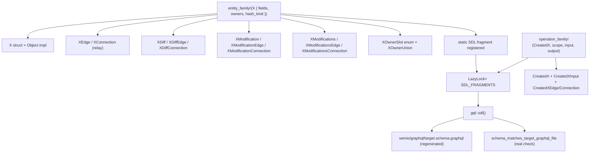

# Macro-Driven Entity Family Refactor

## Direction (confirmed)

- **Code-first**: a single `entity_family!` macro per entity emits Rust types AND a static SDL fragment string. `crate::gql::sdl()` concatenates collected fragments with the executable schema's Query/Mutation/Subscription. `semio/graphql/target.schema.graphql` becomes a regenerated golden file.
- **Full family scope**: 12-type ladder per entity as real Rust types backed by macros, plus owner-slot enums, owner unions, and `#[Object]` shells. Operations get a sibling `operation_family!` macro.

## Architecture

## Key files

- [semio/rs/lib.rs](semio/rs/lib.rs) — single source for all macros and entities (workspace rule: keep code in existing files)
- [semio/graphql/target.schema.graphql](semio/graphql/target.schema.graphql) — regenerated golden after refactor
- [semio/rs/Cargo.toml](semio/rs/Cargo.toml) — already has `paste = "1.0"`; we'll lean on `paste::paste!` for ident concatenation. No new deps needed.

## Macro surface

Inside a new `//#region 🧬 entity_dsl` section in [semio/rs/lib.rs](semio/rs/lib.rs):

- `**entity_family!**` (the workhorse): per-entity declaration with kind tag (`weak` / `strong` / `rich` / `artifact`), data fields with types and optionality, owner enum variants, owned-entity union variants, child hash sources. Emits:
  - struct + `Default` + `Debug`
  - `XOwnerSlot` enum + `Default::Unset`
  - `XOwnerUnion` (async-graphql `Union`)
  - `impl X { fn new(..) -> Arc<Self>; fn new_with_id(..); async fn compute_hash() -> String }`
  - `#[Object(name = "X")] impl X { id, hash, owner, owner_entity, owned_entities, <typed_owner_xxx>, <field_accessors> }`
  - `XEdge { cursor, node: Arc<X> }` (SimpleObject)
  - `XConnection { edges, page_info, hash }` + `from_rows(rows: Vec<Arc<X>>) -> Self`
  - `XDiff { <Option<field>> }` (SimpleObject) + `XDiffEdge` + `XDiffConnection`
  - `XModification { before, diff, after }` (SimpleObject) + `XModificationEdge` + `XModificationConnection`
  - `XModifications { removed, modifications, added }` (SimpleObject) + edges/connection
  - SDL fragment string registered via `inventory`-style global (or `linkme`/`LazyLock`-collected `&'static str` slice — no new dep needed, `LazyLock<Vec<&'static str>>` works)
- `**operation_family!**` for each operation (CreatedX/RenamedX/AddedX/RemovedX/Deleted*):
  - Optional `XInput` struct (`SimpleObject`) implementing GraphQL `Input` interface
  - `X` struct (`SimpleObject`) with `scope`, `input`, `modification`, plus output fields
  - `XEdge` + `XConnection`
  - SDL fragment
- `**entity_interface!*`* to declare `async_graphql::Interface` enums for `Entity`, `WeakEntity`, `StrongEntity`, `RichStrongEntity`, `Artifact`, `Document`, `Event`, `Version`, `Input`, `Diff`, `Modification`, `Operation`, `EntityEdge`, `EntityConnection`. The `NodeIface`/`EntityEdgeIface`/`VersionIface` already in [semio/rs/lib.rs](semio/rs/lib.rs) get folded in and grown to cover all variants.
- `**relay_collection!**` helper for connection types whose node is a Union (`Blueprint`, `OperationIface`, `OwnedEntity`) where simple `compute_hash().await` doesn't fit.

## Phases

### Phase 1 — Foundations (single agent, must come first)

1. Carve out `//#region 🧬 entity_dsl` in [semio/rs/lib.rs](semio/rs/lib.rs) with the macros above.
2. Replace existing `simple_conn_sync!` / `simple_conn_entity!` / `entity_full_family!` / `entity_relay!` / `entity_diffs!` / `entity_owner!` with the new unified macros (the old ones become thin shims or are removed entirely — workspace rule says no backwards compat).
3. Add `LazyLock<Mutex<Vec<&'static str>>>` SDL fragment registry; entity macros push fragments into it from a `ctor`-style pattern (or a single `register_all_sdl_fragments()` called from `gql::sdl()`).
4. Make `gql::sdl()` real: emit header + collected fragments + `Schema::new(Query, Mutation, Subscription).sdl()` filtered for the executable types. Remove the fake `include_str!` indirection.

### Phase 2 — Geometry + meta entities (parallel)

Convert in two parallel batches via subagents:

- Batch A — geometry: `Vector`, `Point`, `Coordinate`, `Offset`, `Plane`, `Position`, `Location`, `Place` (replace ~600 lines of hand-rolled `*Node` structs and Object impls).
- Batch B — meta: `Attribute`, `Author`, `File`, `Folder`, `Prop`, `Benchmark`, `Quality`, `Tag`, `Concept`, `Stat`, `Layer`, `Group`, `Family` (replace ~1,400 lines including the long `#[Object]` impls for `Tag`/`Concept`/`Quality`).

### Phase 3 — Kit graph entities (parallel)

- Batch C — type tree: `Type`, `Port`, `Connector`, `Representation`.
- Batch D — design tree: `Design`, `Piece`, `Side`, `Connection`, `Clump`.
- Batch E — root: `Kit`.

### Phase 4 — VCS + operation entities (sequential, depends on 1-3)

- `Edit`, `Change`, `Checkpoint`, `TheKit`, `Alternative`, `Graph`, `Session`, `Conflict` via `entity_family!`.
- All `Operation` types (CreatedDesign, RenamedKit, MovedPiece, …) via `operation_family!`. Wire to the existing `KitOperation` enum in `pub mod operation`.

### Phase 5 — Schema cleanup and golden regeneration

Fix every inconsistency uncovered (full list under "Schema fixes" below) by editing entity declarations in [semio/rs/lib.rs](semio/rs/lib.rs) and rerunning `cargo test schema_matches_target_graphql_file -- --ignored` once with `SEMIO_GRAPHQL_SCHEMA_OUT` set to regenerate [semio/graphql/target.schema.graphql](semio/graphql/target.schema.graphql).

### Phase 6 — Test sweep + cleanup

Run `cargo test --target x86_64-pc-windows-msvc` (37 tests). Fix any field-name/resolver-shape regressions. Remove the now-empty `simple_conn_sync!` / `simple_conn_entity!` etc. — no backwards compat retained.

## Schema fixes (from inconsistency scan)

Hard duplicates (delete the second copy):

- `ClumpEdge` / `ClumpConnection` duplicated at lines 7293-7305 vs 7308-7320 in [semio/graphql/target.schema.graphql](semio/graphql/target.schema.graphql)
- `TheKitEdge` / `TheKitConnection` duplicated at 8025-8037 vs 8040-8052; also misplaced under `#region Alternatives` instead of `#region TheKit`

Missing operation ladders (the macro will generate them uniformly):

- `Stat`, `Representation`, `Layer`, `Group`, `Connection` (artifact), `Kit` get full Created/Renamed/Updated/AddedAttribute/RemovedAttribute/Deleted operation families to match `Quality`/`Tag`/`Concept` pattern.
- `Clump` gets the missing `ClumpDiff` / `ClumpModification` / `ClumpModifications` ladder.

Comment / structure fixes:

- `Modifications.owns` (line 251) reference list is missing `TagModification`; `*Modifications.owns` for Position/Location/Place repeat their own modification name. The macro will emit a deterministic, alphabetically-sorted owns comment.
- `Operation.scope` interface comment (line 284) gets all `*Modifications` containers added.
- `RepresentationModification.owner` and other modification owner comments get normalized lineages.
- `GroupDiff.owner` comment (line 5789) gets aligned with `GroupModification.owner` (line 5820).
- `GroupModifications` heading normalized to `# GroupModifications` (currently `# Modifications`).
- `ConnectionDiff` body filled with substantive diff fields (currently scaffold only).

Operation interface conformance:

- Every concrete `Operation` type currently omits the `input: Input` field when it has no payload (e.g. `DeletedQuality`, `FlattenedDesign`, `FixedPiece`). The macro will always emit `input: Input` (nullable per interface) so the generated SDL satisfies async_graphql interface validation. Operations with no input render `input: null`.

Naming normalization:

- `Created*` reserved for "new artifact creation"; `Added*` reserved for "adding existing entity to a collection"; `Removed*` for collection removal; `Deleted*` for artifact deletion. `AddedConnector` stays (adds existing connector to type), `CreatedPort` stays (creates new port). `FixedPieces` gains `FixedPiecesInput` for symmetry with `MovedPieces`.
- Long names like `AddedHangingChildPiecesWithParentConnectionsConnection` are unavoidable given the operation name pattern; left as-is.

Out of scope (intentionally not changed):

- The parallel `*OperationInput` command DSL (lines 8184-8334) coexists with the typed Operation ladder. Keep both; they serve different purposes (live mutation routing vs persisted operation entities).
- Field name `type:` inside `Kit { type: Type }` and operation outputs stays — GraphQL is not Rust; the Rust side already uses `r#type`. The "kind not type" rule applies to Rust naming, not GraphQL field names that mirror the entity name.

## Risks and mitigations

- **37 GraphQL execution tests** (`graphql_`* in tests module) depend on field names. Macros must preserve every field name and resolver behavior exactly. Mitigation: phase 6 runs the full test suite; macros take optional `#[graphql(name = "...")]` overrides per field.
- `**OwnerEntity` / `OwnedEntity` unions** in `pub mod iface` are partial. Macros will register variants automatically into a generated mega-union via `inventory`-style collection or, as fallback, a single hand-curated `entity_owner_unions!` invocation that lists all entities once.
- **The schema test guard** (`single_emit_event_in_codebase`) does substring checks on `lib.rs`. Won't break unless we touch `emit_event`.
- **WASM build** must keep working (`#[cfg(target_arch = "wasm32")]` paths). Macros must not introduce native-only deps.

## Tickets

Per workspace rule, before any code change:

1. Read `repo://goals` via repo MCP.
2. Open a ticket via `ticket_open` titled "Macro-Driven Entity Family Refactor", associated with the closest existing goal (likely the GraphQL/control-plane goal). Ticket folder will be `.repo/🎫/26/05/11/macro-driven-entity-family-refactor` — all temp scripts/logs land there.
3. Close with `ticket_close` once Phase 6 passes.

## Estimated impact

- Net Rust LOC: roughly -1,500 to -2,000 in [semio/rs/lib.rs](semio/rs/lib.rs) (replaces ~3,000 lines of repetition with ~1,000 lines of macro definitions and ~30 entity-family invocations).
- Schema LOC: roughly -5,000 in [semio/graphql/target.schema.graphql](semio/graphql/target.schema.graphql) regeneration is mechanical, not hand-edited; size stays similar but structure is fully derived.
- New behavior: `gql::sdl()` is no longer a tautology; `schema_matches_target_graphql_file` becomes a real invariant.

