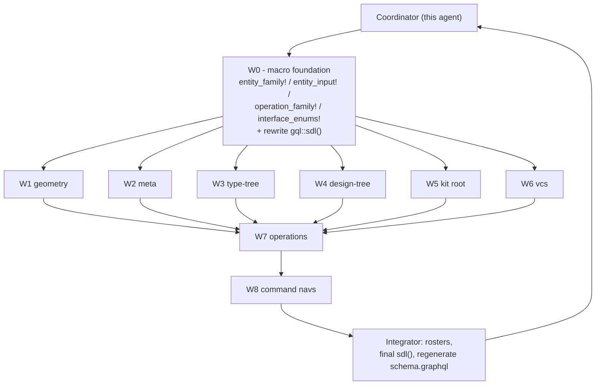

## Background

- Current state: `[semio/client/lib/rs/lib.rs](semio/client/lib/rs/lib.rs)` exposes a thin `entity_family!` (just `SimpleObject` + `compute_entity_hash`) and an empty `register_entities!` that emits empty `SDL_FRAGMENT` constants. `gql::sdl()` returns `Schema::sdl()` directly. Result: `[semio/schema/graphql/schema.graphql](semio/schema/graphql/schema.graphql)` has 200 type/interface/union/input declarations.
- Goal: `[semio/schema/graphql/schema.golden.graphql](semio/schema/graphql/schema.golden.graphql)` has 963 declarations (805 missing). Per-entity 12-type ladder (X/XEdge/XConnection + XDiff trio + XModification trio + XModifications trio) plus per-operation 6-type ladder (X/XEdge/XConnection + XInput/XInputEdge/XInputConnection) plus 14 interfaces (`Entity`, `WeakEntity`, `StrongEntity`, `RichStrongEntity`, `Artifact`, `Document`, `Event`, `Workspace`, `Input`, `Diff`, `Modification`, `Operation`, `EntityConnection`, plus the existing `Node`/`EntityEdge`).
- Match strictness chosen: structural equivalence (same types, fields, interfaces, unions, args). Inline `# data` / `# computed` / `# reference` comments and `#region` markers are not reproduced (deferred to a follow-up).
- Existing ticket: `[.repo/🎫/26/05/11/MACRO-DRIVEN-ENTITY-FAMILY-REFACTOR/](.repo/🎫/26/05/11/MACRO-DRIVEN-ENTITY-FAMILY-REFACTOR/)`. Reuse it via repo MCP `ticket_reopen`. W0/W2 are marked complete but `entity_family!` is still the thin shell — W0 must be redone.

## Architecture



## Decisions

- Single source file: every macro and every invocation lives in `[semio/client/lib/rs/lib.rs](semio/client/lib/rs/lib.rs)` (workspace rule). Region markers `//#region 🧬 entity_dsl`, `//#region 🤖 W1` … `//#region 🤖 W8` partition the file so subagents edit non-overlapping ranges.
- Macros emit BOTH the Rust types (struct + Object impl + Edge/Connection/Diff/Modification/Modifications + Default + hashing) AND a `pub const SDL_FRAGMENT: &'static str` per entity. `register_entities!` collects them; `gql::sdl()` concatenates fragments + executable Query/Mutation/Subscription.
- Drop the legacy thin macros (`entity_full_family!`, `entity_diffs!`, `entity_owner!`, current `entity_family!`) and the existing hand-written entity definitions in the same wave — no backwards compat (workspace rule).
- Subagents share `lib.rs`; each W-region gets its own `//#region 🤖 W<N>` block plus an exclusive entity list, so they can run in parallel without conflict edits. Coordinator owns `entity_dsl` region + final integrate.
- Strict subset goal: byte-identity with golden (regions, comments) is a follow-up ticket.

## Coordinator (this agent) — phase 1 setup

Acceptance: `cargo check -p semio` green, macro foundation usable by W1-W6 subagents, `gql::sdl()` produces ≥ all golden interfaces and the geometry/meta entity ladders for at least Vector + Tag.

- Reopen the ticket via repo MCP: `ticket_reopen` with id `2026/05/11/MACRO-DRIVEN-ENTITY-FAMILY-REFACTOR`.
- In `[semio/client/lib/rs/lib.rs](semio/client/lib/rs/lib.rs)` `//#region 🧬 entity_dsl` (lines 7-225 currently) replace the thin macros with the full blueprint suite from the existing plan §§ 1-14:
  - `entity_family!` (struct + Default + Object impl + owner enum + owner union + relay + diff + modification + modifications + `SDL_FRAGMENT`).
  - `entity_input!` (InputObject + `into_X` + `into_X_with_id`).
  - `__entity_relay!`, `__entity_diff!`, `__entity_modification!`, `__entity_modifications!`, `__simple_relay!`.
  - `__entity_field_resolver!`, `__entity_field_to_hash!`, `__diff_field_ty!`, `__typed_owner_resolver!`, `__owner_ty!`, `__build_sdl_fragment!`, `__sdl_field_line!`, `__sdl_relay_block!`, `__sdl_diff_block!`, `__sdl_diff_field_line!`, `__sdl_mod_block!`, `__sdl_mods_block!`.
  - `operation_family!`, `kit_operation_enum!`, `scope_enum!`, `input_enum!`, `__build_input_sdl!`, `__build_op_sdl!`.
  - `command_nav!`, `__nav_method!`.
  - `entity_owner_unions!`, `entity_interface_enums!`, `relay_collection!`.
- Inject region markers: `//#region 🤖 W1` (geometry), `//#region 🤖 W2` (meta), `//#region 🤖 W3` (type-tree), `//#region 🤖 W4` (design-tree), `//#region 🤖 W5` (kit), `//#region 🤖 W6` (vcs), `//#region 🤖 W7` (operations), `//#region 🤖 W8` (command navs). These delimit each subagent's exclusive write range.
- Rewrite `gql::sdl()` (`[semio/client/lib/rs/lib.rs](semio/client/lib/rs/lib.rs):11124`):
  ```rust
  pub async fn sdl() -> String {
      let mut out = String::with_capacity(128 * 1024);
      out.push_str(SDL_HEADER);
      for frag in crate::sdl_registry::all_fragments() { out.push_str(frag); }
      out.push_str(&extract_root_types(&build_schema().await.sdl()));
      normalize_target_sdl(&out)
  }
  ```
  with `SDL_HEADER` containing `scalar Timestamp` + `scalar Color` + the 14 interface declarations (`Entity`, `WeakEntity`, `StrongEntity`, `RichStrongEntity`, `Artifact`, `Document`, `Event`, `Workspace`, `Input`, `Diff`, `Modification`, `Operation`, `EntityConnection`, plus the existing `Node`/`EntityEdge`) hand-emitted as a single string constant.
- Convert at least Vector + Tag end-to-end as the canonical example for subagents (one geometry/weak entity + one artifact/rich entity).

## Subagent dispatch — wave 2 (parallel)

Each subagent gets the same prompt template (described below), a different region marker, and an exclusive entity list. All run in parallel via the Task tool with `subagent_type=generalPurpose`, `run_in_background=true`. Shared rules:

- Edit only `//#region 🤖 W<N>` and the immediate adjacent code that becomes dead after macro adoption (within that region).
- Do not edit `//#region 🧬 entity_dsl` or other workers' regions.
- For each entity in scope: emit one `entity_family! { name: X, … }` block + one `entity_input! { … }` block. Delete the matching legacy struct, `#[Object]` impl, hand-written `XEdge`/`XConnection`, and `compute_hash` block.
- Run `cargo check -p semio` before finishing; report compile errors to coordinator if any.

W-package contents:

- W1 geometry — `Vector`, `Point`, `Coordinate`, `Offset`, `Plane`, `Position`, `Location`, `Place` (all `kind: weak`, `sdl_implements: "WeakEntity"`).
- W2 meta — `Attribute`, `Author`, `File`, `Folder`, `Prop`, `Benchmark`, `Quality`, `Tag`, `Concept`, `Stat`, `Layer`, `Group`, `Family` (mostly `kind: artifact` / `kind: weak` per golden).
- W3 type-tree — `Type`, `Port`, `Connector`, `Representation`.
- W4 design-tree — `Design`, `Piece`, `Side`, `Connection`, `Clump`.
- W5 kit root — `Kit` (single entity but emits the full ladder + owns the rich relay shell at the kit-level).
- W6 vcs — `Edit`, `Change`, `Checkpoint`, `TheKit`, `Alternative`, `Graph`, `Session`, `Conflict`.

Subagent prompt skeleton (template; coordinator fills `<W>`, `<entities>`, region marker):

> Reopen ticket `2026/05/11/MACRO-DRIVEN-ENTITY-FAMILY-REFACTOR`. Edit only `//#region 🤖 W<N>` in `[semio/client/lib/rs/lib.rs](semio/client/lib/rs/lib.rs)`. For each entity `<entities>`, emit one `entity_family! { … }` and one `entity_input! { … }` invocation matching the golden type ladder in `[semio/schema/graphql/schema.golden.graphql](semio/schema/graphql/schema.golden.graphql)` (find each entity by `rg "type X "`). Use the canonical Vector/Tag examples in `//#region 🧬 entity_dsl` as templates. Delete the legacy hand-written struct, `#[Object]` impl, hand-written Edge/Connection, and compute_hash for that entity. Run `cargo check -p semio --manifest-path semio/client/lib/rs/Cargo.toml` and fix any compile errors. Do not edit other workers' regions or the entity_dsl region. Return a list of converted entities + cargo check result.

## Subagent dispatch — wave 3 (sequential after W1-W6)

W7 operations — depends on every entity already being macro-driven so `Scope::X { x_id: Id }` arms can reference real types. One subagent owns this wave. Tasks:

- Apply `kit_operation_enum!`, `scope_enum!`, `input_enum!` to derive `KitOperation` / `OperationKind` / `OperationIface` / `Scope` / `Input` from the operation roster (currently lines 108-118 of `[semio/client/lib/rs/lib.rs](semio/client/lib/rs/lib.rs)`). Delete the hand-written `operation::*` struct/enum trio.
- For every operation in `register_operations! { … }`, emit one `operation_family! { … }` block. Each emits `XInput` (when input non-empty), `X`, `XEdge`, `XConnection`, `XInputEdge`, `XInputConnection` plus an `apply_to(kit)` skeleton (kept as `Ok(())` placeholder; real apply logic stays in `Kit::apply_diff`).
- Also delete the duplicate hand-written operation `Object` impls at lines 7179-7430 in `[semio/client/lib/rs/lib.rs](semio/client/lib/rs/lib.rs)`.

## Subagent dispatch — wave 4 (sequential after W7)

W8 command navs — depends on per-op enums existing. Tasks:

- In `//#region 🤖 W8`, replace the hand-written `KitOperationNav` / `TagOperationNav` / `ConceptOperationNav` / `QualityOperationNav` / `PortOperationNav` / `TypeOperationNav` / `ConnectorOperationNav` / `DesignOperationNav` / `PieceOperationNav` / `PiecesOperationNav` (lines 9499-9700+ in `[semio/client/lib/rs/lib.rs](semio/client/lib/rs/lib.rs)`) with `command_nav! { … }` invocations driven by the operation roster.

## Integrator (coordinator) — wave 5

- Author the bottom-of-file `register_entities! { … }` and `register_operations! { … }` rosters in `[semio/client/lib/rs/lib.rs](semio/client/lib/rs/lib.rs)` (replacing the current empty-fragment versions at lines 56-118).
- Apply schema fixes that aren't derivable from per-entity declarations: `union AttributeOwner = …` (already correct), `union Blueprint = Type | Design`, `union ChangeOwner = Alternative | Checkpoint`, etc. — only if a golden union is missing from macro output, hand-emit it in the SDL header constant.
- Regenerate `[semio/schema/graphql/schema.graphql](semio/schema/graphql/schema.graphql)` via `bun run semio/schema/graphql/build.script.ts` (which runs `cargo test export_semio_graphql_schema_file -- --ignored --nocapture`).
- Diff against `[semio/schema/graphql/schema.golden.graphql](semio/schema/graphql/schema.golden.graphql)` using `Compare-Object` on `^type|^interface|^union|^input|^scalar|^enum` lines. Iterate until missing-types count is 0.
- Run full `cargo test -p semio --manifest-path semio/client/lib/rs/Cargo.toml`. Fix regressions in `schema_matches_target_graphql_file` (which currently only asserts non-empty SDL) — strengthen it to assert structural superset of golden's type list.
- Verify WASM build: `cargo check -p semio --manifest-path semio/client/lib/rs/Cargo.toml --target wasm32-unknown-unknown`.
- Close the ticket via repo MCP `ticket_close` with summary listing the converted entities/operations and the new schema diff stats.

## Out of scope (follow-up tickets)

- Byte-identity (inline `# data` / `# computed` / `# reference` comments per field; `#region` markers around groups). Will require either a custom SDL emitter that produces those comments, or copying the comment patterns into `__build_sdl_fragment!` / `SDL_HEADER`.
- The `union` definitions golden expects (e.g. `AttributeOwner`, `Blueprint`) that have non-trivial composition rules will be hand-emitted in `SDL_HEADER` for now; deriving them from `register_entities!` is a follow-up.
- Updates to `[semio/schema/graphql/schema.graphql](semio/schema/graphql/schema.graphql)` consumers (TS clients via codegen) once the ladder lands.
