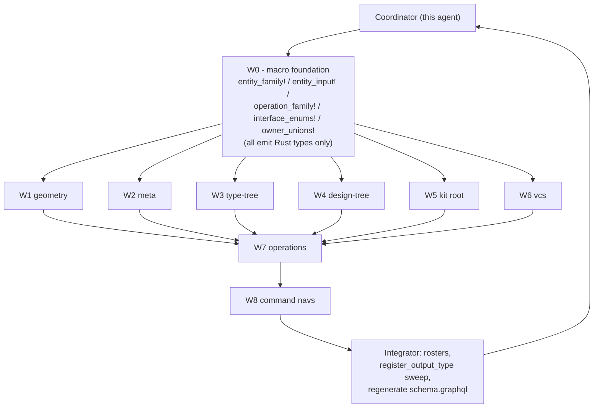

## Direction (revised)

The goal is **not** to reproduce the golden SDL string. The goal is to **implement the system the golden SDL specifies** as real Rust types.

- Pure code-first via async-graphql. `gql::sdl()` keeps its current body — `build_schema().await.sdl()` — and the resulting SDL is whatever async-graphql produces from the typed surface. Nothing is hand-written as string.
- Every type in `[semio/schema/graphql/schema.golden.graphql](semio/schema/graphql/schema.golden.graphql)` becomes a real Rust struct/enum derived through `#[Object]`, `#[derive(SimpleObject)]`, `#[derive(InputObject)]`, `#[derive(async_graphql::Interface)]`, or `#[derive(async_graphql::Union)]`.
- Every interface (`Entity`, `WeakEntity`, `StrongEntity`, `RichStrongEntity`, `Artifact`, `Document`, `Event`, `Workspace`, `Input`, `Diff`, `Modification`, `Operation`, `EntityEdge`, `EntityConnection`, `Node`) is an `async_graphql::Interface` enum auto-populated from the entity / operation roster.
- Every owner / owned union (`AttributeOwner`, `Blueprint`, `ChangeOwner`, …) is an `async_graphql::Union` enum auto-grown from the same roster.
- Macros emit Rust types only. There is no `SDL_FRAGMENT` constant, no `__sdl_*` macro, no `SDL_HEADER` string, no `extract_root_types`. `sdl_registry::HasSdlFragment` and the matching infrastructure get deleted.

## Background

- Current state: `[semio/client/lib/rs/lib.rs](semio/client/lib/rs/lib.rs)` exposes a thin `entity_family!` (`SimpleObject` + `compute_entity_hash`) and an empty `register_entities!` that emits empty `SDL_FRAGMENT` constants. `sdl_registry::all_fragments` is a no-op tail in `gql::sdl()`. Hand-written entity structs / `#[Object]` impls live across ~9k lines of `lib.rs`. No `XDiff` / `XModification` / `XModifications` / per-operation `XInput` types exist (`rg "struct (Vector|Tag|Piece)Diff"` matches zero).
- Goal: `[semio/schema/graphql/schema.golden.graphql](semio/schema/graphql/schema.golden.graphql)` declares 963 types/interfaces/unions/inputs vs current 200 (805 missing). Per-entity 12-type ladder + per-operation 6-type ladder + 14 interfaces + several owner unions.
- Match strictness: structural superset (every golden top-level declaration name present in the generated schema, with matching field set). Comments / regions / declaration ordering are not part of the spec — async-graphql's emitter chooses.
- Existing ticket: `[.repo/🎫/26/05/11/MACRO-DRIVEN-ENTITY-FAMILY-REFACTOR/](.repo/🎫/26/05/11/MACRO-DRIVEN-ENTITY-FAMILY-REFACTOR/)`. W0/W2 marked complete but `entity_family!` is still the thin shell — W0 must be redone with the code-first direction.

## Architecture

## Decisions

- Single source file: every macro and every invocation lives in `[semio/client/lib/rs/lib.rs](semio/client/lib/rs/lib.rs)` (workspace rule). Region markers `//#region 🧬 entity_dsl`, `//#region 🤖 W1` … `//#region 🤖 W8` partition the file so subagents edit non-overlapping ranges.
- Macros emit Rust types only — `#[derive(SimpleObject)]`, `#[Object]`, `#[derive(InputObject)]`, `#[derive(async_graphql::Interface)]`, `#[derive(async_graphql::Union)]`. No string SDL anywhere.
- `gql::sdl()` stays `build_schema().await.sdl()`. The SDL emitted by async-graphql is the byproduct.
- `register_entities!` becomes the source of truth that auto-grows the Interface / Union enums covering every entity. `register_operations!` does the same for the Operation interface and Scope/Input enum families.
- Drop the legacy thin macros (`entity_full_family!`, `entity_diffs!`, `entity_owner!`, current `entity_family!`), the `sdl_registry::HasSdlFragment` trait, and the existing hand-written entity / operation definitions in the same wave — no backwards compat (workspace rule).
- Subagents share `lib.rs`; each W-region gets its own `//#region 🤖 W<N>` block plus an exclusive entity list, so they can run in parallel without conflict edits. Coordinator owns `entity_dsl` region + final integrate.

## Coordinator (this agent) — phase 1 setup

Acceptance: `cargo check -p semio` green, macro foundation usable by W1-W6 subagents, `Schema::sdl()` already emits the full ladder for at least Vector + Tag (one weak + one rich entity).

- Reopen the ticket via repo MCP: `ticket_reopen` with id `2026/05/11/MACRO-DRIVEN-ENTITY-FAMILY-REFACTOR`.
- Purge string-SDL infrastructure in `[semio/client/lib/rs/lib.rs](semio/client/lib/rs/lib.rs)`:
  - Delete `pub mod sdl_registry { … }` (lines 9-23).
  - Delete the empty-fragment `register_entities!` / `register_operations!` macros (lines 26-54) — they get rewritten to drive Interface/Union derivation, not fragment collection.
  - Delete any `push_all_fragments` / `push_operation_fragments` / `all_fragments` references throughout the file (mostly inside `gql::sdl`).
  - Confirm `gql::sdl()` reduces to `build_schema().await.sdl()` (already the case at line 11124).
- In `//#region 🧬 entity_dsl` rewrite the macro suite (no `__sdl_*`, no `__build_sdl_fragment!`, no `HasSdlFragment`):
  - `entity_family!` emits: entity struct (RwLock fields) + Default + `new` / `new_with_id` / `compute_hash` / `compute_entity_hash` + `XOwnerSlot` enum + `#[derive(async_graphql::Union)] XOwnerUnion` + full `#[Object(name = "X")]` impl (id / hash / owner / typed_owner / ownerEntity / ownedEntities / one resolver per data field / one connection resolver per child collection) + `__entity_relay!(X)` (Edge/Connection as `SimpleObject`) + `__entity_diff!(X, …)` (`XDiff` `SimpleObject` with `Option<...>` fields + ComplexObject hash + Edge/Connection) + `__entity_modification!(X, …)` + `__entity_modifications!(X, …)`.
  - `entity_input!` emits: `#[derive(InputObject)] XInput` + async `into_x()` / sync `into_x_with_id()`.
  - `operation_family!` emits: `XInput` (when input fields), `X` (`SimpleObject` implementing the `Operation` interface via field selection), `XEdge` / `XConnection` / `XInputEdge` / `XInputConnection`, plus an `apply_to(kit) -> Result<()>` skeleton (default `Ok(())`).
  - `kit_operation_enum!` / `scope_enum!` / `input_enum!` derive the central `KitOperation` / `OperationKind` / `OperationIface` / `Scope` / `Input` enums from the operation roster. `OperationIface` is `#[derive(async_graphql::Interface)]` with shape `field(name = "id", …), field(name = "hash", …), field(name = "scope", …), field(name = "input", …), field(name = "modification", …)` matching golden's `interface Operation`.
  - `entity_owner_unions!` derives `OwnerEntity` / `OwnedEntity` / `OwnedEntityConnection` (`#[derive(async_graphql::Union)]`) from the entity roster.
  - `entity_interface_enums!` derives `Node` / `Entity` / `WeakEntity` / `StrongEntity` / `RichStrongEntity` / `Artifact` / `Document` / `Event` / `Workspace` / `Input` / `Diff` / `Modification` / `Operation` / `EntityEdge` / `EntityConnection` (each `#[derive(async_graphql::Interface)]`). Each macro arm filters the roster by entity `kind:` to populate only the matching interface (e.g. `WeakEntity` only includes entities declared `kind: weak`).
  - `command_nav!` emits `XOperationNav` struct + `#[Object]` impl with one async resolver per declared method, dispatching `Command::ApplyKitOperation` through `ParentRuntime`.
  - `relay_collection!` for union-node connections (`Blueprint`, `OwnedEntity`, `OperationIface`).
- Inject region markers: `//#region 🤖 W1` (geometry), `//#region 🤖 W2` (meta), `//#region 🤖 W3` (type-tree), `//#region 🤖 W4` (design-tree), `//#region 🤖 W5` (kit), `//#region 🤖 W6` (vcs), `//#region 🤖 W7` (operations), `//#region 🤖 W8` (command navs). These delimit each subagent's exclusive write range.
- Convert `Vector` (`kind: weak`) and `Tag` (`kind: artifact`) end-to-end as the canonical examples. Verify with a quick assertion test that `gql::sdl()` already contains `type VectorDiff implements Diff`, `type VectorModification implements Modification`, `type TagDiff implements Diff`, etc.

## Subagent dispatch — wave 2 (parallel)

Each subagent gets the same prompt template, a different region marker, and an exclusive entity list. All run in parallel via the Task tool with `subagent_type=generalPurpose`, `run_in_background=true`. Shared rules:

- Edit only `//#region 🤖 W<N>` and the immediate adjacent code that becomes dead after macro adoption (within that region).
- Do not edit `//#region 🧬 entity_dsl` or other workers' regions.
- For each entity in scope: emit one `entity_family! { name: X, kind: <weak|artifact|document|event|workspace>, owners: [...], owns: [...], fields: { ... }, hash_tag: "semio:<region>:X" }` block + one `entity_input! { name: X, fields: { ... } }` block. The macros derive every Rust type and resolver. Delete the matching legacy struct, `#[Object]` impl, hand-written `XEdge`/`XConnection`, and `compute_hash` block.
- Run `cargo check -p semio` before finishing; report compile errors.

W-package contents (entities and their golden `kind`):

- W1 geometry — `Vector`, `Point`, `Coordinate`, `Offset`, `Plane`, `Position`, `Location`, `Place` (all `kind: weak`).
- W2 meta — `Attribute`, `Author`, `File`, `Folder`, `Prop`, `Benchmark`, `Quality`, `Tag`, `Concept`, `Stat`, `Layer`, `Group`, `Family` (mix per golden — `Tag`/`Concept`/`Quality` are `artifact`; `Author`/`File`/`Folder` are weak).
- W3 type-tree — `Type`, `Port`, `Connector`, `Representation` (`Type` is `artifact`, others `weak`).
- W4 design-tree — `Design`, `Piece`, `Side`, `Connection`, `Clump`.
- W5 kit root — `Kit` (single entity but emits the full ladder + owns the rich relay shell at the kit-level).
- W6 vcs — `Edit`, `Change`, `Checkpoint`, `TheKit`, `Alternative`, `Graph`, `Session`, `Conflict`.

Subagent prompt skeleton:

> Reopen ticket `2026/05/11/MACRO-DRIVEN-ENTITY-FAMILY-REFACTOR`. Edit only `//#region 🤖 W<N>` in `[semio/client/lib/rs/lib.rs](semio/client/lib/rs/lib.rs)`. For each entity `<entities>`, emit one `entity_family! { … }` and one `entity_input! { … }` invocation. The fields and `kind:` MUST match the entity's declaration in `[semio/schema/graphql/schema.golden.graphql](semio/schema/graphql/schema.golden.graphql)` (look up `type X implements …`). Use the canonical Vector/Tag examples in `//#region 🧬 entity_dsl` as templates. Delete the legacy hand-written struct, `#[Object]` impl, hand-written Edge/Connection, and compute_hash for that entity in the same region. Run `cargo check --manifest-path semio/client/lib/rs/Cargo.toml -p semio` and fix compile errors. Do not edit other workers' regions or the entity_dsl region. NEVER emit GraphQL SDL as a string. Return the converted entity list + cargo check result.

## Subagent dispatch — wave 3 (sequential after W1-W6)

W7 operations — depends on every entity already being macro-driven so `Scope::X { x_id: Id }` arms can reference real types. One subagent owns this wave. Tasks:

- Apply `kit_operation_enum!`, `scope_enum!`, `input_enum!` to derive `KitOperation` / `OperationKind` / `OperationIface` / `Scope` / `Input`. The `OperationIface` derive emits `interface Operation` automatically. Delete the hand-written `operation::*` enum/struct trio.
- For every operation in `register_operations! { … }`, emit one `operation_family! { … }` block. Each emits `XInput` (when input non-empty), `X`, `XEdge`, `XConnection`, `XInputEdge`, `XInputConnection` plus an `apply_to(kit)` skeleton (default `Ok(())`; real apply logic stays in `Kit::apply_diff`).
- Delete the duplicate hand-written operation `Object` impls at lines 7179-7430+ in `[semio/client/lib/rs/lib.rs](semio/client/lib/rs/lib.rs)`.

## Subagent dispatch — wave 4 (sequential after W7)

W8 command navs — depends on per-op enums existing. Tasks:

- In `//#region 🤖 W8`, replace the hand-written `KitOperationNav` / `TagOperationNav` / `ConceptOperationNav` / `QualityOperationNav` / `PortOperationNav` / `TypeOperationNav` / `ConnectorOperationNav` / `DesignOperationNav` / `PieceOperationNav` / `PiecesOperationNav` (lines 9499-9700+ in `[semio/client/lib/rs/lib.rs](semio/client/lib/rs/lib.rs)`) with `command_nav! { … }` invocations driven by the operation roster.

## Integrator (coordinator) — wave 5

- Author the bottom-of-file `register_entities! { … }` and `register_operations! { … }` rosters (replacing the current empty-fragment versions at lines 56-118). The rosters auto-grow:
  - `OwnerEntity` / `OwnedEntity` async-graphql Unions (one variant per registered entity).
  - The 14 Interface enums (`Node`, `Entity`, `WeakEntity`, `StrongEntity`, `RichStrongEntity`, `Artifact`, `Document`, `Event`, `Workspace`, `Input`, `Diff`, `Modification`, `Operation`, `EntityEdge`, `EntityConnection`).
  - `KitOperation` / `OperationKind` / `OperationIface` / `Scope` / `Input` operation enums.
- Specialty unions (`AttributeOwner`, `Blueprint`, `ChangeOwner`, `QualityOwner`, `PieceOwner`, `ConnectionOwner`, `PortOwner`, `RepresentationOwner`) are emitted as real `#[derive(async_graphql::Union)]` enums in the same `entity_dsl` region (one declaration per golden union); their variants are listed once and referenced wherever an entity's `owners:` slot needs them.
- `register_output_type` sweep in `gql::build_schema_sync_for`: every macro-emitted concrete type must be reachable from `Query` / `Mutation` / `Subscription` OR explicitly registered (`SchemaBuilder::register_output_type::<XDiff>()`, `::<XModification>()`, `::<XModifications>()`, `::<XInput>()`, …) so async-graphql includes it in `Schema::sdl()`. Generate the registration list from the same roster (a `register_output_types!` macro emitted alongside `register_entities!`).
- Regenerate `[semio/schema/graphql/schema.graphql](semio/schema/graphql/schema.graphql)` via `bun run semio/schema/graphql/build.script.ts` (which runs `cargo test export_semio_graphql_schema_file -- --ignored --nocapture`).
- Diff against `[semio/schema/graphql/schema.golden.graphql](semio/schema/graphql/schema.golden.graphql)` using `Compare-Object` on `^type|^interface|^union|^input|^scalar|^enum` lines. Iterate (add missing entities, missing operations, missing register_output_type calls) until missing-types count is 0.
- Run full `cargo test -p semio --manifest-path semio/client/lib/rs/Cargo.toml`. Rewrite `schema_matches_target_graphql_file` (currently just asserts non-empty SDL) to:
  - Parse both the generated schema and the golden via `async_graphql_parser` (or `apollo-parser` if needed).
  - For every top-level declaration in golden (`type` / `interface` / `union` / `input` / `enum` / `scalar`), assert the generated schema contains a declaration of the same kind and name.
  - For every `type X implements Y { fields }` in golden, assert generated `X` declares the same field set with compatible nullability.
- Verify WASM build: `cargo check -p semio --manifest-path semio/client/lib/rs/Cargo.toml --target wasm32-unknown-unknown`.
- Close the ticket via repo MCP `ticket_close` with summary listing the converted entities/operations and the schema diff stats.

## Out of scope (follow-up tickets)

- Inline `# data` / `# computed` / `# reference` field comments and `#region` markers in the generated SDL string (async-graphql's emitter doesn't produce them).
- Declaration ordering parity with golden (async-graphql emits in registration order; cosmetic).
- Updates to `[semio/schema/graphql/schema.graphql](semio/schema/graphql/schema.graphql)` consumers (TS clients via codegen) once the ladder lands.
