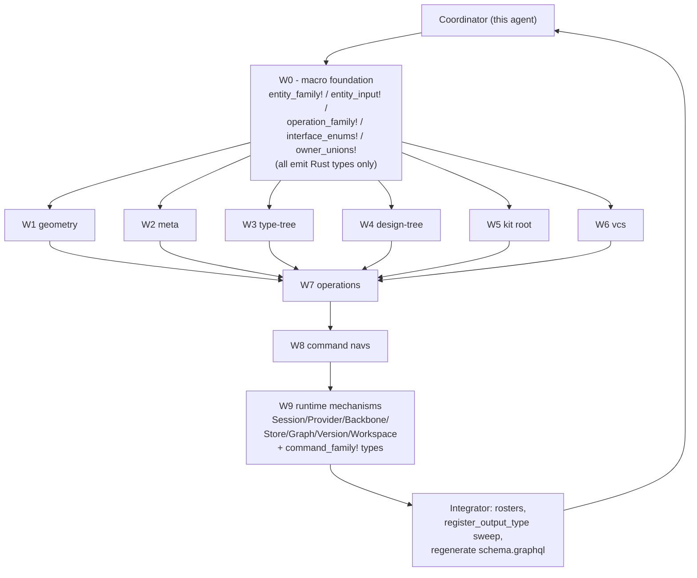

## Direction (revised)

The goal is **not** to reproduce the golden SDL string. The goal is to **implement the system the golden SDL specifies** as real Rust types.

- Pure code-first via async-graphql. `gql::sdl()` keeps its current body — `build_schema().await.sdl()` — and the resulting SDL is whatever async-graphql produces from the typed surface. Nothing is hand-written as string.
- Every type in `[compose/schema/graphql/schema.golden.graphql](compose/schema/graphql/schema.golden.graphql)` becomes a real Rust struct/enum derived through `#[Object]`, `#[derive(SimpleObject)]`, `#[derive(InputObject)]`, `#[derive(async_graphql::Interface)]`, or `#[derive(async_graphql::Union)]`.
- Every interface (`Entity`, `WeakEntity`, `StrongEntity`, `RichStrongEntity`, `Artifact`, `Document`, `Event`, `Workspace`, `Backbone`, `Provider`, `Input`, `Diff`, `Modification`, `Operation`, `BackboneCommand`, `ProviderCommand`, `EntityEdge`, `EntityConnection`, `Node`) is an `async_graphql::Interface` enum auto-populated from the entity / operation / command roster.
- Every owner / owned union (`AttributeOwner`, `Blueprint`, `ChangeOwner`, …) is an `async_graphql::Union` enum auto-grown from the same roster.
- Macros emit Rust types only. There is no `SDL_FRAGMENT` constant, no `__sdl_*` macro, no `SDL_HEADER` string, no `extract_root_types`. `sdl_registry::HasSdlFragment` and the matching infrastructure get deleted.

## New mechanisms in the updated golden

The May 13 update introduced a runtime / hosting layer that the previous lib.rs only partially modeled:

- `interface Workspace` (line 158) — abstract workspace contract; concrete impls `TheKit` and `Alternative` (lines 9237 / 9270) implement `Workspace & StrongEntity & Entity & Node` and carry `checkpoint`, `latestWipCheckpointAncestor`, `savedChanges`, `unsavedChanges`, `kit`. `Alternative` adds `name`. This replaces the old `interface Version` for that role.
- `enum VersionKind { INITIAL_KIT, MATERIALIZED }` + concrete `type Version { kind, initialKit, edit }` (line 9335). This is a thin descriptor, not an interface.
- `enum BackboneStatus { OFFLINE, RECONNECTING, ONLINE }` + `interface Backbone` (line 330) + concrete `type FileBackbone implements Backbone & StrongEntity & Entity & Node` (line 9523) + `type WebsocketBackbone implements Backbone & StrongEntity & Entity & Node` (line 9614). All Backbones expose `uri`, `status`. Owner is `Store`.
- `interface Provider` (line 379) with `backbones: BackboneConnection`, `backbone(id): Backbone`. Concrete impls: `LocalProvider` (line 9570: `uri`, `stores: StoreConnection`, `store(id): StoreCommand!`) and `RemoteProvider` (line 9663: `uri`, `backbones`, `backbone(id)`, plus its own `url`).
- `type Store { wip: Graph!, authoritative: Graph, conflicts: ConflictConnection! }` (line 9470). Now first-class.
- `type Graph implements StrongEntity & Entity & Node` (line 9405) — owns `initialKit: Kit`, `theKit: Workspace`, `alternatives`, `alternative(id)`, `checkpoints`, `checkpoint(id)`, `releases`, `release(id)`. The session→store→graph→workspace document is the new container model.
- `type Session implements StrongEntity & Entity & Node` (line 9735) — owns `stores: StoreConnection`, `localProvider: LocalProvider`, `remoteProviders: RemoteProviderConnection`, `startedAt: Timestamp`. Owner: `Graph`.
- Command surface (no Diff/Modification ladder; relay Edge/Connection only):
  - `interface BackboneCommand { detach: ID!, sync: ID! }` + `type FileBackboneCommand implements BackboneCommand`, `type WebsocketBackboneCommand implements BackboneCommand`.
  - `interface ProviderCommand { createBackbone(uri), attachBackbone(store) }` + `type LocalProviderCommand implements ProviderCommand`, `type RemoteProviderCommand implements ProviderCommand` (adds `login`, `logout`).
  - `type SessionCommand { start, end, store(id), localProvider, remoteProvider(url) }`.
  - `type StoreCommand { backbone, theKit: VersionCommand, alternative(id), startAlternative(name) }`.
  - `type AlternativeCommand { version, integrateIntoTheKit }`.
  - `type VersionCommand { startNewChange, unsavedChange(id), save, createCheckpoint(message) }`.
  - `type UnsavedChangeCommand { kit: KitOperation!, save }`.
- Mutation root rewired: `type Mutation { session: SessionCommand! }` (line 9799).
- Subscription rewired: `type Subscription { session: Session!, operation: Operation! }`.
- `Edit` and `Change` (lines 9128 / 9164) become `StrongEntity` owned by `Alternative | Checkpoint`, owning the operation set directly. `Checkpoint` owns `Edit`s.

## Background

- Current state: `[compose/client/lib/rs/lib.rs](compose/client/lib/rs/lib.rs)` exposes a thin `entity_family!` (`SimpleObject` + `compute_entity_hash`) and an empty `register_entities!` that emits empty `SDL_FRAGMENT` constants. `sdl_registry::all_fragments` is a no-operation tail in `gql::sdl()`. Hand-written entity structs / `#[Object]` impls live across ~9k lines of `lib.rs`. No `XDiff` / `XModification` / `XModifications` / per-operation `XInput` types exist (`rg "struct (Vector|Tag|Piece)Diff"` matches zero).
- Goal: `[compose/schema/graphql/schema.golden.graphql](compose/schema/graphql/schema.golden.graphql)` declares 963 types/interfaces/unions/inputs vs current 200 (805 missing). Per-entity 12-type ladder + per-operation 6-type ladder + 14 interfaces + several owner unions.
- Match strictness: structural superset (every golden top-level declaration name present in the generated schema, with matching field set). Comments / regions / declaration ordering are not part of the spec — async-graphql's emitter chooses.
- Existing ticket: `[.repo/🎫/26/05/11/MACRO-DRIVEN-ENTITY-FAMILY-REFACTOR/](.repo/🎫/26/05/11/MACRO-DRIVEN-ENTITY-FAMILY-REFACTOR/)`. W0/W2 marked complete but `entity_family!` is still the thin shell — W0 must be redone with the code-first direction.

## Architecture

## Decisions

- Single source file: every macro and every invocation lives in `[compose/client/lib/rs/lib.rs](compose/client/lib/rs/lib.rs)` (workspace rule). Region markers `//#region 🧬 entity_dsl`, `//#region 🤖 W1` … `//#region 🤖 W8` partition the file so subagents edit non-overlapping ranges.
- Macros emit Rust types only — `#[derive(SimpleObject)]`, `#[Object]`, `#[derive(InputObject)]`, `#[derive(async_graphql::Interface)]`, `#[derive(async_graphql::Union)]`. No string SDL anywhere.
- `gql::sdl()` stays `build_schema().await.sdl()`. The SDL emitted by async-graphql is the byproduct.
- `register_entities!` becomes the source of truth that auto-grows the Interface / Union enums covering every entity. `register_operations!` does the same for the Operation interface and Scope/Input enum families.
- Drop the legacy thin macros (`entity_full_family!`, `entity_diffs!`, `entity_owner!`, current `entity_family!`), the `sdl_registry::HasSdlFragment` trait, and the existing hand-written entity / operation definitions in the same wave — no backwards compat (workspace rule).
- Subagents share `lib.rs`; each W-region gets its own `//#region 🤖 W<N>` block plus an exclusive entity list, so they can run in parallel without conflict edits. Coordinator owns `entity_dsl` region + final integrate.

## Coordinator (this agent) — phase 1 setup

Acceptance: `cargo check -p compose` green, macro foundation usable by W1-W6 subagents, `Schema::sdl()` already emits the full ladder for at least Vector + Tag (one weak + one rich entity).

- Reopen the ticket via repo MCP: `ticket_reopen` with id `2026/05/11/MACRO-DRIVEN-ENTITY-FAMILY-REFACTOR`.
- Purge string-SDL infrastructure in `[compose/client/lib/rs/lib.rs](compose/client/lib/rs/lib.rs)`:
  - Delete `pub mod sdl_registry { … }` (lines 9-23).
  - Delete the empty-fragment `register_entities!` / `register_operations!` macros (lines 26-54) — they get rewritten to drive Interface/Union derivation, not fragment collection.
  - Delete any `push_all_fragments` / `push_operation_fragments` / `all_fragments` references throughout the file (mostly inside `gql::sdl`).
  - Confirm `gql::sdl()` reduces to `build_schema().await.sdl()` (already the case at line 11124).
- In `//#region 🧬 entity_dsl` rewrite the macro suite (no `__sdl_*`, no `__build_sdl_fragment!`, no `HasSdlFragment`):
  - `entity_family!` emits: entity struct (RwLock fields) + Default + `new` / `new_with_id` / `compute_hash` / `compute_entity_hash` + `XOwnerSlot` enum + `#[derive(async_graphql::Union)] XOwnerUnion` + full `#[Object(name = "X")]` impl (id / hash / owner / typed_owner / ownerEntity / ownedEntities / one resolver per data field / one connection resolver per child collection) + `__entity_relay!(X)` (Edge/Connection as `SimpleObject`) + `__entity_diff!(X, …)` (`XDiff` `SimpleObject` with `Option<...>` fields + ComplexObject hash + Edge/Connection) + `__entity_modification!(X, …)` + `__entity_modifications!(X, …)`. The `kind:` field accepts `weak | strong | rich | artifact | document | event | workspace | backbone | provider`; the `__entity_diff!`/`__entity_modification!`/`__entity_modifications!` ladder is skipped for `kind: workspace | backbone | provider` (per golden, those don't have diff/modification trios — they're hosting-layer entities).
  - `entity_input!` emits: `#[derive(InputObject)] XInput` + async `into_x()` / sync `into_x_with_id()`.
  - `command_family!` (NEW — for command-only types like `SessionCommand`, `StoreCommand`, `AlternativeCommand`, `VersionCommand`, `UnsavedChangeCommand`, `FileBackboneCommand`, `WebsocketBackboneCommand`, `LocalProviderCommand`, `RemoteProviderCommand`): emits `X` struct + `#[Object(name = "X")]` impl with one async resolver per declared method (dispatching `Command::*` through `ParentStore`) + `XEdge` + `XConnection` (`SimpleObject`). No Diff/Modification ladder, no owner-slot enum, no `Default`. Methods are declared inline as `methods: [ rename(new_name: String) -> RenamedTag, … ]` mapping to `KitOperation::*` arms or to direct host-side actions (login, attach, …).
  - `command_interface!` (NEW — for `BackboneCommand` / `ProviderCommand`): emits `#[derive(async_graphql::Interface)] XCommandIface` enum with one variant per concrete impl + matching `field(name=...)` attributes for the interface's required methods.
  - `operation_family!` emits: `XInput` (when input fields), `X` (`SimpleObject` implementing the `Operation` interface via field selection), `XEdge` / `XConnection` / `XInputEdge` / `XInputConnection`, plus an `apply_to(kit) -> Result<()>` skeleton (default `Ok(())`).
  - `kit_operation_enum!` / `scope_enum!` / `input_enum!` derive the central `KitOperation` / `OperationKind` / `OperationIface` / `Scope` / `Input` enums from the operation roster. `OperationIface` is `#[derive(async_graphql::Interface)]` with shape `field(name = "id", …), field(name = "hash", …), field(name = "scope", …), field(name = "input", …), field(name = "modification", …)` matching golden's `interface Operation`.
  - `entity_owner_unions!` derives `OwnerEntity` / `OwnedEntity` / `OwnedEntityConnection` (`#[derive(async_graphql::Union)]`) from the entity roster.
  - `entity_interface_enums!` derives `Node` / `Entity` / `WeakEntity` / `StrongEntity` / `RichStrongEntity` / `Artifact` / `Document` / `Event` / `Workspace` / `Backbone` / `Provider` / `Input` / `Diff` / `Modification` / `Operation` / `EntityEdge` / `EntityConnection` (each `#[derive(async_graphql::Interface)]`). Each macro arm filters the roster by entity `kind:` to populate only the matching interface (e.g. `WeakEntity` only includes entities declared `kind: weak`; `Workspace` only includes `kind: workspace`; `Backbone` only includes `kind: backbone`; `Provider` only includes `kind: provider`).
  - `command_nav!` emits `XOperationNav` struct + `#[Object]` impl with one async resolver per declared method, dispatching `Command::ApplyKitOperation` through `ParentRuntime`. (Distinct from `command_family!` — `command_nav!` is for the per-artifact mutation entry points; `command_family!` is for the standalone `*Command` GraphQL types.)
  - `relay_collection!` for union-node connections (`Blueprint`, `OwnedEntity`, `OperationIface`).
- Inject region markers: `//#region 🤖 W1` (geometry), `//#region 🤖 W2` (meta), `//#region 🤖 W3` (type-tree), `//#region 🤖 W4` (design-tree), `//#region 🤖 W5` (kit), `//#region 🤖 W6` (vcs), `//#region 🤖 W7` (operations), `//#region 🤖 W8` (command navs). These delimit each subagent's exclusive write range.
- Convert `Vector` (`kind: weak`) and `Tag` (`kind: artifact`) end-to-end as the canonical examples. Verify with a quick assertion test that `gql::sdl()` already contains `type VectorDiff implements Diff`, `type VectorModification implements Modification`, `type TagDiff implements Diff`, etc.

## Subagent dispatch — wave 2 (parallel)

Each subagent gets the same prompt template, a different region marker, and an exclusive entity list. All run in parallel via the Task tool with `subagent_type=generalPurpose`, `run_in_background=true`. Shared rules:

- Edit only `//#region 🤖 W<N>` and the immediate adjacent code that becomes dead after macro adoption (within that region).
- Do not edit `//#region 🧬 entity_dsl` or other workers' regions.
- For each entity in scope: emit one `entity_family! { name: X, kind: <weak|artifact|document|event|workspace>, owners: [...], owns: [...], fields: { ... }, hash_tag: "compose:<region>:X" }` block + one `entity_input! { name: X, fields: { ... } }` block. The macros derive every Rust type and resolver. Delete the matching legacy struct, `#[Object]` impl, hand-written `XEdge`/`XConnection`, and `compute_hash` block.
- Run `cargo check -p compose` before finishing; report compile errors.

W-package contents (entities and their golden `kind`):

- W1 geometry — `Vector`, `Point`, `Coordinate`, `Offset`, `Plane`, `Position`, `Location`, `Place` (all `kind: weak`).
- W2 meta — `Attribute`, `Author`, `File`, `Folder`, `Prop`, `Benchmark`, `Quality`, `Tag`, `Concept`, `Stat`, `Layer`, `Group`, `Family` (mix per golden — `Tag`/`Concept`/`Quality` are `artifact`; `Author`/`File`/`Folder` are weak).
- W3 type-tree — `Type`, `Port`, `Connector`, `Representation` (`Type` is `artifact`, others `weak`).
- W4 design-tree — `Design`, `Piece`, `Side`, `Connection`, `Clump`.
- W5 kit root — `Kit` (single entity but emits the full ladder + owns the rich relay shell at the kit-level).
- W6 vcs — `Edit`, `Change`, `Checkpoint`, `TheKit` (`kind: workspace`), `Alternative` (`kind: workspace`), `Graph`, `Session`, `Conflict`.

Subagent prompt skeleton:

> Reopen ticket `2026/05/11/MACRO-DRIVEN-ENTITY-FAMILY-REFACTOR`. Edit only `//#region 🤖 W<N>` in `[compose/client/lib/rs/lib.rs](compose/client/lib/rs/lib.rs)`. For each entity `<entities>`, emit one `entity_family! { … }` and one `entity_input! { … }` invocation. The fields and `kind:` MUST match the entity's declaration in `[compose/schema/graphql/schema.golden.graphql](compose/schema/graphql/schema.golden.graphql)` (look up `type X implements …`). Use the canonical Vector/Tag examples in `//#region 🧬 entity_dsl` as templates. Delete the legacy hand-written struct, `#[Object]` impl, hand-written Edge/Connection, and compute_hash for that entity in the same region. Run `cargo check --manifest-path compose/client/lib/rs/Cargo.toml -p compose` and fix compile errors. Do not edit other workers' regions or the entity_dsl region. NEVER emit GraphQL SDL as a string. Return the converted entity list + cargo check result.

## Subagent dispatch — wave 3 (sequential after W1-W6)

W7 operations — depends on every entity already being macro-driven so `Scope::X { x_id: Id }` arms can reference real types. One subagent owns this wave. Tasks:

- Apply `kit_operation_enum!`, `scope_enum!`, `input_enum!` to derive `KitOperation` / `OperationKind` / `OperationIface` / `Scope` / `Input`. The `OperationIface` derive emits `interface Operation` automatically. Delete the hand-written `operation::*` enum/struct trio.
- For every operation in `register_operations! { … }`, emit one `operation_family! { … }` block. Each emits `XInput` (when input non-empty), `X`, `XEdge`, `XConnection`, `XInputEdge`, `XInputConnection` plus an `apply_to(kit)` skeleton (default `Ok(())`; real apply logic stays in `Kit::apply_diff`).
- Delete the duplicate hand-written operation `Object` impls at lines 7179-7430+ in `[compose/client/lib/rs/lib.rs](compose/client/lib/rs/lib.rs)`.

## Subagent dispatch — wave 4 (sequential after W7)

W8 command navs — depends on per-operation enums existing. Tasks:

- In `//#region 🤖 W8`, replace the hand-written `KitOperationNav` / `TagOperationNav` / `ConceptOperationNav` / `QualityOperationNav` / `PortOperationNav` / `TypeOperationNav` / `ConnectorOperationNav` / `DesignOperationNav` / `PieceOperationNav` / `PiecesOperationNav` (lines 9499-9700+ in `[compose/client/lib/rs/lib.rs](compose/client/lib/rs/lib.rs)`) with `command_nav! { … }` invocations driven by the operation roster.

## Subagent dispatch — wave 5 (sequential after W8)

W9 runtime mechanisms — covers the May-13 hosting layer additions. One subagent owns this wave. Tasks (in `//#region 🤖 W9`):

- Emit the host-layer enums: `BackboneStatus { Offline, Reconnecting, Online }` (`#[derive(async_graphql::Enum)]`) and `VersionKind { InitialKit, Materialized }`.
- Emit the host-layer entities via `entity_family!` with the new `kind:` values:
  - `Session` (`kind: strong`, owners `[Graph]`, fields `stores: Vec<Store> @children(StoreConnection)`, `local_provider: Arc<LocalProvider> @entity`, `remote_providers: Vec<RemoteProvider> @children(RemoteProviderConnection)`, `started_at: Option<Timestamp> @data`).
  - `FileBackbone` and `WebsocketBackbone` (`kind: backbone`, owners `[Store]`, fields `uri: String @data`, `status: BackboneStatus @data`).
  - `LocalProvider` (`kind: provider`, owners `[Store]`, fields `uri: String @data`, `stores: Vec<Store> @children(StoreConnection)`, plus a typed `store(id)` resolver returning `StoreCommand`).
  - `RemoteProvider` (`kind: provider`, owners `[Store]`, fields `uri: String @data`, `url: String @data`, `backbones: Vec<Backbone> @children(BackboneConnection)`, plus a `backbone(id)` resolver).
  - `Graph` already covered in W6, but extend its `entity_family!` declaration here if W6 doesn't yet add `theKit: Workspace` / `release(id)` / `releases` / `alternative(id)` / `checkpoint(id)`.
  - `Conflict` already covered in W6 — re-verify.
- Emit `Store` and `Version` as concrete (non-entity) types via `command_family!` (or `#[derive(SimpleObject)]` directly, since they don't need the entity ladder):
  - `Store { wip: Arc<Graph>, authoritative: Option<Arc<Graph>>, conflicts: ConflictConnection }` — no Diff/Modification, just `SimpleObject` + relay.
  - `Version { kind: VersionKind, initial_kit: Arc<Kit>, edit: Option<Arc<Edit>> }`.
- Emit the command interface enums via `command_interface!`:
  - `BackboneCommand` (interface) with concrete `FileBackboneCommand` + `WebsocketBackboneCommand` (each `command_family!` with `methods: [detach, sync]`, body dispatches `Command::DetachBackbone` / `Command::SyncBackbone` through `ParentStore`).
  - `ProviderCommand` (interface) with concrete `LocalProviderCommand` + `RemoteProviderCommand`. `LocalProviderCommand` methods: `create_backbone(uri)`, `attach_backbone(store)`. `RemoteProviderCommand` adds `login(username, password_hash, hub_url?)`, `logout`.
- Emit the standalone command types via `command_family!`:
  - `SessionCommand { start, end, store(id) -> StoreCommand!, local_provider -> LocalProviderCommand!, remote_provider(url) -> RemoteProviderCommand! }`.
  - `StoreCommand { backbone -> BackboneCommand!, the_kit -> Option<VersionCommand>, alternative(id) -> Option<AlternativeCommand>, start_alternative(name?) -> ID! }`.
  - `AlternativeCommand { version -> ID!, integrate_into_the_kit -> ID! }`.
  - `VersionCommand { start_new_change -> ID!, unsaved_change(id) -> UnsavedChangeCommand!, save -> ID!, create_checkpoint(message) -> ID! }`.
  - `UnsavedChangeCommand { kit -> KitOperation!, save -> ID! }`.
- Rewire `Mutation`: replace existing `Mutation::session` body with `async fn session(&self) -> SessionCommand` returning a `SessionCommand` instance. Delete the legacy `SessionCommandNav` / `StoreCommandNav` / `BackboneCommandNav` / `VersionCommandNav` / `UnsavedChangeCommandNav` hand-written structs once equivalents exist via `command_family!`.
- Rewire `Subscription`: ensure `session: Session!` and `operation: Operation!` resolvers exist (drop legacy `events`/`commands` subscriptions if they aren't in golden).
- Verify the runtime backbone routing: existing `kit_backbone::DevBackboneBundleDoc` etc. continue to feed `FileBackbone` (dev JSON) and `WebsocketBackbone` (remote sync) — the macro emits the GraphQL surface; existing host code stays as-is, only its public types are replaced.
- Run `cargo check -p compose` + `cargo test -p compose` (specifically `schema_matches_target_graphql_file` once strengthened in the integrate wave).

## Integrator (coordinator) — wave 6

- Author the bottom-of-file `register_entities! { … }`, `register_operations! { … }`, and `register_commands! { … }` rosters (replacing the current empty-fragment versions at lines 56-118). The rosters auto-grow:
  - `OwnerEntity` / `OwnedEntity` async-graphql Unions (one variant per registered entity).
  - The full Interface enum set (`Node`, `Entity`, `WeakEntity`, `StrongEntity`, `RichStrongEntity`, `Artifact`, `Document`, `Event`, `Workspace`, `Backbone`, `Provider`, `Input`, `Diff`, `Modification`, `Operation`, `BackboneCommand`, `ProviderCommand`, `EntityEdge`, `EntityConnection`).
  - `KitOperation` / `OperationKind` / `OperationIface` / `Scope` / `Input` operation enums.
- Specialty unions (`AttributeOwner`, `Blueprint`, `ChangeOwner`, `QualityOwner`, `PieceOwner`, `ConnectionOwner`, `PortOwner`, `RepresentationOwner`, plus the new owner unions implied by the host layer like `BackboneOwner = Store`, `ProviderOwner = Store`, `SessionOwner = Graph`) are emitted as real `#[derive(async_graphql::Union)]` enums in the same `entity_dsl` region (one declaration per golden union); their variants are listed once and referenced wherever an entity's `owners:` slot needs them.
- `register_output_type` sweep in `gql::build_schema_sync_for`: every macro-emitted concrete type must be reachable from `Query` / `Mutation` / `Subscription` OR explicitly registered (`SchemaBuilder::register_output_type::<XDiff>()`, `::<XModification>()`, `::<XModifications>()`, `::<XInput>()`, `::<FileBackbone>()`, `::<WebsocketBackbone>()`, `::<LocalProvider>()`, `::<RemoteProvider>()`, `::<Store>()`, `::<Version>()`, `::<*Command>()`, …) so async-graphql includes it in `Schema::sdl()`. Generate the registration list from the same roster (a `register_output_types!` macro emitted alongside `register_entities!`/`register_commands!`).
- Regenerate `[compose/schema/graphql/schema.graphql](compose/schema/graphql/schema.graphql)` via `bun run compose/schema/graphql/build.script.ts` (which runs `cargo test export_compose_graphql_schema_file -- --ignored --nocapture`).
- Diff against `[compose/schema/graphql/schema.golden.graphql](compose/schema/graphql/schema.golden.graphql)` using `Compare-Object` on `^type|^interface|^union|^input|^scalar|^enum` lines. Iterate (add missing entities, missing operations, missing register_output_type calls) until missing-types count is 0.
- Run full `cargo test -p compose --manifest-path compose/client/lib/rs/Cargo.toml`. Rewrite `schema_matches_target_graphql_file` (currently just asserts non-empty SDL) to:
  - Parse both the generated schema and the golden via `async_graphql_parser` (or `apollo-parser` if needed).
  - For every top-level declaration in golden (`type` / `interface` / `union` / `input` / `enum` / `scalar`), assert the generated schema contains a declaration of the same kind and name.
  - For every `type X implements Y { fields }` in golden, assert generated `X` declares the same field set with compatible nullability.
- Verify WASM build: `cargo check -p compose --manifest-path compose/client/lib/rs/Cargo.toml --target wasm32-unknown-unknown`.
- Close the ticket via repo MCP `ticket_close` with summary listing the converted entities/operations and the schema diff stats.

## Out of scope (follow-up tickets)

- Inline `# data` / `# computed` / `# reference` field comments and `#region` markers in the generated SDL string (async-graphql's emitter doesn't produce them).
- Declaration ordering parity with golden (async-graphql emits in registration order; cosmetic).
- Updates to `[compose/schema/graphql/schema.graphql](compose/schema/graphql/schema.graphql)` consumers (TS clients via codegen) once the ladder lands.
