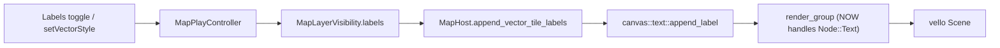

## Map Vector Tile Labels

Labels (continent/country/region/city/district/street) are already wired end-to-end and gated by LOD, but never paint because of a renderer bug, and they don't exist at all in the figure-ground styles. This plan fixes the bug, adds labels to every vector style, and adds the per-style default toggle behavior the dev asked for.

### 0. Ticket

- Read `repo://goals`, then reopen ticket `2026/06/03/MAP-VECTOR-TILES` (it already owns vector tiles + labels) via `ticket_reopen`. Keep any scratch under that ticket folder.

### 1. Root-cause fix: render SVG text glyphs

In [infinite/canvas/vello/lib.rs](infinite/canvas/vello/lib.rs) `render_group` (lines ~585-618), the `_ => {}` arm drops `usvg::Node::Text`, so `append_label` produces empty scenes.

- Add a `usvg::Node::Text(t) => { ... }` arm that renders `t.flattened()` (a `&usvg::Group`) through the same path logic.
- Draw glyph **stroke (halo) under fill** for legibility (the label SVG uses `paint-order="stroke"`, which the current fill-then-stroke order ignores). Either recurse into a small text-specific variant that strokes before filling, or reorder for the flattened group.
- This single fix restores place labels, street labels, and position labels everywhere.

### 2. Draw labels in all vector styles (Rust)

In [gis/map/rs/lib.rs](gis/map/rs/lib.rs):

- Extract the two inline label blocks from `append_vector_tiles_colored` (lines ~2169-2202) into one method `append_vector_tile_labels(&self, scene, draw, span, forced_lod, fill, halo)` that iterates tiles/layers and emits:
  - `place`/`centroids`/`poi`/`water_name` labels gated by `place_label_visible(class, span)`.
  - `transportation_name` street labels gated by `transportation_visible(...)`.
  - All gated solely by `vis.labels` (decouple street labels from the `roads` geometry toggle so one "Labels" switch controls all text).
- Call it from:
  - Colored path with `theme.label_fill` / `theme.label_halo`.
  - `append_vector_tiles_figure` (lines ~2210-2311), after geometry, with `fill = ink`, `halo = paper` so text stays readable in both figure-ground and inverted.
- Confirm `place_label_visible` covers the full document (region = `state`/`province`, district = `suburb`/`quarter`/`neighbourhood`); extend the match if any listed tier is missing.

### 3. Per-style default Labels toggle (TS)

Reuse the existing `gis-map-layer-labels` toggle; add per-vector-style default and relabel it "Labels".

- In [gis/map/play/index.ts](gis/map/play/index.ts) near `MAP_VECTOR_STYLES` (line ~183), add:
  `const MAP_VECTOR_STYLE_DEFAULT_LABELS: Record<MapVectorStyle, boolean> = { colored: true, figureGround: false, invertedFigure: false };`
- In the `setVectorStyle` handler (lines ~532-546), after updating the style, patch the scope's visibility: `labels = MAP_VECTOR_STYLE_DEFAULT_LABELS[resolved]` (update `layerVisibilityByInstance` and root `layerVisibility`, then `rebuildShellMode` + `bumpSnapshot`). Initial snapshot is already `colored` + `labels: true`, so no idle-state change is needed.
- Update the toggle label `labels: "Place labels"` → `"Labels"` in `GIS_MAP_LAYER_LABEL`.

### 4. Tests (extend existing files only)

- [infinite/canvas/vello/lib.rs](infinite/canvas/vello/lib.rs) `mod tests`: add a test that `text::append_label` into a fresh `Scene` yields a non-empty encoding (e.g. `!scene.encoding().path_tags.is_empty()`), and that an empty/whitespace label yields an empty scene — locking in the `Node::Text` fix.
- [gis/map/rs/lib.rs](gis/map/rs/lib.rs) tests: add a figure-ground render test with `labels` visible asserting the scene grows vs labels hidden, plus a `place_label_visible` document coverage assertion.

### 5. Verification

- `cargo test` for `infinite_canvas` and `gis_map` (via `script.ts`/`nx`, registered in `launch.json`).
- Run map play, switch Colored/Figure-Ground/Inverted, zoom across bands, and confirm labels appear and respect the per-style default with a temporary `[DEBUG]` log of rendered label count; remove the log after confirming.

### Flow

