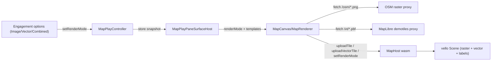

# Map Vector Tiles

Add MVT vector-tile rendering alongside the existing raster path, with an in-window Image / Vector / Combined chooser built on the existing `WindowEngagement.options` infrastructure.

## Architecture

## Data source

- Keyless MapLibre demotiles: `https://demotiles.maplibre.org/tiles/{z}/{x}/{y}.pbf` (Natural-Earth MVT: `countries`, `geolines`, `centroids`, etc.; maxzoom ~5). Country/place names live in feature properties (e.g. `NAME`/`name`); these drive labels.

## Changes

### 1. Vector tile dev proxy

- In [ui/styling/vite-elements-assets.ts](ui/styling/vite-elements-assets.ts), add a sibling to `osmTileProxyVitePlugin` (region) named `mapLibreVectorTileProxyVitePlugin(cacheDir)` serving `/vt/{z}/{x}/{y}.pbf` from demotiles, caching to `.repo-cache/vt-tiles`, mirroring caching/headers (`Content-Type: application/x-protobuf`).
- Register it in `createPlaygroundPlayViteConfig` next to the osm plugin: `...(playEntryKind === "map" ? [osmTileProxyVitePlugin(repoRoot), mapLibreVectorTileProxyVitePlugin(repoRoot)] : [])`.

### 2. Canvas text/label capability

- In [infinite/cavas/vello/lib.rs](infinite/cavas/vello/lib.rs), add a sans label font asset under `infinite/cavas/vello/asset/` (subset, analogous to existing `NotoColorEmoji-subset.ttf`), exposed via `board_icon_assets`-style static bytes.
- Add a `text` module (new region) with `append_label(scene, text, origin, px, fill, halo)` that renders glyphs by building an SVG `<text>` and reusing the existing `usvg`/`render_svg_tree_themed` pipeline with a dedicated `usvg::Options` whose `fontdb` loads the sans font (mirrors `usvg_options_board_icons`). Export for map use.

### 3. MVT decode interface (Rust)

- Add `prost = "0.13"` to [gis/map/rs/Cargo.toml](gis/map/rs/Cargo.toml) (hand-written `#[derive(prost::Message)]` structs; no `protoc`/`build.rs`, keeps zero-touch cross-platform).
- In [gis/map/rs/lib.rs](gis/map/rs/lib.rs) add `pub mod vector_tiles` (region) wrapping the MVT proto behind a clean interface: `VectorTile { layers }`, `VectorLayer { name, extent, features }`, `VectorFeature { geom_type, geometry (rings/lines/points in tile coords), properties }`. Implement the MVT command/zigzag geometry decode and key/value property decode here so the rest of `MapHost` never touches `prost`.

### 4. MapHost: vector store, modes, rendering

- In [gis/map/rs/lib.rs](gis/map/rs/lib.rs) `MapHost`:
  - Add `enum MapTileMode { Image, Vector, Combined }` + `render_mode` field; `set_render_mode(&str)`.
  - Add `vector_tiles: BTreeMap<String, vector_tiles::VectorTile>` + `upload_vector_tile(z,x,y,bytes)` (decode via the interface, store).
  - Add vector tile zoom selection clamped to demotiles maxzoom (<=5) with overzoom (reuse parent tile) + `visible_vector_tiles_json()` for the JS fetch loop.
  - Add `append_vector_tiles(scene)`: tile-local coords -> world (`tile_world_rect` + `extent`) -> screen; style by layer/geometry: polygon fills, line strokes (`countries`, `geolines`, boundaries), and labels from name properties via the new `cavas::text::append_label`.
  - Make `build_vector_scene` honor `render_mode`: Image = raster only; Vector = vector only; Combined = raster then vector overlay (labels always on top).
- Extend `MapSession` (wasm region) with `uploadVectorTile`, `setRenderMode`, `visibleVectorTilesJson`.

### 5. React renderer/canvas

- In [gis/map/react/index.tsx](gis/map/react/index.tsx):
  - Add `renderMode: "image" | "vector" | "combined"` and `vectorTileUrlTemplate` (default `/vt/{z}/{x}/{y}.pbf`) to `MapCanvasProps`/`MapRenderer`.
  - `MapRenderer.setRenderMode` -> `session.setRenderMode`; add `refreshVectorTiles()` using `visibleVectorTilesJson()` + `uploadVectorTile` (mirrors `refreshTiles`); fetch raster for Image/Combined and vector for Vector/Combined.
  - Re-fetch + re-render when `renderMode` changes; keep `[DEBUG]` logs for verification.

### 6. Chooser via existing engagement infra

- In [gis/map/play/index.ts](gis/map/play/index.ts) `MapPlayController`:
  - Add `renderMode` state (default `combined`), a snapshot store via `provideStore(GIS_MAP_PLAY_STORE_ID, store)` exposing `{ renderMode }` (mirror `PresentationPlayController`), and `run("setRenderMode", { mode })` to update state, rebuild the window-kind `engagement.options`, `notify`, and bump the store.
  - Give the window kind three `engagement.options` (Image / Vector / Combined) with `pressed` reflecting current mode and `command` dispatching `setRenderMode` (keep the existing engagement `input`).

### 7. Surface host reads mode

- In [framework/product/playground/renderer/react/index.tsx](framework/product/playground/renderer/react/index.tsx) `MapPlayPaneSurfaceHost`: read the controller snapshot via `useApp().runtime.getActiveApp()?.controller` + `useControllerStore(ctrl, GIS_MAP_PLAY_STORE_ID)` and pass `renderMode` (+ vector template) into `<MapCanvas>`.

### 8. Tests (extend existing blocks only)

- Rust `#[cfg(test)]` in `gis/map/rs/lib.rs`: MVT geometry/property decode round-trip, vector tile-zoom clamp/overzoom, and `build_vector_scene` composition per mode.
- Vitest `import.meta.vitest` in `gis/map/react/index.tsx`: vector tile URL templating + mode-driven fetch selection.
- Vitest in `gis/map/play/index.ts`: engagement options + `pressed`/`setRenderMode` transitions.

## Build & verify

- Rebuild wasm via the existing `@gis/map/rs` `wasm` script (`runWasmPackWebBuild`); run `🛠️dev🌐gis📍map` (port 6040) and confirm runtime via `[DEBUG]` logs that vector tiles fetch/decode and the chooser switches modes. No new `launch.json` entries needed (dev/test commands already exist).

## Ticket

- First (execution): read `repo://goals`, then open/reopen a repo-mcp ticket for this work; keep any scratch under the ticket folder.

