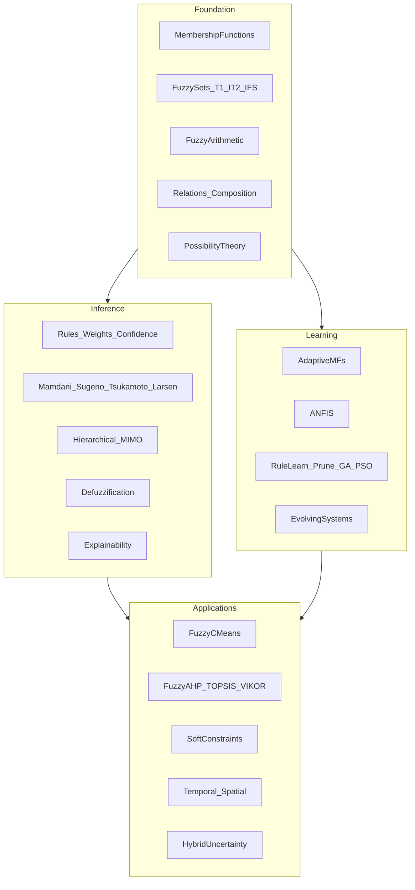

# Mathematical Fuzzy Bundle

## Goal and ticket

- **Goal association:** `r2602/runningsketchpad` (same mathematical-framework wave as [CAUSAL-INFERENCE-FRAMEWORK-FOR-MATHEMATICAL-CRATES](.repo/🎫️/26/07/19/CAUSAL-INFERENCE-FRAMEWORK-FOR-MATHEMATICAL-CRATES/ticket.json)).
- On execution: `ticket_open` with title **Fuzzy Logic Mathematical Bundle**, emoji `🌫️`, client `cursor-chat`, llm `composer-2.5` (or current session model). Bind the plan id for archival on close.
- No existing fuzzy ticket; create new (do not reopen causal).

## Deliverable shape

One new package mirroring [mathematical/probability](mathematical/probability):

| Path                                                                 | Role                                                        |
| -------------------------------------------------------------------- | ----------------------------------------------------------- |
| [mathematical/fuzzy/rs/lib.rs](mathematical/fuzzy/rs/lib.rs)         | Entire API + tests (flattened single file)                  |
| [mathematical/fuzzy/rs/Cargo.toml](mathematical/fuzzy/rs/Cargo.toml) | `mathematical_fuzzy` rlib                                   |
| [mathematical/fuzzy/script.ts](mathematical/fuzzy/script.ts)         | `test` / `lint` via `runCargoTestBudgeted` / `runCargoLint` |
| [mathematical/fuzzy/project.json](mathematical/fuzzy/project.json)   | `@semio-tech/math-fuzzy` nx targets                         |
| [mathematical/fuzzy/package.json](mathematical/fuzzy/package.json)   | nx script bridge                                            |

Wire into root [Cargo.toml](Cargo.toml) `members` next to the other mathematical crates. Add launch entry `🧪️test🧮️mathematical-fuzzy` in [.vscode/launch.json](.vscode/launch.json) after `🧪️test♾️mathematical-cas` (`order` ~391.77).

**Dependencies (only):** `mathematical_algebra`, `mathematical_random`, `serde` (derive), `thiserror`.  
**Not used:** stub crates (`tabular` / `statistics` / `probability` / `causal`), and `neural/engine` (separate technology — ANFIS is implemented in-crate).

**Philosophy:** zero external fuzzy/ML crates; all numerics in-house; `f64` throughout; public API never leaks external types.

## Architecture

Single `lib.rs` organized as `// #region 🔖️Name` sections (algebra/random style), not `pub mod` files.

## Region / API checklist (feature-complete)

### Foundation

- **FuzzyError** — validated domains, empty rule bases, singular LSE, etc.
- **MembershipFunction** — triangular, trapezoidal, Gaussian, generalized bell, sigmoid, singleton, piecewise-linear, custom closure-backed; eval + parameter get/set for adaptation.
- **FuzzySet** (type-1), **IntervalType2Set** (FOU lower/upper), **IntuitionisticSet** (μ, ν, π with μ+ν≤1).
- Set operations / hedges — t-norms & t-conorms (min, product, Łukasiewicz, drastic, nilpotent max); complement; concentration/dilation; linguistic hedges.
- **FuzzyNumber** + α-cut arithmetic and extension-principle application for elementary operations.
- **FuzzyRelation** + max-min / max-product composition.
- **Possibility** / **Necessity** measures from fuzzy sets and distributions-as-possibility.

### Rules and inference

- **LinguisticVariable**, **Term**, **Universe** (discrete grid for numerical integration).
- **Rule** / **RuleBase** with rule weight and confidence; soft constraint rules (“prefer low cost”).
- Engines: **Mamdani**, **Sugeno–Takagi** (constant + linear consequents), **Tsukamoto**, **Larsen**, hybrid combiner.
- **MimoSystem** and **HierarchicalSystem** (layer outputs feed next layer — rule-explosion control).
- Defuzzification: centroid, bisector, MOM / SOM / LOM, weighted average, height, COA on discrete universes.
- **Explanation** — fired rules, activation strengths, consequent contributions, chosen crisp value rationale.

### Learning and adaptation

- Adaptive MF fitting from `(x, μ)` or labeled samples (gradient + bounded projection).
- **Anfis** — hybrid learning (LSE for consequent params + gradient for premise params); forward pass matches Sugeno.
- Rule induction: Wang–Mendel, subtractive-clustering seed, prune low-support/low-weight rules, confidence weighting from data fit.
- **GeneticOptimizer** / **PsoOptimizer** (in-house via `mathematical_random`) for MF params and rule weights.
- **EvolvingFuzzySystem** — online rule add/prune and MF tweak on streaming samples.

### Clustering, decision, temporal, hybrid

- **FuzzyCMeans** (and Gustafson–Kessel covariance variant) with membership matrix + centers.
- **FuzzyAhp**, **FuzzyTopsis**, **FuzzyVikor** multicriteria APIs.
- Temporal/spatial hedges and evaluators (`recently`, `frequently`, `near`, `slowly`) over time/space indices.
- Hybrid bridges: fuzzy–possibility wrappers and fuzzy membership from soft probabilistic scores (no Bayesian engine dependency).

### Example path (controller)

Typed builder covering the user’s fan example: learn “high” from sensor data → interval type-2 sensor uncertainty → weighted rule → evolving update → `Explanation` of selected fan speed.

## Tests

All in `// #region 🔖️Tests` inside `lib.rs` (no new test files):

- Fundamental: MF shapes, set operations, each inference engine on a 1–2 rule system, each defuzzifier, FCM toy 2-cluster, AHP/TOPSIS smoke, α-cut arithmetic.
- `mod long`: ANFIS fit on a nonlinear target, evolving stream, GA/PSO improvement, hierarchical MIMO, type-2 FOU robustness check.

Validate with `bun nx run @semio-tech/math-fuzzy:test` and `test-long` (never claim pass without running).

## Implementation order

1. Scaffold package + workspace + launch.json + ticket folder scratch notes.
2. Foundation regions (MF → sets → arithmetic → relations → possibility).
3. Rules + all inference engines + defuzz + explanation + MIMO/hierarchical.
4. Learning (adaptive MF → ANFIS → rule learn/prune → GA/PSO → evolving).
5. FCM, MCDM, temporal/spatial, soft constraints, hybrid bridges.
6. Exhaustive tests; close ticket with summary and full file list.

## Out of scope

- No TS/JS bindings, no UI, no mixing into `neural/`, `compose/`, or other technologies.
- No dependency on unfinished causal-substrate stubs.
- No multi-file crate layout (contradicts flatten-to-single-`lib.rs` convention).

