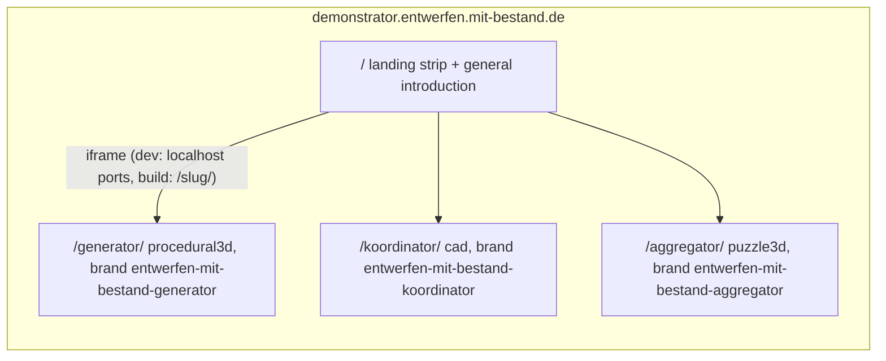

# Mit-Bestand Demonstrator with Three Branded Apps

## Decisions (confirmed)
- Landing strip shows the three **live apps in iframes** (pointer-events disabled).
- The general introduction (Willkommen / Früher Prototyp / Förderhinweis) plays **on the landing page only**; each app plays only its app-specific introduction.
- Naming: **Generator** (`/generator`), **Koordinator** (`/koordinator`), **Aggregator** (`/aggregator`) at `demonstrator.entwerfen.mit-bestand.de`.

## Architecture

## 1. New playground variants (registry)
- [✏️s/🔌️plugins/🌀️procedural/🛂️manifest/🗿️artifact/⚡️implementations/🦀️rust/Cargo.toml](✏️s/🔌️plugins/🌀️procedural/🛂️manifest/🗿️artifact/⚡️implementations/🦀️rust/Cargo.toml): add playground row `variant = "generator"`, `app = "procedural3d-play"`, `brand = "entwerfen-mit-bestand-generator"`, ports `{ react = 6027, wgpu = 6127 }`.
- [✏️s/🔌️plugins/📐️cad/🛂️manifest/🗿️artifact/⚡️implementations/🦀️rust/Cargo.toml](✏️s/🔌️plugins/📐️cad/🛂️manifest/🗿️artifact/⚡️implementations/🦀️rust/Cargo.toml): add `variant = "koordinator"`, `brand = "entwerfen-mit-bestand-koordinator"`, ports `{ react = 6028, wgpu = 6128 }`.
- [✏️s/🔌️plugins/🧩️puzzle/🛂️manifest/🗿️artifact/⚡️implementations/🦀️rust/Cargo.toml](✏️s/🔌️plugins/🧩️puzzle/🛂️manifest/🗿️artifact/⚡️implementations/🦀️rust/Cargo.toml): rename aggregator row's brand to `entwerfen-mit-bestand-aggregator`.
- Regenerate `🤖️generated/🟦️playgrounds.ts` via the plugin-registry `generate` task.

## 2. Generalize `🧺️aggregator` into `🧺️demonstrator`
Move `♻️mit-bestand/🧺️aggregator/` → `♻️mit-bestand/🧺️demonstrator/` (plain `mv`, no git commands) and restructure [🟦️brand.ts](♻️mit-bestand/🧺️aggregator/🟦️brand.ts) with regions:
- **Shared region**: logo SVG, `DEMONSTRATOR_HOST` (`demonstrator.entwerfen.mit-bestand.de`), shared locks (locale `de`, theme `semio`), the split-out **general introduction** (`welcome`, `prototype`, `funding` steps with the BMWSB/BBSR/Zukunft-Bau logos) exported for the landing page, and `ENTWERFEN_MIT_BESTAND_BRAND_IDS`.
- **Aggregator brand**: keeps only app-specific steps (`viewport` … `fill-distribution`), id `entwerfen-mit-bestand-aggregator`, existing tutorial, `distDir` under the demonstrator build staging.
- **Generator brand** (new): German app-specific introduction for procedural3d hand-authored against real element ids from [✏️s/🔌️plugins/🌀️procedural/🎛️apps/🧊️3d/🔨️modules/🖱️ui/⚡️implementations/🦀️rust/📦️lib.rs](✏️s/🔌️plugins/🌀️procedural/🎛️apps/🧊️3d/🔨️modules/🖱️ui/⚡️implementations/🦀️rust/📦️lib.rs); default example `hex-column` (Hexagonal Mushroom Column).
- **Koordinator brand** (new): same for cad against [✏️s/🔌️plugins/📐️cad/🎛️apps/📐️cad/🔨️modules/🖱️ui/⚡️implementations/🦀️rust/📦️lib.rs](✏️s/🔌️plugins/📐️cad/🎛️apps/📐️cad/🔨️modules/🖱️ui/⚡️implementations/🦀️rust/📦️lib.rs); default example `forest-left`. Lock terminology `reuse` only where the app declares it (verify per app; puzzle does today).
- Register all three in [🏷️brand/📦️index.ts](🧰️framework/🛍️products/💻️os/🔨️modules/🧑️‍💻️dev/⚡️implementations/🟦️typescript/🏷️brand/📦️index.ts) `SHELL_BRANDS`.
- Renderer footer credits in [📦️index.tsx](🧰️framework/🛍️products/💻️os/🔨️modules/📺️renderer/🧑️‍🎨️engine/⚛️react/⚡️implementations/🟦️typescript/📦️index.tsx) (line ~8874): replace the `brand?.id === "entwerfen-mit-bestand"` check with membership in `ENTWERFEN_MIT_BESTAND_BRAND_IDS`.
- Update all `♻️mit-bestand/🧺️aggregator/…` path references (asset URLs in brand/footer, vite `assetsDir`, doc references).

## 3. Landing page app (`♻️mit-bestand/🧺️demonstrator/`)
New standalone Vite app following the [projektetage pattern](♻️mit-bestand/🎤️präsentation/📅️33.projektetage/⚡️implementations/🟦️typescript/📜️script.ts): `package.json`, `📋️project.json`, `📜️script.ts` (dev/build only), `⚙️vite.config.ts`, `🌐️index.html`, `📦️index.tsx`, `🎨️globals.css`.
- **General introduction**: rendered with the exported `UIIntroduction` component from `@semio-tech/ui-react` (all three steps are `placement: "center"` with logos, so no shell anchoring needed); auto-plays on every load (ephemeral, matching the brands), dismiss/finish reveals the strip.
- **Strip**: `300vw × 100vh` flex row of three pointer-events-none iframes; container translates by `-(mouseX / innerWidth) × 200vw` (smoothed with a small lerp).
- **Glass overlay**: three fixed screen thirds with tint + backdrop blur and the centered names Generator / Koordinator / Aggregator; hovering a name removes that third's tint; clicking navigates to the app URL.
- **URL resolution**: dev → `http://localhost:6027|6028|6023/`; production build → `/generator/`, `/koordinator/`, `/aggregator/` (via `import.meta.env.DEV`).
- Footer partner/funding credits reuse [⚛️footer.tsx](♻️mit-bestand/🧺️aggregator/⚛️footer.tsx).

## 4. Suppress in-iframe introductions
The three brands set `replayIntroductionOnLoad`, which would auto-open the intro inside every strip iframe. In the react renderer's introduction auto-start effect, skip auto-start when embedded (`window.self !== window.top`). This also benefits playground iframes in presentations.

## 5. Build assembly and deployment
Apps keep root-absolute runtime URLs (`/plugin-modules/…`, `/mesh/…`, `/♻️mit-bestand/…` — these are a data-level convention, including inside documents), so apps are built with default base `/` and merged at the domain root:
- Each app brand's `distDir` points at a staging dir under `♻️mit-bestand/🧺️demonstrator/` build output; `cnameHost` moves off the app brands.
- The demonstrator `📜️script.ts build` runs the three `framework-os-dev` variant builds plus the landing build, then assembles one `dist/`: landing at root, each app's entry html at `<slug>/index.html` (plain `index.html` so static hosts serve directory indexes), all other trees (hashed `assets/`, `plugin-modules/<pluginId>`, `mesh/`, fixtures, brand assets) merged at root, plus `.nojekyll` and one `CNAME`/`🌐️CNAME` with the host.

## 6. Wiring (zero-touch)
- Root [package.json](package.json): workspace entry + `dev:mit-bestand:demonstrator`, `dev:mit-bestand:generator`, `dev:mit-bestand:koordinator`, `build:mit-bestand:demonstrator` (replacing/renaming the aggregator-only build script); keep `dev:mit-bestand:aggregator`.
- `dev:mit-bestand:demonstrator` spawns the three app dev servers plus the landing dev server.
- [.vscode/launch.json](.vscode/launch.json): add matching `🛠️dev🏚️mitbestand…` and `📦️build🏚️mitbestand🎪️demonstrator` entries following existing order/grouping/naming.

## 7. Tests and verification
- Extend existing test files only: renderer [🧪️index.test.ts](🧰️framework/🛍️products/💻️os/🔨️modules/📺️renderer/🧑️‍🎨️engine/⚛️react/⚡️implementations/🟦️typescript/🧪️index.test.ts) (brand ids, seen-key scoping, iframe suppression, footer credits for all three brands) and brand-catalog resolution tests.
- Runtime verification with `[DEBUG]` console logs: each app boots branded at its dev port with only its app-specific intro; landing plays general intro, strip scrolls with mouse x, hover untints, click navigates; production build assembles and previews end to end.

All work happens inside a repo ticket (opened via repo MCP at implementation start, associated with the mit-bestand goal), with temporary logs/probes stored in the ticket folder.