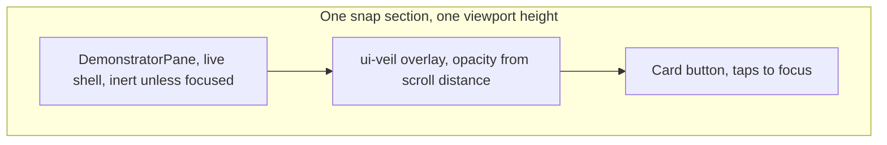

## Goal

On touch/mobile the hover-driven 3x2 grid cannot work (no hover to reveal a pane). Replace it, for touch viewports only, with a single vertical list: six sections of one viewport height each (six times the height in total), each section painting its own live app pane in the background with one card centered on top. The veil tint is driven by scroll position instead of hover: fully transparent while a section is settled (app revealed, mirroring desktop hover-reveal), smoothly ramping to fully tinted mid-transition between two sections.

All work lands in [♻️mit-bestand/🧺️demonstrator/📦️index.tsx](♻️mit-bestand/🧺️demonstrator/📦️index.tsx). The desktop grid path, `DEMONSTRATOR_PANES` in [♻️mit-bestand/🧺️demonstrator/🟦️brand.ts](♻️mit-bestand/🧺️demonstrator/🟦️brand.ts), the pane boot machinery and `DemonstratorPane` itself stay as they are.

## Mode switch

Two separate media flags, both via `useMediaQuery` from `@semio-tech/ui-react`:

- List layout: `UI_MOBILE_MEDIA_QUERY` plus `(hover: none) and (pointer: coarse)`. The extra clause matters because a landscape phone or tablet is wider than 767px yet still has no hover, so the grid's reveal would be unreachable there.
- Surface chrome device: `UI_MOBILE_MEDIA_QUERY` alone, so the landing's own document chrome matches what every pane's shell already computes for itself (`const mobile = useMediaQuery(UI_MOBILE_MEDIA_QUERY)` then `uiDevice = mobile ? "mobile" : uiLayout` in the OS renderer). The existing `surfaceChrome` memo currently hardcodes `desktop`/`tablet` and has `[]` deps, so it gains the mobile branch and that dep.

## Section layers

Panes live inside the scrolling sections rather than in a separately transformed strip, so the app, its veil and its card scroll as one unit with native momentum and never desync from the scroll position.



## Changes in the landing entry

New region `//#region 📱️DemonstratorMobileList` holding the mobile geometry plus the list renderer, next to the existing `🎪️DemonstratorGridGeometry`.

Scroll-driven tint, replacing the hover reveal-rect math on this path:

```ts
/** @emoji 📱️ How far past a section's snap point the veil needs to reach full tint. */
const DEMONSTRATOR_LIST_VEIL_RAMP = 0.35;

/** @emoji 🌫️ Veil alpha for one section: transparent while settled, opaque once a neighbour takes over. */
function demonstratorListVeilOpacity(distanceInSections: number): number {
  const t = Math.min(1, Math.abs(distanceInSections) / DEMONSTRATOR_LIST_VEIL_RAMP);
  return t * t * (3 - 2 * t);
}
```

Because both neighbours are equidistant at the midpoint, their alphas match and the two half-screens read as one uniform tint with no seam.

Scroll container and sections:

- Container: `h-dvh w-full overflow-y-auto overscroll-y-contain snap-y snap-mandatory`, with a `ref` and an `onScroll` handler that coalesces into one `requestAnimationFrame` and stores `scrollTop / clientHeight` as list progress state. `dvh` rather than `vh` so the iOS URL bar does not cut a section short.
- Section: `relative h-dvh w-full snap-start overflow-hidden`, containing the existing `<DemonstratorPane>`, an absolutely positioned `ui-veil` at `z-30` whose `style.opacity` is `demonstratorListVeilOpacity(progress - index)`, and the card at `z-[31]`.
- The card markup (icon chip, label, tagline, "Demonstrator öffnen" row) is extracted from the desktop grid into one `DemonstratorCard` component used by both paths, so the copy and chrome stay single-sourced; the mobile instance just gets a wider `max-w` and bottom padding clear of the fixed footer.

Lazy boot instead of the idle queue: six live WASM shells on a phone is too much up front, so `useSequentialPaneBoot` gains a flag to skip its automatic queue in list mode, and a scroll effect calls the existing `promote(...)` for the current section (plus the next one) as it comes into view. Panes stay booted once seen, since unmounting would throw away shell state and pay the boot cost again.

Desktop-only effects get an early return in list mode: the `mousemove` pan, the easing `requestAnimationFrame` loop, `refreshRevealRect` and its `resize` handler.

## Focus and deep links on mobile

Tapping a card reuses the existing `focusPane`, so the hash, `Übersicht` button and Escape handling are unchanged. On top of that, in list mode:

- `focusPane` scrolls the container to `index * clientHeight` with instant behavior (the section is already snapped, so this is just a guard) and then locks scrolling by swapping the container to `overflow-hidden` with the snap classes off. The focused section already fills the viewport, so no pane is reparented and the live shell never remounts.
- The focused section hides its veil and card and drops `inert` on its pane, which the existing `focused` prop already drives.
- `returnToOverview` restores the scroll classes and re-asserts the section offset.
- An initial `#<paneId>` hash scrolls the container to that section before focusing, matching the desktop deep-link behavior.

No new executable command is introduced, so `package.json` and `.vscode/launch.json` stay untouched; the page keeps running under the demonstrator's existing `📜️script.ts dev` on the fixed port 6029.

## Verification

Runtime only, since the demonstrator has no test file to extend and the rules forbid adding one. Inside a fresh ticket folder, a Playwright probe at viewport 390x844 with `hasTouch` and `isMobile` asserts and screenshots:

- six snap sections, exactly one card in the viewport at rest;
- veil opacity near zero once a section settles and near one at a midpoint scroll;
- the settled section's shell actually painting (canvas or German shell text present);
- tap on a card gives a full-screen interactive pane with scrolling locked, and `Übersicht` returns to the list at the same section;
- `#bearbeiten` on load boots and focuses that pane;
- a desktop-viewport pass confirming the 3x2 grid and hover reveal still behave as before.

Then `📜️script.ts build` with `SKIP_PLUGIN_BUILD=1` for the type and bundle pass.

## Ticket

Read `repo://goals`, authenticate the repo MCP if it still reports needing auth, and open a ticket for this work associated with the demonstrator goal (`🎯️r2602`, as used by the previous demonstrator tickets). Probes, logs and screenshots stay in that ticket folder; close it with a summary and the touched files when the mobile list is verified.
