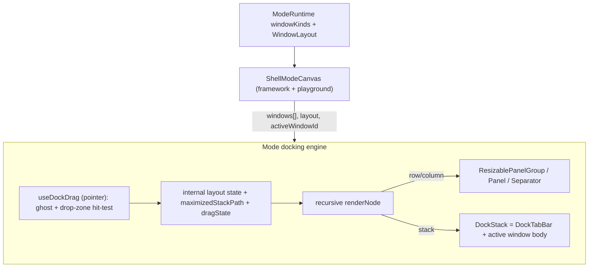

# Mode Docking Reimplementation

Reimplement Golden Layout's functionality in pure React inside the elements `Mode` component. Scope (per user): tab stacks, splitter resize, drag-to-reorder tabs, drag-to-dock/split between regions, maximize/restore, close. Excluded: layout persistence (`onLayoutChange`) and native popout.

All elements work stays in [elements/lib/react/core/index.tsx](elements/lib/react/core/index.tsx) (`🧭Mode` region), per the "edit existing files, use regions" rule.

## Architecture

The existing tree types already mirror Golden Layout (`row`/`column`/`stack`/`window`), so the model is reused; `Mode` becomes the layout owner with internal mutable state (no persistence needed).

## Core changes (`elements/lib/react/core/index.tsx`)

- Extend types: add `activeId?: string` to `WindowLayoutStackNode` (per-stack active tab) and `title?: string` to `ModeWindowDescriptor` (tab label).
- New `🧭Mode` subregions:
  - Tree utils: `normalizeLayoutToStacks` (every window lives in a stack), `reconcileWindows` (add window ids present in `windows` but missing from layout, drop absent ones, collapse empty stacks/single-child axes), `removeWindowFromLayout`, `insertWindowAsTab(targetPath,index)`, `splitWithWindow(targetPath, side)`, `applyAxisSizes(path, {panelId:size})`.
  - `DockTabBar`: per-window tab (title from descriptor `title`/id, per-tab close `x`, active highlight, `pointerdown` to start drag) plus stack-right controls (maximize/restore). Clicking a tab sets stack `activeId` and calls `onActiveWindowChange`.
  - `DockStack`: renders `DockTabBar` + only the active tab's `Window` body; registers its DOM rect in a refs map keyed by node path for hit-testing.
  - Recursive `renderNode`: axis -> `ResizablePrimitive.Group orientation=row?horizontal:vertical` with `Panel id=<pathKey> defaultSize` + `Separator`, capturing `onLayoutChanged` into `applyAxisSizes`; stack -> `DockStack`; window leaf normalized into a stack.
  - `useDockDrag` hook: on tab drag start, render a floating cursor-following ghost; during move, hit-test pointer vs registered stack rects and compute drop zone (center = add tab; left/right/top/bottom quarter = split via `splitWithWindow`; outer mode edges = split root); render a translucent drop-indicator overlay over the zone. On drop, mutate the layout tree (reorder within same stack, move tab to another stack, or split) and collapse emptied nodes.
  - Maximize: `maximizedStackPath` state; when set, render only that stack filling the Mode area (Golden Layout's maximise overlay), with restore toggle.
- `Window` cleanup: remove dead Golden Layout header portal (`windowRef.current.closest(".lm_item.lm_stack")` / `.lm_header`, lines ~19679-19685 and the `headerElement` portal branch). Windows inside a stack no longer render their own maximize/close (the `DockTabBar`/stack header owns those); keep `controls`, `measures`, `engagement` overlays and the `active` ring.

## Renderer wiring (titles)

- [elements/lib/framework/renderer/react/index.tsx](elements/lib/framework/renderer/react/index.tsx) and [elements/lib/playground/react/index.tsx](elements/lib/playground/react/index.tsx): in each `ShellModeCanvas`, set `title: windowKind.label` on each `ModeWindowDescriptor` and propagate layout-node `title` in `convertFrameworkLayoutNodeToShellLayout`. No other renderer change needed; `Mode` now owns drag/close/maximize internally.

## Sketchpad regression remediation (semio surface I broke)

The prior removal deleted the `golden-layout` dependency and its CSS, but [semio/client/lib/sketchpad/js/index.ts](semio/client/lib/sketchpad/js/index.ts) `LayoutCanvas` still uses Golden Layout (`import("golden-layout")`, `.lm_popout`/`.lm_maximise`/`.lm_close`, 7+ usages). Restore, using `git show 8d5dba003^:<file>` to recover exact removed content:
- Re-add the `golden-layout` dependency to the package(s) the sketchpad/semio surface needs (recovered from the commit diff).
- Restore the Golden Layout base CSS import + `.lm_*` overrides in [elements/lib/styling/js/elements.css](elements/lib/styling/js/elements.css) (only the `.touch .lm_*` rules survive today). This keeps the separate semio sketchpad working; elements no longer uses Golden Layout.

## Tests, stories, verification

- Extend inline `import.meta.vitest` in core: stack renders tabs with only the active window visible; clicking a tab switches the visible window; closing a tab removes the window and collapses an emptied stack; `splitWithWindow` and `removeWindowFromLayout` tree utils; maximize shows only one stack. Run `@elements/ui` vitest (ResizeObserver mock already in `vitest.setup.ts`).
- Update [.storybook/stories/elements/ui/Mode.stories.tsx](.storybook/stories/elements/ui/Mode.stories.tsx): tab-stack story, drag-to-dock story, maximize story; build Storybook.
- Runtime-verify one play host (spatial) and the sketchpad in the browser (tabs, drag-dock, splitter resize, maximize, close); run lint across affected packages; then close the ticket.