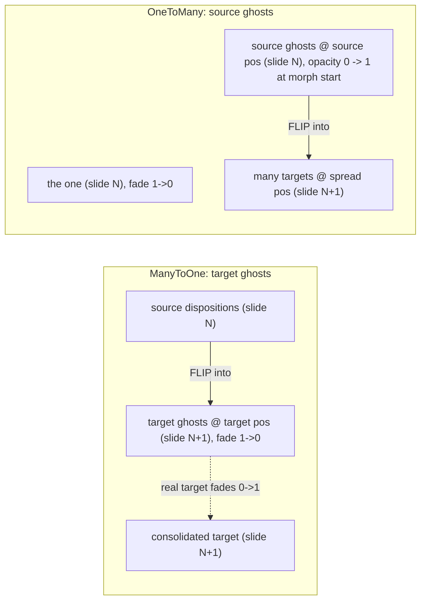

## Problem (current state)

- Many-to-one IS first-class via `Disposition.morphFrom` -> `expandArrangementMorphFrom` -> `morphSource: true` ghosts placed at the target position on the target slide, rendered as `.presentation-morph-source` (fade 1->0) plus the real target `.presentation-morph-into` (fade 0->1). Behaviorally this is already a "target ghost", but it is named "source" everywhere.
- One-to-many is NOT first-class. The deck hacks it: `[Bauteilkatalog.ts](mit-bestand/präsentation/33.projektetage/slide/Hauptteil/Einführung/Medien/Bauteilkatalog.ts)` manually appends every split tile disposition at `style:{opacity:0}` and relies on `settleBeforeMorphTo`, and the framework CSS hardcodes deck slide titles `section[title="catalogue"]` / `section[title="catalogue-focus"]` in `[globals.css](framework/product/presentation/renderer/react/globals.css)` (lines ~696-726). This leaks deck identity into the framework and is the inconsistency to refactor.

## Target model (spec-aligned)

- Unify the ghost concept. Replace `Disposition.morphSource?: boolean` / `ResolvedDisposition.morphSource` with `ghost?: GhostKind` where `GhostKind = "source" | "target"`.
  - `"target"` ghost = many-to-one (was `morphSource:true`).
  - `"source"` ghost = one-to-many (new).
- Symmetric declarative slots in `[core/index.ts](framework/product/presentation/core/index.ts)`:
  - Keep `morphFrom?: MorphFromSlot[]` on the consolidated target (many-to-one). `MorphFromSlot.position` = where the target ghost sits (target position).
  - Add `morphTo?: MorphToSlot[]` on the "one" disposition (one-to-many). `MorphToSlot { participantId; embodimentId?; position }` where `position` = where the source ghost sits on the source slide (overlay/grid position). Same shape/semantics as `MorphFromSlot`, mirrored.

## Core changes (`[framework/product/presentation/core/index.ts](framework/product/presentation/core/index.ts)`)

- `#region Morph` / `#region Disposition` / `#region Resolved`: add `GhostKind`, `MorphToSlot`; swap `morphSource` -> `ghost`; update `MorphFromSlot` docstring (target ghost).
- `#region Expand`:
  - Rename/adjust `expandArrangementMorphFrom` to set `ghost: "target"`.
  - Add `expandArrangementMorphTo(targetSlide, sourceArrangement)`: for each `morphTo` slot on the source disposition, resolve the target disposition from the next slide (embodiment fallback), append a `ghost:"source"` disposition to the SOURCE arrangement at `slot.position`, `morphId = participantId` (matches the target tile on slide N+1).
  - In `expandThoughtSlides`, within a morph run expand BOTH directions per slide: `morphFrom` against previous slide (existing) and `morphTo` against next slide (new).
  - Generalize `slideMorphParticipantIds` to also include `morphTo` slot ids so runs pair correctly.
  - Rename `isMorphSourceDisposition` -> `isGhostDisposition` (true for either ghost kind); `arrangementRestDispositions` and `isDispositionVisibleForLayout` omit both ghost kinds.
- `#region Resolve`: morphId rules - target ghost -> `participantId`; source ghost -> `participantId`; consolidated `morphFrom` target -> `participantId--label`; the `morphTo` "one" keeps its own morphId and is intentionally unmatched (fades out).
- `#region Tests`: extend inline vitest - one-to-many expansion produces source ghosts on the source slide with correct positions/morphIds; both ghost kinds excluded from rest/centering; existing many-to-one tests updated for `ghost:"target"`.

## Renderer changes (`[renderer/react/index.tsx](framework/product/presentation/renderer/react/index.tsx)` + `[globals.css](framework/product/presentation/renderer/react/globals.css)`)

- Rename classes to spec terminology and add source-ghost support:
  - `.presentation-morph-source` -> `.presentation-target-ghost` (many-to-one ghost, fade 1->0).
  - keep target fade-in but rename `.presentation-morph-into` -> `.presentation-morph-target`.
  - add `.presentation-source-ghost` (one-to-many ghost: opacity 0 at rest; opacity 1 during `pending`/`running`; then FLIP) and `.presentation-morph-one` (the "one", fades 1->0 during the run).
- Replace the deck-specific `section[title="catalogue"]` / `section[title="catalogue-focus"]` rules and the `presentation-morph-slot--dormant` + `settleBeforeMorphTo` machinery with generic, class-driven CSS keyed only on ghost classes + `data-auto-animate` state. Keep a generic settle reflow only if required for reveal FLIP to capture source-ghost geometry (driven by ghost classes, never slide titles).
- Update `presentationMorphGhostAutoAnimateCss`, `presentationAutoAnimateMatcher`, `elementIsMorphSourceAnchor` (-> ghost-aware), `buildInteractiveSlideLayout` revealMorphId branch, `declaredDispositionRect`, and `MorphDispositionView`/`FigureMorphView` props (`morphSource` -> `ghost`). Matcher must pair source tile->target ghost (m2o) and source ghost->target tile (o2m), and never pair the "one".
- `#region Tests`: replace assertions referencing `section[title="catalogue"]` settle, `presentation-morph-slot--dormant`, and `presentation-morph-source` with the new ghost classes and the generic one-to-many path.

## Deck changes (`[33.projektetage](mit-bestand/präsentation/33.projektetage)`)

- `[spec.ts](mit-bestand/präsentation/33.projektetage/spec.ts)`: add a `catalogueFocusMorphTo()` helper returning `MorphToSlot[]` (focus-tile participants + their grid/source positions from `CATALOGUE_SPLIT`).
- `[Bauteilkatalog.ts](mit-bestand/präsentation/33.projektetage/slide/Hauptteil/Einführung/Medien/Bauteilkatalog.ts)`: drop the manual `...CATALOGUE_SPLIT.dispositions.map(opacity:0)`; declare `morphTo` on the catalogue figure disposition so source ghosts are generated by core.
- `[Bauteilarten.ts](mit-bestand/präsentation/33.projektetage/slide/Hauptteil/Einführung/Medien/Bauteilarten.ts)`: keep focus tiles as the many targets; remove `settleBeforeMorphTo` if the generic class-driven path makes it unnecessary.
- `[Bauteilbeschriftungen.ts](mit-bestand/präsentation/33.projektetage/slide/Hauptteil/Einführung/Medien/Bauteilbeschriftungen.ts)`: unchanged API (`morphFrom`), verify it still resolves to target ghosts.

## Validation

- Run framework core + react renderer vitest and the projektetage deck assertions via `nx` (launch.json existing tasks; no new commands). Confirm both morph runs (catalogue->focus one-to-many, focus->labels many-to-one) build the right ghost dispositions/classes.
- Per repo rules, confirm runtime by loading the deck and checking slide 7->8 and 8->9 transitions (console/DOM assertions in the inline tests), since "passing tests" alone is insufficient for animation behavior.

## Process (execution-time, not done in plan mode)

- Read `repo://goals`, then open/reopen a repo MCP ticket (associate with the presentation/framework goal); keep all scratch files inside the ticket folder; close with summary + file list when done. Do not edit any `AGENTS.md`.

