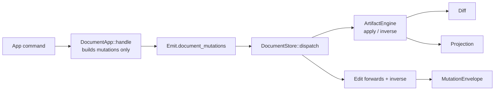

to# Operations to Mutations: Per-Mutation Artifact Decomposition and Mandatory Engines

## Current state (verified)

- Kernel contract lives in [🧰️framework/🛍️products/💻️os/🔨️modules/📡️spr/🎮️command/🦀️component.rs](🧰️framework/🛍️products/💻️os/🔨️modules/📡️spr/🎮️command/🦀️component.rs): `Operation<P>` (`diff`, `backwards`), `OperationDiff<P>`, `OpText`, `OpBinary`, `OperationMeta`, `Edit<Op>`, `OperationDescriptor`, `OperationUpcaster`, `OperationEvent`.
- Wire/causal layer in [🔗️causal/🦀️component.rs](🧰️framework/🛍️products/💻️os/🔨️modules/📡️spr/🔗️causal/🦀️component.rs): `OperationEnvelope`, `InverseOperation`, `OpDag`, `OperationTransform`.
- Store in [🏪️store/🦀️component.rs](🧰️framework/🛍️products/💻️os/🔨️modules/🏪️store/🦀️component.rs): `DocumentStore::dispatch`, `DocumentCommand<Operation>`, `replay_operations` (sole `Operation::backwards` call site, line ~2578).
- App transition surface is `DocumentApp::handle -> Emit<Operation, ConfigOperation, DraftOperation>` in [🔌️plugin/🦀️component.rs](🧰️framework/🛍️products/💻️os/🔨️modules/🔌️plugin/🦀️component.rs) (~3319), consumed by `dispatch_emit` (~4299).
- `trait Engine` in [⚙️engine/🦀️component.rs](🧰️framework/🛍️products/💻️os/🔨️modules/⚙️engine/🦀️component.rs) is a content-addressed byte-in/byte-out compute cache, **not** a per-artifact state machine. Per-artifact `⚙️engine` folders are headless compute helpers (e.g. `LowpolyDocument`).
- Taxonomy is the single source of truth: [🔣️taxonomy.json](🧰️framework/🛍️products/🦑️repo/🔨️modules/📚️library/🔣️taxonomy.json) (`artifactComponentDirs`, `artifactChildDirs`, `artifactSpecFilenames`, `taxonomyLeafParentDirs`), mirrored by `validateTaxonomyTree` (registry), `assert_taxonomy_components` (Rust, ~1588), and the `PolicyRuleTaxonomy` region of [📜️script.ts](📜️script.ts) (~3889-4438).
- Scale: 52 artifacts, 52 `🔧️op` grammars (all `grammar <x>.op` + `start operation`), ~450 operation variants, 38 protocol schemas ending `.operation`, 91 `*.op.semio` examples, 52 TS facades.

## Target shape

```
<plugin>/🗿️artifacts/<artifact>/
  🧬️mutations/                      # NEW facet, required
    🦀️component.rs                  # <Artifact>Mutation dispatch enum + impl Mutation<P>
    🟦️component.ts
    ➕️objects-add/                  # one dir per mutation, unique emoji per specific
      🦠️mutation/{🦀️component.rs,🟦️component.ts}   # struct + builder
      🔺️diff/{🦀️component.rs,🟦️component.ts}       # diff this mutation yields for its args
      ↩️inverse/{🦀️component.rs,🟦️component.ts}     # Vec<Mutation> that reverts it
    ➖️objects-remove/ ...
  🔧️op/                             # KEPT: handcrafted grammar combining mutations compactly
  🔺️diff/                           # KEPT: general artifact diff definition
  🗣️dsl/ 🎒️pack/ 📡️spr/ 📚️examples/
  ⚙️engine/                          # now REQUIRED: the state machine
```

Kind emojis (unique per kind): `🧬️mutations`, `🦠️mutation`, `↩️inverse`, reusing `🔺️diff` for the diff kind and existing `⚙️engine` / `🔧️op`. Every concrete mutation dir gets its own emoji, unique within its artifact, enforced by a new policy scanner.

Mutation type shape (per the `per_type` decision):

```rust
pub trait Mutation<P>: Clone + Serialize + DeserializeOwned {
    type Diff: MutationDiff<P>;
    fn diff(&self, base: &P) -> Self::Diff;
    fn inverse(&self, base: &P) -> Vec<Self>;
}
```

Each mutation is its own struct implementing `Mutation<P>`; `<Artifact>Mutation` is a thin dispatch enum whose `diff`/`inverse` delegate. `impl OpText`/`OpBinary` for the dispatch enum stays in `🔧️op` (grammar-adjacent codec).

## Engine as the state machine




New kernel trait in [⚙️engine/🦀️component.rs](🧰️framework/🛍️products/💻️os/🔨️modules/⚙️engine/🦀️component.rs), separate from the existing byte-cache `Engine`:

```rust
pub trait ArtifactEngine: Send + Sync {
    type Projection;
    type Mutation: Mutation<Self::Projection>;
    type Diff: MutationDiff<Self::Projection>;
    fn projection(&self) -> &Self::Projection;
    fn apply(&mut self, mutation: &Self::Mutation) -> Result<Self::Diff, EngineFault>;
    fn inverse(&self, mutation: &Self::Mutation) -> Vec<Self::Mutation>;
}
```

`DocumentStore` drives the engine instead of calling `Operation::diff`/`backwards` directly; `replay_operations` becomes `replay_mutations` and goes through `ArtifactEngine`. Existing compute helpers (`LowpolyDocument`, `SequenceHost`, `host_operations`, `ops_from_host_mutation`, etc.) become engine internals. All 52 artifacts get an `⚙️engine`, including `🪐️space/🏠️home`, `🎪️demonstrator/🎪️playground`, `🔋️energy/🔋️model`.

## Rename map (no legacy, no aliases)

Renamed:

- `Operation<P>` to `Mutation<P>`; `backwards` to `inverse`; `OperationDiff<P>` to `MutationDiff<P>`
- `OperationEnvelope`/`WireOperationEnvelope` to `MutationEnvelope`/`WireMutationEnvelope`; field `operation_id` to `mutation_id`
- `InverseOperation` to `InverseMutation`; `OperationMeta`, `OperationDescriptor`, `OperationEvent`, `OperationUpcaster`, `OperationTransform`, `OpDag` to `Mutation*` / `MutationDag`
- `CollectionOperation` to `CollectionMutation`; `apply_collection_operation` to `apply_collection_mutation`; `invert_collection_operation` to `inverse_collection_mutation`; `apply_operation` to `apply_mutation`
- `DocumentCommand<Operation>` to `DocumentCommand<Mutation>`; `Apply { operations }` to `Apply { mutations }`; `Edit.backwards` to `Edit.inverse`
- `DocumentApp::{Operation, ConfigOperation, DraftOperation}` to `{Mutation, ConfigMutation, DraftMutation}`; `NoConfigOperation`/`NoDraftOperation` to `No*Mutation`; `Emit.document_operations` etc. to `*_mutations`
- Every `<X>Operation` enum to `<X>Mutation` (~50 enums), every `apply_*_operation`/`invert_*_operation` fn
- TS: `KernelOperation` to `KernelMutation`, `applyOperations` to `applyMutations`, `encode/decodeOperationEnvelopesPack` to `*MutationEnvelopesPack*`, `operationEnvelopeTo/FromWire`, `remoteOperations`, `pendingOperations`, `inverseOperations`, `relayOperationsToHub`, `Puzzle2dLiveMirrorOperations`, `ActionDefinition.kind: "operation"` to `"mutation"`
- Grammars: `start operation` to `start mutation`, production `operation =` to `mutation =` (52 files); protocol schemas `<x>.operation` to `<x>.mutation` (38 files)
- WIT comment `apply-operations` in [📜️world.wit](🧰️framework/🛍️products/💻️os/🔨️modules/🔌️plugin/📦️packages/🦀️rust/📜️wit/📜️world.wit)
- `neural_engine::Operation` to `neural_engine::Operator` (frees the word; genuinely an eval operator)

Kept (the `op` concept survives as the compact grammar/protocol for mutations): `🔧️op`, `🔧️ops`, `*.op.semio`, `grammar <x>.op`, `OpText`/`OpBinary`, `print_op`/`parse_op`, `LanguageRole::Ops`, `dsl::DslOps`.

Untouched (different concepts, different technologies): GraphQL `OperationDefinition`, compose kit worker `operation` discriminators, CAD scripting/kernel `operation` fields, 2d boolean `operation`, ink/NodeGraph UI event `operation`.

## Mechanism changes

- [🔣️taxonomy.json](🧰️framework/🛍️products/🦑️repo/🔨️modules/📚️library/🔣️taxonomy.json): add `🧬️mutations` and `⚙️engine` to `artifactComponentDirs`; add `mutationChildDirs: ["🦠️mutation","🔺️diff","↩️inverse"]`; add all three plus `🧬️mutations` to `taxonomyLeafParentDirs`.
- [🔍️discovery/🟦️component.ts](🧰️framework/🛍️products/🦑️repo/🔨️modules/📚️library/🔍️discovery/🟦️component.ts): extend `Taxonomy` interface and `validateTaxonomy`.
- Registry `validateTaxonomyTree` in [📇️registry/📜️script.ts](🧰️framework/🛍️products/💻️os/🔨️modules/🔌️plugin/📦️packages/🟦️typescript/📇️registry/📜️script.ts): add `CONSTITUTIONAL_SLOTS` entry, walk `🧬️mutations/<mutation>/<kind>` requiring both leaves.
- Rust twin `assert_taxonomy_components` (~1588 of [🔌️plugin/🦀️component.rs](🧰️framework/🛍️products/💻️os/🔨️modules/🔌️plugin/🦀️component.rs)).
- [📜️script.ts](📜️script.ts) policy: rename `POLICY_PROTOCOL_MIGRATION_NAMES`, `POLICY_DSL_*`, `POLICY_DIFF_COMPLETENESS_ALLOWLIST`, `PolicyRuleCommandEnvelopeCompleteness`, `PolicyRuleDiffCompleteness`, `POLICY_HANDCRAFTED_FACETS`; **replace** the 52-entry `POLICY_TS_FACADE_ALLOWLIST` with a structural rule (an allowlist cannot scale to ~2700 leaves). Add new scanners: per-mutation triad completeness, `impl Mutation<P>` presence per mutation, `ArtifactEngine` presence per artifact, specific-emoji uniqueness within an artifact, grammar `start mutation` conformance, dispatch-enum-covers-all-mutation-dirs.
- Grammar engine [📖️grammar/🦀️component.rs](🧰️framework/🛍️products/💻️os/🔨️modules/🗣️dsl/📖️grammar/🦀️component.rs): no structural change, only the start-symbol values in the 52 artifact grammars.
- Pre-existing taxonomy breaches to clean while here: `📐️cad/🗿️artifacts/📐️cad/🎬️interaction-spec`, `🏛️architect/🗿️artifacts/🏛️program/{🗄️registers,🧱️kernel}`.
- `.vscode/launch.json` is generated by the registry `generate` target; re-run rather than hand-edit.

## Agent workforce

Models: `cursor-grok-4.5-high` for contract/kernel/complex artifacts, `composer-2.5` for mechanical fan-out. File-ownership isolation rule: only Wave 1/2/6 agents may touch kernel or root `📜️script.ts`; fan-out agents are scoped to exactly one plugin crate each (own `🦀️component.rs`, `📦️glue.rs`, `📦️index.ts`), so no two agents share a file.

- **Wave 0** (1 Grok, serial): write the normative spec into the ticket folder: emoji registry, folder layout, trait signatures, full old-to-new identifier table. Every later agent reads only this.
- **Wave 1** (1 Grok, serial): kernel rename + `Mutation`/`MutationDiff`/`ArtifactEngine` traits across `📡️spr/🎮️command`, `📡️spr/🔗️causal`, `🏪️store`, `🌿️vcs`, `🔌️plugin`, `⚙️engine`, `🗣️dsl` + derive. Gate: `cargo check -p semio-framework-os-kernel`.
- **Wave 2** (2 agents parallel): 2a Grok on taxonomy + discovery + registry + Rust twin; 2b Grok on root `📜️script.ts` policy regions and new scanners. Gate: `bun ./📜️script.ts policy` runs and reports the expected 51 not-yet-migrated artifacts.
- **Wave 3** (1 Grok, serial): lowpoly pilot end to end — 9 mutation dirs, `LowpolyEngine`, grammar `start mutation`, examples, tests. Gate: `cargo test -p semio-s-plugin-lowpoly --lib` green, zero policy breaches for lowpoly. This becomes the reference every fan-out agent diffs against.
- **Wave 4** (fan-out, ~8 concurrent, one crate per agent): dedicated Grok agents for the heavy artifacts (`🏛️program` 72 variants, `🎥️shooting` 38, `📸️remodel` 22, `🧊️process3d` 20, `📐️cad`, `🖍️draw`); Composer agents for the mechanical ones (15 norm artifacts, puzzle/block/fem/gis/procedural/trinity pairs, and the remaining single-artifact plugins). Each gate: `cargo check -p <crate>` then its `:test` target.
- **Wave 5** (2 agents parallel): 5a Grok on `framework-core` + `framework-os` + `backbone-worker` + WIT; 5b Composer on renderer elements (`PluginRuntime`, `ShellHost`, `Board2dHost`), react target re-exports, and the vitest suites.
- **Wave 6** (1 Grok, serial): full gate — `bun nx run workspace:verify-gate`, `bun ./📜️script.ts policy`, cargo check/test across plugin crates, `bun nx run @semio-tech/framework-renderer-react:test`, registry `generate` to refresh `launch.json`, then `rg -in 'operation'` sweep to prove zero legacy outside the untouched-concepts list. Close ticket.

## Verification commands

- `bun ./📜️script.ts policy`
- `bun nx run workspace:verify-gate`
- `cargo check -p semio-framework-os-kernel` / `cargo test -p semio-s-plugin-lowpoly --lib`
- `bun nx run @semio-tech/framework-renderer-react:test`
- `bun nx run @semio-tech/plugin-registry:check`

Note: macOS Rust link steps have historically failed with `cc` exit 69 (Xcode SDK license); the known workaround already used by `@semio-tech/framework-os-dev` is `DEVELOPER_DIR=/Library/Developer/CommandLineTools`.

## Needs your decision before I start

1. The `repo` MCP server is not loaded in this session, so I cannot `ticket_open` or read `repo://goals`. Enable it, or confirm I proceed without a ticket.
2. `AGENTS.md` glossaries define `Operation`/`Op` ([💻️os/AGENTS.md:61-71](🧰️framework/🛍️products/💻️os/AGENTS.md), [🖥️host/AGENTS.md:61-71](🧰️framework/🛍️products/💻️os/🖥️host/AGENTS.md), plus `🌿️vcs`, `📖️playbook`, `🏛️architect`). Rules forbid me editing them — grant an exception or update them yourself.
3. Your sketch showed `builder.rs`/`builder.ts` in the mutation folder; I plan `🦀️component.rs`/`🟦️component.ts` everywhere to stay taxonomy-conformant, holding the struct plus its builder. Say so if you want literal `builder.*` leaf names instead.
4. Per-mutation TS facades in all three kinds means roughly 2,700 new leaf files across the repo. Confirm, or restrict TS to one facade at the `🧬️mutations` root.

