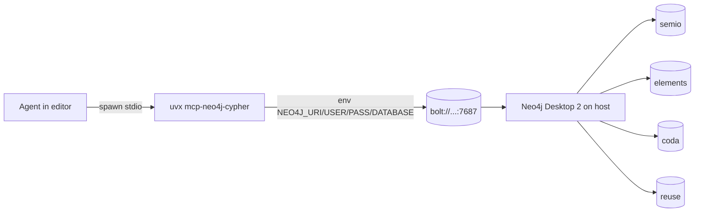

## Decisions (confirmed)

- Run the official server via `uvx mcp-neo4j-cypher` (uv is already installed everywhere).
- One MCP entry per technology: `neo4j-semio`, `neo4j-elements`, `neo4j-coda`, `neo4j-reuse`, each pinned to its own `NEO4J_DATABASE`.
- Devcontainer reaches host Neo4j Desktop 2 via `bolt://host.docker.internal:7687` (with `host-gateway` for Linux parity).

## Shared env contract

Every environment exports the following (single source of truth — MCP entries only override `NEO4J_DATABASE`):

```bash
NEO4J_URI=bolt://localhost:7687         # native windows/mac/linux
NEO4J_URI=bolt://host.docker.internal:7687  # devcontainer
NEO4J_USERNAME=neo4j
NEO4J_PASSWORD=password
NEO4J_TELEMETRY=false
```

Per-technology databases: `semio`, `elements`, `coda`, `reuse` (created by devs in Neo4j Desktop 2 — we document the bootstrap, not auto-create, since Desktop 2 owns DBMS lifecycle).

## Files to change

### 1. MCP configs (add 4 neo4j entries each; keep existing `repo` entry)

Apply the same block to all four — using `${env:VAR}` interpolation so the values come from the platform-specific env layer:

- [.mcp.json](.mcp.json)
- [.cursor/mcp.json](.cursor/mcp.json)
- [.windsurf/mcp.json](.windsurf/mcp.json)
- [.kiro/settings/mcp.json](.kiro/settings/mcp.json)

```json
"neo4j-semio": {
  "type": "stdio",
  "command": "uvx",
  "args": ["mcp-neo4j-cypher"],
  "env": {
    "NEO4J_URI": "${env:NEO4J_URI}",
    "NEO4J_USERNAME": "${env:NEO4J_USERNAME}",
    "NEO4J_PASSWORD": "${env:NEO4J_PASSWORD}",
    "NEO4J_DATABASE": "semio",
    "NEO4J_TELEMETRY": "false"
  }
}
```

Repeat with `NEO4J_DATABASE` set to `elements`, `coda`, `reuse` for the other three entries.

### 2. Devcontainer — [.devcontainer/devcontainer.json](.devcontainer/devcontainer.json)

- Add to `runArgs`: `"--add-host=host.docker.internal:host-gateway"` (Linux Docker parity with Win/Mac).
- Add to `containerEnv`:
  - `NEO4J_URI`: `bolt://host.docker.internal:7687`
  - `NEO4J_USERNAME`: `neo4j`
  - `NEO4J_PASSWORD`: `password`
  - `NEO4J_TELEMETRY`: `false`
- Forward port `7687` in `forwardPorts` with a `portsAttributes` label `Neo4j Bolt` for visibility.

### 3. Windows native — [.devcontainer/install-native.ps1](.devcontainer/install-native.ps1)

- In the `🧰MachineInstall` region, add:
  ```powershell
  Sync-WingetPackage -Id "Neo4j.Neo4jDesktop" -Label "Neo4j Desktop"
  ```
- In the `🗂️UserState` region, persist user env vars:
  ```powershell
  Set-UserEnvironmentVariable -Name "NEO4J_URI"      -Value "bolt://localhost:7687"
  Set-UserEnvironmentVariable -Name "NEO4J_USERNAME" -Value "neo4j"
  Set-UserEnvironmentVariable -Name "NEO4J_PASSWORD" -Value "password"
  Set-UserEnvironmentVariable -Name "NEO4J_TELEMETRY" -Value "false"
  ```

### 4. macOS + Linux native — new [.devcontainer/install-native.sh](.devcontainer/install-native.sh)

There is currently no native sh bootstrap (only PS1 + devcontainer). Create a new POSIX bash script that mirrors the PS1 contract scoped to making Neo4j MCP zero-touch (and the prereqs it needs):

- Detect OS (`darwin` vs `linux`).
- Install Neo4j Desktop 2:
  - macOS: `brew install --cask neo4j` (auto-bootstraps Homebrew if missing).
  - Linux: download the official `.deb` from `https://neo4j.com/download-center/` via `apt` (Ubuntu/Debian) or `.AppImage` fallback for other distros; otherwise print a one-line manual fallback URL.
- Ensure `uv` is installed (`curl -LsSf https://astral.sh/uv/install.sh | sh`).
- Persist env vars idempotently to `~/.zshrc` (mac) and `~/.bashrc` + `~/.profile` (linux) inside a `#region 🔌Neo4j` marker block:
  ```sh
  export NEO4J_URI=bolt://localhost:7687
  export NEO4J_USERNAME=neo4j
  export NEO4J_PASSWORD=password
  export NEO4J_TELEMETRY=false
  ```
- Delegate the rest of the bootstrap (`bun install`, `bun nx run workspace:setup`) — same end-state as the PS1.

### 5. Workspace setup — [scripts/workspace-setup.script.ts](scripts/workspace-setup.script.ts)

Add an idempotent step that pre-fetches the MCP server so the first agent run isn't blocked on a cold `uvx` resolve:

```ts
tryRun("uvx", ["--quiet", "mcp-neo4j-cypher", "--help"]);
```

## Data flow




URI resolution per environment:

- Native Win/Mac/Linux: `bolt://localhost:7687` (from user env).
- Devcontainer: `bolt://host.docker.internal:7687` (from `containerEnv` + `host-gateway`).

## Out of scope

- Auto-creating the four databases in Neo4j Desktop 2 — Desktop 2 owns DBMS lifecycle; we document one-time db creation in the devcontainer README during ticket cleanup.
- The actual schemas (per-technology GraphQL/Cypher schemas) — this ticket only delivers the connection plumbing.

