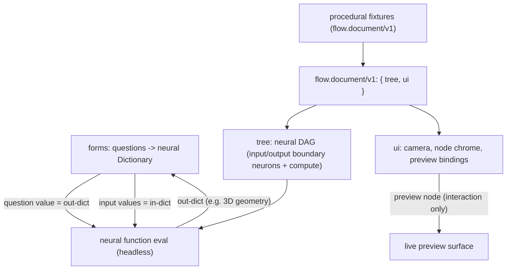

## Neural / Flow / Procedural / Forms Clean Refactor

Greenfield, no legacy/adapters. Bottom-up across the four technologies. The neural engine already has the needed primitives (`INPUT_KIND`/`OUTPUT_KIND` boundary neurons, `[Tree::contract()](neural/engine/lib.rs)`, and boundary seed/collect logic inside `evaluate_cluster_sequential`); this refactor promotes that to the top level and rebuilds flow/procedural/forms around it.

### Target architecture

Core principle: a flow's `tree` is a neural function. INPUT boundary neurons name the in-dict keys; OUTPUT boundary nodes name the out-dict keys; preview nodes are UI-only and never part of the headless out-dict. All UI lives under a separate `ui` root so the `tree` alone is headlessly evaluable.

### Layer 1 - neural engine: tree-as-function

In [neural/engine/lib.rs](neural/engine/lib.rs):

- Refactor boundary seed/collect logic currently duplicated in `evaluate_cluster_sequential`/`evaluate_cluster` (lines ~1316-1382) into shared helpers (`seed_input_boundaries(tree, in_dict)`, `collect_output_boundaries(channels)`).
- Add public top-level `Evaluator::evaluate_function(tree, in_dict) -> Dictionary` plus cached/dispatch variants, reusing those helpers: seed `INPUT_KIND` neurons from `in_dict` by `channel`, evaluate, collect `OUTPUT_KIND` neurons into the out-dict by `channel`. This makes the top-level tree behave exactly like a cluster contract.
- Keep `Evaluator::evaluate_channels*` for interactive eval (previews need full per-neuron `EvalChannels`).
- Extend the in-file `#region Tests` with a top-level function-eval case (in-dict -> out-dict) mirroring the existing cluster test.

In [flow/module/wasm/lib.rs](flow/module/wasm/lib.rs):

- Add `evaluate_function_json(tree_json, in_dict_json) -> out_dict_json` bridge so TS can evaluate any flow `tree` headlessly with an explicit in-dict.

### Layer 2 - flow core (Rust): canonical split document + output/preview nodes

In [flow/core/lib.rs](flow/core/lib.rs):

- Make `flow.document/v1` the single schema: `{ schema, tree: Tree, ui: FlowUiV1 }`. Delete `FlowFixtureV1`, `tree_from_fixture`, and the seed-derivation path; the `tree` is authoritative and serialized directly (no widget->neuron derivation).
- `FlowUiV1`: `camera`, `nodes: { id -> { layout, chrome } }`, `previews: [{ id, source: {neuron, channel}, mode }]`. `chrome` carries presentation-only data (slider min/max/step + current value, note text, image src, stepper fields, variable enum).
- Node model on the tree:
  - Input nodes = `INPUT_KIND` boundary neurons (channel = key); current value lives in `ui.nodes[id].chrome` (interactive) or supplied via in-dict (headless).
  - Compute nodes = operator neurons (unchanged).
  - Output nodes (NEW) = `OUTPUT_KIND` boundary neurons (channel = key); define the out-dict. Replaces the old `OutputAction` concept.
  - Preview nodes = UI-only entries in `ui.previews` bound to a channel ref. Replaces `OutputPreview` as a tree widget.
- Interactive eval (`evaluate_internal`): build in-dict from input-node chrome values -> `evaluate_channels*` -> apply preview-node outputs + per-neuron channel JSON (`build_channel_eval_json`).
- Update `widget_to_dag_node` / `widget_io_ports` for the new kinds: output boundary nodes get an input port; preview nodes render as bound UI sinks.
- Update Rust tests in-file.

### Layer 3 - flow react / play (TS)

- [flow/react/index.tsx](flow/react/index.tsx): replace `FlowFixtureV1` TS types + `FLOW_DEFAULT_FIXTURE` with `FlowDocumentV1` (`tree` + `ui`); update the localStorage key, catalogue (add Output node + Preview node), DOM overlays, and eval-output application.
- [flow/worker.ts](flow/worker.ts) / [flow/worker-client.ts](flow/worker-client.ts): evaluate from `document.tree`; add a headless `evaluateFunction(treeJson, inDictJson)` entry for forms.
- [flow/play/index.ts](flow/play/index.ts): update controller, hierarchy/inspector builders, and default document; add `flow/fixture/*.flow.json` + `flow/fixture-slugs.ts` (none today) for parity with other technologies.

### Layer 4 - procedural (2d/3d)

- Migrate every fixture to `flow.document/v1` (`tree` + `ui`) and add explicit output nodes defining the data-out (`draw.drawing` for 2D, `geometry`/`solid` for 3D) plus preview nodes for interaction:
  - [procedural/2d/fixture/default.procedural2d.json](procedural/2d/fixture/default.procedural2d.json)
  - [procedural/3d/fixture/hexagonal-mushroom-column.procedural.json](procedural/3d/fixture/hexagonal-mushroom-column.procedural.json), [rectangle-extrude-volume.procedural.json](procedural/3d/fixture/rectangle-extrude-volume.procedural.json), [sphere-cut-with-torus.procedural.json](procedural/3d/fixture/sphere-cut-with-torus.procedural.json)
- Update default documents + `extractChannelPreviewItems` in [procedural/2d/react/index.tsx](procedural/2d/react/index.tsx) and [procedural/3d/react/index.tsx](procedural/3d/react/index.tsx) to read channels from the document eval; update play controllers/fixture-slugs as needed.

### Layer 5 - forms: questions -> neural Dictionary

In [forms/core/index.ts](forms/core/index.ts):

- Make the canonical form result a neural `Dictionary`: add `FormRuntime.toDictionary()` and have `submit()` return it (replace flat `FormValues` as the aggregate). Each question contributes a typed value under its key.
- A flow-backed question (`buildingComponent`) contributes the evaluated OUT-dict of its flow document (the 3D data): use its input values as the in-dict and call the headless `evaluate_function_json` bridge - not just the raw slider values.
- Replace `flowFixtureToFormSpec` -> `flowDocumentToFormSpec` (derive questions from input boundary neurons + `ui` chrome) and `applyGenerationValuesToFixture` -> non-destructive apply of values onto input-node chrome (returns a new document).

In [forms/react/index.tsx](forms/react/index.tsx):

- `Flow3dQuestionControl` reads the flow document; the live preview during interaction = the document's preview node(s); keep patched-copy (non-destructive) eval.

In [forms/play/index.ts](forms/play/index.ts) + [framework/product/playground/renderer/react/index.tsx](framework/product/playground/renderer/react/index.tsx): surface the dictionary result; keep Edit/Try/Generate wiring.

### Cross-cutting

- Non-destructive by default: all edit ops and evaluations operate on copies (already the pattern in `applyGenerationValuesToFixture` and the flow3d preview); enforce uniformly.
- No `flow.fixture/v1` references remain anywhere (flow, procedural, forms, play, framework).
- Validation per layer: extend Rust `#region Tests`, in-file vitest in each TS package, a `runtime-check.mjs` in the ticket folder, and browser runtime verification with `[DEBUG]`-prefixed logs before claiming success.
- Repo MCP: read `repo://goals`, then reopen `26/06/30/FORMS-TECHNOLOGY-AND-GENERATE-MODE` (or open a new ticket) before implementing.

