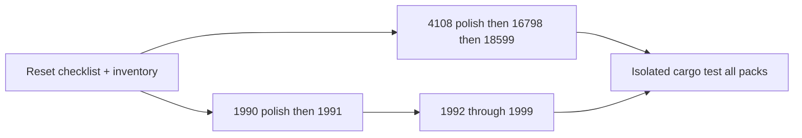

# Norm Absolute Feature Completeness

## Context

Ticket [`26/07/18/NORM-TECHNOLOGY-ABSOLUTELY-FEATURE-COMPLETE`](.repo/🎫/26/07/18/NORM-TECHNOLOGY-ABSOLUTELY-FEATURE-COMPLETE/) closed with a checklist marked done, but an audit against the gate in [`norm_feature_complete_73be55cf.plan.md`](.repo/🎫/26/07/18/NORM-TECHNOLOGY-ABSOLUTELY-FEATURE-COMPLETE/norm_feature_complete_73be55cf.plan.md) still finds: simplified models, thin wrappers, parts present but unused by `evaluate()`, weak `!checks.is_empty()` tests, EN 1993 part-number confusion, and FEM only in EN 1992.

Goal: **`🎯Norm`**. Reopen that ticket (same task). Keep temps under the ticket folder. Run all cargo tests with `CARGO_TARGET_DIR=/tmp/semio-norm-target-fc2` to avoid workspace locks.

## Completeness gate (unchanged)

A part is done only when **all** hold:

1. Real computational clauses (no stubs, no identical clones ignoring part physics)
2. Clause-cited named tables
3. `AnnexChoice::De` changes results where DIN EN NA differs
4. At least one numeric worked-example test (not only `!checks.is_empty()`)
5. No leaked foreign types except explicit `norm_core` reexports

Also: each family’s `evaluate(&Document) -> CheckReport` must exercise **all** part modules that family owns (session documents may grow fields as needed).

## Work order



### 0. Ticket + checklist reset

- `ticket_reopen` on `26/07/18/NORM-TECHNOLOGY-ABSOLUTELY-FEATURE-COMPLETE`
- Rewrite [`part-checklist.md`](.repo/🎫/26/07/18/NORM-TECHNOLOGY-ABSOLUTELY-FEATURE-COMPLETE/part-checklist.md) to **incomplete** with per-part rows (gate items), not crate-level “done”
- Track progress only in the ticket folder

### 1. Energy families

| Crate | Remaining work |
|-------|----------------|
| [`norm/din/4108/rs/lib.rs`](norm/din/4108/rs/lib.rs) | Replace simplified part_5 summer model with clause-cited method; wire `rh_int` into surface-temp factor; expand `Document`/`evaluate()` to cover parts 1–8 (moisture μ inputs, catalog, airtightness class) |
| [`norm/din/en/16798/rs/lib.rs`](norm/din/en/16798/rs/lib.rs) | Replace `pmv_simplified` with ISO 7730-style PMV/PPD; deepen single-threshold parts (5,9,10,13…) with real tables; expand `evaluate()` beyond 3 residential checks to all published parts |
| [`norm/din/v/18599/rs/lib.rs`](norm/din/v/18599/rs/lib.rs) | Include parts **4,5,6,11,12** in `balance_annual`; distinct tabular method for part 12 (not a duplicate of part 10); replace heuristic envelope/`f_p`/limits with clause-cited factors; keep 4108+16798 wiring |

### 2. EN 1990 + EN 1991

| Crate | Remaining work |
|-------|----------------|
| [`norm/en/1990/rs/lib.rs`](norm/en/1990/rs/lib.rs) | Accidental/seismic combination set (6.11+); STR/GEO/EQU situation paths; remove dead `LimitState` noise; keep DE vs EN numeric divergence tests |
| [`norm/en/1991/rs/lib.rs`](norm/en/1991/rs/lib.rs) | Expand `evaluate()` to parts 1_5–1_7 and 2–4; deepen wind (c_s·c_d) and accidental models; replace weak e2e with numeric assertions |

### 3. Material Eurocodes EN 1992–1999

Priority order by remaining depth: **1993 → 1998 → 1996/1997 → 1994/1995/1999 → 1992 polish**.

- **EN 1993:** Fix part numbering (remove aluminium-as-1_7 confusion); make every `part_1_*` and `part_2`–`part_6` distinct physics; widen `evaluate()` beyond I-section member; add `fem_core` member force path like EN 1992
- **EN 1998:** Use design spectrum `s_d` for base shear (stop discarding it); include parts 2–6 in `evaluate()`
- **EN 1996 / 1997:** Session covers flexure/shear/sliding/retaining (1996) and real pile shaft/base resistance (1997 part 2), not compression/bearing-only
- **EN 1994 / 1995 / 1999:** Deepen connectors/joints/fire; numeric e2e per part; welded/bolted aluminium for 1999
- **EN 1992:** Prestress basics if still missing; keep FEM path; strengthen any remaining simplified fire tables

Cross-cutting for structural crates: where member ULS needs N/V/M, call `fem_core` and **use** the solve result (pattern already in EN 1992 `check_rc_beam_from_fem`).

### 4. Verification

```bash
CARGO_TARGET_DIR=/tmp/semio-norm-target-fc2 \
  cargo test -p norm_core -p norm_din_4108 -p norm_din_en_16798 \
  -p norm_din_v_18599 -p norm_en_1990 -p norm_en_1991 \
  -p norm_en_1992 -p norm_en_1993 -p norm_en_1994 -p norm_en_1995 \
  -p norm_en_1996 -p norm_en_1997 -p norm_en_1998 -p norm_en_1999
```

Gate for close: every checklist part row checked; every family has numeric worked examples; `evaluate()` covers all parts; no `todo!` / zero stubs / identical part clones.

## Out of scope

- Research-only standards without crates (EN 15804, ISO 14040, …)
- Plugin UI polish ([`norm/plugin`](norm/program/rs/) already exists; only update Documents if session fields grow)
- Pasting proprietary PDF text — hand-implement formulas/tables only
