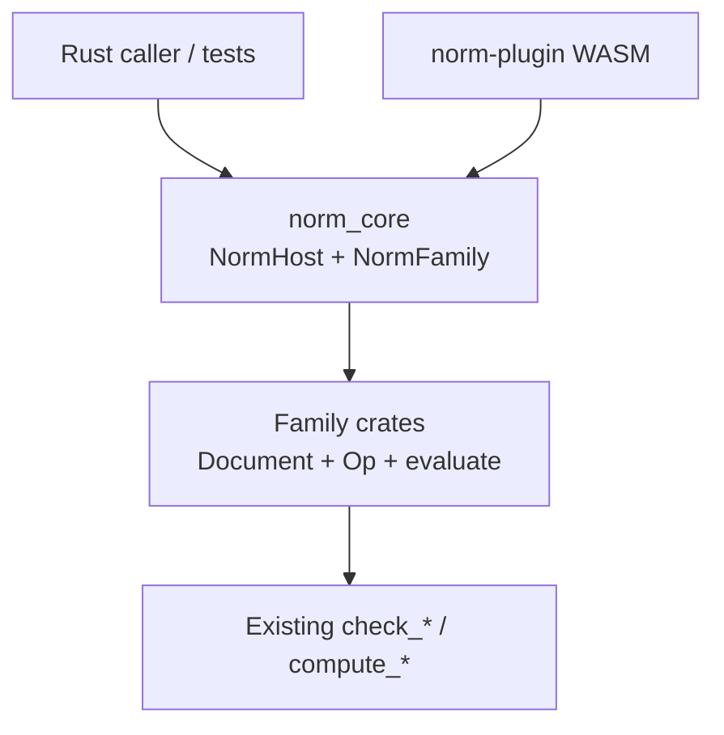

# Norm Plugin and Per-Family Apps

## Decisions (locked)

- **Apps:** one DocumentApp per family crate (13) — not per part, not research-only standards.
- **State:** retained Rust `NormHost` per family (document + last `CheckReport`); UI is optional; logic never lives in React.

## Architecture




| Layer              | Path                                         | Role                                                                      |
| ------------------ | -------------------------------------------- | ------------------------------------------------------------------------- |
| Shared host kernel | `[norm/core/rs/lib.rs](norm/core/rs/lib.rs)` | `NormFamily` trait, generic `NormHost<F>`, shared session types           |
| Family sessions    | each `norm/*/rs/lib.rs`                      | Typed `Document`, `Op`, `evaluate(doc) -> CheckReport`, thin `Host` alias |
| Plugin             | new `[norm/plugin/rs/](norm/plugin/rs/)`     | 13 DocumentApps; VCS undo over document ops; render from host report      |


Computation stays in family crates. The host only retains inputs, annex choice, and the last report, and re-evaluates when the document changes.

## 1. Headless session in `norm_core`

Extend `[norm/core/rs/lib.rs](norm/core/rs/lib.rs)` (regions, no new files outside ticket temps):

- `NormFamilyId` enum covering the 13 families.
- Trait roughly:

```rust
pub trait NormFamily {
    type Document: Clone + Default + Serialize + DeserializeOwned;
    type Op: Operation<Self::Document> + Clone;
    fn family_id() -> NormFamilyId;
    fn evaluate(document: &Self::Document) -> CheckReport;
}
```

- `NormHost<F: NormFamily>` holding `document: F::Document` and `report: CheckReport`, with:
  - `from_document` / `default`
  - `apply(op)` → mutate document, recompute report
  - `replace_document` / `set_annex` as needed
  - `document()`, `report()`, `evaluate()` (force recompute)
- Unit tests that construct a host, apply ops, and assert report updates **with no plugin/UI**.

Depend on `vcs` in `norm_core` only if needed for `Operation` — otherwise keep ops in family crates and keep core free of VCS if that stays cleaner (prefer family `Op: Operation<Document>` like architect/`ProgramOp`).

## 2. Per-family Document + Op + Host

For each of the 13 crates, add regions in the existing `lib.rs`:

1. `Document` — serde model of the inputs that today’s top-level `check_*` / `balance_*` APIs already take (start from the e2e helpers, e.g. DIN 4108 opaque wall inputs).
2. `Op` — granular patches (`SetField`, `SetAnnex`, …) implementing `vcs::Operation`.
3. `evaluate(&Document) -> CheckReport` — calls existing pure functions; no formula duplication.
4. `type Host = NormHost<ThisFamily>` (or `impl NormFamily for ThisFamily`).

Families:

- `norm_din_4108`, `norm_din_en_16798`, `norm_din_v_18599`
- `norm_en_1990` … `norm_en_1999`

Headless tests in each family (extend existing test region): host round-trip + at least one evaluate after op.

## 3. Plugin crate: one app per family

Create `[norm/plugin/rs/](norm/plugin/rs/)` following `[fem/plugin/rs](fem/plugin/rs)` / `[architect/plugin/rs](architect/plugin/rs)` consistency contract:

- `Cargo.toml`: `name = "norm-plugin"`, `package = "semio:norm"`, `cdylib`+`rlib`, deps on all 13 families + `norm_core` + `semio-framework-plugin` + `vcs`.
- 13 playground rows, ports **react 6091–6103 / wgpu 6191–6203** (free above architect `6090`/`6190`):


| App id                                    | Variant             |
| ----------------------------------------- | ------------------- |
| `norm-din-4108-play`                      | `din4108`           |
| `norm-din-en-16798-play`                  | `din16798`          |
| `norm-din-v-18599-play`                   | `din18599`          |
| `norm-en-1990-play` … `norm-en-1999-play` | `en1990` … `en1999` |


- `lib.rs` layout: `pub mod` per family app (flat multi-app like puzzle/gis), Consistency Contract regions (`Constants`, `Types`, `Panels`, `Render`, `*PlayApp`, `Manifest`, `Tests`).
- Each app:
  - `Projection = Family::Document`, `Op = Family::Op`
  - Runtime: selection + optional UI-only camera; **report comes from host**, not recomputed only in React
  - On document ops: apply via host semantics (mutate + evaluate)
  - Windows: inputs (form/table), results (`CheckReport` as block list / table), standard Document/Catalogue/Inspection panels
  - `semio_plugin!` registers all 13 create_* factories

Register workspace member in root `[Cargo.toml](Cargo.toml)`. Add launch entries next to `🧪test📏norm` for plugin tests / playground variants (same grouping/naming as other plugins).

## 4. Ticket and goal

- Goal: `**🎯Norm**` (`[.repo/🎯/NORM/goal.json](.repo/🎯/NORM/goal.json)`).
- On execute: `ticket_open` (or reopen if a matching open ticket exists) titled e.g. "Norm Plugin And Per-Family Apps"; bind this plan id; keep temps under the ticket folder.
- Do **not** reopen/close the goal.

## 5. Verification (must run)

- `cargo test -p norm_core` — host trait/session tests.
- Per-family `cargo test -p norm_*` — host evaluate after op.
- `cargo test -p norm-plugin` — manifest lists 13 apps; undo/redo round-trip on one representative app; host-backed report present after op.
- Confirm with temporary `[DEBUG]` logs only if needed for runtime proof, then leave them removable.

## Out of scope

- Clause-complete physics upgrades (separate feature-complete ticket).
- Research-only standards (EN 15804, ISO 14040, …).
- One app per `part_*` module.
- HTTP/service backend — “backend” here is the retained Rust host inside the process/WASM plugin boundary.

