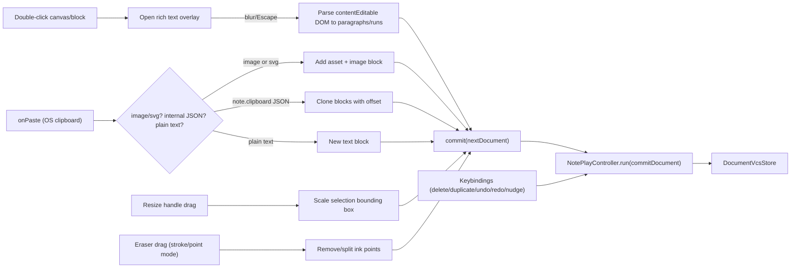

# Note App Feature Completion

## Scope confirmed with user

- **Rich text**: `NoteTextBlock` is reworked to store paragraphs of runs with per-run bold/italic/underline/link marks (not just a plain string), edited via a contenteditable overlay with a floating Bold/Italic/Underline/Link toolbar.
- **Clipboard**: both OS-clipboard image/SVG paste (creates image blocks) *and* in-app block copy/paste (`cmd+c`/`cmd+v` duplicates selection with an offset).
- **Eraser**: two modes — *stroke eraser* (click/drag over an ink stroke deletes the whole stroke) and *point eraser* (drag removes points within a radius, splitting the stroke where needed).

All new document mutations continue to flow through the existing `NoteCanvas` → `onCommit` → `NotePlayController.run("commitDocument", …)` → `DocumentVcsStore` path (see `note/react/index.tsx` `commit()` at [note/react/index.tsx](note/react/index.tsx) lines 219-225 and `NotePlayPaneSurfaceHost`'s `onCommit` in [framework/product/playground/renderer/react/index.tsx](framework/product/playground/renderer/react/index.tsx) line 11071). No new transport is needed — most work is new pure helpers in `note/core/internal.ts` plus interaction logic in `note/react/index.tsx`, with a handful of new keyboard-triggered controller commands in `note/core/index.ts`.

## 1. Rich text model (`note/core/internal.ts`)

- Add `NoteTextRun { text, bold?, italic?, underline?, link? }` and `NoteTextParagraph { runs: readonly NoteTextRun[] }`.
- Change `NoteTextBlock` to `{ kind: "text"; paragraphs: readonly NoteTextParagraph[]; fontSize; fontWeight; align }` (drop `content: string`).
- Add helpers: `noteTextParagraphsFromPlainText(text)`, `noteTextPlainText(paragraphs)` (flatten for inspector/status display), update `createNoteTextBlock` to seed one paragraph/run.
- Add geometry helpers for resize: `noteSelectionBounds(blocks, ids)`, `noteScaleBlockWithinGroup(block, fromBounds, toBounds)` (recurses into `group` children, scales ink `points`).
- Add ink-erase helpers: `noteEraseInkStrokeAtPoint(doc, x, y, threshold): NoteDocument` (point-to-segment distance hit test, removes whole block) and `noteEraseInkPointsNearPoint(doc, x, y, radius): NoteDocument` (filters points, splits surviving contiguous runs into separate ink blocks, drops runs with <2 points).
- Add clipboard helpers: `noteCloneBlocksWithOffset(blocks, dx, dy)` (reuse `cloneNoteBlock`), `noteClipboardPayload(blocks)` / `noteBlocksFromClipboardPayload(json)` using a `{schema:"note.clipboard", blocks:[...]}` envelope.
- Replace `NOTE_TOOL_IDS` `"eraser"` with `"eraserStroke" | "eraserPoint"`; add `eraserRadius?: number` to `NoteDocument` (default 12) and a corresponding `setEraserRadius` edit op alongside the existing `setPencilWidth`.
- Extend the existing `if (import.meta.vitest)` block in this file with tests for: rich-text plain-text round trip, group bounds scaling, ink erase (stroke + point/split), clipboard payload round trip.

## 2. Controller commands (`note/core/index.ts`)

- Update `notePlayInspectorTextField`/`notePlayPatchBlockField` "textContent" case to read/write via `noteTextPlainText`/`noteTextParagraphsFromPlainText` (inspector edits reset formatting to plain — canvas inline editor is the rich-text path).
- Update `buildTools()` "draw" collection: replace the single `eraser` toggle with `eraserStroke` and `eraserPoint` toggles; add an `eraserRadius` slider to `canvasMeasures()` mirroring the existing `pencilWidth` slider.
- Add new `run()` cases: `deleteSelection` (removes every selected block), `duplicateSelection` (clones selection with offset via `noteCloneBlocksWithOffset`, selects the clones), `clearSelection`, `nudgeSelection` (args `{dx, dy}`, applies to every selected block), `undo`/`redo` (dispatch `{kind:"undo"}`/`{kind:"redo"}` to `this.docStore`, mirroring `vcs/core/index.ts` lines 165-169).
- Extend the existing controller test block with coverage for the new commands.

## 3. Keybindings wiring

- [note/core/playground.ts](note/core/playground.ts): extend `PlaygroundNote.keybindings` (currently only `ctrl+a,meta+a` → `selectAll`) with `delete,backspace` → `deleteSelection`, `ctrl+d,meta+d` → `duplicateSelection` (prevent browser bookmark dialog via `preventDefault`, already handled by `PlaygroundKeybindingHotkey`), `ctrl+z,meta+z` → `undo`, `ctrl+shift+z,meta+shift+z,ctrl+y,meta+y` → `redo`, `escape` → `clearSelection`, and one binding per arrow direction (`up`/`down`/`left`/`right`, plus `shift+` variants for a larger step) → `nudgeSelection` with fixed `args: {dx, dy}` per binding (confirmed `PlaygroundKeybinding.args` supports this in [framework/product/playground/core/index.ts](framework/product/playground/core/index.ts) line 629).
- [framework/product/playground/renderer/react/index.tsx](framework/product/playground/renderer/react/index.tsx): `NotePlayInner`'s `<PlaygroundView>` (~line 11196) is currently missing `playgroundKeybindings={playground.keybindings}` (compare puzzle-3d at line 2680) — add it so the above bindings actually fire.

## 4. Image rendering + asset plumbing (`note/react/index.tsx`)

- `NoteBlockView`'s `"image"` branch currently renders `block.imageKey` as placeholder text ([note/react/index.tsx](note/react/index.tsx) lines 171-176). Thread `assets: NoteDocument["assets"]` into `NoteBlockView` and render `` (the `noteImageDataUrl` helper already exists at lines 86-89), falling back to the current placeholder when the asset is missing.

## 5. Double-click → block creation & rich text editing (`note/react/index.tsx`)

- Add an `onDoubleClick` handler on the canvas root:
  - No block under pointer → create a text block at that world position (`createNoteTextBlock`), add + select it, and immediately open the inline editor (autofocus, select-all so typing replaces the seed text).
  - Unlocked text block under pointer → open the inline editor for that block.
  - Unlocked table block under pointer → resolve the specific cell (row/col from local coordinates) and open a lightweight single-cell edit (see §7).
- New `NoteTextEditorOverlay` component: absolutely positioned over the block's screen-space bounds; renders a `contentEditable` div seeded from `paragraphs` (paragraph → `
`, runs → ``/`<strong>`/`<em>`/`<u>`/`<a>`), plus a small floating toolbar with Bold/Italic/Underline/Link buttons using `document.execCommand` on `onMouseDown` (`preventDefault` to keep the text selection alive) — Link prompts for a URL via `window.prompt`.
- On blur / `Escape` / pointer-down outside the overlay: walk the contentEditable's child nodes back into `paragraphs`/`runs` (paragraph per top-level child, run per inline leaf, marks inferred from tag name), call `commit()` with the updated block, close the overlay. Empty result on a block that was just created via double-click removes the block instead of leaving an empty one.
- Update `NoteBlockView`'s `"text"` render branch to render `paragraphs`/`runs` (bold/italic/underline/link styling) instead of the old plain `content` string, hiding the block while it is the one being edited (overlay takes over).

## 6. Resize handles + multi-select move (`note/react/index.tsx`)

- When the current tool is a select tool and there is a non-empty, unlocked selection, render 8 absolutely positioned handle divs (`nw,n,ne,e,se,s,sw,w`) around the selection's screen-space bounding box (`noteSelectionBounds` converted through the camera transform), each with the matching resize cursor.
- Handle `onPointerDown` starts a new `dragState` kind `"resize"` capturing the handle id and the world-space bounding box of the selection at drag start. On `pointerMove`, compute the new bounding box from the delta and call `noteScaleBlockWithinGroup` per selected block to build the next document, `commit()`-ing on every move (same pattern as the existing `"move"`/`"ink"` drag kinds).
- Fix the existing `"move"` dragState (currently tracks a single `blockId`, [note/react/index.tsx](note/react/index.tsx) lines 265-283/311-318) to move every selected block together when the pointer-downed block is part of the current multi-selection: capture `{blockId, originX, originY}` for each selected id at drag start, apply the same delta to all of them.

## 7. Table cell + inline block editing (`note/react/index.tsx`)

- Double-click a table cell (see §5) opens a small `<input>` positioned over that cell; Enter/Tab commits and advances to the next cell, Escape cancels; commits via `updateBlock` with the modified `rows`.
- Add "Add Row" / "Add Column" / "Remove Row" / "Remove Column" buttons to the Table inspector group in `buildNotePlayInspectorTree` ([note/core/index.ts](note/core/index.ts) lines 271-277), wired to new small `notePlayPatchBlockField` cases that splice `rows`/`columns`.

## 8. Eraser tool (`note/react/index.tsx` + core helpers from §1)

- `eraserStroke`: on `pointerDown`/`pointerMove` while the button is held, call `noteEraseInkStrokeAtPoint` at the world position for continuous drag-erase of whole strokes.
- `eraserPoint`: on `pointerDown`/`pointerMove`, call `noteEraseInkPointsNearPoint` with `doc.eraserRadius ?? 12`, replacing/splitting the affected ink block(s).
- Both commit continuously like the existing pencil drag.

## 9. Clipboard: paste images/SVG + copy/paste blocks (`note/react/index.tsx`)

- Make the canvas root focusable (`tabIndex={0}`) and add native `onCopy`/`onPaste` handlers (not routed through the command bus, since we need `ClipboardEvent.clipboardData`):
  - **Copy**: if the event target is inside the active rich-text overlay, let the browser's native text copy proceed unmodified. Otherwise, if there's a block selection, `preventDefault()` and `setData("text/plain", noteClipboardPayload(selectedBlocks))`.
  - **Paste**: inspect `clipboardData.items`/`files`:
    - `image/*` file → `FileReader.readAsDataURL`, store as a new entry in `doc.assets`, create a `NoteImageBlock` referencing it, positioned at the viewport center.
    - `image/svg+xml`, or plain text starting with `<svg` → store as a `NoteImageAsset` with `mime:"image/svg+xml"` (same asset path as raster images — no new block kind needed).
    - Plain text matching the `note.clipboard` envelope → `noteBlocksFromClipboardPayload`, insert clones offset by a fixed amount, select them.
    - Otherwise, plain text → create a new text block seeded with that text via `noteTextParagraphsFromPlainText`.
  - All paste branches build the next `NoteDocument` and call `commit()`.

## 10. Fixtures & manifest

- Rewrite [note/fixture/semio.note.json](note/fixture/semio.note.json)'s `welcome-text` block from `content: "..."` to the new `paragraphs` shape (handcrafted, per repo "no migrations" rule).
- Update [note/manifest/blocks.manifest.json](note/manifest/blocks.manifest.json) if the `text` block's `content` property declaration needs to reflect the new paragraph structure (or drop the flat `content` property declaration since it's no longer a simple string field).

## 11. Verification

- Run `bun run test:note` (extends existing inline vitest blocks — no new test files).
- Boot `bun run dev:note`, and manually exercise via CDP/browser: double-click empty canvas creates + focuses a text block; type + bold/italic/underline/link via toolbar; double-click existing text re-opens editor; resize handles resize single and multi selections; multi-select drag moves all selected blocks; stroke/point eraser removes/splits ink; copy/paste of blocks (cmd+c/cmd+v) and paste of a copied image/SVG from the OS clipboard; Delete/Backspace, cmd+d, cmd+z/cmd+shift+z, arrow-key nudge, and Escape all work.
- Update `.repo/🎫/26/07/02/NOTE-INFINITE-CANVAS-APP/verify-log.md` with the new verification results (reopen ticket via `ticket_reopen` since it covers the same app).

