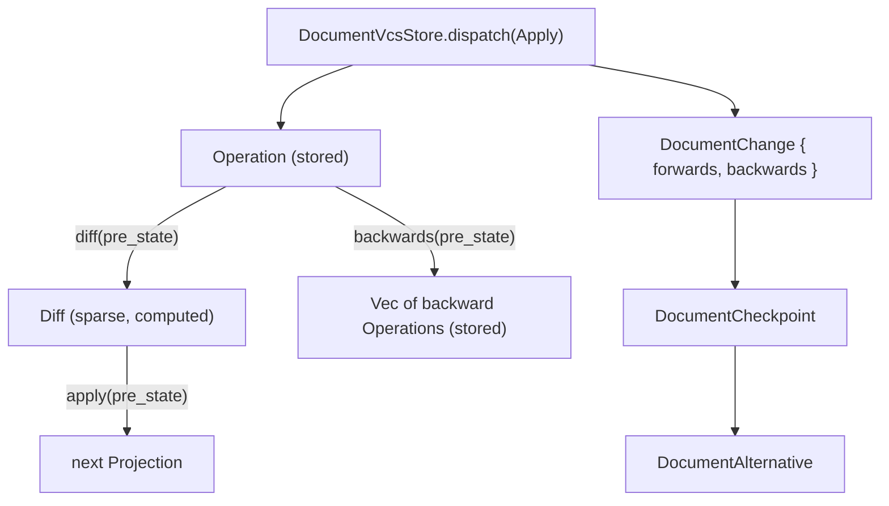

# Generalize the Operation / Diff / Centralized-Apply VCS Pattern

## The reference pattern (from compose)

Compose's actual architecture is richer than what `framework_vcs` currently offers. From [compose/client/schema/graphql/schema.golden.graphql](compose/client/schema/graphql/schema.golden.graphql) and [compose/client/lib/rs/lib.rs](compose/client/lib/rs/lib.rs):

- `**Operation**` (schema.golden.graphql:414) is stored data: `scope` + `input`, nothing else. It is never mutated in place.
- `**Operation::to_diff(&self, kit) -> KitDiff**` (e.g. lib.rs:9605-9645) is pure and reads pre-state to compute a _sparse_ patch: `Option<field>` per changed scalar, and `XCollectionDiff { removed: Vec<IdRef>, modified: Vec<XModified>, added: Vec<X> }` per changed collection (schema.golden.graphql `KitDiff` type at line 9121, Rust `CanonicalKitDiff` at lib.rs:9184).
- `**Operation::to_backwards(&self, kit) -> Vec<Operation>**` (lib.rs:10041) is pure and reads pre-state to compute the inverse operation(s) — this is stored once (`Edit.backwards`, schema.golden.graphql:9404) and never recomputed.
- `**Kit::apply_diff(&self, diff: &KitDiff)**` (lib.rs:5867) is the single centralized mutation entry point for the whole `Kit` projection: it walks every optional field/collection generically. No other code mutates `Kit` fields directly from operation logic.
- `**Edit**` (forwards+backwards operations), `**Change**` (groups saved Edits), `**Checkpoint**` (chain of Changes, computes `kit`), `**Alternative**`/`TheKit` (`Workspace`: `checkpoint`, `savedChanges`, `unsavedChanges`, `kit`) are the storage/branching shell around this.

`framework_vcs`'s current `ApplyOp<P, Op>::apply(&self, projection, op) -> P` collapses diff+backwards+apply into one hand-written match per op, and callers must hand-supply `backwards` at `dispatch` time. This plan brings every technology (and compose itself) onto the real pattern.

## Target architecture



### New `framework_vcs` traits ([framework/rs/lib.rs](framework/rs/lib.rs))

```rust
pub trait OperationDiff<P>: Clone + Default + Serialize + DeserializeOwned {
    fn apply(&self, projection: &P) -> P;   // the ONE centralized mutator per technology
    fn absorb(&mut self, other: Self);       // merge/coalesce two diffs
}

pub trait Operation<P>: Clone + Serialize + DeserializeOwned {
    type Diff: OperationDiff<P>;
    fn diff(&self, projection: &P) -> Self::Diff;      // pure, reads pre-state
    fn backwards(&self, projection: &P) -> Vec<Self>;  // pure, reads pre-state
}
```

Reusable sparse-collection helpers (mirrors `XCollectionDiff` in compose):

```rust
pub struct ItemPatch<TId, TPatch> { pub id: TId, pub patch: TPatch }
pub struct CollectionDiff<TId, TPatch, TAdded> {
    pub removed: Vec<TId>,
    pub modified: Vec<ItemPatch<TId, TPatch>>,
    pub added: Vec<TAdded>,
}
```

`DocumentVcsStore<P, Op>` drops the `A: ApplyOp<P, Op>` type parameter and `applier` field entirely — `Op: Operation<P>` is now sufficient, since the op knows how to diff/backward itself and the diff knows how to apply itself. `ApplyOp`, `XApplier` structs everywhere, and `JsonReplaceApplier` remnants are removed.

`DocumentVcsCommand::Apply` becomes `Apply { operations: Vec<Op>, description: Option<String> }` — no hand-supplied `backwards`. In `dispatch`, for each `operation` (in order): compute `op.backwards(&projection)` against the running pre-op projection and splice it to the **front** of the accumulated backwards list (so undo replays most-recent-first), then advance `projection = op.diff(&projection).apply(&projection)`. `materialize_document_projection` replays the same `diff().apply()` step per stored forward op.

## Phased migration

### Phase 1 — `framework_vcs` core rework

Implement the traits/helpers above; rewrite `DocumentVcsStore`/`DocumentVcsCommand`/`materialize_document_projection` to use them; delete `ApplyOp`. Update the crate's own unit tests (`DemoProjection`/`DemoOp`) to implement `Operation`/`OperationDiff` instead of `ApplyOp`.

### Phase 2 — migrate existing Rust-backed technologies

For each of `semios/rs` (`StudioOp`), `draw/rs` (`DrawOp`, note: `DrawLayerNode` tree needs an id/path-addressed diff, not a flat `CollectionDiff`), `forms/rs` (`FormOp`), `shooting/rs` (`ShootingOp`), `cad/rs` (`CadOp`), `framework/product/presentation/rs` (`PresentationOp`), `writer/rs` (`WriterOp`), `raster/rs` (`RasterOp`), and the `puzzle/2d/rs` test demo:

- Add a `XDiff` struct (sparse fields + `CollectionDiff` for sub-entities).
- Replace `impl ApplyOp<X, XOp>`/`XApplier` with `impl Operation<X> for XOp` (one match arm per variant emitting `XDiff` + inverse op(s) from pre-state) and `impl OperationDiff<X> for XDiff` (the one centralized mutator).
- Drop the applier argument from `XStore`/WASM bridge constructors.
- Re-run/extend each crate's undo/redo unit tests to confirm engine-computed backwards match previous hand-written expectations.

### Phase 3 — bring TS-only technologies onto the same Rust pattern

Currently only TS-side reducers exist for `flow/core` (`FlowEditOp`/`applyFlowEditOp`, [flow/core/index.ts](flow/core/index.ts):21-49), `mathematical/graph/port/directed/dag`, `gis/map/rs`, `reasoning/mindmap/rs`, `puzzle/3d/rs` (crate exists but not on `framework_vcs` yet), and no Rust crate at all yet for `trinity/rewrite`, `trinity/jack`, `puzzle/5d`, `procedural/2d`, `procedural/3d`. For each:

- Add/extend a Rust crate with a typed `Projection`, `Op` enum, `Diff` struct, exactly like Phase 2.
- Replace the TS reducer and any `DocumentVcsEnvelope<...>` usage in `*/core/index.ts` with a thin WASM client (matching `draw/play/index.ts`'s current shape).
- Once every technology is Rust-backed, retire `framework/core/vcs-sync.ts`'s TS mirror (`recordProjectionChange`, `DocumentVcsStoreOptions.applyOp`) and update [semios/core/index.ts](semios/core/index.ts)'s `createTypedAppVcsHandler` registrations to route through the real per-technology WASM stores instead of locally-defined minimal TS op types.

### Phase 4 — rewire compose itself onto the generalized engine (highest risk)

Compose's `Graph`/`Kit`/`Edit`/`Change`/`Checkpoint`/`Alternative` are live async `Arc<RwLock<...>>` GraphQL entities (~20k lines in [compose/client/lib/rs/lib.rs](compose/client/lib/rs/lib.rs)), not the plain-clone value model `framework_vcs` assumes. Approach:

- Introduce a plain serializable `KitSnapshot` projection value (distinct from the live async `Kit` graph entity) as `P`.
- `impl framework_vcs::Operation<KitSnapshot> for compose::operation::Operation` wrapping the existing `to_diff`/`to_backwards` logic; `impl framework_vcs::OperationDiff<KitSnapshot> for compose::operation::KitDiff` wrapping the existing `apply_diff`/`absorb` (lib.rs:5867, lib.rs:9208).
- Replace the bespoke `Edit`/`Change`/`Checkpoint`/`Alternative` bookkeeping (`record_operation_in_open_transaction` at lib.rs:8101, checkpoint/alternative chains at lib.rs:9395-9567) with a `framework_vcs::DocumentVcsStore<KitSnapshot, Operation>` owned per `Workspace` (`TheKit` + each `Alternative`).
- Rebuild `materialized_kit_for_workspace` (lib.rs:8025) to hydrate the live async `Kit` GraphQL view from the engine's materialized `KitSnapshot`, reusing the existing golden-projection hydration path (`hydrate_kit_from_initial_projection_value`), instead of incrementally mutating a live `Kit`.
- Keep the GraphQL schema (`Edit`/`Change`/`Checkpoint`/`Alternative`/`KitDiff` types) as the unchanged wire contract; resolvers become thin views over the generic engine's `DocumentChange`/`DocumentCheckpoint`/`DocumentAlternative`.
- No fixture/golden-schema content changes — only the internal storage/undo engine moves onto `framework_vcs`.

### Phase 5 — regression

`cargo test` across every touched crate (framework, semios, draw, forms, shooting, cad, presentation, writer, raster, puzzle/2d, puzzle/3d, gis/map, reasoning/mindmap, dag, trinity, procedural, compose) and `nx test` across TS packages. Manually verify undo/redo, checkpoint/alternative switching, and backbone round-trip for one representative technology, semios_studio, and compose.
