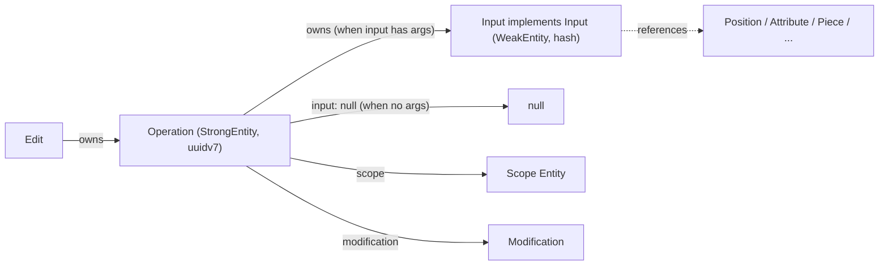

# Operation Input Interface Design

## Goal

Replace today's 109 inconsistent `type *Input { ... }` bag types with a uniform contract:

- **Non-empty inputs** become `type <Op>Input implements Input` (WeakEntity, hash-id) that is owned by its `<Op>` Operation.
- **Empty inputs** (the 35 placeholders that today carry only `hasInput: Boolean! # computed`) are deleted; their operations inherit `input: Input` (nullable) from the `Operation` interface and resolve to `null` at runtime.

All edits land in [compose/graphql/target.schema.graphql](compose/graphql/target.schema.graphql). The non-target [compose/graphql/schema.graphql](compose/graphql/schema.graphql) is the current/source schema and is NOT touched in this design pass.

## Decisions (locked from the dialogue)

- Input identity = `WeakEntity` (content-hash id). The example in your message that showed `id: ID! # data // uuidv7` was a typo; we keep the current `interface Input implements WeakEntity`.
- `Operation.input: Input` stays NULLABLE on the interface; operations with no argument payload simply have `input: null` and we delete their `*Input` type.
- Inputs own NOTHING (`owns: EntityConnection # reference` empty). All sub-entities they hold (e.g. `position: Position!`, `attribute: Attribute!`, `pieces: PieceConnection!`) are references, owned by the operation's resulting entity.

## Final shape

### 1. `interface Input` (sharpened, ~line 159)

```graphql
interface Input implements WeakEntity {
 # Node
 id: ID! # computed // hash
 # Entity
 hash: String! # cached
 owner: Entity # reference // Operation
 owns: EntityConnection # reference
 # Input
 # ARGUMENT: ARGUMENTTYPE
}
```

Changes vs. today: tighten `owner` comment from `# reference` to `# reference // Operation`; tighten `owns` to indicate Inputs own nothing.

### 2. Add abstract `InputEdge` / `InputConnection`

Sit right under the `interface Input` block. We add ONLY the abstract pair (parallel to `DiffEdge`/`DiffConnection`, `ModificationEdge`/`ModificationConnection`). We deliberately do NOT generate `<Op>InputEdge`/`<Op>InputConnection` for each of the ~74 concrete inputs because Inputs are always accessed via `Operation.input` and are never enumerated as a connection — that would add ~150 unused types.

```graphql
type InputEdge implements EntityEdge {
 cursor: String! # computed
 node: Input! # reference
}

type InputConnection implements EntityConnection {
 edges: [InputEdge!]! # computed
 pageInfo: PageInfo! # computed
 hash: String! # cached
}
```

### 3. `interface Operation` (sharpened, ~line 262)

```graphql
interface Operation implements Entity { # implements StrongEntity
 # Node
 id: ID! # data // uuidv7
 # Entity
 hash: String! # cached
 owner: Entity # reference // Edit
 owns: EntityConnection # reference // Input | <output entities>
 # Operation
 scope: Entity! # reference // Entity | Quality | Attribute | Tag | Concept | Port | Type | Connector | Design | Piece | Connection | Kit
 input: Input # data // null when all operation data is carried by scope
 modification: Modification! # computed
 # Operation Output
}
```

Changes vs. today: append clarifying `// null when all operation data is carried by scope` to `input`; add `Input` to the `owns` union comment.

### 4. Convert ~74 non-empty `*Input` bag types to `implements Input`

Pattern, applied uniformly. Before:

```graphql
type RenamedQualityInput {
 # RenamedQualityInput
 key: String! # data
}
```

After:

```graphql
type RenamedQualityInput implements Input {
 # Node
 id: ID! # computed // hash
 # Entity
 hash: String! # cached
 owner: Entity # reference // RenamedQuality
 owns: EntityConnection # reference
 # Input
 # Arguments
 key: String! # data
}
```

Special case — fix the broken example at [compose/graphql/target.schema.graphql](compose/graphql/target.schema.graphql) line 4902: change `CreatedFixedPieceInput.id` from `# data // uuidv7` to `# computed // hash` so it actually conforms to the `Input` (WeakEntity) interface.

The 74 concrete Inputs to convert, grouped by region:

- **Quality** (lines 2288–2407): `CreatedQualityInput`, `CreatedQualitiesInput`, `RenamedQualityInput`, `UpdatedQualityDescriptionInput`, `UpdatedQualityIconInput`, `AddedAttributeToQualityInput`, `AddedAttributesToQualityInput`.
- **Tag** (~lines 2608–2728): `CreatedTagInput`, `CreatedTagsInput`, `RenamedTagInput`, `UpdatedTagDescriptionInput`, `UpdatedTagIconInput`, `AddedAttributeToTagInput`, `AddedAttributesToTagInput`.
- **Concept** (~lines 2928–3048): `CreatedConceptInput`, `CreatedConceptsInput`, `RenamedConceptInput`, `UpdatedConceptDescriptionInput`, `UpdatedConceptIconInput`, `AddedAttributeToConceptInput`, `AddedAttributesToConceptInput`.
- **Port** (~lines 3382–3503): `CreatedPortInput`, `CreatedPortsInput`, `RenamedPortInput`, `UpdatedPortDescriptionInput`, `UpdatedPortIconInput`, `AddedAttributeToPortInput`, `AddedAttributesToPortInput`.
- **Type** (~lines 3978–4253): `CreatedTypeInput`, `CreatedTypesInput`, `RenamedTypeInput`, `UpdatedTypeDescriptionInput`, `UpdatedTypeIconInput`, `AddedAttributeToTypeInput`, `AddedAttributesToTypeInput`, `AddedConnectorInput`, `AddedConnectorsInput`, `RenamedConnectorInput`, `UpdatedConnectorDescriptionInput`, `UpdatedConnectorIconInput`.
- **Piece** (~lines 4900–5240): `CreatedFixedPieceInput` (fix id), `DraggedPiecesInput`, `DraggedPieceInput`, `AddedChildPieceWithParentConnectionInput`, `AddedChildPiecesWithParentConnectionsInput`, `AddedHangingChildPieceWithParentConnectionInput`, `AddedHangingChildPiecesWithParentConnectionsInput`, `RenamedPieceInput`, `UpdatedPieceDescriptionInput`, `MovedPieceInput`, `MovedPiecesInput`, `ChangedPieceToTypeInput`, `ChangedPiecesToTypeInput`, `AddedAttributeToPieceInput`, `AddedAttributesToPieceInput`.
- **Design** (~lines 5610–5760): `CreatedDesignInput`, `CreatedDesignsInput`, `AddedAttributeToDesignInput`, `AddedAttributesToDesignInput`.
- **Kit** (~lines 5920–5955): `RenamedKitInput`, `ChangedDescriptionInput`.

For each converted Input, also append `// <Op>Input |` (or insert at the right alphabetical spot) to the corresponding operation's `owns: EntityConnection # reference // ...` comment, so the union accurately reflects ownership.

### 5. Delete 35 empty `*Input` placeholder types and their operation `input` fields

For each empty input listed below, delete the `type *Input { hasInput: Boolean! ... }` block AND remove the `input: <Op>Input! # data` line from its corresponding operation. The operation then inherits `input: Input` (nullable) from the interface and resolves to `null`.

Empty inputs to drop (line numbers from current file):

- `RemovedAttributeFromQualityInput` (2409), `RemovedAttributesFromQualityInput` (2426), `DeletedQualityInput` (2443), `DeletedQualitiesInput` (2459)
- `RemovedAttributeFromTagInput` (2729), `RemovedAttributesFromTagInput` (2746), `DeletedTagInput` (2763), `DeletedTagsInput` (2779)
- `RemovedAttributeFromConceptInput` (3049), `RemovedAttributesFromConceptInput` (3066), `DeletedConceptInput` (3083), `DeletedConceptsInput` (3099)
- `RemovedAttributeFromPortInput` (3504), `RemovedAttributesFromPortInput` (3521), `DeletedPortInput` (3538), `DeletedPortsInput` (3554)
- `RemovedAttributeFromTypeInput` (4099), `RemovedAttributesFromTypeInput` (4116), `DeletedTypeInput` (4133), `DeletedTypesInput` (4149)
- `RemovedConnectorInput` (4254), `RemovedConnectorsInput` (4271)
- `FixedPieceInput` (4932), `FixedPiecesInput` (5127), `RemovedAttributeFromPieceInput` (5214), `RemovedAttributesFromPieceInput` (5231), `DeletedPieceInput` (5248), `DeletedPiecesInput` (5264), `DeletedPiecesAndConnectionsInput` (5280)
- `DeletedDesignInput` (5646), `DeletedDesignsInput` (5662), `FlattenedDesignInput` (5678), `RemovedAttributeFromDesignInput` (5731), `RemovedAttributesFromDesignInput` (5748)

### 6. Naming-clash check

None. The 7 graphql `input X { ... }` types (`VectorInput`, `PointInput`, `CoordinateInput`, `OffsetInput`, `PlaneInput`, `PositionInput`, `LocationInput`) are mutation-side primitives whose names do not match any operation. No operation is named `Vector`/`Point`/etc., so no collision.

## Resulting data flow



## Out of scope (intentionally not in this plan)

- No regeneration of resolvers, codegen, or downstream TS/Rust/Python types — this is a schema-only design pass.
- Per-`<Op>Input` `Edge`/`Connection` types are deliberately omitted.
- The non-target [compose/graphql/schema.graphql](compose/graphql/schema.graphql) is left untouched; once the target shape is approved we can sync it in a follow-up.
