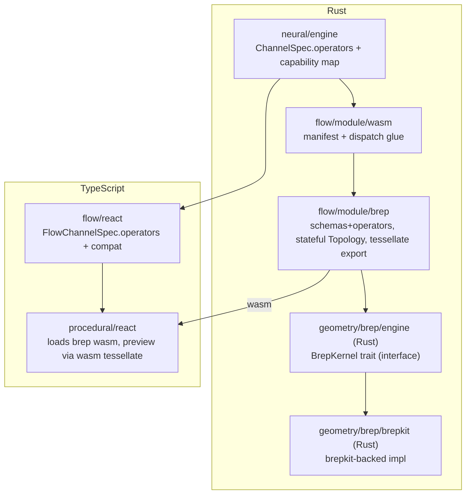

# Operator-Typed Channels + Pure-Rust Brep Nodes

## Goal

1. Channels declare a SET of required operators (capability typing), replacing the single `schema: ValueType` on `ChannelSpec`. Connection validity = source value's schema supports all required operators.
2. Replace the OpenCascade JS brep kernel with a pure-Rust kernel built on [brepkit](https://github.com/andymai/brepkit), exposed as a real flow WASM module (`flow/module/brep`).
3. Every procedural node (the brep catalogue) is defined with accurate named, capability-typed input/output channels — no generic `in`/`out` fallback.

Scope decision (confirmed): port only brepkit-supported operations and REMOVE the rest; fully remove the OpenCascade JS kernel. Greenfield, no legacy/compat.

## Architecture

Brep is stateful (arena `Topology` + handle map) while neural operators are stateless dict-in/dict-out. The brep WASM module keeps a thread-local kernel: operators allocate handles and return `{ "$schema": "geometry", "handle": "solid-1", "kind": "solid" }`; a wasm-bindgen `tessellate(handle, tolerance)` + `dispose(handle)` feed the R3F viewport (mirrors today's `MeshTransfer`).

## Phase 1 — Operator-typed channels (core model)

Files: [neural/engine/lib.rs](neural/engine/lib.rs), [flow/module/wasm/lib.rs](flow/module/wasm/lib.rs), all `flow/module/*/lib.rs`, [flow/core/lib.rs](flow/core/lib.rs), [flow/react/index.tsx](flow/react/index.tsx).

- `ChannelSpec`: replace `schema: ValueType` with `operators: Vec<String>`. Keep `default`, `label`. `ValueType`/`FieldSpec`/`Schema` stay (data-shape + dispatch).
- `Registry`: add a `finalize()`/capability pass building `schema_id -> Set<operator_id>` (operators whose impl signatures include that schema). `register_operator` gains the operator's produced output-schema id(s) so the registry can auto-fill each OUTPUT channel's provided `operators` (= operators supported by produced schema). INPUT channels author required `operators` explicitly.
- Compatibility rule (single source of truth): input.required ⊆ output.provided.
- Dispatch unchanged: still keys on runtime `$schema` via `operator_signature` (L615-633); change `channel_schema` fallback (L606-613) to use the channel default's `$schema` (or empty) since `schema` is gone.
- `inject_channel_defaults` (L561-572) unchanged (uses `default`).
- ChannelSpec builders: replace `number()/list()/dictionary()/value()/text_default()` etc. with capability-based helpers (e.g. `requires(["math.add"])`, plus `*_default` that still emit full schema'd default dicts). Numbers feeding `math.add` require `["math.add"]` and accept number/point/vector.
- `flow/core` port layout (L347-398): `value_type` derives from `operators` (display + compat) instead of `spec.schema.id()`.
- `flow/react`: `FlowChannelSpec.schema` -> `operators: string[]`; update manifest interfaces (L69-138) and any connection/port-compat logic to set-containment.
- Update all in-repo operator registrations (core/math/text/logic/dictionary/list) + their tests to the new channel shape. Keep multi-impl dispatch and variadics intact.

## Phase 2 — Pure-Rust brep kernel (brepkit, behind interface)

Per repo rule "no direct external dependency; wrap behind an interface":

- `geometry/brep/engine` (Rust): a `BrepKernel` trait + value types (geometry handle, kind, mesh buffers) — the interface. Mirrors the contracts in [geometry/brep/js/index.ts](geometry/brep/js/index.ts) (GeometryKind, MeshTransfer, Aabb).
- `geometry/brep/brepkit` (Rust): brepkit-backed impl (git deps `brepkit-topology`, `brepkit-operations`, `brepkit-io`). Holds `Topology` + handle registry; implements primitives, booleans, fillet/chamfer/shell/draft/offset/thicken, extrude/revolve/sweep/loft, section/split/slice, measure, query, heal/sew, STEP/STL IO, and tessellation (adaptive deflection + edges + per-face groups) → mesh buffers.
- Add both crates to root `Cargo.toml` workspace; add `script.ts` per crate (build/test/wasm) and register in `launch.json` following existing grouping.

## Phase 3 — `flow/module/brep` WASM module + node catalogue

- New crate `flow/module/brep` (mirror `flow/module/math`): `Cargo.toml`, `lib.rs`, `project.json`, `package.json`, `script.ts`; uses `flow/module/wasm` glue and depends on `geometry/brep/engine`.
- Register a `geometry` schema (handle/kind fields) and operators for every supported node, each with accurate named, operator-typed channels (e.g. `brep.bool.fuse` inputs `a`,`b` require `["brep.bool.fuse"]`; `brep.xform.translate` `geometry` requires a transform capability, `offset` requires `["math.move"]`/vector; `brep.measure.volume` output requires nothing). Reuse math `point`/`vector` and core `number`/`text`/`list` schemas (brep depends on core+math being loaded).
- Stateful kernel: thread-local `geometry/brep/brepkit` instance; operators read input handle dicts, call the kernel, return geometry dicts.
- Export via wasm-bindgen: `manifest()`, `evaluate(kind, json)`, `tessellate(handle, tol)`, `dispose(handle)`.
- Determine final node set against brepkit's real API; drop nodes brepkit can't do (candidates: gears, minkowski, ellipsoid, helix, some draw2d/sketch2d + 2D booleans, polyhedron) — confirm during implementation.

## Phase 4 — Procedural integration + remove OpenCascade

Files: [procedural/react/index.tsx](procedural/react/index.tsx), [procedural/play/*](procedural/play), [geometry/brep/js/index.ts](geometry/brep/js/index.ts), build configs.

- Replace `BREP_FLOW_KINDS`/`BREP_EVAL_HANDLERS`/virtual-module overrides with loading the brep WASM module through the normal flow module path; `ProceduralExtensionHost` keeps only: load brep wasm, register its manifest, and expose `tessellateGeometry` by calling the brep wasm `tessellate` (preview at L1409-1451 unchanged downstream of `MeshTransfer`).
- Remove `geometry/brep/js` OpenCascade kernel and `brepjs`/`brepjs-opencascade` deps; delete now-dead TS contracts or move the still-needed mesh-buffer types into the wasm bridge.
- Update Vite/optimizeDeps/aliases for `@semio-tech/flow-module-brep` (mirror module-core handling), and procedural play `script.ts` wasm build list + `vitest.config.ts` aliases.
- Update `launch.json`, root `package.json` workspaces (`flow/module/*/pkg`), and `procedural/play/index.ts` extension-tree counts.

## Validation

- `cargo test` for neural + every flow module + brep crates.
- Vitest for `flow/react` and `procedural/play` (extend existing test files only — no new test files; update brep tests in `procedural/react`).
- Browser probe of procedural dev server: catalogue shows brep operators with named capability-typed ports (not in/out), a box→fillet→translate graph evaluates and renders a mesh, and connection compatibility respects required-operator sets.

## Risks / notes

- brepkit coverage gaps shrink the node catalogue (acceptable per scope).
- Tessellation parity: must produce triangles + normals + edges + per-face groups to match the existing viewport `MeshTransfer`.
- This is large; phases 1 and 2/3 are independent and can proceed in parallel, but Phase 3 channel definitions depend on Phase 1 landing.

