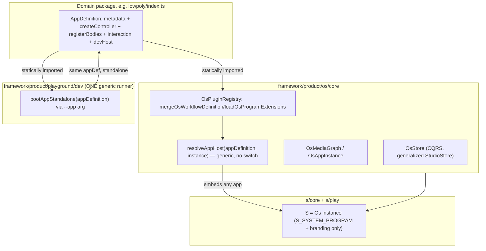

# os Framework, Composable Apps, Unified Interaction

## Current state (confirmed by exploration)

- `s` (`s/core/index.ts`, `s/play/index.ts`) already implements almost everything an "os" needs: `StudioStore` (CQRS), `SMediaGraph`, `SAppInstance`, a plugin registry (`mergeSWorkflowDefinition`/`registerSWorkflowDefinition`/`listSPrograms`), dynamic extension loading (`loadAllSProgramExtensions` in `s/play/program-extensions.ts`), and `SAppHostRouter` — a hand-written switch statement in `framework/product/playground/renderer/react/index.tsx` that embeds each technology inside S. This was just generalized in the closed `S-TECHNOLOGY-EXTENSION-LOADING` ticket, but it is still S-branded and not a reusable framework.
- `framework/product/AGENTS.md` already defines the "product" taxonomy: `platform` (full extendable product framework) and `playground` (lightweight interactive dev harness) are peers. There is no `os` product yet.
- Every domain (draw, flow, lowpoly, puzzle 2d/3d/5d, dag, trinity, gis, procedural 2d/3d, raster, writer, forms, sequence, layout, imperative, vcs, presentation, reasoning/mindmap, shooting, cad — 25 in total) ships its own `*/play` package: `package.json`, `project.json`, `script.ts`, `vite.config.ts`, `index.html`, and a large `index.ts`. Per the exploration, these are ~80-95% identical boilerplate (nx scripts, `createPlaygroundPlayViteConfig` wrapper, boot-gate tail keyed by a build-time `PUZZLE_PLAY_ENTRY` string). The only generic boot primitives today are `Playground`/`bootstrapPlaygroundWorkbench` (`framework/product/playground/core/index.ts`) and per-domain `boot<X>Play(playground)` functions in the renderer — there is no `bootFromDefinition()` that skips a bespoke `play/index.ts` per domain.
- Hover/selection is fragmented: `CanvasHoverFocus`/`AppPointerFocusStore<TKey>` (`framework/core/index.ts`) are already generic single-hover/single-selection primitives, but most domains bypass them with bespoke shapes: `LowpolyTarget`+`hoverRevision` (lowpoly), `DrawHoverPayload` (draw), `Puzzle3dHoverPayload` (puzzle 3d), `HoverFocusSnapshot` (puzzle 5d), `selectedNodeIds` (flow/dag), `selectedMediaNodeIds`/`selectedAppInstanceIds` (s/play), each wired ad hoc to `JackHoverBridge` where relevant.
- `AppDefinition`/`PlatformDefinition` (`framework/product/platform/core/index.ts:2257-2290`) are already the closest thing to a canonical "app definition," but only carry static metadata (id/label/modes) for S registration — none of the imperative controller/layout/toolbar/body wiring that today lives only in `*/play/index.ts`.

## Target architecture



Each domain's `AppDefinition` is consumed by two independent callers — the generic standalone runner and any `os` instance (`s` or future ones) — which is the concrete meaning of "composable: an app can run standalone as playground but also be part of os."

## Phase 1 — `os` framework skeleton

New `framework/product/os/core/index.ts` (+ `framework/product/os/renderer/react/index.tsx`), generalizing S's composition primitives out of `s/core/index.ts` / `s/play/index.ts`:

- `OsDocument`/`OsProjection`/`OsVcs` ← generalized from `SStudioDocument`/`SStudioProjection`/`SStudioVcs`.
- `OsAppInstance`, `OsMediaGraph` (nodes/edges/ports) ← generalized from `SAppInstance`/`SMediaGraph`.
- `OsStore` (CQRS: spawn/connect/apply commands) ← generalized from `StudioStore`.
- `OsPluginRegistry`: `mergeOsWorkflowDefinition`/`registerOsWorkflowDefinition`/`listOsPrograms`, built directly on `AppDefinition`/`PlatformDefinition` (`framework/product/platform/core/index.ts`) — no more per-technology dynamic `import()` guesswork; each domain's `AppDefinition` is imported directly since it is now a first-class exported value.
- `resolveAppHost(appDefinition, instance)`: replaces the hand-written `SAppHostRouter` switch in `framework/product/playground/renderer/react/index.tsx` with generic resolution based on what each `AppDefinition` itself registers (bodies/surface hosts), so adding an app never requires touching a central switch statement again.
- `OsBackbone` ← generalized from `DevJsonBackbone`/`LocalJsonBackbone` (already fairly generic; just de-S-branded).

## Phase 2 — Unified interaction contract ("every app has one hover, a selection")

In `framework/core/index.ts`, formalize the existing `AppPointerFocusStore<string>` (`framework/core/index.ts:762`) as the mandatory interaction primitive on the base `Controller` (`framework/core/index.ts:1066`): every controller must `provideStore("pointerFocus", new AppPointerFocusStore<string>())` and expose it uniformly, instead of inventing new per-domain shapes.

- `JackHoverBridge` (`framework/product/platform/core/index.ts:2771`) becomes an adapter reading/writing through this one store instead of bespoke per-domain glue.
- Migrate every domain controller off its bespoke hover/selection state onto the shared store: lowpoly (`LowpolyTarget`/`hoverRevision`), draw (`DrawHoverPayload`), flow/dag (`selectedNodeIds` + `JackHoverBridge`), puzzle 3d (`Puzzle3dHoverPayload`), puzzle 5d (`HoverFocusSnapshot`), procedural 2d/3d, gis/2d, trinity/jack, s/play (`selectedMediaNodeIds`/`selectedAppInstanceIds`).

## Phase 3 — `s` becomes "an os"

- `s/core/index.ts` shrinks to only S-specific branding: `S_SYSTEM_PROGRAM`, the table of which `AppDefinition`s this OS instance registers (statically imported, replacing today's string-keyed dynamic-import extension loader), and any S-only chrome. The composition machinery (store, media graph, registry, host resolution) is now `os/core`, imported not duplicated.
- `s/play/index.ts` (`SPlayController`, `PlaygroundS`) is rebuilt on `framework/product/os/renderer/react`'s generic `resolveAppHost`, so `SAppHostRouter`'s ~20 hand-written cases disappear.
- `s/play` itself stays a `Playground` (it is still directly runnable standalone) — proving the composability requirement in both directions: S hosts other apps, and S itself is still a standalone playground app.

## Phase 4 — Canonical `AppDefinition` per domain, exported from `index.ts`

Extend `AppDefinition` (`framework/product/platform/core/index.ts:2257`) with the imperative pieces that today live only in `*/play/index.ts`:

```typescript
export interface AppDefinition {
  // existing: id, label, iconId, controllerId, modes, defaultModeId
  createController(commandBus: CommandBus, notify: () => void): Controller;
  registerBodies(): void;
  registerSurfaceHosts?(): void;
  devHost?: { prebuild?(): void; viteAliases?: ...; optimizeDeps?: ...; watchIgnored?: readonly string[]; defaultPort?: number };
}
```

For every domain, fold the render-independent contents of `*/play/index.ts` (controller, layout, toolbar, declarative window bodies — these are declarative/`UiNode`-based, not React-specific, per `framework/AGENTS.md`'s "renderer implements the components") into `*/core/index.ts`, and export one `<X>AppDefinition: AppDefinition` object. `buildXWorkflowDefinition()` (already present per domain from the prior S-extension ticket) is absorbed into this single object instead of existing as a separate parallel export.

## Phase 5 — One generic standalone runner, replacing 24 `*/play` packages

New single package, e.g. `framework/product/playground/dev` (`package.json` + `project.json` + one `vite.config.ts` + one `index.html` + one `script.ts`):

- Takes the target domain via a runtime arg (`--app lowpoly`) instead of today's build-time `PUZZLE_PLAY_ENTRY` per-package define.
- `vite.config.ts` calls the existing `createPlaygroundPlayViteConfig` (`ui/styling/vite-elements-assets.ts`) but resolves aliases/`optimizeDeps`/`watchIgnored` from the target domain's `AppDefinition.devHost`.
- Entry module dynamic-`import()`s the requested domain's `index.ts`, then calls one generic `bootAppStandalone(appDefinition)` in `framework/product/playground/renderer/react`, replacing the ~20 bespoke `boot<X>Play()` functions.
- WASM/cargo prebuild divergence (flow's 8 modules, lowpoly, puzzle rust, procedural) becomes a declarative `devHost.prebuild()` hook invoked by the one shared `script.ts`.

Root-level fallout: `package.json` workspaces (drop ~24 entries), `dev:*`/`build:*`/`test:*` scripts collapse to `bun ./📜️script.ts dev <domain>` routed through the one runner, root `script.ts` `DevScript` router, `repo/lib/js/index.ts` `PLAYGROUND_PORTS` (collapse to one port/dynamic allocation), `.vscode/launch.json` entries (regenerate one parametrized launch config per domain, or one launch config with an input picker).

## Phase 6 — Delete the per-domain `*/play` packages

After Phase 4/5, delete for every domain: `play/package.json`, `play/project.json`, `play/script.ts`, `play/vite.config.ts`, `play/index.html`, `play/globals.css`, `play/vitest.config.ts`, `play/index.ts` (logic already folded into `core/index.ts` in Phase 4; any inline `import.meta.vitest` tests move with it — per repo rule, extend the existing `core/index.ts` test block rather than creating new test files).

Special cases needing individual handling:

- `compose/client/lib/sketchpad/play` — different `bundleKind: "site"`, assess separately.
- `cad/js/renderer/play` — currently boots isolated per the S-extension verify-log ("CAD still boots isolated `CadPlayRoot`"); needs its own composability pass.
- `reasoning/mindmap/play` — already an empty stub (`bundleKind: "library"`, no `script.ts`) — plain delete.

## Phase 7 — Tests

- New `os/core` test file (first test file for a new package, not "additional").
- Extend existing `s-core`/`s-play` test suites for S-as-os-instance behavior (registry completeness, host resolution without the old switch).
- Extend each domain's existing test file for: unified `AppPointerFocusStore` hover/selection behavior, and standalone boot via `AppDefinition` (replacing whatever `play/index.ts` tested before deletion).
- Run `bun nx run <pkg>:test` for every touched package before closing out.

## Phase 8 — Docs

- New `framework/product/os/AGENTS.md` (mirrors `framework/product/platform/AGENTS.md` / playground's doc).
- Update `framework/product/AGENTS.md` to list `os` alongside Platform/Playground.
- Update `s/AGENTS.md` to describe "S is an os instance."
- Update `framework/product/playground/AGENTS.md` to describe the single generic dev runner replacing per-domain play packages.

## Execution notes

- Per repo convention this work happens inside a ticket (goal `🎯️platform`/`🎯️s🎯️platform`, or a new `🎯️os` subgoal — confirm during ticket open by reading `repo://goals`). Given the "full big-bang" scope, expect this to be tracked as one ticket with the phases above as its todos, similar in shape to the prior `S-TECHNOLOGY-EXTENSION-LOADING` ticket (8 phases, ~24 technologies touched).
- Phases 1-3 (os core + s-as-os) unblock Phase 4 (per-domain `AppDefinition`), which unblocks Phases 5-6 (runner + deletion). Phase 2 (interaction contract) can proceed in parallel with Phase 1.
