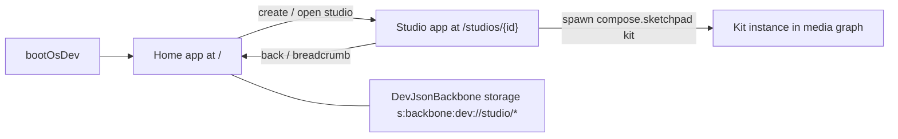

# OS Home App and Studio App

## Context

Sketchpad's platform shell was generalized into the OS framework (`framework/product/os`), but the shell composition wasn't: booting OS ([s/core/js/index.ts](s/core/js/index.ts) `bootOsDev`) drops you straight into the media-graph app on a single auto-resolved studio document. Sketchpad meanwhile still has its own kit-centric home app.

Target state (per user decisions):

- The OS shell gets a **Home app** at `/` that lists studios and can create/load/import/delete them — the studio-level analogue of sketchpad's kit home.
- The current media-graph app (media graph + media VFS + compiled DAG) becomes the **Studio app**, opened per studio at `/studios/{id}` with browser History API sync (deep links, back/forward).
- **Sketchpad's home app is removed entirely.** Kits are managed by spawning sketchpad apps (`kit`, `design`, `type`, …) inside a studio's media graph.

## 1. Studio catalog primitives — `framework/product/os/core`

In [framework/product/os/core/js/index.ts](framework/product/os/core/js/index.ts) (new region `🔖OsStudioCatalog`, next to the existing `OsStorageVirtualFileSystemController` at line ~1838):

- `listOsStudioCatalogEntries()`: enumerate the dev backbone namespace (`localStorage` keys `s:backbone:dev://studio/*`), parse each stored `OsDocument` for `id`, `name`, node/app counts, and last-operation timestamp.
- `createOsStudio(name)`: `createEmptyOsDocument(id, name)` + attach `DevJsonBackbone` at `dev://studio/{id}` + sync. Returns the id.
- `deleteOsStudio(id)` and `importOsStudioFromJson(json)` (parse via `parseOsDocument`, re-home onto a dev backbone URI).
- `OsHomeVirtualFileSystemController extends VirtualFileSystemController`: lists catalog entries as rows with descriptor values (name, updated, apps/nodes counts) and `navigateUri: "/studios/{id}"`, modeled on sketchpad's home VFS (`sketchpadHomeVfsChildren`). Reuses the same load/refresh pattern as `OsStorageVirtualFileSystemController`.

## 2. S shell: Home app + Studio app + routing — `s/core/js/index.ts`

- **Rename the play app to the Studio app**: `S_PLAY_APP_ID` value becomes `"studio"`, label "Studio" (constants/surface ids keep their names; greenfield, no aliases). `SPlayController` stays the studio controller.
- **New `SHomeController`** (region `🔖SHome`): wraps `OsHomeVirtualFileSystemController`, exposes `run` commands `createStudio`, `importStudio`, `deleteStudio`, `openStudio`; mode toolbar buttons ("New Studio", "Import Studio") following `buildSPlayToolbarTools` style. Home `AppRuntime` has a single VFS window registered via `registerAppVirtualFileSystem` (same mechanism as `attachMediaGraphVirtualFileSystem`, line ~193).
- **Studio open/close on `SPlayController`**: add `openStudio(studioId)` (load document from `DevJsonBackbone` at `dev://studio/{id}`, swap store via existing store-swap path used by fixture switching) and `goHome`.
- **Routing**: set `platform.applyUri` on the S runtime — `/` activates the home app, `/studios/{id}` activates the studio app and opens that studio; `platform.navigation` yields Home / Studio-name breadcrumb levels (mirror `applySketchpadUri` wiring at [compose/client/lib/sketchpad/js/index.ts](compose/client/lib/sketchpad/js/index.ts) line ~15974). Navigation from controllers goes through a `navigateTo(uri)` helper like sketchpad's shell controller.
- **Boot**: `bootOsDev` no longer force-opens a document; it builds the runtime with both apps, seeds the demo studio at `dev://studio/default` when storage is empty (reuse `resolveOsBootStudioDocument` seeding so home isn't empty), and starts on `/`.
- **Playground harness**: `sPlayAppDefinition` (fixture-driven `bun script.ts dev s`) keeps working — it boots the studio app directly with the example catalog; the examples contribution stays on the studio app only.
- Register a `home` app in `S_SYSTEM_PROGRAM` ([s/core/js/internal.ts](s/core/js/internal.ts) line ~259) alongside the existing `studio` app (componentKind `virtualFileSystem`, sourceFormat `os.storage`); catalogue already filters `s.system` from spawnables.

## 3. History sync in the S chrome — `s/react/play-host.tsx` (+ os renderer)

`PlaygroundView` has no URL sync (that lives in `PlatformViewWithHistory`, [framework/product/platform/renderer/react/index.tsx](framework/product/platform/renderer/react/index.tsx) line ~4952). Add a small generic `useOsShellHistory(runtime)` hook in [framework/product/os/renderer/react/index.tsx](framework/product/os/renderer/react/index.tsx) (new region) that replicates the `pushState`/`popstate` + `platform.applyUri` wiring, then use it in `SPlayInner`/`mountSPlayChrome` in [s/react/play-host.tsx](s/react/play-host.tsx). `SPlayInner` renders the home app's `PlaygroundView` when the home app is active, the existing studio chrome (drill-in, panels) otherwise, plus a "Back to Home" affordance next to the existing "Back to Media Graph" pattern.

## 4. Remove sketchpad's home app — `compose/client/lib/sketchpad/js/index.ts`

- Delete the `home` app from `buildSketchpadExtensionManifest`, `SKETCHPAD_HOME_APP_ID`, `sketchpadHomeCommands`, `sketchpadHomePanelTabs`, `sketchpadHomeVfsChildren`, `SketchpadHomeUiState`, and `sketchpadInstallHomeDropzone`.
- Move kit lifecycle commands (create empty kit, import from file, open file/folder/remote kit) onto the **kit app** command set so kits remain creatable when a sketchpad kit instance is spawned in a studio.
- `sketchpadAppIdFromPath`: `/` now resolves to the kit app; standalone `boot.tsx` creates/opens a temporary kit and navigates to `/kits/{id}` when no kit route is present.
- Remove `home` from `SKETCHPAD_APP_RESOURCE` in [s/core/js/internal.ts](s/core/js/internal.ts) (line ~247).
- Update sketchpad tests that reference the home app/route.

## 5. Verification

- Extend existing tests in `s/core/js/index.ts` (region `🧪Tests`): studio catalog list/create/delete round-trip, `applyUri` routing home ↔ studio, boot seeds demo studio.
- Run `s/core`, `os/core`, and sketchpad vitest suites.
- Boot OS dev in the browser: confirm with `[DEBUG]` logs + interaction that home lists studios, "New Studio" creates and navigates to `/studios/{id}`, media graph works there, browser back returns home, and spawning `compose.sketchpad` kit inside a studio still mounts sketchpad.

Work happens inside a repo ticket (`ticket_open` / reopen per repo MCP rules) with temp files in the ticket folder.
