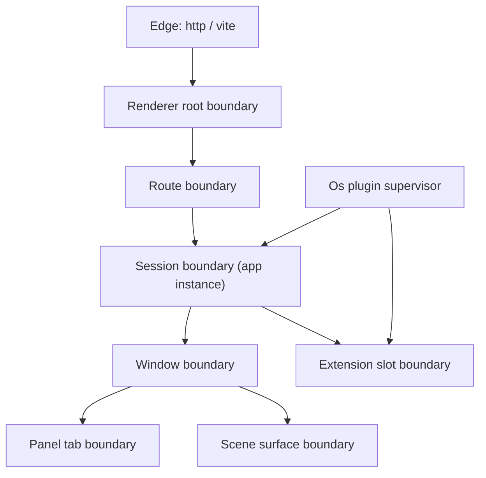

# Layered error handling for os

## The concrete bug, first

`http://127.0.0.1:6070/spaces/space-1` returns HTTP 404 and never loads the bundle. Vite's SPA fallback hardcodes a rewrite to `/index.html`, but the OS dev entry document is named `🌐️index.html`, and `[semioEmojiIndexHtmlVitePlugin](🧰️framework/🔨️module/🖱️ui/🎨️styling/⚡️implementation/🦀️rust/🟦️vite-elements-assets.ts)` only rewrites the bare root:

```688:694:🧰️framework/🔨️module/🖱️ui/🎨️styling/⚡️implementation/🦀️rust/🟦️vite-elements-assets.ts
      server.middlewares.use((req, _res, next) => {
        const url = req.url ?? "";
        if (url === "/" || url.startsWith("/?")) {
          req.url = `${entry}${url.slice(1)}`;
        }
        next();
      });
```

This is not an error-handling failure — it is a routing failure that *presents* as one because no layer reports it. It is also the perfect motivating case: seven levels of the stack were incapable of saying "this rout not exist".

Every host sharing that plugin is affected: os dev, the mit-bestand demonstrator, the präsentation bundle, and compose docs.

## Design

### Two kinds of report

- **Fault** — aborts an operation. Carries origin level, stable code, severity, scope, optional span, cause chain, retryability.
- **Diagnostic** — annotates a result that still succeeded (lint, validation, partial compute). Same `Severity`, no abort semantics.

One `Severity` enum for both. Today there are five incompatible `Diagnostic` structs and four `Severity` enums.

### Canonical types

Declared once in `semio_framework_core` ([Rust](🧰️framework/⚡️implementation/🦀️rust/📦️lib.rs), new `#region 🔖️Fault`), mirrored in [TypeScript](🧰️framework/⚡️implementation/🟦️typescript/📦️index.ts) and in the WIT `[interface types](🧰️framework/🛍️product/💻️os/🔨️module/🔌️plugin/⚡️implementation/🦀️rust/📜️wit/📜️world.wit)`:

```rust
pub enum FaultOrigin { Edge, Renderer, Os, Module, Plugin, App, Extension }
pub enum Severity { Fatal, Error, Warning, Hint }
pub struct FaultScope { plugin_id: Option<String>, app_id: Option<String>, instance_id: Option<String>, module: Option<String>, body_key: Option<String> }
pub struct Fault { origin: FaultOrigin, code: FaultCode, severity: Severity, message: String, scope: FaultScope, span: Option<TextSpan>, causes: Vec<FaultCause>, retryable: bool }
pub struct Diagnostic { code: FaultCode, severity: Severity, message: String, scope: FaultScope, span: Option<TextSpan> }
```

`FaultCode` is a stable dotted string namespaced by owner (`edge.route.not-found`, `os.plugin.load-timeout`, `module.pack.checksum-mismatch`, `plugin.trap`, `app.command.rejected`, `s.space.not-found`).

### Level boundaries and containment strategy




- **Edge** — a nav request must always resolve to the app document. Never a bare 404.
- **Renderer** — never dies. Every subtree above is an isolation unit with a scoped fallback and a retry affordance. Currently there is exactly one boundary in the whole 26k-line shell, wrapping only the canvas.
- **Os** — supervises plugins: retry with backoff, then quarantine. `ProgramSupervisorState` already exists but only the wgpu renderer uses it; React gets the same model.
- **Module** — framework modules (store, pack, protocol, dsl, vcs, db) keep typed enums, gain a code namespace, and stop panicking on wasm paths.
- **Plugin** — the crash-isolation unit. A trap restarts the instance, repeated traps quarantine it, and the rest of the space keeps running.
- **App** — recoverable. A rejected command leaves the document untouched and surfaces a fault as a toast plus diagnostic, never a crash.
- **Extension** — degradable. A failed contribution renders a placeholder in its slot; the host app is unaffected.

## Work

### 1. Edge: make deep links resolve

Rewrite in `[semioEmojiIndexHtmlVitePlugin](🧰️framework/🔨️module/🖱️ui/🎨️styling/⚡️implementation/🦀️rust/🟦️vite-elements-assets.ts)` so `configureServer`/`configurePreviewServer` *return* a post-hook middleware that maps `/index.html` onto the emoji entry. That slot sits after Vite's fallback and before `indexHtmlMiddleware`, so it handles `/`, deep links, and preview uniformly without accept-header heuristics. Add a `closeBundle` step emitting `dist/index.html` and `dist/404.html` alongside `dist/🌐️index.html` so static deploys and their SPA fallbacks work.

### 2. Canonical model

Add the types above to core Rust, core TypeScript and WIT. Add `TextSpan` reuse from `dsl_core`. Add a `FaultFrom` trait so any domain error converts with its own code namespace.

### 3. Wire: stop stringifying twice

- WIT: `variant plugin-error { message(string) }` becomes the `fault` record; all 11 host `result<_, string>` arms become `result<_, fault>`.
- `AppFrame::Error { code, message }` in [protocol/channel](🧰️framework/🛍️product/💻️os/🔨️module/📡️protocol/🧵️channel/⚡️implementation/🦀️rust/📦️lib.rs) becomes `AppFrame::Fault { in_reply_to, fault }`, pack-encoded. Update all 25 runtime emission sites in the plugin SDK and run module.
- The 15 `PluginApp` methods, `DocumentApp::command_from_action` and `AppAction::from_action_id` in [the plugin SDK](🧰️framework/🛍️product/💻️os/🔨️module/🔌️plugin/⚡️implementation/🦀️rust/📦️lib.rs) return `Result<_, Fault>`.
- The 183 `.map_err(|e| JsValue::from_str(...))` sites route through one shared `fault_to_js` bridge; TypeScript reconstructs a `SemioFaultError` carrying the structured fault instead of a bare string.
- Install `console_error_panic_hook` in os and plugin wasm so a trap carries a Rust backtrace rather than an opaque `unreachable`.

### 4. Unify diagnostics

Collapse onto the canonical pair, deleting the divergent declarations:

- Rust: `dsl_core::{TextError, Diagnostic, Severity}`, `mathematical_graph_dsl::{Diagnostic, DiagnosticSeverity}`, `vdi3805::{Diagnostic, Severity}`, energy `{Severity, Error, Diagnostics}`, architect `{DiagnosticSeverity, ProgramDiagnostic}`.
- TypeScript: core `Diagnostic`, shell `EditorDiagnostic`, CAD `Diagnostic`.
- Adapters stay only where an external protocol demands its own shape (LSP severities in the Jack server, `vscode.Diagnostic` in the repo extension).
- Architect's `IssueSeverity` (Cosmetic through Blocker) is a domain issue-tracker concept, not an error severity. Confirm before touching it.

### 5. Wire all 93 domain error enums onto the model

Each of the 93 `*Error` types across the 62 thiserror crates gets a code namespace and a `FaultFrom` impl, so structure survives every hop. The enums themselves stay — collapsing 93 domain vocabularies into one enum would destroy the typing they exist to provide; unification happens at the boundary type, not the domain type.

### 6. Renderer boundaries

In the [React shell](🧰️framework/🛍️product/💻️os/🔨️module/📺️renderer/🧑️‍🎨️engine/⚛️react/⚡️implementation/🟦️typescript/📦️index.tsx), generalize `ShellRenderErrorBoundary` into the hierarchy above (root, route, session, window, panel, surface, extension slot), each with `componentDidCatch` reporting a `Fault` and a scoped fallback with retry. Add supervisor state and a recovery panel matching the wgpu `ui_recovery_panel`. Keep the wgpu renderer at parity via the shared model.

### 7. Routing: report unknown routes

Replace `parseSpaceShellPath`'s `SpaceShellPath | null` with a typed `ShellRoute` union (`landing` / `space` / `notFound`) so an unrecognized path renders a not-found page instead of silently falling back to the landing app.

### 8. Report unknown spaces

`SpaceCommand::OpenSpace` currently invents a document for any id:

```1444:1444:✏️s/🔌️plugin/🪐️space/🎛️app/🪐️space/🔨️module/🖱️ui/⚡️implementation/🦀️rust/📦️lib.rs
                let document = home_ui::resolve_studio_document(space_id).or_else(|| if space_id == "demo" { Some(parse_demo_space_document()) } else { None }).unwrap_or_else(|| create_empty_os_document(space_id, "Untitled Studio"));
```

So even after the 404 is fixed, `/spaces/space-1` would show a blank "Untitled Studio". Return a `Fault` with code `s.space.not-found`; the shell renders a not-found state offering "create this space" and "back home".

## Verification

Runtime evidence, not assertions:

- `curl -i http://127.0.0.1:6070/spaces/space-1` returns 200 with the transformed HTML; same for `vite preview`.
- Browser console confirms boot, route resolution, and the not-found state for an unknown space id, via `[DEBUG]`-prefixed logs.
- Extend existing test files (no new ones): channel round-trip for `AppFrame::Fault`, fault propagation through `plugin_exchange`, the emoji-entry middleware, and boundary isolation in the shell tests.
- The `data-semio-os-error` / `data-semio-os-ready` readiness beacon gains a `notFound` state for headless smoke tests.

## Before starting

Open a ticket via the repo MCP (`2026/08/04/DESIGN-LAYERED-ERROR-HANDLING-FOR-OS`). That namespace was not available in this session, so it needs to be reachable at execution time. None of the seven open goals is a natural fit for OS-wide error architecture (`R26-02`/`R26-03` are past release cycles, `AI-OPTIMIZED-REPO` is repo tooling, the rest are domain technologies) — since goals must not be opened without instruction, confirm which one to attach to.

[{"id": "edge-fallback", "content": "Fix the edge: make semioEmojiIndexHtmlVitePlugin serve the emoji entry for deep links via a configureServer/configurePreviewServer post hook, plus dist/index.html and dist/404.html emission. Verify /spaces/space-1 returns 200 with curl."}, {"id": "canonical-types", "content": "Declare canonical Fault, FaultOrigin, FaultCode, FaultScope, Severity and Diagnostic in core Rust, core TypeScript and WIT interface types, with a FaultFrom conversion trait."}, {"id": "wire-fault", "content": "Replace stringly errors on the wire: WIT plugin-error and the 11 host result<_, string> arms, AppFrame::Error to AppFrame::Fault with its 25 emission sites, and the 15 PluginApp methods plus DocumentApp::command_from_action and AppAction::from_action_id."}, {"id": "wasm-bridge", "content": "Route the 183 JsValue::from_str sites through a shared fault_to_js bridge, add SemioFaultError on the TypeScript side, and install console_error_panic_hook in os and plugin wasm."}, {"id": "unify-diagnostics", "content": "Collapse the five Diagnostic structs and four Severity enums (dsl_core, graph DSL, vdi3805, energy, architect, plus TypeScript core/editor/CAD) onto the canonical pair, keeping adapters only for LSP and vscode."}, {"id": "domain-errors", "content": "Give each of the 93 domain error enums across the 62 thiserror crates a code namespace and a FaultFrom impl."}, {"id": "renderer-boundaries", "content": "Build the React boundary hierarchy (root, route, session, window, panel, surface, extension slot) with scoped fallbacks and retry, add supervisor state and a recovery panel, and keep the wgpu renderer at parity."}, {"id": "routing-notfound", "content": "Replace parseSpaceShellPath's nullable return with a typed ShellRoute union including notFound, and render a not-found page instead of silently falling back to landing."}, {"id": "space-notfound", "content": "Make SpaceCommand::OpenSpace return a s.space.not-found fault for unknown ids instead of inventing an Untitled Studio, and render the not-found state with create and home actions."}, {"id": "verify", "content": "Verify at runtime: curl dev and preview, browser console logs for boot/route/not-found, extend existing test files for channel round-trip, fault propagation, the middleware and boundary isolation, and add a notFound readiness beacon state."}]