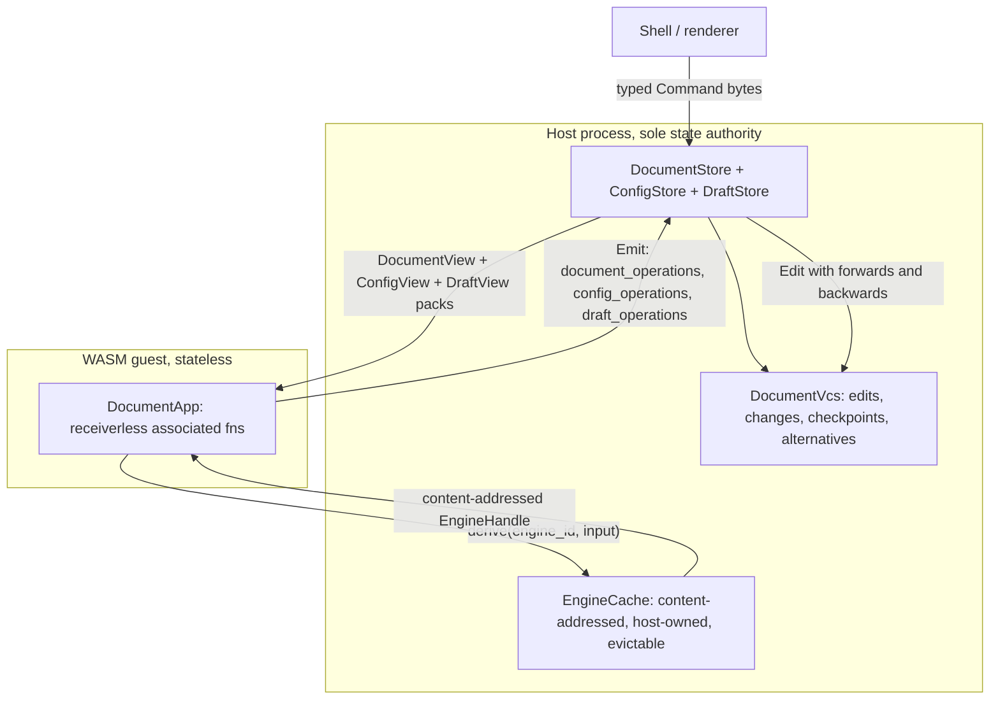

## Title

# Exclusive OS State Authority

## What is actually broken

The OS already has the right algebra. [store/component.rs](🧰️framework/🛍️products/💻️os/🔨️modules/🏪️store/🦀️component.rs) has `DocumentEnvelope`/`DocumentCommand`/`DocumentStore::dispatch`, [vcs/component.rs](🧰️framework/🛍️products/💻️os/🔨️modules/🌿️vcs/🦀️component.rs) has `DocumentVcs`/`Change`/`Checkpoint`/`Alternative`, and [spr/command/component.rs](🧰️framework/🛍️products/💻️os/🔨️modules/📡️spr/🎮️command/🦀️component.rs) has `Operation`/`OperationDiff`/`Edit`. The `DocumentApp::handle` at [plugin/component.rs:3282](🧰️framework/🛍️products/💻️os/🔨️modules/🔌️plugin/🦀️component.rs) is already a pure `&self` function returning an `Emit`.

Five concrete holes let plugins reimplement state anyway:

- The store lives **inside the WASM guest**. `VcsDocumentApp` at [plugin/component.rs:3876](🧰️framework/🛍️products/💻️os/🔨️modules/🔌️plugin/🦀️component.rs) owns `store: DocumentStore<..>`, guest linear memory survives across `exchange`, and `PluginBundle::register_document_app` takes an `impl Fn() -> A` factory, so any app struct can carry fields. `&self` plus `Mutex`/`RefCell` is all it takes: `FlowPlayApp` holds `Mutex<FlowEvalSession>`, and there is a guest TLS `HashMap` of `ViewState` in `set_instance_view_state`.
- The store has **public write escape hatches**: `set_envelope` (line 1984), `set_state` (1990) and `ingest_remote` (2364) sit beside `dispatch` (2063), and `DocumentEnvelope` fields are all `pub`.
- **Computational kernels own their own registries and mint their own ids.** `DrawingStore { seq: u32, registry: HashMap<..> }` in [◻2d/🗄️store](✏️s/🔨️modules/◻2d/🗄️store/🦀️component.rs), `BrepkitKernel`, the `Store<T, Id>` arena and `Body`/`LabelSource` in 🧊3d, `HalfedgeMesh`, plus process globals `CAD_BREP_KERNEL`, `PROCESS_BREP_KERNEL`, layout `ENGINE`, `PUZZLE3D_MESH_REGISTRY`, `FLOW_PLAY_NEURAL_CACHE`, `PRESENCE_PEERS`, `STUDIO_PORTS`.
- **A whole parallel host architecture bypasses the plugin path**: `EditorHost`, `MapHost`, `RasterHost`, `GraphHost`, `TerrainSessionState`, `ActionBus`, `Platform` in non-OS framework, and `ImperativeHost`, `SequenceHost`, `TrinityHost`, `NormHost`, `Puzzle3dEngine` in plugins, all `&mut self` and reached from wasm-bindgen `Rc<RefCell<..>>` sessions.
- **No enforcement exists.** There is a rich policy convention in [📜️script.ts](📜️script.ts) (`policyDbServerOnlyBreaches` at 3306, `policyAllRustFiles`, `policyDocumentAppUsages`, `policyTestModSpans`) and a boundary matrix in [.dependency-cruiser.cjs](.dependency-cruiser.cjs), but nothing about state ownership.

Counts to migrate, from the inventory: 52 core Rust sites and about 26 core non-Rust sites across `✏️s/**` and `🧰️framework/**` outside the OS product. `compose`, `♻️mit-bestand` and `🌎️hub` are out of scope as separate technologies.

## Target architecture




Three lanes, one command algebra:

- **Document lane** for durable state. `DocumentCommand::Apply` only, recorded as `Edit` in `DocumentVcs`.
- **Config lane** for persisted per-user settings. Already exists as `ConfigStore`; keep it, it is a `DocumentStore`.
- **Draft lane** (new) for ephemeral state: gestures, camera, selection, hover, presence, preview scratch. This is the `Draft` concept already defined in [os/AGENTS.md](🧰️framework/🛍️products/💻️os/AGENTS.md) ("a draft is a volatile artifact"). It is a real `DocumentStore` with real `Operation`/`Diff`, so undo works inside a session, but its vcs is truncated at each checkpoint and never enters a `Change`.

Computational kernels become the `Engine` concept from the same AGENTS.md ("a stateful headless computational engine... maintains a pack buffer"): host-owned, content-addressed, incremental.

## Mechanism changes

### M1: seal the store, one write gate

In [store/component.rs](🧰️framework/🛍️products/💻️os/🔨️modules/🏪️store/🦀️component.rs):

- Make every `DocumentEnvelope` field `pub(crate)`; expose a read-only `DocumentEnvelopeView`. `envelope()` returns the view.
- Delete `set_envelope` and `set_state`. Fold them into `DocumentCommand::Reset { envelope, applied_edit_ids, redo_edit_ids }`.
- Delete public `ingest_remote`. Fold into `DocumentCommand::IngestRemote { envelope }`.
- `dispatch` becomes the sole `&mut self` entry point and returns a `CommandReceipt { edit_ids, diff, generation }`.
- Subordinate `SpaceHost::commit_space_checkpoint` and the db `CommandBatch::submit` path in [db/📄️document](🧰️framework/🛍️products/💻️os/🔨️modules/🛢️db) to `dispatch`, so the hub and the client share one algebra.

In [vcs/component.rs](🧰️framework/🛍️products/💻️os/🔨️modules/🌿️vcs/🦀️component.rs):

- Replace the `ID_COUNTER` global in `create_document_vcs_id` with `edit_scoped_id(edit_id, ordinal)` so ids are deterministic and merge-safe. This is what lets kernel `seq: u32` counters go away.
- Delete the duplicate `CollectionOperation` and `ItemPatch` twins; spr is the single home.

### M2: new OS module `⚙️engine`

New `🧰️framework/🛍️products/💻️os/🔨️modules/⚙️engine/🦀️component.rs`, registered in [os glue.rs](🧰️framework/🛍️products/💻️os/📦️packages/🦀️rust/📦️glue.rs) and the os kernel `Cargo.toml`:

```rust
pub struct EngineKey([u8; 32]);
pub struct EngineHandle { key: EngineKey, engine_id: &'static str }

pub trait Engine: 'static {
    const ENGINE_ID: &'static str;
    type Input: DocumentPack;
    type Output: DocumentPack;
    fn compute(input: &Self::Input) -> Result<Self::Output, EngineFault>;
}

pub trait EngineHost {
    fn derive(&self, engine_id: &str, input: &[u8]) -> Result<EngineHandle, EngineFault>;
    fn read(&self, handle: &EngineHandle) -> Result<Vec<u8>, EngineFault>;
}
```

- `EngineKey` is the hash of `(ENGINE_ID, input pack bytes)`. Handles are content-addressed, so no plugin can mint one and identity is reproducible across machines and merges.
- **Incrementality**: an `Input` may reference a parent `EngineHandle`, so a brep topology step is `derive(brep, (parent_handle, step))`. The cache holds intermediates, so an edit stays O(1) rather than replaying from scratch. This is what makes `BrepkitKernel` viable as an engine rather than as a plugin-owned registry.
- `EngineCache` is host-owned with an LRU byte budget and eviction; the guest reaches it through two new WIT imports `engine-derive` and `engine-read` added to [world.wit](🧰️framework/🛍️products/💻️os/🔨️modules/🔌️plugin/📦️packages/🦀️rust/📜️wit/📜️world.wit), gated by a new `ArtifactKind::Engine` capability.
- Engines are registered and executed **native in the host**, which additionally moves heavy geometry out of WASM.

### M3: receiverless `DocumentApp` and host-authoritative store

In [plugin/component.rs](🧰️framework/🛍️products/💻️os/🔨️modules/🔌️plugin/🦀️component.rs):

- Every `DocumentApp` method loses its receiver and becomes an associated function; `app_id`/`document_schema`/`config_schema` become associated consts. An app type is then a ZST with nowhere to put state:

```rust
pub trait DocumentApp: 'static {
    const APP_ID: &'static str;
    const DOCUMENT_SCHEMA: &'static str;
    type Projection; type Operation;
    type Config;     type ConfigOperation;
    type Draft;      type DraftOperation;
    type Command: OpBinary + Send;

    fn initial_projection() -> Self::Projection;
    fn handle(
        command: &Self::Command,
        doc: DocumentView<'_, Self::Projection>,
        cfg: ConfigView<'_, Self::Config>,
        draft: DraftView<'_, Self::Draft>,
        engines: &EngineHandles,
    ) -> Result<Emit<Self::Operation, Self::ConfigOperation, Self::DraftOperation>, Fault>;
    fn render(body_key: &str, doc: DocumentView<'_, Self::Projection>, cfg: ConfigView<'_, Self::Config>, draft: DraftView<'_, Self::Draft>) -> UiNode;
}
```

- `Emit` gains `draft_operations`.
- `PluginBundle::register_document_app::<A>()` becomes turbofish-only, dropping the `impl Fn() -> A` factory. There is no instance to construct, so a stateful app is unrepresentable.
- Move `VcsDocumentApp`'s `store`, `config_store`, `command_log`, `cache` and `history_filter` out of the guest into [plugin/🖥️host](🧰️framework/🛍️products/💻️os/🔨️modules/🔌️plugin/🖥️host/🦀️component.rs). The host owns a `DocumentSession { store, config_store, draft_store, command_log }` per instance.
- Delete the guest TLS `INSTANCES` vector and `set_instance_view_state`; `ViewState` folds into `Draft`.
- Rewrite `exchange` in [world.wit](🧰️framework/🛍️products/💻️os/🔨️modules/🔌️plugin/📦️packages/🦀️rust/📜️wit/📜️world.wit) and the `AppCommand`/`AppFrame` codec in [spr/🧵️channel](🧰️framework/🛍️products/💻️os/🔨️modules/📡️spr/🧵️channel/🦀️component.rs): host sends `(command bytes, doc pack, cfg pack, draft pack)`, guest returns `Emit` bytes plus `UiNode`. Bump `CHANNEL_VERSION` from 4 to 5. The host then calls `store.dispatch(Apply { operations })` itself.
- With no durable guest state, hot reload stops needing `LoadDocument` replay.

### M4: draft lane and chrome

- Add `DraftStore` (a `DocumentStore` alias) and `DocumentCommand::PruneDrafts`; drafts never produce a `Change` or enter a `Checkpoint`.
- Framework UI chrome (theme, locale, appearance, terminology, driver, per-shell selection mode, tree selection) moves from `localStorage`/`StoragePort`/module-level `let` in [ui react index.tsx](🧰️framework/🔨️modules/🖱️ui/📦️packages/🟦️typescript/🎯️targets/⚛️react/📦️index.tsx) into an OS chrome config document, persisted through the store's existing folder/hub backbone binding.

## Enforcement, so this cannot regress

Structural first (a violation should not compile): receiverless trait, no app factory, `pub(crate)` envelope fields, content-addressed engine handles, no public store setters.

Then a lint, following the existing `policy*Breaches` convention in [📜️script.ts](📜️script.ts):

- `policyOsStateAuthorityBreaches(repoRoot)` over `policyAllRustFiles` outside `🧰️framework/🛍️products/💻️os/`, skipping `policyTestModSpans`: flags item-scope `static mut`, `thread_local!`, `lazy_static!`, `OnceLock<`, `OnceCell<`, `LazyLock<`, `Mutex<`, `RwLock<`, `RefCell<`, `Cell<`; struct fields of `HashMap<`/`BTreeMap<` on types matching `(Store|Registry|Host|Session|Engine|Kernel|World|Scene|State|Cache)$`; `fn .*(&mut self` on those same types; and `AtomicU\d+`/`seq: u32` id minting.
- `policyDocumentAppShapeBreaches(repoRoot)` reusing `policyDocumentAppUsages`: any `impl DocumentApp for X` where `struct X` declares fields, and any `register_document_app(` call with an argument.
- Register both in the `policy` export at [📜️script.ts:3969](📜️script.ts) next to `policyDbServerOnlyBreaches`.
- TS: a `no-state-outside-os` rule in [.dependency-cruiser.cjs](.dependency-cruiser.cjs) and `no-restricted-syntax`/`no-restricted-globals` in [eslint.config.mjs](eslint.config.mjs) for module-level mutable bindings, module-scope `new Map()`/`new Set()`, `class *Store`, and `localStorage`/`sessionStorage`/`indexedDB`.
- Wire into `VerifyScript` `gate` in [📜️script.ts](📜️script.ts) and add the corresponding entries to [.vscode/launch.json](.vscode/launch.json) following the existing numeric-group and emoji-name convention.

## Workforce plan

Ticket first: read `repo://goals` over the repo MCP, then `ticket_open` slug `OS-EXCLUSIVE-STATE-AUTHORITY` under the most fitting goal (likely `AI-OPTIMIZED-REPO`). Note: the repo MCP is not currently loaded in this session, only `cursor` and `cursor-app-control`, so this step needs it available. All logs and scratch go in the ticket folder.

**Conflict control.** No git mutations, no worktrees, everyone edits existing files. The ticket folder carries `👥️ownership.md` assigning a disjoint file glob to each agent. Shared root files (`Cargo.toml`, `Cargo.lock`, `📜️script.ts`, `.dependency-cruiser.cjs`, `eslint.config.mjs`, `nx.json`, `📋️project.json`, `.vscode/launch.json`) are owned **only** by the integrator agent; every other agent appends its required root edit to `📥️integration-requests.md` instead of touching them.

**Models.** Architecture, mechanism and enforcement waves use Cursor Grok 4.5. Mechanical migration and verification sweeps use Composer 2.5. Regular speed, never the fast variants.

**Wave 0, serial, 1 agent (Grok).** Open the ticket, snapshot the baseline: `cargo metadata` crate list, `bun ./📜️script.ts verify gate`, `bun nx run-many -t test`, and the full violation inventory written to the ticket folder as the checklist every later wave ticks off.

**Wave 1a, parallel, 3 agents (Grok), disjoint files.**

- Store and vcs sealing (M1) — owns `🏪️store/**`, `🌿️vcs/**`, `🛢️db/**`.
- New `⚙️engine` module (M2) — greenfield, owns `⚙️engine/**` plus its glue and Cargo entries via the integrator.
- Draft lane types and chrome config schema (M4 Rust side) — owns the new draft types inside `🏪️store` regions coordinated with the first agent by region, or serialized after it if regions collide.

**Wave 1b, serial, 1 agent (Grok).** The plugin/host/WIT flip (M3). `🔌️plugin/🦀️component.rs` is ~9000 lines and `🖥️host`, `world.wit` and `spr/🧵️channel` are tightly coupled to it, so one writer only. Gate: os kernel and plugin-host crates compile, os examples and fixtures pass.

**Wave 2, parallel, ~26 agents (Composer), one owner per crate.**

- Kernels to engines, 4 agents: `◻2d`; `🧊3d` (brep arena, `Body`, `LabelSource`, `HalfedgeMesh` — one crate, one agent); `📏️layout` `ENGINE` plus `🖨️raster`; `🏔️terrain` plus `🕸️node-graph`.
- Plugin apps to receiverless plus draft, 11 agents batched by kernel affinity: (draw, raster, note, forms); (cad, alone — largest); (puzzle, block); (procedural, dag, reasoning); (flow, sequence, imperative); (trinity, playbook, mathematical, writer); (fem, process, energy); (animate, shooting, remodel); (architect, norm, sourcing); (gis, lowpoly); (space, demonstrator, vcs-plugin). Global mutexes `CAD_BREP_KERNEL`, `PROCESS_BREP_KERNEL`, `PUZZLE3D_MESH_REGISTRY`, `FLOW_PLAY_NEURAL_CACHE`, `PRESENCE_PEERS`, `STUDIO_PORTS` die here.
- Non-OS framework hosts, 8 agents: `✍️editor`; `🗺️tiled-map`; `🎨️paint`; `🎲️board-2d`; `🧩core/🎯️action-bus` plus `🖥️platform`; `🧮math/🧩️wfc`; `🖱️ui` wgpu retained state; `💭️mindmap` plus `🗣️lang` plus `📜️imperative` s-modules.
- TypeScript, 3 agents: CAD core (`AttributeStore`, `ActionRegistry`, `InteractionRegistry`, `InteractionRuntime`, module caches); CAD stately, brepjs, runtime and renderer; framework UI chrome, `ShellScope`, `Tree`, `UiDriver`, styling.

Every Wave 2 agent must finish with its own crate green: `bun ./<crate>/📜️script.ts test` and `lint`.

**Wave 3, serial, 1 integrator (Grok).** Applies `📥️integration-requests.md`, writes both policy functions, the dep-cruiser and eslint rules, the `verify gate` wiring and the launch.json entries. The lint lands with **zero** allowlist — Wave 2 must be complete first, since a baseline allowlist would be exactly the compatibility layer the repo rules forbid.

**Wave 4, parallel, 3 agents (Composer).** Full `bun ./📜️script.ts verify gate`, `bun nx run-many -t lint`, `bun nx run-many -t test`, and a runtime proof: temporary `[DEBUG]` logs in the host `dispatch`, the guest `handle`, and the engine cache, captured to the ticket folder, showing one draw command travelling shell to host to guest, returning operations, landing as an `Edit` with real `backwards`, and an engine cache miss then hit. Nothing is claimed working without that log.

**Wave 5, serial, 1 agent (Grok).** Strip the `[DEBUG]` logs, then `ticket_close` with the summary and the full file list.

## Verification checklist

- `bun ./📜️script.ts verify gate` green.
- `bun nx run-many -t lint` green, including the two new policies at zero breaches.
- `bun nx run-many -t test` green across all 70 crates plus TS and Python.
- Grep proof: no `static mut`, `lazy_static!`, `thread_local!`, `OnceLock`, `Mutex`, `RefCell` at item scope in non-test Rust outside the OS product; no `seq: u32` handle counters; no `localStorage` in `✏️s/**` or non-OS `🧰️framework/**`.
- Runtime log proof of the host-to-guest-to-vcs round trip and of engine cache behaviour, stored in the ticket folder.

