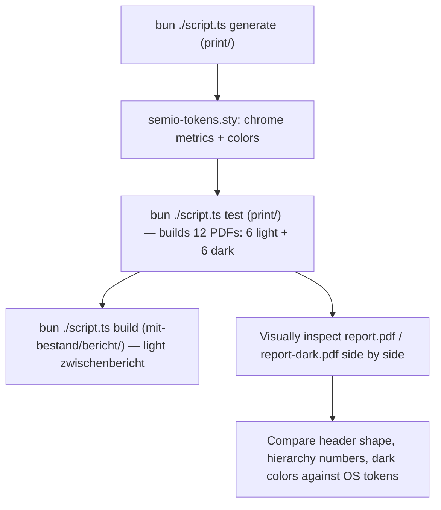

## Problem with current implementation

[print/tex/semio-window.sty](print/tex/semio-window.sty) currently renders windows as a single solid-color `tcolorbox` title bar (`title={\thechapter\quad #1}`) — a plain rectangle. The real OS chrome (`ModeDockTabBar` in [ui/js/react/index.tsx](ui/js/react/index.tsx)) is not a rectangle: the title row is **three horizontal segments** —

- left **tab cap**: `window`-filled, border on top+left+right only (`windowCapFrameClass`, lines 4068-4069)
- middle **gap**: `canvas`-filled (matches body, not page), border on **bottom only** (`windowGapFrameClass`, lines 4076-4077) — this is the visual "cutout"
- right **controls cap**: `window`-filled, border on top+left+right only (`windowControlsCapClass`, line 4146) — holds Focus/Close buttons in the OS, will hold the hierarchy number here

The body sits directly under, canvas-filled, border on left+right+bottom only (no top), overlapping the header row by `-1px` (`windowBodyFrameClass`, line 4079).

Exact tokens (from `ui/styling/tokens.json`):

- Row height: `metrics.chrome.controlHeightUiSpacing = 7` × `spacing.compact` (`0.2rem`) = **1.4em**
- Padding: `metrics.chrome.paddingStandardUiSpacing = 1` × compact = **0.2em** (currently the `.sty` wrongly uses the unrelated `touch` spacing token for top/bottom padding)
- Colors: already correctly emitted (`semio-chrome-{light,dark}-{window,canvas,border-normal,border-emphasized}` in [print/tex/semio-tokens.sty](print/tex/semio-tokens.sty)) — no change needed there.
- Border width: already correct (`\semio@stroke@hairline` = 0.75pt ≈ 1px).

## 1. Emit exact chrome metrics — [print/script.ts](print/script.ts)

Add `metrics` to the `Tokens` type and read `tokens.metrics.chrome`. In `emitSemioTokensSty()`, scale `spacing.compact` by the relevant multipliers and emit ready-made length macros:

```ts
const compactFactor = parseFloat(tokens.spacing.compact); // "0.2rem" -> 0.2
const chrome = tokens.metrics?.chrome;
if (chrome) {
 lines.push(`\\newcommand{\\semio@chrome@titlebar@height}{${compactFactor * chrome.controlHeightUiSpacing}em}`);
 lines.push(`\\newcommand{\\semio@chrome@padding}{${compactFactor * chrome.paddingStandardUiSpacing}em}`);
}
```

Also emit two font-size macros from `tokens.metrics.typography` (`textXsPx`/`text2xsPx` relative to 16px base): `\semio@chrome@font@title` = `0.7em` (name tab, matches `text-xs`), `\semio@chrome@font@number` = `0.6em` (number tab, matches `text-tiny`, the size used for the Focus/Close labels it replaces).

## 2. Rebuild the U-shaped header — [print/tex/semio-window.sty](print/tex/semio-window.sty)

Replace the single `tcolorbox` `title=` mechanism with three adjacent `tcbox` segments using tcolorbox's independent per-side rule keys (`toprule`/`bottomrule`/`leftrule`/`rightrule`, distinct from the shorthand `boxrule`):

```
\tcbset{
  semio window tab/.style={enhanced, nobeforeafter, tcbox raise base,
    toprule=\semio@stroke@hairline, leftrule=\semio@stroke@hairline, rightrule=\semio@stroke@hairline, bottomrule=0pt,
    arc=0mm, colframe=semio-chrome-border-normal, colback=semio-chrome-window, coltext=semio-chrome-border-emphasized,
    fontupper=\SemioSans\fontsize{\semio@chrome@font@title}{\semio@chrome@font@title},
    height=\semio@chrome@titlebar@height, valign=center,
    left=\semio@chrome@padding, right=\semio@chrome@padding, top=0pt, bottom=0pt},
  semio window controls/.style={semio window tab, fontupper=\SemioSans\fontsize{\semio@chrome@font@number}{\semio@chrome@font@number}},
  semio window gap/.style={enhanced, nobeforeafter, tcbox raise base,
    toprule=0pt, leftrule=0pt, rightrule=0pt, bottomrule=\semio@stroke@hairline,
    arc=0mm, colframe=semio-chrome-border-normal, colback=semio-chrome-canvas,
    height=\semio@chrome@titlebar@height},
  semio window body/.style={enhanced, breakable, arc=0mm,
    toprule=0pt, leftrule=\semio@stroke@hairline, rightrule=\semio@stroke@hairline, bottomrule=\semio@stroke@hairline,
    colframe=semio-chrome-border-normal, colback=semio-chrome-canvas,
    left=\semio@chrome@padding, right=\semio@chrome@padding, top=\semio@chrome@padding, bottom=\semio@chrome@padding},
}
```

New macro `\semio_window_header:nn{#1}{#2}` (name, number — number may be empty) draws the three-segment row and then overlaps `-\semio@stroke@hairline` into the body:

- Measure `\settowidth` of the name-tab and number-tab (each including their own padding+borders).
- Draw: `\noindent\tcbox[semio window tab]{name}` immediately followed by `\tcbox[semio window gap, width=\dimexpr\linewidth-<leftw>-<rightw>\relax]{}` immediately followed by `\tcbox[semio window controls]{number}`.
- `\vspace*{-\semio@stroke@hairline}` before the body box so borders overlap exactly like `-mt-px`.

`Semiobox` keeps its optional `title=` key but routes through `\semio_window_header:nn{title}{}` (empty right chip — no hierarchy context) before a `semio window body` box; untitled `Semiobox` (as used for the untitled flyer tile) skips the header entirely, matching current behavior of `tcolorbox` without a `title` key.

## 3. Always show a hierarchy number — remove starred/unstarred distinction

Per clarification: every `\chapter`/`\section`, **including previously-starred calls**, must always display its number (`\thechapter`, `\thesection`), matching whatever depth is used (e.g. `1.2`). Simplify `semio-window.sty`:

- Delete `\semio_window_open_chapter_star:n` / `\semio_window_open_section_star:n` entirely.
- `\RenewDocumentCommand{\chapter}{s m}` and `\RenewDocumentCommand{\section}{s m}` ignore the star flag and always call the numbered path (`\refstepcounter`, `\chaptermark`/`\sectionmark`, `\addcontentsline{toc}{...}`, then `\semio_window_header:nn{#2}{\thechapter}` or `{\thesection}`).
- Chapter stays a header-only "band" (no body box — this is the existing safe fallback avoiding tcolorbox nested-breakable crashes); section keeps header + real `semio window body` box (breakable). This nesting-safety design is unchanged, only the header visuals and always-on numbering change.
- `\subsection`/`\subsubsection`/`\paragraph` remain out of scope (unused in any template today, same as the original plan) — the same header macro can be reused for them later without rework.

**Cleanup of now-redundant manual TOC calls** (since numbering/TOC is now automatic for what used to be starred headings):

- [print/tex/semio-components.sty](print/tex/semio-components.sty) `\makefundingacknowledgement`: remove `\addcontentsline{toc}{chapter}{Förderhinweis}` (line 59).
- [print/template/zukunftbau/forschungsbericht.tex](print/template/zukunftbau/forschungsbericht.tex): remove `\addcontentsline{toc}{chapter}{Kurzbeschreibung / Abstract}` (line 16).

No other template has manual `\chapter*`/`\section*` + `\addcontentsline` pairs (checked `kompaktbericht.tex`, `flyer.tex`).

## 4. Permanent dark-theme templates

Per clarification: add permanent dark-themed PDF targets for every template (not just a one-off verification build). For each of the 6 templates, split content out of the theme-specific entry file:

- New `<name>.content.tex` holding everything from `\title{...}`/`\begin{document}` through `\end{document}` (unchanged from today's file body).
- `<name>.tex` (existing filename, light) shrinks to `\documentclass[...,theme=light,...]{...}` + `\input{<name>.content.tex}`.
- New `<name>-dark.tex`: `\documentclass[...,theme=dark,...]{...}` + `\input{<name>.content.tex}`.

Applies to: `report`, `paper`, `flyer`, `forschungsbericht`, `zwischenbericht`, `kompaktbericht` (all under [print/template/](print/template/)). `zukunftbau.cls` type-based class loading is unaffected since only the `theme` option changes between wrapper files.

[print/script.ts](print/script.ts) `TEMPLATES` array gains 6 corresponding dark entries (`report-dark` → `report-dark.pdf`, etc.), so `bun ./script.ts test` builds and verifies all 12 PDFs.

`mit-bestand/bericht/zwischenbericht/zwischenbericht.tex` is a standalone real deliverable (not a template gallery entry) and stays light-only — out of scope for the dark variant.

## 5. Verification



- Rebuild all templates (light+dark) and the mit-bestand zwischenbericht.
- Visually confirm: header has the open-gap "U" look (not a solid rectangle), name is left, number is right, numbers appear even on former `\chapter*`/`\section*` calls (e.g. forschungsbericht's "Kurzbeschreibung / Abstract" now shows a chapter number), and dark-themed PDFs use `#07181d`/`#0c1c21`/`#f7f3e3` chrome colors with correctly inverted page background.

## Files touched

- [print/script.ts](print/script.ts) — chrome metric emission, `TEMPLATES` dark entries
- [print/tex/semio-window.sty](print/tex/semio-window.sty) — U-header rebuild, always-numbered chapter/section, `Semiobox` header routing
- [print/tex/semio-components.sty](print/tex/semio-components.sty) — drop redundant `\addcontentsline`
- [print/template/zukunftbau/forschungsbericht.tex](print/template/zukunftbau/forschungsbericht.tex) — drop redundant `\addcontentsline`, split into `.content.tex` + light/dark wrappers
- `report.tex`, `paper.tex`, `flyer.tex`, `zwischenbericht.tex`, `kompaktbericht.tex` under [print/template/](print/template/) — same content-file split, each gains a `-dark.tex` sibling
