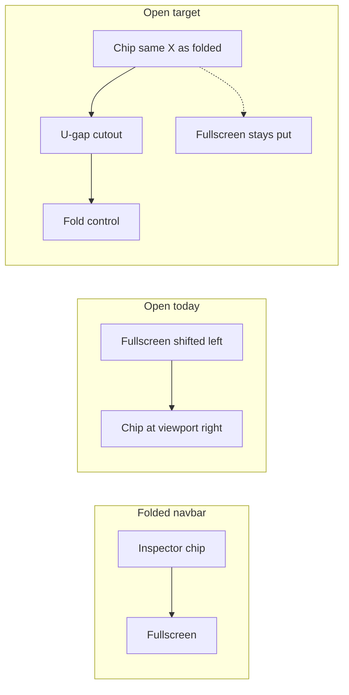

# Fix Panel Toggle Chip Jump Over Fullscreen

## Problem

Folded inspector chips live in the navbar as `PanelChromeTabBar` **immediately before** the trailing fullscreen toggle:

```8305:8307:🧰️framework/🛍️product/💻️os/🔨️module/📺️renderer/🧑️‍🎨️engine/⚛️react/⚡️implementation/🟦️typescript/📦️index.tsx
{ key: "topLeftPanelTabs", content: <PanelChromeTabBar anchor="top-left" ... /> },
navbarFillItem("navbarTrailingFill"),
{ key: "topRightPanelTabs", content: <PanelChromeTabBar anchor="top-right" ... /> },
```

```15049:15052:🧰️framework/🔨️module/🖱️ui/⚛️react/⚡️implementation/🟦️typescript/📦️index.tsx
{showFullscreenToggle ? (
  <div key="fullscreenToggle" data-slot="navbar-fullscreen-toggle" className="... ms-auto">
    <NavbarFullscreenToggle />
```

On open, two things break “unfold in place”:

1. `[PanelChromeTabBar](🧰️framework/🔨️module/🖱️ui/⚛️react/⚡️implementation/🟦️typescript/📦️index.tsx)` returns `null` when `visible` — navbar chip width disappears and fullscreen shifts left.
2. Open `[Panel](🧰️framework/🔨️module/🖱️ui/⚛️react/⚡️implementation/🟦️typescript/📦️index.tsx)` rehosts chips on `WindowChrome` at `right: var(--spacing-single)`. With `dir="rtl"` for top-right, chips dock on the **outer** edge and land on/past the fullscreen control.

Vertical jump was already addressed by `[chromeHostedOpenPanelPositionStyle](🧰️framework/🔨️module/🖱️ui/⚛️react/⚡️implementation/🟦️typescript/📦️index.tsx)`; horizontal trailing conflict with fullscreen was not.




## Approach

Keep navbar order `[top-right chips][fullscreen]` (fullscreen stays trailing). Make open state preserve chip X and fullscreen X, with panel body still corner-anchored.

### 1. Width-stable navbar placeholder while open

In `PanelChromeTabBar` (same file ~8833):

- When `visible`, do **not** return `null`.
- Measure folded bar width (`useLayoutEffect` + ref) and render a non-interactive placeholder (`aria-hidden`, no tab buttons) with that width under the same `data-slot="panel-chrome-tab-bar"` / `data-anchor`.
- Result: fullscreen no longer slides when the real chips move onto the panel.

### 2. Trailing-end reserve on open right chrome caps

Introduce a shared reserve token for the navbar end control footprint, e.g.

`calc(var(--size-medium) + var(--spacing-single))`

(matching the fullscreen `h-medium` slot + navbar `gap-single`).

Apply it only for chrome-hosted **right** anchors when open:

- Keep panel root at the corner via existing `chromeHostedOpenPanelPositionStyle` (`right: var(--spacing-single)` + vertical shell pull-in) so the **body still grows from the corner**.
- On the open `WindowChrome` cap row, add logical `padding-inline-start` equal to that reserve (under `dir="rtl"` this pads the physical right). Chips stay left of fullscreen; U-gap + fold control remain toward the canvas; fullscreen sits in the clear cut zone.

Wire this via `data-panel-chrome-hosted` + anchor (already on `Panel`) or an explicit prop/class on `WindowChrome` — prefer data attributes + existing styling tokens in `[🎨️ui.css](🧰️framework/🔨️module/🖱️ui/🎨️styling/⚡️implementation/🟦️typescript/🎨️ui.css)` / component classes in the React index, consistent with other chrome metrics.

Mirror the same reserve for `bottom-right` if it uses chrome hosting (footer has no fullscreen today; still keep horizontal chip stability if a trailing footer control appears later, or apply only when the shell actually has an end control — default: right anchors that share the navbar trailing group, i.e. `top-right`).

### 3. Tests (extend existing vitest in the same `📦️index.tsx`)

- `PanelChromeTabBar` with `visible`: still occupies a placeholder node / non-zero layout slot (not absent).
- Open chrome-hosted `top-right` panel: cap has trailing-end reserve (class/attr/style assertion).
- Extend `chromeHostedOpenPanelPositionStyle` coverage only if the helper gains a horizontal component; if reserve stays on the cap, assert on rendered markup instead.
- Keep existing “fullscreen toggle on trailing navbar edge” test green.

### 4. Ticket workflow (on execute)

Repo MCP auth was skipped in planning — authenticate, read `repo://goals`, then open/reopen a ticket (likely under `🎯️r2602`) such as **Fix Panel Toggle Chip Jump Over Fullscreen**. Put any probes/logs in the ticket folder. Close with summary + touched files when done.

## Primary files

- `[🧰️framework/🔨️module/🖱️ui/⚛️react/⚡️implementation/🟦️typescript/📦️index.tsx](🧰️framework/🔨️module/🖱️ui/⚛️react/⚡️implementation/🟦️typescript/📦️index.tsx)` — `PanelChromeTabBar`, open `Panel`/`WindowChrome` wiring, tests
- `[🧰️framework/🔨️module/🖱️ui/🎨️styling/⚡️implementation/🟦️typescript/🎨️ui.css](🧰️framework/🔨️module/🖱️ui/🎨️styling/⚡️implementation/🟦️typescript/🎨️ui.css)` — only if the reserve is expressed as a shared CSS rule/token

No OS renderer navbar reorder unless runtime proves the reserve token must be owned by `Navbar` (prefer UI-local fix).