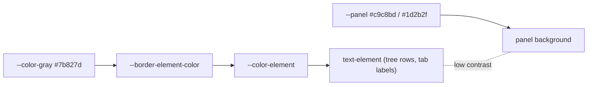

## Root cause

`text-element` (used by tree rows, tree section headers, and panel/side-panel tab labels at rest) resolves through `--color-element` → `--border-element-color` → `--color-gray` (`#7b827d`) for every level. Against the panel surface (`--panel` = `#c9c8bd` light / `#1d2b2f` dark) the contrast is too low, so labels only become readable on hover (which swaps to `text-emphasized`).

The level mechanism currently has per-level families for background (`--base` … `--temporary`) and hover (`--hover-base` … `--hover-temporary`), but no element-text family. The clean fix is to add that missing family and wire it through the existing `data-level` attribute scoping.



## Changes

### 1. `[ui/styling/js/ui.css](ui/styling/js/ui.css)` — add per-level element token family (light `:root`, ~lines 53-101)
- Add a complete family mirroring the existing `--hover-*` family:
  - `--element-base`, `--element-canvas`, `--element-window`, `--element-overlay`, `--element-temporary` = `var(--color-gray)` (unchanged from today).
  - `--element-panel` = a darker, readable gray, e.g. `var(--color-dark-5-9)` (`#666e6b`).
- Repoint the default at line 79: `--border-element-color: var(--element-base);` (still resolves to `--color-gray`, so no global change).

### 2. `.dark` block (~lines 601-652)
- Override the family for dark mode: keep `--element-base/canvas/window/overlay/temporary` = `var(--color-gray)`, and set `--element-panel` to a lighter, readable gray, e.g. `var(--color-gray-600)` (`#a2a59d`). (`--border-element-color` is not redefined in `.dark`, so it keeps inheriting via the per-level rules below.)

### 3. `ui.css` — add per-level scoping rules (new small region after the `@theme inline` block, ~line 866)
- For each level, remap the element color from the family:

```css
[data-level="base"] { --border-element-color: var(--element-base); }
[data-level="canvas"] { --border-element-color: var(--element-canvas); }
[data-level="window"] { --border-element-color: var(--element-window); }
[data-level="panel"] { --border-element-color: var(--element-panel); }
[data-level="overlay"] { --border-element-color: var(--element-overlay); }
[data-level="temporary"] { --border-element-color: var(--element-temporary); }
```

Because every non-panel `--element-*` equals `--color-gray`, navbar (window), canvas, window-options, footer, and overlay controls render identically to today. Only `panel` shifts. These top-level selectors do not conflict with the existing `[data-slot="navbar"] [data-level="panel"]` hover rules (those are descendant-scoped and only set hover `background-color`/`color`).

### 4. `[ui/react/index.tsx](ui/react/index.tsx)` — emit `data-level` on the panel root (`PanelGhostRoot`, ~line 3441)
- `PanelGhostRoot` is rendered only by `Panel`, `SidePanel`, and `MobilePanel`, each already wrapped in `<LevelProvider level="panel">`. Make it read the level and stamp the attribute so the CSS scoping above reaches all descendants (tree items, section headers, tab labels):

```tsx
function PanelGhostRoot({ children, className, style, ...props }: PanelGhostRootProps) {
  const level = useLevel();
  return (
    <GhostRegionShell clickThroughWhenGhost data-level={level} className={className} style={style} {...props}>
      {children}
    </GhostRegionShell>
  );
}
```

`GhostRegionShell` already spreads `{...props}` onto its `<div>`, so `data-level` forwards to the DOM. `useLevel()` is safe to call here (declaration hoisted; only invoked at render).

## Why this is clean and scoped
- Adds the missing element-foreground tier to the existing level token system rather than a one-off panel override — same naming/shape as `--hover-*`.
- Text color stays fully token-driven; no component class changes to tree/tab styling are needed because they already use `text-element`.
- Hover/active behavior is untouched (`--border-normal-color`, `--hover-interactive-fill`, `text-emphasized`, `panelTabActiveClass` all unchanged).
- Non-panel levels resolve to the same `--color-gray` as today, guaranteeing navbar, canvas, window, window-options, and overlay are visually unaffected.

## Process
- Open/reopen a repo MCP ticket (associate with the most appropriate goal from `repo://goals`) before editing; keep any temp notes inside the ticket folder; close it with a summary when done.
- Verify at runtime in both light and dark themes that side-panel tree items, section headers, and tab labels are readable at rest, and confirm navbar/canvas/window-options are pixel-unchanged.

## Open choice (tunable during implementation)
- Exact panel rest shades: light `--color-dark-5-9` (`#666e6b`) and dark `--color-gray-600` (`#a2a59d`) are proposed defaults; can be nudged to neighboring palette steps if more/less contrast is wanted.
</plan>
<todos>
<todo>
<id>ticket</id>
<content>Open/reopen repo MCP ticket and associate with the best goal from repo://goals</content>
</todo>
<todo>
<id>tokens-light</id>
<content>Add --element-* family to :root in ui.css and repoint --border-element-color to var(--element-base)</content>
</todo>
<todo>
<id>tokens-dark</id>
<content>Add dark-mode --element-* overrides in .dark block (panel = lighter readable gray)</content>
</todo>
<todo>
<id>level-scoping</id>
<content>Add [data-level="..."] element-color remap rules after the @theme inline block</content>
</todo>
<todo>
<id>panel-data-level</id>
<content>Make PanelGhostRoot read useLevel() and emit data-level so panels scope the token</content>
</todo>
<todo>
<id>verify</id>
<content>Run UI and confirm panel labels readable at rest in light+dark; navbar/canvas/window-options unchanged; close ticket</content>
</todo>
</todos>
</invoke>
