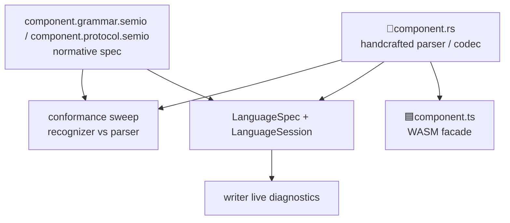

> Paths in this repo are emoji-prefixed. Emoji below are part of real file paths, not decoration.

# Handcrafted Grammar and Protocol for Every Artifact Facet

## Current state

One generic text grammar and one generic binary codec serve all 52 artifacts:

- Text: [dsl_core](🧰️framework/🛍️products/💻️os/🔨️modules/🗣️dsl/🫀️core/⚡️implementations/🦀️rust/📦️lib.rs) (fixed token alphabet + lexer) → [dsl_schema](🧰️framework/🛍️products/💻️os/🔨️modules/🗣️dsl/🧬️schema/⚡️implementations/🦀️rust/📦️lib.rs) (`RecordSpec`-driven parse/print) → [dsl_derive](🧰️framework/🛍️products/💻️os/🔨️modules/🗣️dsl/✨️derive/⚡️implementations/🦀️rust/📦️lib.rs) emits `store::DocumentDsl` and `protocol::OpText`. Result: `.dag`, `.fem3d`, `.layout` are the same key=value language; graph edges print as SoA tables.
- Binary: [pack](🧰️framework/🛍️products/💻️os/🔨️modules/🎒️pack) (`.spk` documents) and [protocol](🧰️framework/🛍️products/💻️os/🔨️modules/📡️protocol) (`OpBinary`, `.spr` op-log) — hand-rolled varint/tag encoders with no spec file of any kind.
- Prior art, still open: ticket [26/08/03/HANDCRAFTED-GRAMMAR-FOR-EVERY-ARTIFACT](.🦑️repo/🎫️tickets/🎆️26/🌙️08/☀️03/HANDCRAFTED-GRAMMAR-FOR-EVERY-ARTIFACT/🎫️ticket.json) already built the text-side engine: `dsl_notation`, self-hosted `dsl_grammar` + 6 `.grammar` files, 4 family kits, 131 passing tests. **Reopen this ticket; do not open a new one.**

## Locked decisions

- `component.ts` is a thin TypeScript facade over the Rust WASM parser/codec. Rust stays the single source of truth.
- `.protocol.semio` is a new declarative binary-format spec language, normative and verified against the Rust codec by a conformance sweep. Encoders stay handcrafted Rust.
- One `.semio` spec language with two dialects. Rename all existing `.grammar` files to `<name>.grammar.semio`; add `<name>.protocol.semio`. One shared header and lexer, one crate parses both.
- All five constitutional facets get a spec file, plus per-app config and CAD's interaction-spec.
- **Arrow syntax is the fused form you specified**: `a <- b`, `a -e1- b`, `a -c:Connection> b`. The 08/03 session shipped a bracketed workaround (`a -[e1:Connection]-> b`) because `-` is `is_ident_continue` in `dsl_core`. That workaround is reverted: P1 adds a real `TokenKind::EdgeArrow` and deletes `Arrow`/`DashArrow`.

## Target layout

```
✏️s/🔌️plugins/<plugin>/🗿️artifacts/<artifact>/
  🗣️dsl/   🦀️component.rs  🟦️component.ts  📖️component.grammar.semio
  🔧️op/   🦀️component.rs  🟦️component.ts  📖️component.grammar.semio
  🔺️diff/ 🦀️component.rs  🟦️component.ts  📖️component.grammar.semio
  🎒️pack/ 🦀️component.rs  🟦️component.ts  📡️component.protocol.semio
  📡️spr/  🦀️component.rs  🟦️component.ts  📡️component.protocol.semio
  ⚙️engine/ (no spec file)
```

Scale: 52 artifacts x 5 facets = 260 spec files + 260 TS facades, plus 34 app `🎚️config` grammars and 1 CAD interaction-spec. ~295 spec files total.



## Mechanism changes

### M1. Taxonomy vocabulary (unblocks everything)

[🔣️taxonomy.json](🧰️framework/🛍️products/🦑️repo/🔨️modules/📚️lib/⚡️implementations/🟦️typescript/🔣️taxonomy.json) currently permits only a language leaf file inside a facet dir (`_treePurityComment`, Shape V2). Adding `.semio` files and a TS leaf requires:

- New key `artifactSpecFilenames` mapping each facet to its spec filename and dialect: `🗣️dsl`/`🔧️op`/`🔺️diff` → `📖️component.grammar.semio`; `🎒️pack`/`📡️spr` → `📡️component.protocol.semio`.
- Fix `ecosystems.🟦️typescript.leafFilename` from `🟦️component.tsx` to `🟦️component.ts`; keep `.tsx` only on `targets.⚛️react`. This is already the de-facto convention (12 of 13 existing TS leaves in `✏️s/🔌️plugins` are `.ts`) and today's value is a latent inconsistency.
- Extend `validateTaxonomy` / `validateTaxonomyTree` in [🟦️discovery.ts](🧰️framework/🛍️products/🦑️repo/🔨️modules/📚️lib/⚡️implementations/🟦️typescript/🟦️discovery.ts) and [registry 📜️script.ts](🧰️framework/🛍️products/💻️os/🔨️modules/🔌️plugin/⚡️implementations/🟦️typescript/📇️registry/📜️script.ts) so a facet is complete only with all three files.
- Extend `policyTaxonomyDirsBreaches` in [📜️script.ts](📜️script.ts) to accept the new filenames.

### M2. `.semio` spec language, grammar dialect

Rename `dsl_grammar` file extension and move the 6 existing files:

- [📖️grammar.grammar](🧰️framework/🛍️products/💻️os/🔨️modules/🗣️dsl/📖️grammar/📖️grammar.grammar) → `📖️grammar.grammar.semio` (self-hosting; the meta-grammar describes both dialects).
- The 4 family fragments under `🗣️dsl/👪️family/*/` and [📖️math.grammar](🧰️framework/🔨️modules/📚️compiler/📖️syntax/📖️math.grammar) get the new extension.
- Add a `dialect` header directive (`grammar` | `protocol`) so one parser handles both.

### M3. `.protocol.semio` dialect and binary conformance (new)

Design a declarative binary-format language over the primitives the codecs actually use: `pack_core` LEB128 varints, tags, segment kinds, `OpBinary`'s `format u8 | ordinal varint | record body`, `.spr` framing and hash chain. New productions: `record`, `field id type`, `varint`, `tag`, `segment`, `framing`, `chain`. Verification is a byte-level recognizer: for every fixture, decode the bytes the Rust codec produced by walking the `.protocol.semio` spec and assert structural agreement. This is the binary analogue of the existing text `Recognizer`.

### M4. TypeScript facade mechanism

Only 3 of 32 plugins have a TS package today ([flow](✏️s/🔌️plugins/🌊️flow/📦️packages/🟦️typescript), cad, animate). Each plugin needs `📦️packages/🟦️typescript` with `package.json`, `📋️project.json`, `📜️script.ts`, `📦️index.ts` barrel re-exporting every facet's `🟦️component.ts`. Each facade exposes `parse`/`print` or `encode`/`decode` bound to the plugin's WASM export — no parsing logic in TS. A conformance test per facet asserts the TS facade and Rust agree on the same fixture.

### M5. Language registry and shared LSP host

Complete section A5/A6 of the absorbed architecture: collapse the `🔖️Idiom` registry in the [dsl facade](🧰️framework/🛍️products/💻️os/🔨️modules/🗣️dsl/⚡️implementations/🦀️rust/📦️lib.rs) into `🔖️Language` (`LanguageSpec` with `role`, `grammar`, `grammar_path`, `hooks`). `LanguageSpec::derived` auto-services unconverted facets so nothing goes dark mid-migration. Add `dsl_lsp` (LSP 3.17 JSON-RPC, spec-compliant `semanticTokens` `{data:[]}`) plus in-process `LanguageSession`. Aggregate via a new `s_language_bundle` under `✏️s/🔨️modules/🗣️lang/` — framework must not depend on plugins. Delete the dead [Jack LSP](✏️s/🔌️plugins/🔱️trinity/🔨️modules/🔌️jack/🧠️lsp/📦️packages/🦀️rust/📦️lib.rs), folding its behavior into Jack's `LanguageSpec`.

### M6. Writer integration

[Writer's main window](✏️s/🔌️plugins/✒️writer/🎛️apps/✒️writer/🎭️modes/✏️edit/🪟️windows/✒️main/🦀️component.rs) currently forks on `language_id == "jack"` and calls `trinity::core` directly, with regex tokenizers in [the engine](✏️s/🔌️plugins/✒️writer/🗿️artifacts/✒️writer/⚙️engine/🦀️component.rs). Replace every fork with `LanguageSession` calls onto the existing `TextEditorScene` JSON plumbing (kept — it is the law-preserving renderer boundary). Drop the `trinity_jack` dependency. Add `WriterCommand::OpenDocument{uri,text}` resolving extension to language via the registry. Replace the static `#[dsl(lang = "jack")]` on `WriterProjection.text` with `#[dsl(lang_from = "language_id")]`.

### M7. Enforcement (the forcing function)

[📜️script.ts](📜️script.ts) already has the exact mechanism at line 2846: `policyGrammarFileBreaches` reads a deliberately-empty `POLICY_GRAMMAR_FILE_ALLOWLIST` (line 2059), alongside `POLICY_DIFF_COMPLETENESS_ALLOWLIST` and `POLICY_PACK_COMPLETENESS_ALLOWLIST`. Repurpose it: its doc comment says grammars are *generated* by `dsl_grammar::from_record_spec` (design ruling B-R2) — rewrite for handcrafted specs, seed the allowlist with all ~295 missing spec files, and let each fan-out wave shrink it. Add sibling `POLICY_PROTOCOL_FILE_ALLOWLIST` and `POLICY_TS_FACADE_ALLOWLIST`. Program is done when all three are empty.

## Execution: parallel agent workforce

Engine phases are single-writer and serialized. Fan-out waves run disjoint per-plugin globs with an ownership file per wave.

- **P0 Bootstrap** (2 agents, serial): reopen ticket 26/08/03 via repo MCP (configured in [.mcp.json](.mcp.json) as `bun ./📜️script.ts dev mcp stdio client`; not currently connected). Write contracts into the ticket folder: grammar-file contract, protocol-file contract, notation style guide, TS facade contract, LSP hook contract, verification checklist. Collision map from open tickets + `git status --porcelain` per plugin.
- **P1 Engine** (1 deep writer + 1 adversarial reviewer, serialized, **engine frozen after gate**): M1 taxonomy; `TokenKind::EdgeArrow` fused arrow + `WireValue` successor + pack wire codec in one atomic landing with one format bump; M2 `.semio` rename and dialect header; M3 protocol dialect + binary recognizer; M5 registry unification. Gate: `cargo check --workspace` green, engine tests green, contracts v2 filed.
- **P2 Families, LSP, TS scaffold** (4-5 agents parallel): 3 remaining family kits (scene, embed, geo); `dsl_lsp` + `LanguageSession` + `s_language_bundle`; M4 TS package scaffold for 29 plugins; M6 writer refactor. Gate: writer opens a fixture with live diagnostics, evidenced by `[DEBUG]` runtime logs.
- **P3 Pilots** (3 + 1 verifier): `fem2d` and `note` retrofitted to the full 5-facet checklist (spec + rs + ts + fixtures + LSP + writer-opens + laws), plus one graph artifact (`dag`) proving the fused arrow syntax end to end. File family exemplars A-H.
- **W4a-W4e Fan-out** (6 workers + 2 reviewers + 1 gate per wave): graph/wiring · text/knowledge (norm's 17 artifacts get 1 family-core agent + 2 vocabulary agents, no duplication) · geometry/media · engineering/spatial · hot-and-deferred last (procedural, flow, block, puzzle, vcs, cad) so concurrent tickets settle. Re-run the collision scan at each wave start.
- **P5 Flag day** (<=5): coverage matrix over (artifact x facet x {spec, rs, ts, LSP, writer}); delete `dsl_derive`'s `DocumentDsl`/`OpText` emission and `dsl::__rt` text functions; all three allowlists empty.
- **P6/P7 Sweeps and end to end** (2-3): full conformance sweep in every mode; `test exhaustive` at 95% LCOV; OS dev boot smoke across ~20 WASM plugins; writer opens >=6 document kinds live with logs and screenshots into the ticket folder; `ticket_close`.

**Ownership protocol**: disjoint per-plugin globs in `wave-N-ownership.txt`. Root [📜️script.ts](📜️script.ts), [Cargo.toml](Cargo.toml), [package.json](package.json) and [.vscode/launch.json](.vscode/launch.json) are orchestrator-only between waves. Engine paths (`🗣️dsl/**`, `🎒️pack/**`, `🏪️store/**`, `📡️protocol/**`) hold a single-writer token, frozen after P1, with an `engine-requests.txt` queue drained by one serialized hotfix agent between waves. No git mutations, no worktrees, agents never close the shared ticket.

## Verification

Six laws per facet, run by [fixture-sweep](🧰️framework/🛍️products/💻️os/🔨️modules/🗣️dsl/🧪️fixture-sweep/⚡️implementations/🦀️rust/📦️lib.rs): text round-trip, canonicalize idempotence, pack-equals-dsl, opText-equals-opBinary, grammar conformance (recognizer accepts exactly what the parser accepts, every production covered by fixtures), and new protocol conformance (spec-walk decodes the codec's bytes). Plus TS-equals-Rust facade agreement. Per wave: adversarial re-run of all laws by a second agent, never trusting conversion claims.

## Risks

- Fused arrow token touches the shared lexer used by ~100 grammars — contained entirely in P1's single-writer session with the wire-format bump.
- `Shape::Wire` has 9 consumers, several historically hot (flow, procedural, cad). Must land atomically; W4e is scheduled last for exactly this.
- The `.protocol.semio` dialect is genuinely new with no prior art in-repo; P1 must prove it on `pack` and `spr` for one artifact before any fan-out.
- Two pre-existing unrelated breakages are already recorded in the ticket's `progress.md` (imperative-text `OperatorInfo.module`; ui_wgpu emoji char literals) and will surface in any full `verify` — do not attribute them to this program.
- Path shape drifted since the absorbed architecture doc was written (`🔨️module` → `🔨️modules`, `⚡️implementation` → `⚡️implementations`, artifacts moved into the `🗿️artifacts` taxonomy). Every path in that doc must be re-resolved, not copied.