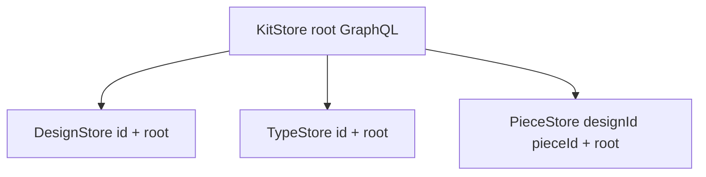

# Implement per-entity stores (`semio/js`)

## Current state

- [`semio/js/index.ts`](c:\git\semio\semio\js\index.ts): [`KitStore`](c:\git\semio\semio\js\index.ts) (~lines 466–1100+) already implements worker/wasm transport, `submitShell` / `submitShellJson`, `read()`, `patchEntityField` / `addChild` / `removeChild`, design mutations (`clusterPieces`, `dragPieces`, …), VCS, backbone, and `openKit` (re-export of `KitStore.open`).
- Lines **3540–3597** (`#region EntityStoreStubs`): [`DesignStore`](c:\git\semio\semio\js\index.ts), [`TypeStore`](c:\git\semio\semio\js\index.ts), [`PieceStore`](c:\git\semio\semio\js\index.ts), [`ConnectionStore`](c:\git\semio\semio\js\index.ts), [`FamilyStore`](c:\git\semio\semio\js\index.ts), [`FileStore`](c:\git\semio\semio\js\index.ts), [`FolderStore`](c:\git\semio\semio\js\index.ts), [`KitEntityStore`](c:\git\semio\semio\js\index.ts) are **empty constructors** with `unknown` fields — re-exported from [`semio/react/index.tsx`](c:\git\semio\semio\react\index.tsx) but unusable.
- [`semio/rs/lib.rs`](c:\git\semio\semio\rs\lib.rs) `KitEvent` (externally tagged JSON) carries entity ids (`Design { design_id }`, `Type { type_id }`, nested design events, etc.) — suitable for **client-side filtering** without a new rs field.

## Target (aligned with [strict layering plan](c:\git\semio.cursor\plans\strict_semio_layering_refactor_205dc73c.plan.md) §3.1)

- Each store: `readonly root: KitStore`, `readonly id: string`, and for pieces/connections `readonly designId: string`.
- **Readers**: one GraphQL read per logical read (reuse existing `KitStore` / `read()` batch building already used by `getDesigns`, `getPieces`, etc.); **no second authoritative cache** — optional **stale-while-revalidate** slot for React `getSnapshot` only (last resolved value + version bump on filtered events), documented as non-authoritative.
- **Mutators**: delegate to existing `KitStore` methods (`clusterPieces`, `patchEntityField`, …) until every call site has a semantic `ChangeKitCommand` shell; return type can stay `SetResult` initially or add a thin `receiptFromSetResult` mapping to [`KitCommandReceipt`](c:\git\semio\semio\js\index.ts) for API parity with the written plan.
- **`subscribe`**: `root.subscribe` wrapped with a predicate `kitEventTouchesStore(ev: KitEvent): boolean` that understands serde JSON tags (`Design`, `Type`, `Piece`, `Connection`, `ChildAdded`, `Changed`, …) and the entity’s ids; always forward `semioKitCommand` lifecycle events if the store initiated a mutation (optional: correlate by `requestId` if you pass it through).

## Implementation steps (all in existing [`semio/js/index.ts`](c:\git\semio\semio\js\index.ts) regions per repo rules)

1. **`KitStore` surface**
   - Add handle factories: `design(id)`, `type(id)`, `piece(designId, id)`, `connection(designId, id)`, `family(id)`, `file(id)`, `folder(id)` returning new store instances (sync, no I/O).
   - Add list helpers where needed: `designs()` / `types()` — async: use existing reads (`readKitDesignsMetadataCommand` / shallow / metadata patterns already in `getDesigns` / `getTypes`) and map ids to `DesignStore` / `TypeStore` instances.

2. **`DesignStore` (first full implementation)**
   - Methods from plan §3.1: `metadata()`, `shallow()`, `full()`, `pieces()`, `piece(id)`, `connections()`, `connection(id)`, `setName`, cluster/drag/move/fix/flatten/paste/create\*, each calling the corresponding `KitStore` method with `this.id`.
   - `subscribe(handler)`: filter root events as above.

3. **`TypeStore`**
   - Reads via existing type read commands; mutations via `patchEntityField` / `addChild` / `removeChild` where no dedicated method exists; `subscribe` on `type_id` / nested port/connector/representation events.

4. **`PieceStore` / `ConnectionStore`**
   - Constructor `(root, designId, id)`; mutations (`setPlane`, `deleteConnection`, etc.) delegate to `KitStore`; reads use `readKitDesignCommands` with the right nested command (already partially present in the file for design-scoped reads).

5. **`FamilyStore`, `FileStore`, `FolderStore`, `KitEntityStore`**
   - Same pattern: minimal read + `patchEntityField` / child ops + filtered subscribe. Expand surface only where [`semio/react`](c:\git\semio\semio\react\index.tsx) or sketchpad imports symbols (grep before deleting stubs).

6. **Event filter helper**
   - One internal module region (e.g. `#region KitEventEntityFilter`) with exhaustive-ish matching on keys present in JSON from [`KitEvent`](c:\git\semio\semio\rs\lib.rs) (~15586); unit-test with fixture objects (no wasm) in the **existing** embedded vitest block at the bottom of `index.ts`.

7. **Embedded tests** (same file, `#region EmbeddedTests`)
   - Replace reliance on `patchEntityField` / `getTypes` in the smoke test with `openKit` → `ks.type("type-1").setName(...)` or `ks.designs()` / `design().setName` once implemented.
   - Add tests: `design.subscribe` fires on `patchEntityField` affecting that design; `piece` scoped subscribe.

8. **Repo process (when executing, not in plan-only mode)**
   - Per [AGENTS.md](c:\git\semio\AGENTS.md): `repo` MCP `search`, read `repo://goals`, `ticket_open` for e.g. `refactor-js-per-entity-stores`, work only under `.repo/🎫/...` for scratch, `ticket_close` with file list.

## Explicitly later (do not block “stores implemented” on this)

- **Remove** `#region InternalReadWire` / `mapReadCommand` wholesale (plan §3.1) — only after all store methods call rs-canonical shapes directly.
- **`semio/react`**: `useDesignStore` / `useSyncExternalStore` thin hooks ([plan §4](c:\git\semio.cursor\plans\strict_semio_layering_refactor_205dc73c.plan.md)) — depends on stable store API; [`useKitStore`](c:\git\semio\semio\react\index.tsx) still returns `KitHostStore` today.
- **Migrate** [`patchEntityField`](c:\git\semio\semio\react\index.tsx) call sites to typed store methods incrementally.

## Risks / notes

- **Return types**: `submitShell` returns `SetResult`; plan text mentions `KitCommandReceipt` — pick one public contract for store mutators and document; mapping from receipt `requestId` is available when `ok`.
- **AGENTS.md** ([`semio/js/AGENTS.md`](c:\git\semio\semio\js\AGENTS.md)) says root exports only `KitStore`, `openKit`, and needed types — entity store classes **are** part of the public API once real; update that sentence if it currently forbids exporting them.
