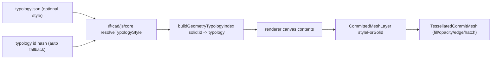

# Per-Kind Object Styling

## Goal

Each object `typology` renders differently, and the primitives of an object inherit the typology's style. The same face geometry must look different as an `ReinforcedConcreteExternalWall` vs `OneWayReinforcedConcreteSlab`. Default styling is auto-derived (deterministic per typology id) so every kind already differs; explicit per-typology overrides add rich encodings (color + edge + opacity + pattern/hatch).

## Architecture

## 1. Schema: add optional `style` to typology

In [cad/schema/json/typology.json](cad/schema/json/typology.json), add an optional `style` object (kept optional so auto-fallback covers everything):

- `color`, `edgeColor` (hex strings)
- `opacity` (0..1)
- `pattern`: `{ kind: "none"|"hatch"|"crosshatch"|"dots", direction (deg), spacing, lineWidth, color }`

## 2. Core: parse + deterministic resolve

In [cad/js/core/index.ts](cad/js/core/index.ts), in the typology region (around `TypologySpec` / `parseTypology` near lines 1976-2057), add a new `// #region 🎨TypologyStyle`:

- Extend `TypologySpec` with `readonly style?: TypologyStyleSpec`; parse it in `parseTypology`.
- Add `export function resolveTypologyStyle(typology: string): ResolvedTypologyStyle`:
  - Auto fallback: derive a stable hue from a hash of the typology id (golden-angle spacing) -> deterministic distinct color; default `opacity`, `edgeColor` derived from the fill, `pattern: none`.
  - Merge authored `style` over the auto defaults.
  - Memoize (mirroring existing typology catalog caches; cleared alongside `typologyOwnerByIdCache`).
- Keep colors computed (HSL->hex helper), not scattered hex literals, consistent with the no-ad-hoc-hex convention.

## 3. Renderer: apply style to committed meshes and primitives

In [cad/js/renderer/index.tsx](cad/js/renderer/index.tsx):

- Add `typologyStyleToMaterialProps(style)` -> `{ color, emissive, opacity }` and a hatch factory that builds a procedural pattern (hatch/crosshatch/dots oriented by `direction`) via `meshStandardMaterial.onBeforeCompile` using world position + face normal (no UVs required), cached by a style key. Patterns fall back cleanly to flat fill when `kind === "none"`.
- `TessellatedCommitMesh` (line ~2641): accept optional `style`; replace the hardcoded `data.color ?? spatialSceneColors().committed` material (lines ~2695-2708) with style-driven fill/opacity/pattern; `CommittedEdgeOverlay` (line ~2614) uses `style.edgeColor`.
- `CommittedMeshLayer` / `ChunkedCommitMeshRow` (lines ~2716-2763): accept a `styleForSolid(solid)` resolver and pass per-row style.
- Canvas contents host (the `<CommittedMeshLayer ... />` at line ~3214): build `solid -> typology` from `buildGeometryTypologyIndex(model, activeModelDefinitionId)` (already maps `solid:<id>` -> typology, line ~1051/1056) and resolve via `resolveTypologyStyle`, memoized on model/modelDefinition revision.
- Result: faces use the typology fill+pattern, edges use the typology edge color, so all primitives of an object inherit the kind's styling.

## 4. Authored overrides for the example kinds

Add explicit `style` to demonstrate rich, distinct rendering (auto-fallback still covers all others):

- [cad/asset/modelDefinition/aec.building.structure.classic/typology/OneWayReinforcedConcreteSlab/typology.json](cad/asset/modelDefinition/aec.building.structure.classic/typology/OneWayReinforcedConcreteSlab/typology.json): directional `hatch` (the "one-way" direction).
- [cad/asset/modelDefinition/aec.building.structure.classic/typology/ReinforcedConcreteExternalWall/typology.json](cad/asset/modelDefinition/aec.building.structure.classic/typology/ReinforcedConcreteExternalWall/typology.json): distinct fill + `crosshatch`.
- A couple of energy typologies (e.g. `ExternalWall`, `Roof`) for visible contrast across views.

## 5. Tests

Extend existing embedded test sections (no new files, per repo rules):

- Core: `resolveTypologyStyle` determinism (same id -> same color, different ids -> different), and authored override merge.
- Renderer: `solid -> typology -> style` mapping, `typologyStyleToMaterialProps`, and stable hatch-texture cache key.

## Notes / assumptions

- "Object kind" == object `typology`; relevant typologies already exist as assets.
- Patterns use procedural shader injection on top of the existing THREE usage in the renderer (THREE is already used directly there).
- The repo MCP (ticket workflow) is not available in this environment, so no ticket will be opened/closed; I'll edit existing files in place using regions as the repo conventions require.

