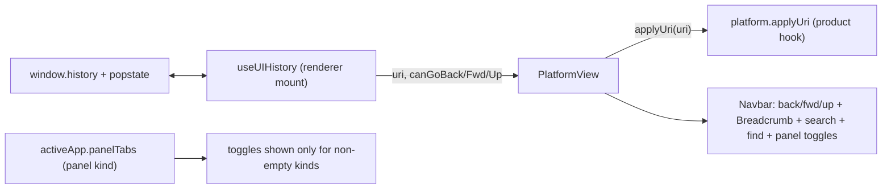

# Platform Navigation Mechanism

## Goal

Every platform product gets a uniform navigation + panel chrome:

- Navigation (URL-synced via browser History API): backward, forward, upward, breadcrumb, search (Ctrl+P, outside apps), find (Ctrl+F, inside apps).
- Six fixed panel slots, each a navbar toggle shown only when the active app registered ≥1 tab for it:
  - Left: `windows`, `overview`, `workbench`
  - Right: `details`, `settings`, `chat`

Then implement/wire it in sketchpad.

## Ticket workflow (first + last step)

Per repo rules: read `repo://goals`, then `ticket_open` a new ticket (e.g. `Platform Navigation And Panel Mechanism`) under the most fitting goal; keep any temp files inside the ticket folder; `ticket_close` with summary + touched files at the end. The unrelated `CAD-TRANSFORM-TOOL-GUMBALL` ticket is untouched.

## 1. Core panel-kind model — `framework/core/index.ts`

- Add a `PanelKind` type + groupings in the `🔖SideTab` region:
  - `export type PanelKind = "windows" | "overview" | "workbench" | "details" | "settings" | "chat";`
  - `LEFT_PANEL_KINDS = ["windows","overview","workbench"]`, `RIGHT_PANEL_KINDS = ["details","settings","chat"]`, plus a `panelSide(kind)` helper.
- Extend `SideTabSpec` (line 279) with required `readonly panel: PanelKind;`.
- Replace the binary `leftTabs`/`rightTabs` with a single panel-keyed array on `BaseAppRuntime` (572-573), `BaseModeRuntime` (645-646), and `ResolvedState` (610-611, 629-630): rename to `panelTabs: SideTabSpec[]`. Update `mergeMode` (619-630) to merge `panelTabs` by id.

## 2. Platform core — `framework/product/platform/core/index.ts`

- Mirror the rename in platform `AppRuntime`/`ModeRuntime`, `mergeMode` (546-558), `AppDefinition`/`ModeDefinition` (689-690, 1004-1005), and the plugin-host app builder (933-934): `panelTabs` instead of `leftTabs`/`rightTabs`.

## 3. Platform React renderer — `framework/product/platform/renderer/react/index.tsx`

Panel slots driven by registered tabs:

- Replace `AppPanelKind`/`APP_*_TAB_ID` (2310-2314) with the core `PanelKind`; rename `options` → `settings` (ids, `createDefaultAppOptionsTabs` → settings, `Settings2` icon stays).
- Rewrite `withDefaultAppPanelTabs` (2417-2430) to group `activeApp.panelTabs` by `panel` via `sideTabsToPanelTabs`, returning `Record<PanelKind, SidePanelTabConfig[]>` with empty arrays for unused kinds. Remove the always-on default fallback panels (`AppSummaryPanel`, default details/options/chat) since toggles now appear only when tabs exist.
- In `PlatformView` (2693+): add `activeDesktopLeftPanelKind` state (mirror of `activeDesktopRightPanelKind`, 2757) so multiple left kinds can switch; compute `leftSidePanelTabs`/`rightSidePanelTabs` from the active kind.
- Build the `panelToggles` navbar item (2947-2968) dynamically: for each `PanelKind` with non-empty tabs, emit a toggle (`ui.panelToggle.<kind>`); left kinds drive `leftSidePanel` + active-left-kind, right kinds drive `rightSidePanel` + active-right-kind. Skip kinds with no tabs.

Breadcrumb:

- Replace the raw-URI navbar item (2931-2935) with `<Breadcrumb items=...>` from `@semio-tech/ui-react` (already exported, `ui/react/index.tsx` 18838). Build items by splitting `uri` into cumulative-path segments, each `onNavigate(href) => onNavigate(href)`. Add optional `platform.breadcrumb?(uri): BreadcrumbItemData[]` override hook so products supply friendly labels.

General URL-sync (the "general mechanism"):

- Add a `platform.applyUri?: (uri: string) => void` field in core `Platform` (alongside `onNavigate`, 728-735): the product's URI→state reducer.
- Add an internal `PlatformViewHistory` wrapper (new component near `useUIHistory`, 1364) that: seeds `useUIHistory` from `window.location`, on mount + on every `navigate/goBack/goForward/goUp` calls `platform.applyUri(uri)` + `history.pushState`, adds a single `popstate` listener, and passes `uri/onNavigate/canGoBack/onGoBack/...` into `PlatformView`.
- Change `ReactUI.mount` (3194-3203) / `mountPlatform` to render the history wrapper, so every product gets URL-synced nav for free.

Extend the existing `🧪Tests` regions (no new test files): toggles hidden when a kind has no tabs; breadcrumb segments render + navigate; `settings` id replaces `options`; history wrapper applies uri on popstate.

## 4. Playground product — `framework/product/playground/core/core.ts`

- Update `buildPlaygroundWorkbenchApp` (616-617) to set `app.panelTabs = [{...panel:"workbench"}, {...panel:"details"}]` instead of `leftTabs`/`rightTabs` (keeps playground compiling after the core rename).

## 5. Sketchpad — `compose/client/lib/sketchpad/js/index.ts`

- Convert the six apps' `leftTabs`/`rightTabs` (1701-1736) to `panelTabs` with explicit `panel` kinds (`workbench`, `details`; add `windows`/`settings`/`chat` where appropriate, e.g. a `windows` tab listing the app's window kinds, a `settings` tab).
- Delete `wireSketchpadBrowserNavigation` (1794-1807) and its `onNavigate`/`popstate`; instead set `platform.applyUri = (uri) => applySketchpadUri(platform, uri)` so the shared history mechanism owns pushState/popstate. Keep `applySketchpadUri` (sets `activeAppId` + dispatches `setNavigation`).
- Optionally implement `platform.breadcrumb` to map kit/design/type UUID routes to friendly names via the shell controller's route selection.
- Drop the manual initial `applySketchpadUri` call (1829-1834); the wrapper applies the initial location.

## Verification

- `nx`/bun typecheck + run framework + sketchpad vitest suites (extend existing test regions, do not add files).
- Run sketchpad dev and confirm at runtime (console `[DEBUG]` logs if needed): URL changes on nav, back/forward/up + breadcrumb work, popstate works, panel toggles appear only for registered kinds, `settings` panel renders.
- Remove `[DEBUG]` logs before `ticket_close`.

## Out of scope / assumptions

- "windows"/"overview" have no built-in special content; they are fixed slots filled by app-registered tabs (per your clarification). Sketchpad will register at least `windows`.
- `options` is renamed to `settings` everywhere (ids, toggles, default tab).
- Svelte renderer stubs untouched (React is the only implementation).
