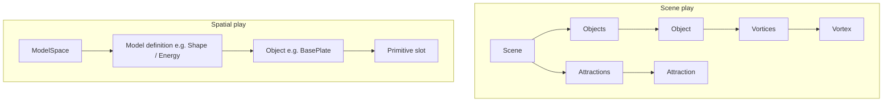
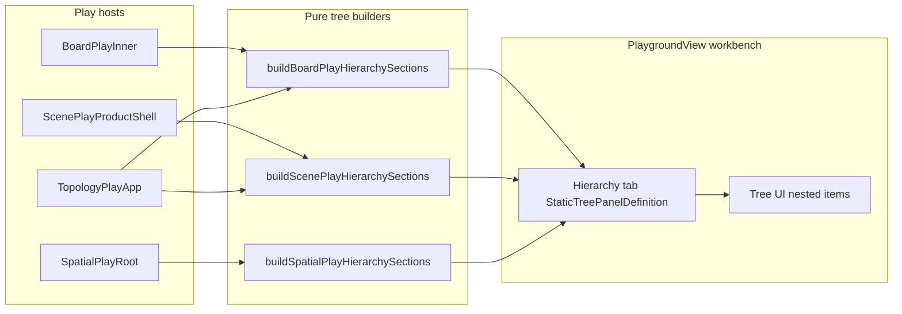

# Play Hierarchy Tabs on Left Workbench

## Goal

Every play host under `@elements/playground` gets a **left workbench tab** (icon: `ListTree`) labeled **Hierarchy**, showing a navigable composition tree. Clicking a leaf syncs canvas selection (same as existing inspectors). Right **details** panels stay as-is (inspector/setting/status).

## Current state

| Play                                                           | Left workbench today  | Composition source (unused for UI trees)                                               |
| -------------------------------------------------------------- | --------------------- | -------------------------------------------------------------------------------------- |
| [board/index.tsx](elements/lib/board/index.tsx)                | Library only          | `BoardFixtureV1` nodes/handles/edges; graph via `computeBoardGraphObservationSnapshot` |
| [scene/index.tsx](elements/lib/react/scene/index.tsx)          | None (left panel off) | `FixtureV1` + `SceneAttractionTree` (3D ownership only)                                |
| [topology/index.tsx](elements/lib/react/topology/index.tsx)    | None                  | `TopologyPlaySnapshot.boardFixture` + `sceneFixture`                                   |
| [spatial play/main.tsx](spatial/js/renderer-r3f/play/main.tsx) | None                  | `ModelSpace.models` + `objectPrimitiveEntries`                                         |

UI infrastructure already supports **nested** trees via `TreeDataItem.items` ([core/index.tsx](elements/lib/react/core/index.tsx) ~16365) and playground tabs via `PureSidePanelTabDefinition` + `StaticTreePanelDefinition` ([playground/react/index.tsx](elements/lib/playground/react/index.tsx)).

## Target tree shapes (per your examples)

**Scene** — flat objects under `Objects` (not attraction-nested; matches your sketch). Each object expands to `Vortices` → vortex leaves. `Attractions` is a sibling group with one item per `fixture.attractions[]`.

**Spatial** — one branch per linked model in `ModelSpace` (use `listModelDefinitionManifests()` label when available, else id). Under each model: objects from `listModelObjectsForModelDefinition` (or `Object.values(model.objects)` filtered by typology scope). Under each object: one leaf per `objectPrimitiveEntries` row (`slot: kind id`). No full solid→shell→face expansion in v1 (your `<Primitive>` level only).

**Board** — root `Board` → `Nodes` (recursive from `node.root` + directed edges `source.node → target.node`, same reachability as `computeBoardGraphObservationSnapshot`) → per node `Handles` → handles; sibling groups `Edges`, `Wires` listing fixture edges/wires.

**Topology** — root manifest label → `Board` (reuse board builder on `boardFixture`) + `Scene` (reuse scene builder on `sceneFixture`); board/scene clicks dispatch existing `setBoardSelection` / `setSceneSelection` commands.

## Architecture

### Shared conventions (each play file, not cross-tech packages)

- Tab id: `{play}-hierarchy` (e.g. `scene-play-hierarchy`)
- `order: 0` on hierarchy tab; bump existing left tabs (board Library → `order: 1`)
- `initialPanelVisibility.leftSidePanel: true` for scene, topology, spatial (board already true)
- Builders return `TreeDataSection[]` with one section `Hierarchy` and a single expanded root item
- Leaves set `isSelected` from current selection; `onClick` updates selection via existing shell APIs
- Export builders from play modules where topology needs reuse (`board/play`, `scene/play`); spatial builder stays in [spatial/js/renderer-r3f/play/main.tsx](spatial/js/renderer-r3f/play/main.tsx)

### Spatial bridge (only host without shell context today)

Wrap [SpatialPlayRoot](spatial/js/renderer-r3f/play/main.tsx) with a small `SpatialPlayChromeContext` (state: `modelsByDefinitionId`, `activeModelDefinitionId`, `selectionInScope`, setters). `PlayApp` publishes on change; hierarchy tab in `SpatialPlayRoot` consumes it. Selection clicks call `replWithRendererSelectionTargets` and `setActiveModelDefinitionId` when picking an entity from another model definition.

## Files to change

| File                                                                                                     | Change                                                                                                                           |
| -------------------------------------------------------------------------------------------------------- | -------------------------------------------------------------------------------------------------------------------------------- |
| [elements/lib/react/scene/index.tsx](elements/lib/react/scene/index.tsx)                                 | `buildScenePlayHierarchySections`, `ScenePlayHierarchyPanelDefinition`, add to `augmentPanelTabs.workbench`, enable left panel   |
| [elements/lib/react/scene/play/index.ts](elements/lib/react/scene/play/index.ts)                         | Vitest: hierarchy shape for sample fixture (objects → vortices, attractions group)                                               |
| [elements/lib/board/index.tsx](elements/lib/board/index.tsx)                                             | `buildBoardPlayHierarchySections` (+ helper to build node subtree from fixture edges), panel + workbench tab                     |
| [elements/lib/board/play/index.ts](elements/lib/board/play/index.ts)                                     | Vitest: root/child node nesting                                                                                                  |
| [elements/lib/react/topology/index.tsx](elements/lib/react/topology/index.tsx)                           | Hierarchy tab composing board + scene builders; workbench + left panel on                                                        |
| [elements/lib/react/topology/play/index.ts](elements/lib/react/topology/play/index.ts)                   | Vitest: paired tree has Board + Scene roots                                                                                      |
| [spatial/js/renderer-r3f/play/main.tsx](spatial/js/renderer-r3f/play/main.tsx)                           | `SpatialPlayChromeContext`, `buildSpatialPlayHierarchySections`, `SpatialPlayHierarchyPanelDefinition`, update `SpatialPlayRoot` |
| [spatial/js/renderer-r3f/play/index.ts](spatial/js/renderer-r3f/play/index.ts)                           | Vitest: model space → object → primitive items                                                                                   |
| [elements/lib/board/play/e2e/board-play-gpu.spec.ts](elements/lib/board/play/e2e/board-play-gpu.spec.ts) | Assert `#scene-play-hierarchy` / `#board-play-hierarchy` tab visible when workbench open (extend existing spec pattern)          |

Optional tiny helper in [playground/react/index.tsx](elements/lib/playground/react/index.tsx): `playHierarchyTabId(playSlug)` — only if it reduces duplication; otherwise keep ids local per play.

## Selection wiring (by play)

- **Scene**: `setSelection({ objectIds, vortexIds, attractionIds })` — vortex leaves use full ids (`objectId:vortexId`); clear other kinds on click
- **Board**: `setSelectionIds([id])` for node/handle/edge/wire
- **Topology**: `controller.commandBus.dispatch(TOPOLOGY_PLAY_CONTROLLER_ID, "setBoardSelection" | "setSceneSelection", …)`
- **Spatial**: `setActiveModelDefinitionId` + `setRendererSelectionByModel(replWithRendererSelectionTargets(..., [{ kind, id }]))`

## Tests and validation

- Add/extend **vitest** in existing `import.meta.vitest` blocks (no new spec files)
- Run targeted tests: `bun nx test @elements/scene`, `@elements/board`, `@elements/topology`, `@spatial/js-renderer-r3f` (or project script equivalents)
- Manual: launch each play from `launch.json`, open workbench, expand Hierarchy, click object/vortex/node/primitive and confirm viewport selection matches

## Ticket workflow (implementation phase)

- Read `repo://goals`, open ticket e.g. **Play Hierarchy Workbench Tab**
- Close ticket with touched files when done

## Out of scope (v1)

- Drag-reorder in hierarchy
- Attraction-based nesting of scene objects (can add later under `Objects`)
- Full B-rep expansion under spatial primitives
- Moving spatial `PlayModelSpacePanel` out of `InteractionRepl` aside (hierarchy is additive)
- `@compose/play` sketchpad (different product; user asked playgrounds in elements/spatial)

