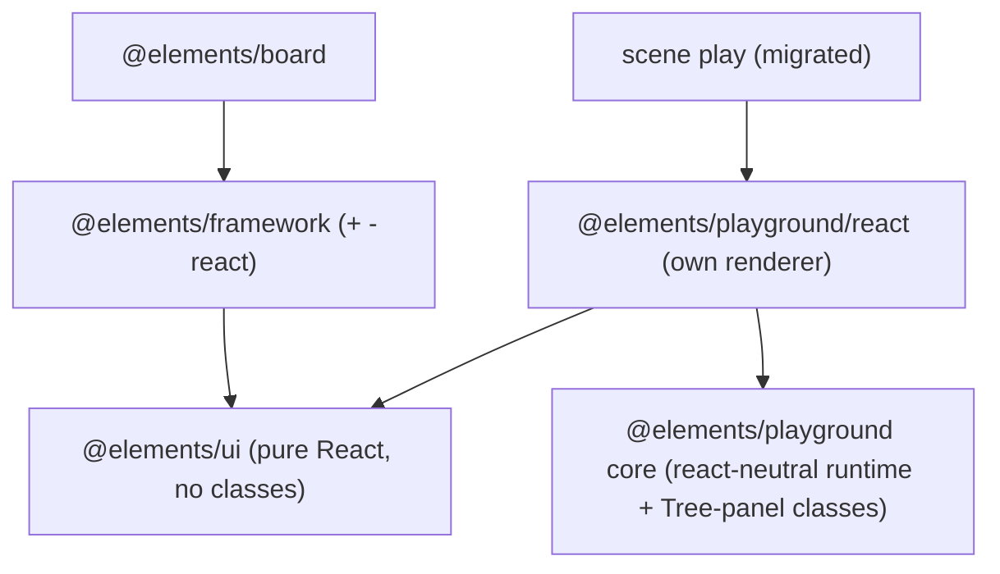

# Playground Miniframework

## Goal

`@elements/playground` becomes a standalone miniframework for playgrounds: it owns its runtime core (no `@elements/framework` dependency) and its own React renderer (depends only on `@elements/ui`). Every panel tab is forced to be a `Tree` with sections + items through declarative classes. Elements scene play is migrated onto it, which removes the always-shown "same JSON snippet" details tab. `@elements/board` is decoupled from playground and stays purely on `@elements/framework(-react)`.

## Target architecture

Key rule confirmed with user: `@elements/ui` stays 100% pure React (no classes); `@elements/framework` and `@elements/playground` are the react-neutral abstraction layers. Playground gets its OWN copies of what it needs (no shared code with framework), its OWN renderer, and board drops its playground import.

## Phase 1 - Playground owns its runtime core

In [elements/lib/playground/index.ts](elements/lib/playground/index.ts), stop importing from `@elements/framework`. Add a react-neutral core (new region(s) in the same file, or a sibling `core` module under the package) duplicating only the subset playgrounds need from [elements/lib/framework/core/index.ts](elements/lib/framework/core/index.ts):

- `CommandBus`, `Controller`
- `ProductRuntime`, `AppRuntime`, `ModeRuntime`, `WindowKindRuntime`
- layout helpers `createDefaultLayout` / `createWindowLayout` and `WindowLayout` type
- window + side-panel body registries: `registerWindowBody` / `getWindowBodyFactory`, `registerSidePanelBody` / `getSidePanelBodyFactory`
- `buildScene3dWindowBody` and the `UiNode` union (scene3d/table/board/stack/text host-surface nodes used by playgrounds)
- the `ToolItem`, `WindowBodyViewContext`, `SidePanelBodyViewContext` types
- Update [elements/lib/playground/package.json](elements/lib/playground/package.json): remove the `@elements/framework` dependency.

## Phase 2 - Playground owns its React renderer + Tree enforcement

Add a renderer module to the playground package (e.g. `elements/lib/playground/react/index.tsx`) exposing `PlaygroundView`, `mountPlaygroundApp`, `useApp`, a side-panel body registry, and surface-host registration (scene3d/table), reusing pure-React primitives from `@elements/ui` (`Layout`, `SidePanel`, `Tree`, `Window`, `Navbar`, `Footer`, `TreeDataSection`/`TreeDataItem`). It must NOT import `@elements/framework` or `@elements/framework-react`.

- Provide the declarative classes `PureSidePanelTabDefinition` (abstract `resolveTab()`) and `StaticTreePanelDefinition` (wraps a `{ sections: TreeDataSection[] }`) - the same shape the board already references - living in the playground (react-neutral). Every side-panel tab is resolved to a `Tree` of sections + items; there is NO content-only/JSON fallback.
- Port the minimal canvas + `registerUiScene3DSurfaceHost`/`registerUiTableSurfaceHost` machinery the playground needs (currently in framework-react `UICanvas`); reuse `@elements/ui` where the primitive is already pure-React.
- Update package `exports` in [elements/lib/playground/package.json](elements/lib/playground/package.json) to expose both core (`.`) and renderer (`./react`); add `@elements/ui` + react deps.

## Phase 3 - Migrate elements scene play onto the playground

- [elements/lib/react/scene/play/index.ts](elements/lib/react/scene/play/index.ts): retarget `ScenePlayShellController` and `buildScenePlayAppRuntime` to the playground core (its `Controller`/`PlaygroundController`, `AppRuntime`, registries) instead of `@elements/framework`.
- [elements/lib/react/scene/index.tsx](elements/lib/react/scene/index.tsx): render via the playground renderer `PlaygroundView` instead of `@elements/framework-react`'s `ProductView`; register the scene3d surface host through the playground renderer.
- Replace the ad-hoc inspector/settings panels (`ScenePlayInspectorPanel`, `ScenePlaySettingsPanel`, `ScenePlayInspectorObjects/Vortices/Attractions`, lines ~4886-5318) with declarative `PureSidePanelTabDefinition` subclasses whose `tree` is `StaticTreePanelDefinition({ sections })`. Sections + items: one section per selected-kind group (Objects / Vortices / Attractions) with one tree item per selected entity (expandable to its editable fields), plus "Objects in scene" / "Attractions in scene" list sections, and a Settings tab section.
- This removes the always-on JSON snippet: the playground renderer has no `createDefaultAppDetailsTabs`/`AppPanelStatePreview` default (the source of the repeated `{"selection":{},"hover":{}}` in [elements/lib/framework/renderer/react/index.tsx](elements/lib/framework/renderer/react/index.tsx) lines 2072-2128, 2165).
- Keep `@elements/ui` scene components pure React (the user wants no classes in the react layer); convert the remaining `React.Component` classes in scene play (`PlaySurfaceFooter`, `PlaySceneCanvas*`, lines ~5435-5510) to function components as part of the migration.

## Phase 4 - Decouple board from playground

- [elements/lib/board/play/index.ts](elements/lib/board/play/index.ts): drop `import { registerPlaygroundSidePanelBodies } from "@elements/playground"` and call framework's own `registerSidePanelBody` directly in `registerBoardPlayDeclarativeBodies` (it already imports `registerSidePanelBody` from `@elements/framework`).
- [elements/lib/board/package.json](elements/lib/board/package.json): remove the `@elements/playground` dependency.
- Remove the `@elements/playground` aliases from [elements/lib/board/vitest.config.ts](elements/lib/board/vitest.config.ts) and [elements/lib/board/play/vitest.config.ts](elements/lib/board/play/vitest.config.ts).

## Validation

- Run playground, scene, and board vitest suites (extend existing `index.ts` test regions; no new test files): assert playground core has no `@elements/framework` import, scene play resolves to a Tree-only details panel (no JSON section), and board still registers its bodies without `@elements/playground`.
- Manually confirm at runtime (console logs with `[DEBUG]` prefix) that selecting an object in scene play renders a sections+items tree and that the repeated JSON snippet tab is gone.
- Follow repo ticket flow (open a ticket via repo MCP, structure new code with regions, close with summary).

## Out of scope / follow-up

- Board's own undefined `PureSidePanelTabDefinition`/`StaticTreePanelDefinition` references (currently in [elements/lib/board/index.tsx](elements/lib/board/index.tsx) lines 8516-8553) are a pre-existing framework-side gap; converting board's panels to the framework's tree mechanism is a separate effort unless you want it folded in.

