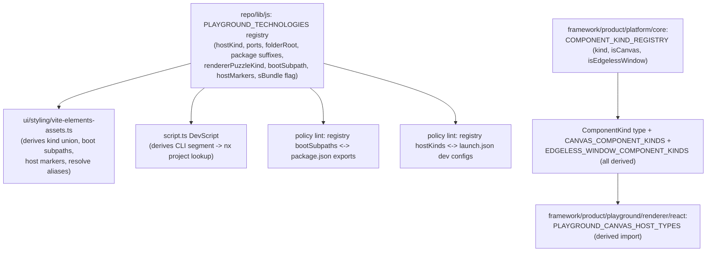

# Playground Technology Registry — Single Source of Truth

## Problem (confirmed by codebase audit)

There is no canonical registry of "all playground/technology kinds." At least 8 places independently hardcode overlapping (and inconsistently named — `puzzle2d` vs `puzzle-2d` vs `2d` vs `puzzle.2d`) lists:

1. `[ui/styling/vite-elements-assets.ts](ui/styling/vite-elements-assets.ts)` — `PlaygroundRendererPuzzleKind` (22-value union), `PLAYGROUND_RENDERER_PUZZLE_BOOT_SUBPATHS` (22), `PLAYGROUND_RENDERER_PUZZLE_HOST_MARKERS` (22), `S_PLAYGROUND_HOST_MARKERS` (16), and `playgroundRendererResolveAliases()` (~73 hand-written `{find, replacement}` pairs). This is the worst offender the user pointed at — a _styling_ package has no business owning per-technology Vite alias/tree-shaking knowledge.
2. `[repo/lib/js/index.ts](repo/lib/js/index.ts)` (lines 1001-1066) — `PlaygroundHostKind` (27) + `PLAYGROUND_PORTS` — already the closest thing to a real registry, and already imported by (1).
3. `[framework/product/platform/core/index.ts](framework/product/platform/core/index.ts)` (lines 307-311) — `ComponentKind` union (26) plus two hand-duplicated filtered arrays `CANVAS_COMPONENT_KINDS` (25) / `EDGELESS_WINDOW_COMPONENT_KINDS` (17) that must be kept in sync by hand.
4. `[framework/product/playground/renderer/react/index.tsx](framework/product/playground/renderer/react/index.tsx)` — `PLAYGROUND_CANVAS_HOST_TYPES` (19), a hand copy of (3)'s canvas kinds.
5. `[framework/product/playground/renderer/react/package.json](framework/product/playground/renderer/react/package.json)` — 25 `exports` subpaths, one per technology, must stay in lockstep with (1)'s boot-subpath map.
6. `[script.ts](script.ts)` `DevScript.run` (lines 222-321) — ~18 hardcoded `if (segments[0] === "...")` branches mapping CLI segment → nx project name, duplicating (2)'s kind list under yet another naming scheme.
7. `s/core` + `s/play` technology registry — **already being generalized by the open ticket "S Technology Extension Loading" (in progress, phase 1/8)** — explicitly out of scope here to avoid file conflicts; this plan's registry is designed so that ticket's per-technology extension modules could later read from it.
8. `launch.json`, root `package.json` (`workspaces`/`scripts`), `Cargo.toml` `[workspace] members` — legitimately human-curated per `AGENTS.md` ("devs use `launch.json`... register following existing order/grouping/naming"). Not auto-generated (too risky to regenerate blind), but verified by a new policy lint (item below) so they can't silently drift from the registry.

Two layers must **stay separate** (they run in different runtimes — Node build tooling vs. browser bundle) but each gets de-duplicated internally, with a lint bridging them:

- **Build/tooling layer** (Node, fs access): `repo/lib/js`, `ui/styling`, `script.ts`.
- **Runtime UI layer** (bundled to the browser): `framework/product/platform/core`, `framework/product/playground/renderer/react`.

## Target mechanism

## Phase 1 — Extend the canonical build/tooling registry (`repo/lib/js`)

In `[repo/lib/js/index.ts](repo/lib/js/index.ts)`, within the existing `//#region 🔌PlaygroundDevPorts` region:

- Replace the flat `PLAYGROUND_PORTS: Record<PlaygroundHostKind, PlaygroundPortSpec>` with a richer `PLAYGROUND_TECHNOLOGIES: Record<PlaygroundHostKind, PlaygroundTechnologySpec>` where `PlaygroundTechnologySpec` extends today's `{dev, test?, env}` with:
  - `folderRoot`: repo-relative folder (e.g. `"puzzle/2d"`, `"trinity/jack"`)
  - `packages?`: which of `play|react|core|rs|lsp` sub-packages exist and their npm scope slug (defaults to `hostKind` when regular; explicit override for irregulars like `gis-2d`→`map`, `s` naming)
  - `rendererPuzzleKind?`: matching `PlaygroundRendererPuzzleKind` value, or `undefined` for hosts with no renderer boot entry (`storybook`, `compose`, `projektetage`)
  - `rendererBootSubpath?`: e.g. `"puzzle/2d"`
  - `rendererHostMarker?`: `{start, end}` region-marker pair
  - `includedInSBundle?`: boolean (today's `S_PLAYGROUND_HOST_MARKERS` membership)
  - `devSegments?`: CLI segment path used by `script.ts` (e.g. `["trinity", "jack"]`), `nxProject`: nx target name
- Keep all existing exported helpers (`playgroundDevPort`, `playgroundTestPort`, `playgroundPortEnv`, `allPlaygroundReservedPorts`, `PLAYGROUND_SITE_HOSTS`, etc.) working unchanged off the richer map — zero churn for their current callers.
- Add `playgroundTechnologyResolveAliases(repoRoot): {find, replacement}[]` — a convention-driven generator that loops `PLAYGROUND_TECHNOLOGIES` entries and each declared package suffix, producing `@semio-tech/<slug>-<suffix>` → `<folderRoot>/<suffix>/index.ts(x)`, with a small explicit exception list for irregular packages (`kernel-3d-js`→`brep/js`, `compose-*`, `mit-bestand-*`) that aren't per-technology playground packages and stay hand-written.
- Add `playgroundRendererPuzzleKinds()`, `playgroundRendererBootSubpaths()`, `playgroundRendererHostMarkers()`, `sPlaygroundHostMarkers()` accessor functions derived from the map (these replace the standalone consts currently duplicated in `ui/styling`).
- Extend `[repo/lib/js/index.test.ts](repo/lib/js/index.test.ts)` with regression assertions that the derived values equal today's hardcoded values (captured before the refactor) so no behavior silently changes.

## Phase 2 — Migrate `ui/styling/vite-elements-assets.ts` to derive, not own

- Delete `PlaygroundRendererPuzzleKind` (re-export the type from `repo/lib/js` instead), `PLAYGROUND_RENDERER_PUZZLE_BOOT_SUBPATHS`, `PLAYGROUND_RENDERER_PUZZLE_HOST_MARKERS`, `S_PLAYGROUND_HOST_MARKERS`.
- `playgroundRendererShellEntryPlugin`, `stripPlaygroundRendererForPuzzleKind`, `stripPlaygroundRendererForS` keep their string-slicing logic (that's legitimately Vite-mechanism) but source their kind→marker/subpath data from the Phase 1 accessor functions.
- Rewrite `playgroundRendererResolveAliases()` to call `playgroundTechnologyResolveAliases(repoRoot)` for the ~55 per-technology entries, keeping only the genuinely non-technology entries (`ui-react`, `ui-asset`, `infinite-*`, `kernel-*`, `compose-*`, `mit-bestand-*`) hand-written as today.
- Keep all existing `import.meta.vitest` tests in this file passing unchanged (they assert on behavior, not on the removed constants directly — verify each one).

## Phase 3 — De-duplicate the runtime `ComponentKind` vocabulary (`framework/product/platform/core`)

In `[framework/product/platform/core/index.ts](framework/product/platform/core/index.ts)`:

- Replace the 3 hand-kept-in-sync literals (lines 307-311) with one `COMPONENT_KIND_REGISTRY = [{kind: "table", canvas: true, edgelessWindow: false}, ...] as const` array; derive `type ComponentKind = typeof COMPONENT_KIND_REGISTRY[number]["kind"]`, `CANVAS_COMPONENT_KINDS`, and `EDGELESS_WINDOW_COMPONENT_KINDS` by filtering it.
- This is runtime browser code — it must **not** import from `repo/lib/js` (Node/fs). It stays a self-contained, de-duplicated registry at this layer.

## Phase 4 — Derive the playground renderer's canvas host set

In `[framework/product/playground/renderer/react/index.tsx](framework/product/playground/renderer/react/index.tsx)`:

- Replace the hand-written `PLAYGROUND_CANVAS_HOST_TYPES` Set with one derived from `CANVAS_COMPONENT_KINDS` imported from `@framework/platform/core` (a real, already-available dependency — no new coupling).

## Phase 5 — Simplify `script.ts`'s dev router

In `[script.ts](script.ts)` `DevScript.run` (lines 222-321):

- Replace the ~18 duplicated `if (segments[0] === "...")` branches with a lookup against `PLAYGROUND_TECHNOLOGIES`' new `devSegments`/`nxProject` fields (single loop + fallback to today's storybook/mcp/default special cases, which aren't technology dev servers and stay as explicit branches).

## Phase 6 — Enforce with policy lints (the repo's existing mechanism)

Using the existing `defineLint`/`BreachRecord`/policy-runner infra (`[repo/lib/js/index.ts:614-751](repo/lib/js/index.ts)`, pattern shown in `[repo/script.ts](repo/script.ts)`, `[ui/react/script.ts](ui/react/script.ts)`):

- Add a policy (likely `FileLinter` with `policyFile` pinned at `repo/lib/js/index.ts`, or a `BundleLinter` on `framework/product/playground/renderer/react`) that parses `PLAYGROUND_TECHNOLOGIES` entries with a `rendererBootSubpath` and cross-checks every one has a matching `exports` entry in `framework/product/playground/renderer/react/package.json`, flagging both missing and orphaned entries as breaches.
- Add a policy that cross-checks every `PLAYGROUND_TECHNOLOGIES` entry has a corresponding dev configuration in `.vscode/launch.json` (parsed as JSONC), flagging drift without auto-regenerating the human-curated file (preserves the required manual order/grouping).
- These turn "hardcoded and silently drifting" into "hardcoded once, verified everywhere" for the two places (npm `exports`, `launch.json`) that genuinely can't be derived at runtime.

## Phase 7 — Tests

- `repo/lib/js/index.test.ts`: registry completeness assertions (every `PlaygroundHostKind` with a `rendererPuzzleKind` has a `rendererBootSubpath` + `rendererHostMarker`; alias generator output matches a golden snapshot of today's 73 aliases).
- `ui/styling/vite-elements-assets.ts` `import.meta.vitest` block: re-run existing assertions against the now-derived values.
- `framework/product/platform/core` test file: assert `ComponentKind` union values are exactly the registry's `kind`s, and the two derived arrays match today's values.
- `framework/product/playground/renderer/react` test file: assert `PLAYGROUND_CANVAS_HOST_TYPES` matches `CANVAS_COMPONENT_KINDS`.
- New policy lint scripts get exercised via `bun nx run <bundle>:policy` (or however the existing `runPolicyScript` targets are invoked) to confirm the launch.json/exports checks pass today (as a baseline) and correctly flag an intentionally-broken case during development.

## Explicitly out of scope

- Renaming to unify the differing kind-naming schemes (`puzzle2d`/`puzzle-2d`/`2d`/`puzzle.2d`) across layers — each serves a different, defensible convention (TS union vs. env-var-style vs. dotted S program namespace); forcing one spelling everywhere is a much larger, higher-risk rename with low incremental value over the mapping-based deduplication above.
- `s/core` / `s/play` technology registry — actively being reworked by the separate, in-progress "S Technology Extension Loading" ticket; not touched here to avoid conflicting edits on the same files.
- Auto-generating `launch.json`, root `package.json` workspaces/scripts, `Cargo.toml` members — kept human-curated per `AGENTS.md`, backed instead by the new verification lints from Phase 6.

## Process notes

- Per `AGENTS.md`, this work must happen inside a repo-MCP ticket: read `repo://goals`, open (or reuse, if a fitting one already exists) a ticket under the appropriate goal, and close it with a full summary of touched files when done.
- All edits go into existing files using `#region`/`#endregion` structuring per the repo convention; no new files beyond what's structurally unavoidable (none anticipated — every phase above extends an existing file).
