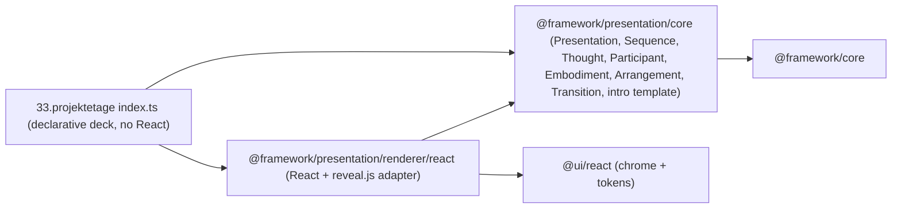

# Presentation Framework + 33.projektetage Migration

## Goal

1. New declarative, render-independent framework product: `@framework/presentation/core` (pure TypeScript, no React/reveal).
2. First renderer: `@framework/presentation/renderer/react` (React + reveal.js as the adapter boundary).
3. Migrate [`mit-bestand/präsentation/33.projektetage`](mit-bestand/präsentation/33.projektetage/index.tsx) so its content is the eg-ice-25 intro (5 slides) expressed declaratively, with **no direct `react`, `react-dom`, `reveal.js`, or `@ui/react`** dependency.

This follows the existing `@framework/playground` pattern: a pure-TS `core` + a `renderer/react`, mirroring [`framework/product/playground`](framework/product/playground/package.json). Reveal.js stays fully isolated inside the renderer's `🔌Adapters` region (core never imports it).

## Architecture

## Domain model (`@framework/presentation/core/index.ts`)

Implements presentation/AGENTS.md verbatim, render-neutral, with inline vitest. Discriminants use `kind` (repo convention), and all definitions get an emoji docstring.

- `Embodiment` = `TextEmbodiment | FigureEmbodiment | BulletEmbodiment | AuthorsEmbodiment | AffiliationsEmbodiment`
  - `TextEmbodiment { kind: "text"; id?; lines: string[]; level: "title"|"heading"|"subheading"|"body"; fit?: boolean }`
  - `FigureEmbodiment { kind: "figure"; id?; src; alt? }`
  - `BulletEmbodiment { kind: "bullet"; id?; items: string[] }`
  - `AuthorsEmbodiment { kind: "authors"; people: { name: string; marks?: string[] }[] }`
  - `AffiliationsEmbodiment { kind: "affiliations"; entries: { mark: string; name: string }[] }`
- `Participant { id; embodiments: Embodiment[] }`
- `ParticipantPlacement { participantId; embodimentId?; emphasis: "active" | "muted" }` (emphasis → opacity layering)
- `Arrangement { id; placements: ParticipantPlacement[] }` (one slide)
- `Transition { kind: "morph" | "fade" }` (default morph = reveal auto-animate)
- `Thought { id; participants: Participant[]; arrangements: Arrangement[]; transition?: Transition }`
- `Sequence { id; thoughts: Thought[] }`
- `Presentation { id; name; sequences: Sequence[]; width?; height? }`
- Resolver helpers: `resolveArrangement(thought, arrangementId)` → ordered `{ participant, embodiment, emphasis }[]`.
- Template `intro(spec)` producing the standard 5-arrangement build (brand active → title.full → description + title.short(muted) → authors → affiliations + authors-with-marks), matching `Semio/Title/Subtitle/Authors/Institutions` in [`temp/eg-ice-25/index.tsx`](temp/eg-ice-25/index.tsx) lines 24-125. `intro` params: `brand`, `title{ full, short }`, `description`, `authors[]`, `affiliations[]`.

## Renderer (`@framework/presentation/renderer/react/index.tsx`)

- `🔌Adapters`: `import Reveal from "reveal.js"`, `reveal.css`, React, `@ui/react` `useElementsSurfaceChrome`.
- Maps the declarative tree to reveal DOM: `Presentation` → `.reveal > .slides`; each `Sequence` → outer horizontal `<section>`; each `Arrangement` → inner vertical `<section data-auto-animate>`; each placement → element with `data-id={participantId}` (drives auto-animate morph, e.g. title full→short) and `opacity-20` when `emphasis==="muted"`. Text levels map to `h1/h2/h4` + `r-fit-text`; authors → flex row with `` marks; affiliations → footnote block.
- Exports `mountPresentation(rootEl, presentation, options?)` and a `<PresentationDeck presentation>` component. Folds in the deck/init/destroy + `syncRevealBackgroundKind` + surface-chrome logic currently inline in [`33.projektetage/index.tsx`](mit-bestand/präsentation/33.projektetage/index.tsx) lines 128-191.
- Ships `globals.css` (the reveal CSS-variable theme overrides currently in [`33.projektetage/globals.css`](mit-bestand/präsentation/33.projektetage/globals.css)), exported as `./globals.css`.
- Inline vitest (jsdom) asserts the rendered DOM has 5 `section` nodes, correct `data-id`s, and muted classes.

## Package scaffolding (mirror playground)

- `framework/product/presentation/package.json`: `{ "name": "@framework/presentation", "private": true, "workspaces": ["core", "renderer/react"] }`.
- `core/`: `package.json` (dep `@framework/core`), `project.json` (test target), `script.ts` (TestScript via shared `runVitest`), `vitest.config.ts`, `index.ts` — copy shapes from [`framework/product/playground/core`](framework/product/playground/core/package.json).
- `renderer/react/`: `package.json` (deps `@framework/presentation/core`, `@framework/core`, `@ui/react`, `react`, `react-dom`, `reveal.js`; devDeps `@types/reveal.js`, `@types/react`, `@types/react-dom`, `typescript`), `project.json`, `script.ts` (with `policy` lint export), `vitest.config.ts` (react() + jsdom + aliases), `index.tsx`, `globals.css` — copy shapes from [`framework/product/playground/renderer/react`](framework/product/playground/renderer/react/package.json).
- Add both package paths to root [`package.json`](package.json) `workspaces` (currently missing `presentation`). Run `bun install` to link.

## 33.projektetage migration

- Rename `index.tsx` → `index.ts` (no JSX/React anymore). Content: build the deck via `intro({...})` with the verbatim eg-ice-25 intro text (semio; "Large-Language-Model-based / Building-Information-Model Alignment / for Automatic-Compliance-Checking"; short "LLM-based BIM Alignment for ACC"; subtitle 3 lines; authors Ueli Saluz/Ildar Baimuratov/Philipp Geyer with marks 1,a/1,b/1,a; affiliations ¹ Leibniz University Hannover, ᵃ Faculty of Architecture, ᵇ Faculty of Computer Science), then `mountPresentation(document.getElementById("root")!, deck)`. Keep inline vitest asserting the deck has 5 arrangements.
- [`package.json`](mit-bestand/präsentation/33.projektetage/package.json): drop `react`, `react-dom`, `reveal.js`, `@types/reveal.js`, `@ui/react`; add `@framework/presentation/core` + `@framework/presentation/renderer/react`. Keep vite/tailwind/vitest + `@vitejs/plugin-react` (vite still compiles the renderer's tsx).
- [`vite.config.ts`](mit-bestand/präsentation/33.projektetage/vite.config.ts): add aliases for `@framework/presentation/core`, `@framework/presentation/renderer/react`, `@framework/core`, keep `@ui/react`.
- [`globals.css`](mit-bestand/präsentation/33.projektetage/globals.css): import `@framework/presentation/renderer/react/globals.css` + keep `@source` lines; remove the now-duplicated reveal overrides (they live in the renderer).
- [`index.html`](mit-bestand/präsentation/33.projektetage/index.html): point `<script src>` to `./index.ts`; update `<title>`.

## Process (repo rules)

- Work inside a repo MCP ticket: read `repo://goals`, then `ticket_open` (reopen if one matches), associate with the best goal, keep any temp files under the ticket folder, and `ticket_close` with summary + file list at the end.
- Validate by running the new tests (`bun nx run @framework/presentation/core:test`, `:renderer/react:test`) and the projektetage dev server (port 6050), confirming the 5-slide auto-animate intro renders.
- Register/verify `launch.json` only if a projektetage entry is missing (dev target already exists).

## Out of scope

- Svelte renderer (placeholder stays).
- The original projektetage playground-embed/components/end slides (replaced per decision).