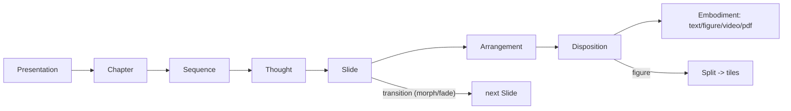

# Presentation Spec Generalization

Make `@semio-tech/framework-presentation` match `[framework/product/presentation/AGENTS.md](framework/product/presentation/AGENTS.md)` and generalize cleanly. (Per repo rules: open a ticket via repo MCP first, read `repo://goals`, do not edit any `AGENTS.md`.)

## Spec vs. code gaps

- No `Slide` type; `[Thought](framework/product/presentation/core/index.ts)` holds `arrangements: Arrangement[]` + one thought-level `transition`.
- `Morph` only exists as `Transition.kind === "morph"`; the spec's "morph-then-switch" ordering is hand-authored in the deck via ghosts/columns.
- `Split` carries non-spec fields (`concealed`, `columns`, `columnGhostsOnly`, `columnMorphTiles`) and `Disposition` carries `morphTargets`/`morphColumnGroups`/`morphSourceTiles`; spec Split = "divides one figure into many independently placed tiles."

## New core model (wrap)

```ts
interface Transition {
 readonly kind: "morph" | "fade";
} // slide -> next slide

interface Arrangement {
 readonly id: string;
 readonly name?: string;
 readonly dispositions: readonly Disposition[];
}

interface Slide {
 readonly arrangement: Arrangement;
 readonly transition?: Transition;
}

interface Thought {
 readonly id: string;
 readonly name?: string;
 readonly participants: readonly Participant[];
 readonly slides: readonly Slide[]; // replaces arrangements + transition
}

interface DispositionSplit {
 readonly tiles: readonly SplitTile[];
} // tiles only
interface FigureEmbodiment {
 kind: "figure";
 id?: string;
 src: string;
 alt?: string;
 crop?: DispositionPosition;
}
```

`SplitTile` stays (`key`, `crop`, `position`, `emphasis?`, `style?`). `splitFigureGrid` stays. Remove `SplitColumnGroup`, `SplitMorphTarget`, `morphTargetId`, `columnMorphId`, `columnMorphTileId`, `splitColumnBounds`, `splitColumnCrop`, and the extra `DispositionSplit`/`Disposition`/`ResolvedDisposition` fields. Keep `Bullet`/`Authors`/`Affiliations` embodiments and `analogy()` (migrate to slides), since those are not the bespoke machinery being removed.

## Generalized Morph (auto-derived bridge)

A morph transition between consecutive slides whose dispositions both move/restyle AND switch embodiment is expanded into an intermediate "bridge" arrangement = the target layout, but participants that switch embodiment keep their SOURCE embodiment at the TARGET position/style.

```
Si (Ea@Pa) --morph--> Bridge (Ea@Pb) --morph--> Si+1 (Eb@Pb)
            position morph first        embodiment switch second
```

New core function `expandThoughtSlides(thought): readonly RenderSlide[]` where `RenderSlide = { id; name?; arrangement; autoAnimateId?; derived?: boolean }`:

- Walks `thought.slides`; for each `morph` transition, compares per-participant resolved embodiment + position/style; inserts a bridge arrangement when a participant changes both.
- Partitions slides into maximal morph-runs (a `fade` transition breaks the run). Each run gets a unique `autoAnimateId` (e.g. `${thought.id}--m${k}`); single-slide runs get none. This scopes reveal.js auto-animate to only morph-linked neighbors so fades stay fades.
- Bridge bookmark name derives from the target slide's name.

`collectPresentationSlides`, `countArrangements`, `presentationSlideAt`, and URL/bookmark helpers iterate `expandThoughtSlides` so indices/bookmarks include bridges. `resolveArrangement` is refactored to resolve a given `Arrangement` against `participants` (so derived bridges resolve too).



## Renderer changes ([renderer/react/index.tsx](framework/product/presentation/renderer/react/index.tsx))

- Iterate `expandThoughtSlides(thought)`; render each `arrangement` as a `<section>`; set `data-auto-animate` + `data-auto-animate-id={autoAnimateId}` only when `autoAnimateId` is set.
- Replace thought-level `arrangementUsesMorph(thought.transition)` logic with the per-slide run logic above.
- Add `crop` support to `FigureMorphView` (reuse `figureTileBackgroundStyle`) so a cropped figure can morph into a label. Keep `FigureTileView` + tile rendering for `split.tiles`.
- Remove `ColumnMorphSlotView`, `SplitColumnMorphGhostView`, `ColumnLabelMorphView`, and column/ghost branches in `FigureSplitMorphView`/`MorphDispositionView`. Update imports/`export {}` lists. Remove dead column-morph CSS from [globals.css](framework/product/presentation/renderer/react/globals.css).

## Re-express the real deck ([33.projektetage/index.ts](mit-bestand/präsentation/33.projektetage/index.ts))

- Move `mediaThought` and intro to the `slides` model (`{ arrangement, transition }`).
- Model the three catalogue columns as participants, each with a cropped `figure` embodiment (`crop` = that column's region of `bauteilbörse.png`) plus a `text` label embodiment. The assembled/explode view uses `split.tiles`; focus -> labels uses the generalized morph (no hand-built ghosts/columns). Aim for visual parity; exact crop/position math during implementation.

## Tests (extend in place, no new files)

- Core `index.ts` tests: `expandThoughtSlides` (bridge insertion, run-id partitioning, fade boundary), updated `intro`/`analogy` shapes, slide counting/bookmarks over expanded slides.
- Renderer tests: per-slide `data-auto-animate-id`, cropped figure rendering, removal of column-morph DOM.
- Deck tests: updated counts/bookmarks and the new column-as-participant morph.
- Run `nx` vitest for core, renderer, and the deck; all must pass. Close the ticket with a summary and touched files.
