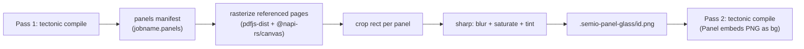

## Concept

Panels are a new, separate concept from the 14 "window" element kinds (Figure/Table/etc. from the closed `PRINT-WINDOW-ELEMENT-TAXONOMY` ticket). Windows wrap document content inline; **Panels are free-floating chrome overlays**, drawn on top of the finished page, matching the UI's `ui-glass-panel` (backdrop-blur + saturate + translucent tint) from [ui/styling/js/ui.css](ui/styling/js/ui.css):

```1438:1442:ui/styling/js/ui.css
@utility ui-glass-panel {
  -webkit-backdrop-filter: blur(var(--glass-panel-blur)) saturate(var(--glass-saturate));
  backdrop-filter: blur(var(--glass-panel-blur)) saturate(var(--glass-saturate));
  background-color: color-mix(in srgb, var(--panel) calc(var(--glass-panel-alpha) * 100%), transparent);
}
```

Since PDF is a static vector/text format, there's no live "backdrop-filter" — we fake it exactly as instructed: render the page once, take an image snippet of what's behind each panel, blur/saturate/tint that snippet with `sharp`, and re-embed it as the panel's background on a second compile pass.

## Two-pass build pipeline



1. **Pass 1** compiles the `.tex` as today. Each `Panel` writes one line per instance to a plain manifest file `\jobname.panels` (id, page, x/y/w/h in PDF bigpoints) and falls back to a flat translucent tier-panel tint (no blur) since no PNG exists yet.
2. **Script step** ([print/script.ts](print/script.ts)): if the manifest is non-empty, rasterize each referenced page with `pdfjs-dist` + `@napi-rs/canvas` (already transitive deps — promote to direct deps of [print/package.json](print/package.json), alongside `sharp`, also already transitive). For each panel: crop the rect (flip y from PDF bottom-left to canvas top-left origin), then with `sharp`: `.blur()` (from `metrics.chrome.glassPanelBlurPx`, scaled to render DPI), `.modulate({ saturation: metrics.chrome.glassSaturate })`, composite a solid tint at `opacities.glassPanelAlpha` using the resolved theme `panel` color. Write to `<template-dir>/.semio-panel-glass/<id>.png`.
3. **Pass 2** recompiles the same source; `Panel` now finds the PNG via `\IfFileExists` and embeds it stretched to the exact rect as the background, with hairline border + content drawn on top. Panel positions are pure page-corner arithmetic (paper size ± anchor offset), so layout is identical between passes — 2 passes is sufficient, no reflow risk.
4. Both light/dark variants get this per `compileLightAndDark`; the manifest + glass dir are build artifacts (gitignored, regenerated every build), so parallel work by others is unaffected.

## LaTeX side — new "Panels" region in `semio-window.sty`

Add `\RequirePackage{eso-pic}` (bundled with Tectonic's TeX Live, no fetch needed) and a `Panel` environment:

```latex
\begin{Panel}[anchor=top-right, x=1cm, y=1cm, width=6cm]
  Floating panel content
\end{Panel}
```

- `anchor` (`top-left|top-right|bottom-left|bottom-right`) + `x`/`y` offset + `width` (`height` optional — auto from content if omitted) resolve to an absolute rect on the physical page via `\paperwidth`/`\paperheight` arithmetic — no aux round-trip needed for positioning.
- Content is captured into a box at `\end{Panel}`; drawn via `\AddToShipoutPictureFG*` (paints after all normal content on that page — true "overlay over the existing page").
- On first use of the environment, open `\jobname.panels` for writing (mirrors `AtBeginDocument` pattern in [semio-core.sty](print/tex/semio-core.sty)); each instance writes `id;page;xpt;ypt;wpt;hpt`.
- Background: `\IfFileExists{.semio-panel-glass/<id>.png}{\includegraphics[...]}{flat tier tint fallback}`; border: hairline `semio-chrome-border-normal` rule; matches existing chrome stroke conventions in [semio-window.sty](print/tex/semio-window.sty).

## Token plumbing

- Add `"panel"` to `CHROME_PAINT_KEYS` in `print/script.ts` so `semio-chrome-light-panel` / `semio-chrome-dark-panel` get emitted into `semio-tokens.sty` from `tokens.themes.*.chrome.panel` (already present in [ui/styling/tokens.json](ui/styling/tokens.json)).
- Alias `semio-chrome-panel` in `\semio_chrome_apply_aliases:` in [semio-core.sty](print/tex/semio-core.sty), same pattern as `semio-chrome-canvas`/`window`.
- The script's glass step reads `opacities.glassPanelAlpha`, `metrics.chrome.glassPanelBlurPx`, `metrics.chrome.glassSaturate` directly from `tokens.json` (no new `.sty` values needed — those three only drive the raster step).

## Build orchestration changes ([print/script.ts](print/script.ts))

- `compilePrintDocument` becomes 2-pass-aware: after pass 1, check for `<jobname>.panels`; if present and non-empty, run the new `renderPanelGlass()` step, then re-run tectonic once more (pass 2). If no manifest / empty, behavior is unchanged (1 pass, current cost for templates without panels).
- New `renderPanelGlass(manifestPath, pdfPath, templateDir, theme)`: parses manifest, loads PDF via `pdfjs-dist`, renders referenced pages via `@napi-rs/canvas`, crops/blurs/tints via `sharp`, writes PNGs to `.semio-panel-glass/`.
- `.gitignore`: add `print/template/**/.semio-panel-glass/` and `print/template/**/*.panels` (and the mit-bestand equivalent path) under the `#--------------------------------------PRINT--------------------------------------` section.

## Demo usage — one `Panel` per template (per your "all examples" answer)

Add a small floating `Panel` (e.g. a short badge/tagline) into each of the 6 template content files, proving the mechanism renders in every template/theme combination exercised by `bun print/script.ts test`:

- [print/template/report/report.content.tex](print/template/report/report.content.tex)
- [print/template/paper/paper.content.tex](print/template/paper/paper.content.tex)
- [print/template/flyer/flyer.content.tex](print/template/flyer/flyer.content.tex)
- [print/template/zukunftbau/forschungsbericht.content.tex](print/template/zukunftbau/forschungsbericht.content.tex)
- [print/template/zukunftbau/zwischenbericht.content.tex](print/template/zukunftbau/zwischenbericht.content.tex)
- [print/template/zukunftbau/kompaktbericht.content.tex](print/template/zukunftbau/kompaktbericht.content.tex)

(The real `mit-bestand/bericht/zwischenbericht/zwischenbericht.tex` report is left untouched — it's production content, not an example.)

## Verification

- `bun print/script.ts test` from `print/`: all 12 PDFs (6 light + 6 dark) build across the 2-pass pipeline.
- Spot-check a couple of rendered PDFs (e.g. flyer, report) to visually confirm the panel shows genuinely blurred/tinted content behind it (not a flat tint) — open the generated PNGs in `.semio-panel-glass/` and the final PDF page to compare.
- Confirm both light and dark themes render distinct correct panel tint colors.
- Repo workflow: open a ticket under the appropriate goal (read `repo://goals` first) before implementing; close it with a summary + files touched when done.
