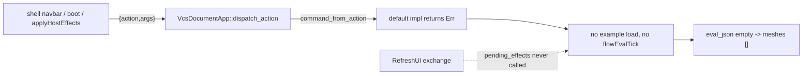

## Root cause

The shells only ever send `{kind: "action", name, args}` (see `encodeActionWire` in [framework/os core index.ts](🧰️framework/🛍️products/💻️os/⚡️implementations/🟦️typescript/📦️index.ts) line 1565). `VcsDocumentApp::dispatch_action` funnels every non-framework action through `command_from_action`:

```3912:3915:🧰️framework/🛍️products/💻️os/🔨️modules/🔌️plugin/⚡️implementations/🦀️rust/📦️lib.rs
            } else {
                let command = self.app.command_from_action(action, args)?;
                self.dispatch_typed_command_inner(command, meta)
            }
```

`Procedural3dPlayApp` does not override it, so the default `Err("action '...' is not a framework-reserved action")` (line 2742) fires for all 34 declared actions. Consequences that match both reported symptoms exactly:

- The React shell's once-per-instance boot dispatch of `setActiveExample` ([react os renderer](🧰️framework/🛍️products/💻️os/🔨️modules/📺️renderer/🧑️‍🎨️engine/⚛️react/⚡️implementations/🟦️typescript/📦️index.tsx) line 8842) and every navbar example pick fail, so the document stays at `initial_projection()` = hexagonal column.
- `flowEvalTick` is re-dispatched as a string action by `applyHostEffects`, so it fails too. `eval_driver_json` stays empty, `preview_payload_from_eval` returns `("[]", "[]")`, and the Preview window renders nothing.

A second, independent gap keeps the preview empty even once the bridge works: `pending_effects()` is never drained on the binary `RefreshUi` path, and wgpu discards the post-batch effects frame.



Only 4 of 40 `DocumentApp` impls have the bridge, and no test anywhere drives an app through the string-action path, which is why this shipped green.

## Wave 0 - Ticket

Read goals from `.🦑️repo/🎯️goals` (repo MCP is not exposed in this session; the on-disk format is authoritative). Open `2026/08/03/FEATURE-COMPLETE-AND-BATTLE-TESTED-PROCEDURAL-3D` under `R26-02/RUNNING-SKETCHPAD`. This absorbs the open ticket `2026/08/03/PROCEDURAL-3D-EXTENSION-NODE-DISCOVERY`; another agent has already landed its W1-W3 (extension rename, `install_flow_extension`/`flow_extension_registry`/`flow_catalogue_sections`, `catalogue_json` on `FlowBackedNodeGraphExtras`, `SetContributions`), so only its W4-W6 remain and fold into Wave 5 below. Close that ticket from this one. All probes, logs and captures go in the new ticket folder.

## Wave 1 - Runtime ground truth first

Before changing code, capture what actually happens, so every later claim is verified rather than asserted. Probe script in the ticket folder, driven against `🛠️dev🔧️procedural🏙️3d⚛️react` (port 6018) and `🛠️dev🔧️procedural🏙️3d🧊️wgpu🌐️wasm` (port 6118):

- Capture all console output unfiltered, expecting `[DEBUG] action failed setActiveExample`.
- Open the navbar example select by clicking the trigger (`playground.navbar.fixture`) before looking for rows. The previous ticket's probe searched for example rows in a closed dropdown, found none, silently skipped the click, and still wrote `ok: true` from canvas dimensions alone. That is why its `probe-box-fillet-preview.png` still shows the hexagonal column.
- Assert on the real payload, not canvas size: read the world-3d scene's `meshesJson`/`instancesJson` element counts and the node-graph `fixtureJson` node id set.

## Wave 2 - The action-to-command bridge

- Implement `command_from_action` in [procedural 3d ui lib.rs](✏️s/🔌️plugins/🌀️procedural/🎛️apps/🧊️3d/🔨️modules/🖱️ui/⚡️implementations/🦀️rust/📦️lib.rs) covering every `Procedural3dCommand` variant including `flowEvalTick` and `setContributions`, following the arg-alias style already proven in [gis 2d](✏️s/🔌️plugins/🌍️gis/🎛️apps/◻2d/🔨️modules/🖱️ui/⚡️implementations/🦀️rust/📦️lib.rs) line 753. Unknown action ids must keep erroring.
- Same for [procedural 2d ui lib.rs](✏️s/🔌️plugins/🌀️procedural/🎛️apps/◻2d/🔨️modules/🖱️ui/⚡️implementations/🦀️rust/📦️lib.rs) (23 declared actions, identically dead).
- Add `testkit::assert_declared_actions_bridge_to_commands` to the `testkit` region of [plugin lib.rs](🧰️framework/🛍️products/💻️os/🔨️modules/🔌️plugin/⚡️implementations/🦀️rust/📦️lib.rs) (next to `assert_undo_redo_round_trip`, line 1428): walk `AppDefinition.actions`, skip framework-reserved ids, and require `command_from_action` to succeed with the action's declared default args and to map back through `command_id` to the same id. Wire it into both procedural apps' existing `mod tests`.

## Wave 3 - Effects actually reach the app

- `plugin_exchange`'s `AppCommand::RefreshUi` arm (line 5054 of [plugin lib.rs](🧰️framework/🛍️products/💻️os/🔨️modules/🔌️plugin/⚡️implementations/🦀️rust/📦️lib.rs)) must arm `pending_effects()` the same way the JSON `plugin_refresh_ui` path already does at line 4849, so a cold-start document with pending nodes starts evaluating without needing a mutation first.
- `performRefreshUi` in the [react os renderer](🧰️framework/🛍️products/💻️os/🔨️modules/📺️renderer/🧑️‍🎨️engine/⚛️react/⚡️implementations/🟦️typescript/📦️index.tsx) line 9804 must return the `Effects` frames instead of documenting them away; `refreshUi` at line 6329 already applies them.
- wgpu's frame parser at line 5981 only accepts `Effects { in_reply_to: Some(seq) }`, dropping the post-batch frame. Accept `None` too and route it into `deferred_actions`.
- Verify the chain converges at runtime with `[DEBUG]` tick logs on both renderers, not just via the existing `drain_flow_eval_ticks` unit helper.

## Wave 4 - Examples

- Unknown or empty example ids currently fall through `example_projection`'s `_ => None` into `Procedural3dDocument::default()`, silently blanking the document. Make the command a no-op for ids the app does not own.
- `SetActiveExample` emits `Procedural3dConfigOperation::Snapshot { config: Procedural3dConfig { camera, ..default() } }`, which also resets `locale`, `show_mode`, `lod_mode`, `sun_json` and `active_utility_id`. Preserve user display preferences; reset only selection, hover, eval driver, generation and cameras.
- Cover all eight examples with a test that each loads a distinct widget set and evaluates to non-empty geometry, replacing today's single sphere-torus spot check.

## Wave 5 - Catalogue and contributed nodes (absorbed)

Finish the absorbed ticket's remaining waves against the already-landed registry:

- `Contribution::FlowExtension` in [framework core](🧰️framework/⚡️implementations/🦀️rust/📦️lib.rs), `contributes`/`consumes` declarations, and runtime `install_flow_extension_manifest` driven by the existing `Procedural3dCommand::SetContributions`.
- `EvalError::PendingExtension` plus `HostEffect::RequestPluginExchange`, resolved by seeding `procedural_neural_cache()` so the next tick hits the cache.
- Drive the catalogue panel and the double-click spotlight from `flow_catalogue_sections()`, and carry `neuronKind` through `AddWidget` so a brep node can actually be placed (today `"neuron"` hardcodes `math.add`).

## Wave 6 - Feature completeness

- Inspector ([build_inspector_tree](✏️s/🔌️plugins/🌀️procedural/🎛️apps/🧊️3d/🔨️modules/🖱️ui/⚡️implementations/🦀️rust/📦️lib.rs)) only edits `InputSlider.value`. Extend to every `Widget` variant and to neuron params, generalizing `PatchFlowWidgets { field, value: Option<f64> }` beyond a single f64.
- `preview_payload_from_eval` only tessellates `Widget::Neuron { preview: true }`, so `Widget::OutputPreview` nodes contribute nothing to the 3D scene. Include them.
- `preview_selection_json` advertises vertex/edge/face selection targets but always sends `componentIds: []`. Either wire real sub-element ids or stop advertising the granularity.
- `artifact_kind` declares `export_formats: vec![]` / `import_formats: vec![]` while the engine already round-trips OBJ/GLB/STL in tests. Declare them and wire them through.
- `procedural3d_document_from_mesh` ignores its mesh argument and returns `default_projection()`. Implement it or drop the port.

## Wave 7 - Battle-testing

- Every new behavior gets coverage in the existing `mod tests` blocks (no new test files): string-action dispatch for all actions, refresh-armed eval, example switching, inspector edits, export round-trips.
- Rewrite the previous ticket's self-deceiving Playwright probe into a real one in the ticket folder: per example, assert mesh and instance counts, assert the graph node set changes, and keep screenshots that visibly differ. Run it against both renderers and store output in the ticket folder.
- Register any new executable command in `.vscode/launch.json` following existing order and grouping, then close both tickets with summaries and full file lists.