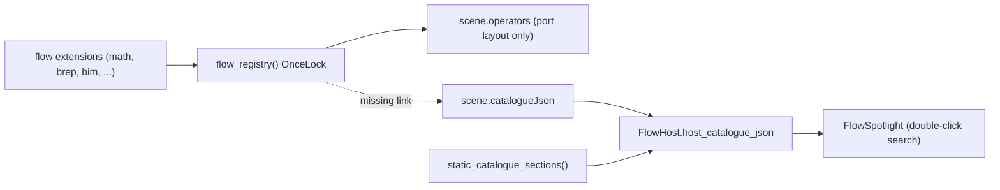

## Root cause

The spotlight list comes from `FlowWasmSession.catalogueJson()`, which is `FlowHost::host_catalogue_json` plus four hardcoded static sections:

```1158:1161:🧰️framework/🛍️products/💻️os/🔨️modules/🌊️flow/🫀️core/⚡️implementations/🦀️rust/📦️lib.rs
fn merge_catalogue_sections(host_json: &str) -> Result<Vec<CatalogueSection>, FlowCoreError> {
    let mut sections: Vec<CatalogueSection> = if host_json.trim().is_empty() { vec![] } else { serde_json::from_str(host_json)? };
    sections.extend(static_catalogue_sections());
    Ok(sections)
```

`host_catalogue_json` is only ever populated from `NodeGraphScene.catalogue_json` (React `session.setCatalogueJson`, wgpu `host.set_host_catalogue_json`). `flow_backed_node_graph_extras` fills `fixture_json`, `operators`, `capabilities_json`, `lod_json` but **never `catalogue_json`**, and no plugin sets it. So the spotlight can only ever offer Slider/Note/Image/Variable/Preview/Action/Export/Input/Output — every operator from `math`, `brep`, `draw`, `bim`, `list`, `dictionary`, `logic`, `text`, `core` is invisible.

Two further gaps behind that: `flow_registry()` is a `OnceLock` with a hardcoded crate list (no install API), and `semio_framework_core::Contribution` has no variant for node kinds, so no plugin can publish nodes at all.

The Flow app confirms the diagnosis and adds a second, redundant path. Its UI calls `seed_host_catalogue(&mut host, &config.catalogue_sections_json)` at lines 87 and 194 of [flow UI lib.rs](✏️s/🔌️plugins/🌊️flow/🎛️apps/🌊️flow/🔨️modules/🖱️ui/⚡️implementations/🦀️rust/📦️lib.rs), merging `flow_operator_catalogue_json()` with app-authored extras into the *plugin-side* `FlowHost`. That host is a different instance from the browser `FlowWasmSession` and its catalogue is never serialized into the scene, so the Flow app's spotlight is broken the same way. W3 makes the scene the single carrier, after which `seed_host_catalogue` collapses into the installed-extension catalogue and `FlowConfig::catalogue_sections_json` is only app-authored extra sections.




## Constraints

- No new files/folders outside the ticket folder: extend existing files with regions, and **relocate** existing crates rather than creating new ones.
- Greenfield: rename outright, no aliases or compatibility shims.

## W0 - Ticket

Read `repo://goals`, then `ticket_open` (or `ticket_reopen` if one covers this) associated with the best-matching goal.

## W1 - Rename module to extension

`module` is the legacy name for what is now an extension. `🧩️extensions` is already the established name in five plugins, and `✏️s/🔌️plugins/📜️imperative/🧩️extensions/{🫀️core,🧮️math,🧠️logic,📝️text,🎮️control}` mirrors the flow module set almost exactly, so this rename removes a real inconsistency rather than inventing a name. Rename across the flow stack:

- `🧰️framework/🛍️products/💻️os/🔨️modules/🌊️flow/⚡️implementations/🦀️rust/🔨️modules/*` becomes `.../🧩️extensions/*`.
- Crates `semio-s-kernel-flow-module-X` become `semio-s-kernel-flow-extension-X`; lib names `flow_module_X` become `flow_extension_X`. Update `Cargo.toml` workspace members and every dependent path (`flow_core`'s `Cargo.toml` lists all nine).
- The SDK crate `🕸️wasm` (`flow_module_wasm`) becomes `flow_extension_sdk`; `FlowModuleManifest` / `FlowModuleContributes` / `FlowModuleWidget` / `FlowModuleCommand` / `FlowModuleSetting` lose the `Module` infix, and the manifest schema string `flow.module` becomes `flow.extension`.
- `neural_engine::OperatorInfo.module` becomes `.extension`; likewise `ui_wgpu::NodeGraphOperatorRecord.module` and the TS mirror in [🧰️framework/⚡️implementations/🟦️typescript/📦️index.ts](🧰️framework/⚡️implementations/🟦️typescript/📦️index.ts). Verify first that `module` is metadata only and is not persisted in any `.flow`/`.procedural3d` fixture (fixtures store `kind`), so no asset edits are needed; if any fixture carries it, hand-fix all of them.

## W2 - Runtime-installable extension registry

Replace the `OnceLock` in `flow_core` with an install API in a new `#region 🔖️ExtensionRegistry`, mirroring the existing `RESOURCE_KIND_REGISTRY: LazyLock<Mutex<HashMap<...>>>` pattern in [🧰️framework/🛍️products/💻️os/⚡️implementations/🦀️rust/📦️lib.rs](🧰️framework/🛍️products/💻️os/⚡️implementations/🦀️rust/📦️lib.rs):

```rust
pub struct FlowExtensionSpec { pub id: String, pub name: String, pub version: String, pub install: fn(&mut neural::Registry) }
pub fn install_flow_extension(spec: FlowExtensionSpec);
pub fn install_flow_extension_manifest(plugin_id: &str, manifest_json: &str);
pub fn uninstall_flow_extension(id: &str);
pub fn installed_flow_extensions() -> Vec<FlowExtensionInfo>;
pub fn flow_extension_registry() -> Arc<neural::Registry>;
pub fn flow_catalogue_sections() -> Vec<CatalogueSection>;
```

The host rebuilds the composed `Registry` and catalogue on every install/uninstall behind a generation counter. Built-ins move from the hardcoded `flow_registry()` body into an idempotent `install_builtin_flow_extensions()` composition-root call. `FlowHost::evaluate_step` (line ~2543) takes `flow_extension_registry()` instead of `flow_registry()`.

## W3 - Catalogue reaches the spotlight (fixes the reported bug)

- `FlowBackedNodeGraphExtras` gains `catalogue_json`, filled from `flow_catalogue_sections()`; every flow-backed app passes it into `NodeGraphScene { catalogue_json: flow_extras.catalogue_json, .. }`, starting with [procedural 3D UI](✏️s/🔌️plugins/🌀️procedural/🎛️apps/🧊️3d/🔨️modules/🖱️ui/⚡️implementations/🦀️rust/📦️lib.rs) around line 827 and the same call in procedural 2D, flow and imperative.
- The plugin sends only extension sections; `static_catalogue_sections()` stays owned by `flow_core` so nothing duplicates.
- Collapse the Flow app's duplicate path: `seed_host_catalogue` in [flow engine lib.rs](✏️s/🔌️plugins/🌊️flow/🎛️apps/🌊️flow/🔨️modules/⚙️engine/⚡️implementations/🦀️rust/📦️lib.rs) stops re-deriving the operator catalogue and only appends `FlowConfig::catalogue_sections_json` extras onto `flow_catalogue_sections()`, so both apps read one source.
- React `syncFlowSessionStructureFromScene` guards with `if (scene.catalogueJson)`, so an emptied catalogue never propagates: change to an explicit `!= null` check.
- Delete `WIDGET_CATALOG` and the `"neuron" => math.add` fallback in `Procedural3dCommand::AddWidget`; drive `build_catalogue_tree` from the same `flow_catalogue_sections()` and carry `neuronKind` through the action args.
- Spotlight ranking in `scoreFlowCatalogueItem` / `flowRankCatalogueSuggestions` additionally matches `summary` and the owning section title, and `FlowSpotlight` renders the extension title as a row subtitle so `brep.prim3d.box` is findable by "box" and by "brep".

## W4 - Contribution::FlowExtension

- New variant in `semio_framework_core::Contribution` (~line 6111): `FlowExtension { app_id, extension_id, label, icon_id, manifest_json }`, where `manifest_json` is the `flow.extension` manifest produced by `flow_extension_sdk::build_manifest_json`.
- Extension crates declare `contributes = ["flow.extension"]`; the procedural plugin manifest declares `consumes = ["flow.extension"]`. The registry codegen in [📇️registry/📜️script.ts](🧰️framework/🛍️products/💻️os/🔨️modules/🔌️plugin/⚡️implementations/🟦️typescript/📇️registry/📜️script.ts) already discovers `✏️s/🔌️plugins/*/🧩️extensions/*` crates and `resolveRegistryPluginIdsForFilter` already pulls contributors into a host's playground session, so no new discovery mechanism is needed.
- Host aggregation already exists on both renderers (`contributions_json_from_plugins` in wgpu ~17540, `buildContributionsJson` in React ~6198).
- Procedural 3D gains a `setContributions` command plus `Procedural3dConfigOperation::SetContributions`, mirroring `FormsConfigOperation::SetContributions`, and calls `install_flow_extension_manifest` for each contributed entry whose set changed.

## W5 - Evaluation of contributed nodes

Contributed operators have no locally linked `Operation`, and `Operation::evaluate` is synchronous inside the plugin WASM, so evaluation is resolved across ticks using the existing budgeted eval chain:

- Registering a contributed operator installs a stub whose `evaluate` returns `EvalError::PendingExtension { extension_id, operator_id, node_hash }`.
- `evaluate_channels_budgeted` treats that like a budget stop and reports it in `remaining`; `FlowEvalDriver` collects the requests.
- New `HostEffect::RequestPluginExchange { plugin_id, app_id, request_json, response_action }`. Both shells resolve the contributor plugin exactly as `resolve_external_slots_in_tree` already does, call it, and re-dispatch `response_action` on the requesting instance with the result.
- Procedural 3D handles `flowEvalResolve` by seeding the shared `procedural_neural_cache()` at `node_hash`; the next `flowEvalTick` finds a cache hit and continues. This reuses `evaluate_cached_output`'s existing keying, so remote results are just pre-seeded cache entries.
- End-to-end proof without new crates: **relocate** the existing `flow_extension_bim` crate (deps are only `neural_engine` + serde, no geometry kernel) to `✏️s/🔌️plugins/🌊️flow/🧩️extensions/🏗️bim/⚡️implementations/🦀️rust/`, give it `[package.metadata.component]` + `contributes = ["flow.extension"]`, and drop it from `flow_core`'s dependency list. Its nodes then reach the procedural 3D spotlight purely through the contribution path and evaluate through the exchange path.

## W6 - Verification

- Extend the existing in-file `mod tests` (no new test files): flow core catalogue includes installed extension sections and reacts to install/uninstall; `flow_backed_node_graph_extras` carries `catalogue_json`; contribution manifest install registers operators; a pending-extension dispatch round-trips through cache seeding. Extend the existing React renderer test file for spotlight ranking over extension sections.
- Run `cargo test` for the touched crates and the existing TS test suite; capture output into the ticket folder.
- Runtime check with `[DEBUG]` logs on both renderers via `.vscode/launch.json` entries `🛠️dev🔧️procedural🏙️3d⚛️react` (port 6018) and `🛠️dev🔧️procedural🏙️3d🧊️wgpu🌐️wasm` (port 6118): double-click empty canvas, type `box`, `add`, `wall`; confirm the section count, that a brep node is offered and placed, and that a contributed bim node actually computes.
- Register any new executable command in `.vscode/launch.json` following existing order and grouping, then `ticket_close` with the summary and file list.

