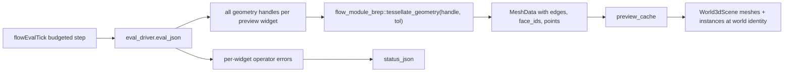

# Feature-Complete Procedural 3D Engine and BREP Kernel

## What is actually broken

The kernel is fine. `brep.solid.extrude` -> `brep.measure.volume` already asserts an exact volume of 16.0 in `flow_module_brep`'s own tests, and `tessellate_geometry_json` runs real deflection-based tessellation. The problem is entirely the procedural 3D app's preview layer, which is built around placeholder primitives instead of kernel output.

In [the engine](✏️s/🔌️plugins/🌀️procedural/🎛️apps/🧊️3d/🔨️modules/⚙️engine/⚡️implementations/🦀️rust/📦️lib.rs):

- `PROCEDURAL_FALLBACK_MESH_KIND = "box"`, `neuron_mesh_kind` (maps extrude/cut/fuse to `"box"`), `widget_preview_mesh_kind`, `preview_meshes_json_fallback`, `preview_instances_json_fallback` synthesize `semio_framework_plugin::mesh_from_kind("box")` unit cubes. `preview_payload_cached` returns them on a cold start, and `evaluated_preview_payload` returns them whenever tessellation yields nothing. This is exactly the grey cube in `probe-hexagonal-mushroom.png` (the fixture is a hexagonal column, not a cube).
- Instances are positioned by node-graph layout: `let position = [x * 0.01, -y * 0.01, 0.0];`. Brep geometry is already in world coordinates, so previews get scattered across the scene by where their node sits in the graph. This is the "wrong boxes in wrong places" symptom.
- `geometry_handle_for_widget` takes `handles.into_iter().next()` - only the first handle per widget, so patterns, compound cuts and deconstruct render one solid.
- `mesh_from_tessellation_json` hand-parses `position`/`normal`/`index` and returns `None` when `index` is empty. `MeshTransfer` also carries `edges`, `points` and `face_groups`, so all edges, wires, curves, vertices and per-face topology are discarded, and wire/curve/vertex geometry can never render at all.
- Tolerance is hardcoded `0.05`; `runtime.lod_mode` never reaches tessellation.
- `runtime.show_mode` is written by `setShowMode` and read nowhere in the entire app.
- Operator errors (`entry["error"]` in the eval JSON) are dropped; a failing brep op silently becomes a box.
- Double evaluation: `flowEvalTick` runs a budgeted `FlowEvalDriver::tick`, then `refresh_all_caches` -> `evaluated_preview_payload` builds a *second* `FlowHost` and runs a *full* synchronous `evaluate()`, discarding `eval_driver.eval_json()`.

[CAD](✏️s/🔌️plugins/📐️cad/🎛️apps/📐️cad/🔨️modules/⚙️engine/⚡️implementations/🦀️rust/📦️lib.rs) already does this correctly via `kernel_3d_brepkit::mesh_data_from_mesh_transfer`, which fills `edge_positions`/`edge_ids`/`face_ids` - everything the React `World3dHost` needs for edge rendering and face/edge/vertex picking.

## Target pipeline




## Steps

### 1. Typed tessellation API on the brep flow module

In [flow/module/brep](🧰️framework/🛍️products/💻️os/🔨️modules/🌊️flow/⚡️implementations/🦀️rust/🔨️modules/📐️brep/📦️lib.rs), add to the existing tessellation region:

```rust
pub fn tessellate_geometry(handle: &str, tolerance: f64) -> Result<semio_framework_core::MeshData, String>
```

backed by `kernel.tessellate` + `kernel_3d_brepkit::mesh_data_from_mesh_transfer`, memoized in `MESH_CACHE` the same way and swept by the same `retain_geometry_handles`/`dispose_geometry`. Delete `tessellate_geometry_json` and its callers' JSON round-trip (greenfield: no parallel API).

### 2. Rewrite the procedural engine preview payload

In [the engine](✏️s/🔌️plugins/🌀️procedural/🎛️apps/🧊️3d/🔨️modules/⚙️engine/⚡️implementations/🦀️rust/📦️lib.rs):

- Delete `PROCEDURAL_FALLBACK_MESH_KIND`, `neuron_mesh_kind`, `widget_preview_mesh_kind`, `preview_meshes_json_fallback`, `preview_instances_json_fallback`, `mesh_from_tessellation_json`. No placeholder geometry anywhere: an empty graph previews nothing, a computing graph shows the existing `status_json` spinner, a failing node shows its error.
- `geometry_handle_for_widget` becomes `geometry_handles_for_widget` returning every handle, in eval order. Emit one mesh + one instance per handle, instance id `widgetId` for a single handle and `widgetId#N` for multiples, so `worldSelect`/`worldHover` still resolve back to the widget.
- Instances get identity transform (`position [0,0,0]`, unit rotation/scale). All previewed geometry shares one world space.
- `preview_payload_cached` loses its fallback branch and returns `("[]", "[]")` when cold.
- Replace `evaluated_preview_payload(fixture, runtime)` with `preview_payload_from_eval(eval_json, fixture, runtime)`; `refresh_all_caches` feeds it `runtime.eval_driver.eval_json()`, `refresh_generation_preview_cache` feeds it the value already returned by `evaluate_generation_preview`. No second `FlowHost::evaluate()`.
- Derive tolerance from `runtime.lod_mode` (coarse/medium/fine) rather than the hardcoded `0.05`.
- Add `preview_status_json(eval, fixture)` collecting per-widget `error` entries, merged into the `World3dScene.status_json` the UI already sets.
- `export_mesh_from_document` merges all preview meshes instead of returning the first.

### 3. Wire show mode and selection targets in the UI

In [the UI](✏️s/🔌️plugins/🌀️procedural/🎛️apps/🧊️3d/🔨️modules/🖱️ui/⚡️implementations/🦀️rust/📦️lib.rs), extend `preview_selection_json` to emit `showEdges`, `selectionMode`, `granularity`, `targets` and `componentIds` the way [CAD's `world_selection_json](✏️s/🔌️plugins/📐️cad/🎛️apps/📐️cad/🔨️modules/🖱️ui/⚡️implementations/🦀️rust/📦️lib.rs)` does, driven by `runtime.show_mode` (`shaded`, `shaded+edges`, `wireframe`, `points`). Wireframe/points modes make the engine emit edge-only / point-only `MeshData`, since the React host has no global wireframe flag but does render `edgePositions` and point clouds. Add the show-mode entries to the window measure next to `procedural3d_lod_measure`.

### 4. Close the two kernel gaps

In [the brepkit kernel](✏️s/🔨️modules/🧊️3d/📐️brep/⚡️implementations/🦀️rust/📦️lib.rs):

- `boolean_sync` currently detours torus-involving booleans through `boolean_mesh_sync` (tessellate at deflection 0.1, triangle-triangle boolean, `import_mesh` back into topology) - a faceted, non-analytic result. Replace with: copy the torus-bearing operand, `brepkit_operations::heal::convert_to_bspline` it (already wrapped as `convert_to_nurbs_sync`), then run the analytic `boolean`. Delete `boolean_mesh_sync` and `mesh_boolean_cache`; a boolean that genuinely fails returns `BrepError` and surfaces through the new status JSON. Keep the existing `fuse_box_torus_mesh_fallback` bench as a timing guard, retargeted at the analytic path.
- `tessellate_sync`'s `Entity::Surface` arm uses `surface_grid(&nurbs, .., 16, 16)` with `normal.extend([0.0, 0.0, 1.0])`. Make the grid resolution derive from `tol` and the surface's parametric span, and compute real normals from the surface partials (the native `surface` module already exposes normal/derivative evaluation).

### 5. Extend the examples

Rework [the example folder](✏️s/🔌️plugins/🌀️procedural/🎛️apps/🧊️3d/⚡️implementations/🦀️rust/📚️examples) and the `PROCEDURAL3D_EXAMPLE_*_TEXT` constants in [the DSL crate](✏️s/🔌️plugins/🌀️procedural/🎛️apps/🧊️3d/🔨️modules/🗣️dsl/⚡️implementations/🦀️rust/📦️lib.rs), plus `example_projection`/`example_document_json` and the `setActiveExample` staged palette args, so the set covers every operator family end to end: primitives, curves and surfaces, extrude/revolve/loft/sweep/pipe, booleans, fillet/chamfer/shell, transforms and patterns, measure. Each new example gets a DSL round-trip test in the existing `dsl` test region.

### 6. Tests and runtime verification

- Strengthen `preview_payload_has_meshes_and_instances` in the engine's existing test region so it can no longer pass on a cube: assert mesh ids are `eval-`-prefixed, assert the hexagonal column's triangle count and bounding box match a 6-sided prism of radius 0.5 and height 6, assert `edge_positions` is non-empty, assert instances are at the origin.
- Add engine tests for multi-handle widgets, wire/curve-only preview, error surfacing, and LOD-driven tolerance.
- Add kernel tests: analytic torus cut preserves an analytic (non-triangulated) face count and matches the expected volume; surface tessellation normals are unit-length and not `[0,0,1]` on a curved patch.
- Run the full workspace test suite for the touched crates, then reuse the Playwright probe pattern from the previous ticket (`probe-flow-graph.mts`) against `bun run dev:procedural:3d` and capture screenshots per example inside the new ticket folder, confirming real geometry with `[DEBUG]`-prefixed console logs of mesh ids and triangle counts.

## Ticket

The repo MCP server is currently reporting a discovery error, so `ticket_open` has to be retried at execution time. Target goal `R26-02/RUNNING-SKETCHPAD` (the same goal the earlier procedural flow tickets used). All probes, logs and screenshots go in `.🦑️repo/🎫️tickets/🎆️26/🌙️08/☀️03/<SLUG>/`.