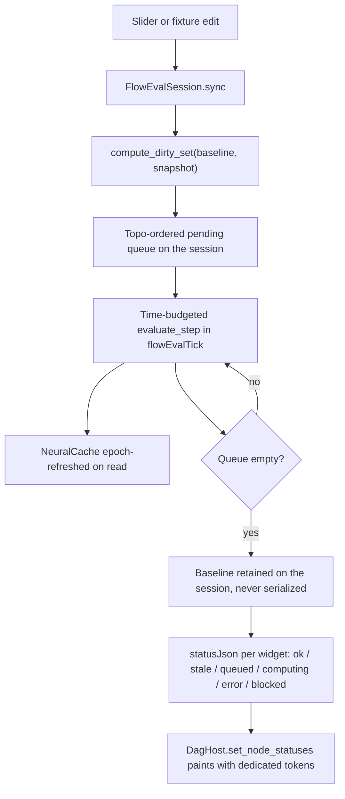

> Terminology note: **status** below always means the new explicit per-node evaluation state (`ok`/`stale`/`queued`/`computing`/`error`/`blocked`). **Baseline** means the pair `previous_snapshot` (structural fingerprint) + `previous_channels` (last computed inputs/outputs) that `compute_dirty_set` diffs against.

# Converging Flow Evaluation and Explicit Node Status

## Root causes (all confirmed in code)

The hexagonal mushroom column never settles because the incremental-eval mechanism is structurally unable to converge, not because of a rendering bug.

**1. The eval baseline is discarded on every round-trip.** `FlowEvalDriver` holds the baseline and the scheduling flag, and all three are serde-skipped:

```3644:3659:🧰️framework/🛍️products/💻️os/🔨️modules/🌊️flow/🫀️core/⚡️implementations/🦀️rust/📦️lib.rs
pub struct FlowEvalDriver {
    #[serde(default)]
    eval_json: String,
    #[serde(default)]
    computing_json: Option<String>,
    #[serde(skip)]
    previous_snapshot: Option<TreeSnapshot>,
    #[serde(skip)]
    previous_channels: Option<EvalChannels>,
    #[serde(skip)]
    tick_scheduled: bool,
}
```

JSON is the only path the driver survives (`Procedural3dConfig::eval_driver_json`, written by `SetEvalDriver` on every tick). So every render and every tick restores a driver with no baseline, `compute_dirty_set(None, &snapshot)` marks the whole graph dirty, and `pending_eval_widget_ids()` reports every node as pending. `computing_json` is therefore never `None`, and the animated arcs spin forever. The comment at [flow core lib.rs:73](🧰️framework/🛍️products/💻️os/🔨️modules/🌊️flow/🫀️core/⚡️implementations/🦀️rust/📦️lib.rs) claims it reads "the persisted baseline" — that state is never persisted.

**2. `tick_scheduled` is also skipped**, so `sync()` re-arms a `flowEvalTick` chain on every render and overlapping chains pile up.

**3. `NeuralCache::sweep()` evicts every cache hit.** `sweep` retains only entries whose epoch equals the current one, but the budgeted walk reads through `cache.contains(key)` / `cache.get(key)`, neither of which touches the epoch — only `get_or_insert_with` does. So the completing tick of every run wipes everything it read, and the next edit starts cold.

**4. Throughput.** Each edit costs one plugin dispatch per node (`evaluate_step(1)`), and each tick commits the whole `eval_json` as a VCS'd config operation.

**5. Status vocabulary conflates two different things.** The UI's "computing" is derived from a dirty probe (`refresh_computing_chrome_from_pending`), so "needs recompute" and "is being computed right now" are indistinguishable. `DagNodePaintChrome` has no error or blocked state at all, and the computing arc borrows `node_stroke_selected`, which resolves to `primary` — bright red in this brand. That is the red dashed outline in the screenshot.

The same driver pattern is triplicated across the flow app, procedural 2d, and procedural 3d.

Not a bug, do not change: the dark grey Poly and Vector bodies are `set_dimmed` from `preview=false`, and `* errors` / `? vector` on the Vector node are the real `math.vector` schema-component channels.




## Wave 0: Ticket

Read `repo://goals`, then `ticket_open` under the goal the closed [FEATURE-COMPLETE-AND-BATTLE-TESTED-PROCEDURAL-3D](.🦑️repo/🎫️tickets/🎆️26/🌙️08/☀️03/FEATURE-COMPLETE-AND-BATTLE-TESTED-PROCEDURAL-3D/🎫️ticket.json) ticket used (`R26-02/RUNNING-SKETCHPAD`). The repo MCP server is declared in [.mcp.json](.mcp.json) but was not registered as a live namespace at planning time; if it is still unavailable, start it before doing anything else rather than working outside a ticket. All probes, logs and screenshots go in the ticket folder.

## Wave 1: FlowEvalSession

In [flow core lib.rs](🧰️framework/🛍️products/💻️os/🔨️modules/🌊️flow/🫀️core/⚡️implementations/🦀️rust/📦️lib.rs), replace region `🔖️EvalDriver` with `🔖️EvalSession`.

- `FlowEvalSession` owns, in one place and with no `Serialize` impl: the `NeuralCache`, the baseline, the topo-ordered pending queue, the id currently being computed, `eval_json`, and the pending-extension request. Eval state becomes session state, which is what it is.
- Delete `FlowEvalDriver`, `Procedural3dConfig::eval_driver_json`, and `Procedural3dConfigOperation::SetEvalDriver` (plus the procedural 2d and flow-app equivalents). Evaluation results stop flowing through the VCS and undo stream entirely.
- Move `NeuralCache` ownership out of the process-global `PROCEDURAL_NEURAL_CACHE` `OnceLock` in [procedural 3d engine lib.rs](✏️s/🔌️plugins/🌀️procedural/🎛️apps/🧊️3d/🔨️modules/⚙️engine/⚡️implementations/🦀️rust/📦️lib.rs) into the session. This also removes the interleaved-sweep hazard that `evaluate_step`'s own doc comment describes.
- `Procedural3dPlayApp` is currently `pub struct Procedural3dPlayApp;` and must gain `session: Mutex<FlowEvalSession>`. `VcsDocumentApp<A>` holds one `A` per `AppInstance`, so this is per-instance and is dropped with the instance — unlike a static keyed map, which `plugin_destroy_app` would leak. Precedent: the `Mutex` fields on `Puzzle3dPlayApp` and `PROCESS3D_PREVIEW_CACHE`. `DocumentApp::handle` takes `&self`, hence the interior mutability.
- Hoist the triplicated `live_eval_driver` / `pending_effects` / `FlowEvalTick` boilerplate into one `flow_core` entry point shared by the three flow-backed apps.

## Wave 2: Cache epoch correctness

In [neural engine lib.rs](🧰️framework/🛍️products/💻️os/🔨️modules/🧠️neural/⚙️engine/⚡️implementations/🦀️rust/📦️lib.rs): make reads keep entries alive, either by refreshing the entry epoch in `get`/`contains` or by routing `evaluate_channels_budgeted` through `get_or_insert_with`. Regression test: two consecutive complete evaluations of the same tree leave the cache populated and the second dispatches nothing.

## Wave 3: Explicit per-node status

- New `NodeEvalStatus { Ok, Stale, Queued, Computing, Error, Blocked }` in `flow_core`. `Error` carries the message; `Blocked` carries the unsatisfied required port ids, derived from `validate_neuron_inputs` plus `ChannelSpec` cardinality `ExactlyOne` with neither a synapse nor a default.
- `build_channel_eval_json` gains a `status` key per widget alongside the existing `in` / `out` / `error`.
- Replace the `{ active, stale }` `computing_json` with a `statusJson` map, threaded `NodeGraphScene` → [node-graph surface](🧰️framework/🔨️modules/🗺️surface/🕸️node-graph/⚡️implementations/🦀️rust/📦️lib.rs) and `FlowHost` → a new `DagHost::set_node_statuses`, replacing `set_computing_progress` / `computing_active` / `computing_stale`.
- Delete `refresh_computing_chrome_from_pending`: a dirty probe is no longer the UI's source of truth.

## Wave 4: Painting

In [dag lib.rs](🧰️framework/🛍️products/💻️os/🔨️modules/♾️infinite/🎲️board/🔌️ports/➡️directed/🕸️dag/⚡️implementations/🦀️rust/📦️lib.rs), `DagNodePaintChrome`'s `is_computing` / `is_stale` become one `status` field, and `paint_node_visual` gets error and blocked branches.

Add `nodeStrokeComputing`, `nodeStrokeStale`, `nodeStrokeError`, `nodeStrokeBlocked` to [tokens.json](🧰️framework/🔨️modules/🖱️ui/🎨️styling/⚡️implementations/🦀️rust/🔣️tokens.json) (a `danger: #a60009` token already exists) and regenerate `🤖️generated.rs` and `CanvasPalette`, so computing stops reusing the red `primary` selection stroke.

Port level: `IoPortSpec` gains a resolved flag so an unsatisfied `! radius` is visibly distinct from a satisfied one in `label_with_cardinality`.

## Wave 5: Throughput and geometry ownership

- Replace the one-node-per-round-trip chain with a time-budgeted `evaluate_step` inside a single `flowEvalTick`, so a six-node graph settles in one dispatch.
- `flow_extension_brep::retain_geometry_handles` currently prunes the process-global kernel to one host's live handles, so a second instance or a generation-preview eval evicts the first's geometry. Scope retention per session.

## Wave 6: Tests and runtime verification

- Extend existing test files only. The current `flow_eval_driver_sync_and_tick_state_machine` keeps one in-memory driver across ticks and therefore cannot catch this class of bug; the replacement must exercise the session exactly as the app does, including the config round-trip, and assert the graph reaches all-`ok` and stays there across a second render.
- Add a `data-status-json` attribute on `.semio-node-graph-host` in [react renderer index.tsx](🧰️framework/🛍️products/💻️os/🔨️modules/📺️renderer/🧑️‍🎨️engine/⚛️react/⚡️implementations/🟦️typescript/📦️index.tsx) so the state is probeable.
- Extend the ticket's Playwright probe, modelled on [procedural-3d-runtime-probe.mts](.🦑️repo/🎫️tickets/🎆️26/🌙️08/☀️03/FEATURE-COMPLETE-AND-BATTLE-TESTED-PROCEDURAL-3D/procedural-3d-runtime-probe.mts): boot `dev:procedural:3d:hexagonal-column` (react on 6018, wgpu on 6118), wait for settle, assert every node is `ok`, drag the `sides` slider, assert a transient `computing` followed by settle, and capture console output plus a screenshot into the ticket folder. Both renderers.
- Close with `ticket_close` only after the probe log shows convergence — the previous ticket closed without runtime verification because the servers were not up.

