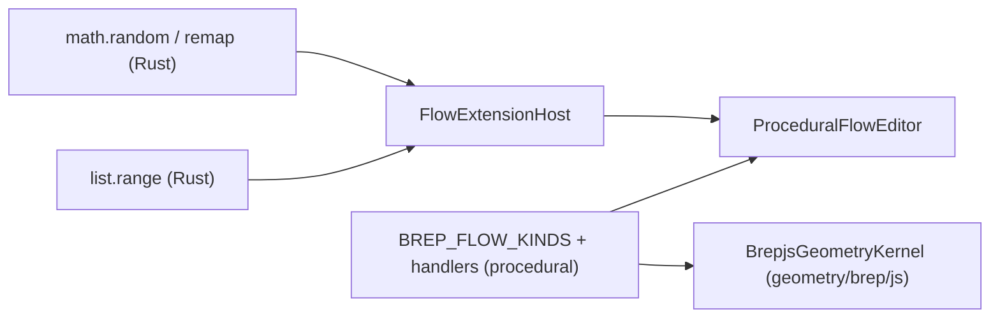

# Procedural Feature Complete

## Context

Two node systems back the procedural editor:

- Brep geometry nodes: catalogue `BREP_FLOW_KINDS` + handlers `BREP_EVAL_HANDLERS` in [procedural/react/index.tsx](procedural/react/index.tsx), backed by `BrepjsGeometryKernel` in [geometry/brep/js/index.ts](geometry/brep/js/index.ts).
- Generic data nodes: Rust/WASM modules in [flow/module/math/lib.rs](flow/module/math/lib.rs), [flow/module/list/lib.rs](flow/module/list/lib.rs), etc., built to `pkg/` and loaded by [flow/react/index.tsx](flow/react/index.tsx).

The kernel already implements many operations not surfaced as nodes; the named utilities (reparametrize, random) do not yet exist. Each addition goes where it belongs: geometry in the brep module, numbers/series in the Rust modules.

## 1. Kernel: new geometry utilities + dedupe

In [geometry/brep/js/index.ts](geometry/brep/js/index.ts) add to `BrepKernel` interface (region `🔌BrepKernelInterface`) and `BrepjsGeometryKernel` (region `🔖Evaluate`/`🔖Curves`/`🔖Surfaces`), reusing already-imported brepjs primitives:

- `divideCurveSync(curve, count)`: sample `curvePointAt` at `count` evenly spaced `t ∈ [0,1]` → `Vec3[]`.
- `reparametrizeCurveSync(curve, samples=64)`: sample points over `[0,1]`, rebuild with `interpolateCurve` (respect `curveIsClosed`) → clean unit-domain edge.
- `reparametrizeSurfaceSync(face, uSamples=12, vSamples=12)`: sample `pointOnSurface` across the `uvBounds` domain into a grid, rebuild with `surfaceFromGrid` → unit-domain face.

Extend the `🧪Tests` region in the same file (no new test files) covering the three methods.

Remove the stale duplicate [geometry/brep/js/kernel.ts](geometry/brep/js/kernel.ts) (not imported anywhere; missing `ellipsoid` import so already non-compiling) per the greenfield no-legacy rule.

## 2. Brep flow nodes: expose all kernel operations + new utilities

In [procedural/react/index.tsx](procedural/react/index.tsx), add entries to `BREP_FLOW_KINDS` and matching `BREP_EVAL_HANDLERS` (using existing `parseGeometry`/`parseVec3Input`/`geoOut` helpers; list inputs read index-keyed dicts like the Rust list module):

- Curves: `curve.bezier`, `curve.bspline`, `curve.approximate`, `curve.polygon`, `curve.reparametrize`.
- Surfaces: `surface.subFace`, `surface.fromGrid`, `surface.reparametrize`.
- Solid: `solid.supportExtrude`, `solid.twistExtrude`, `solid.draft`, `prim3d.polyhedron`.
- Booleans: `bool.cutAll`.
- Intersections: `intersect.split` (list output).
- Evaluate: `eval.curveStart`, `eval.curveEnd`, `eval.curveClosed`, `eval.uvBounds`, `eval.vertexPosition`, `eval.divideCurve` (list of points).
- Query: `query.wires`, `query.vertices`.
- Repair: `repair.healFace`, `repair.sewShells`.
- IO: `io.importStep`, `io.importStl` (base64 text input → `Uint8Array`).

Bump `BREP_MODULE_MANIFEST.version`. Extend the file's `🧪Tests` region with handler tests (e.g. reparametrize round-trips, divideCurve point count, split list).

## 3. Math module: seeded random + fuller arithmetic

In [flow/module/math/lib.rs](flow/module/math/lib.rs), add `Function` structs + `register()` entries:

- `math.random` (`seed?`, `min?`=0, `max?`=1 → `number`): deterministic splitmix64 from `seed` when present; when absent, draw from a lazily-seeded `thread_local` RNG. Entropy via a `cfg`-gated `entropy_seed()` (`js_sys::Math::random()` on `wasm32`, `std::time::SystemTime` natively) — keeps it cross-platform and avoids non-determinism in seeded graphs.
- Arithmetic/utility: `subtract`, `divide`, `power`, `modulo`, `negate`, `abs`, `sqrt`, `min`, `max`, `floor`, `ceil`, `round`, trig `sin`/`cos`/`tan`, and `remap` (`value`, `fromMin`, `fromMax`, `toMin`, `toMax` → `number`).

Add `js_sys` (wasm-only) to [flow/module/math/Cargo.toml](flow/module/math/Cargo.toml) as the wasm interface boundary. Extend the in-file `🔖Tests` (seeded determinism, remap, divide-by-zero guard).

## 4. List module: series generation

In [flow/module/list/lib.rs](flow/module/list/lib.rs) add `list.range` (`start`, `step`, `count` → index-keyed list) and `list.reverse`, with tests in the existing `🔖Tests` region. This drives divide/iteration workflows.

## 5. Build, wire, verify

- Rebuild changed Rust modules: `bun nx run @semio-tech/flow-module-math:wasm` and `@semio-tech/flow-module-list:wasm` (regenerates the `pkg/` JS/WASM that `flow/react` and vitest aliases import). No `launch.json` changes (extending existing modules, no new executables).
- Run tests: brep kernel + procedural via `nx run @semio-tech/geometry-brep-js:test` and `@semio-tech/procedural-react:test`; Rust via `cargo test` for the math/list crates. Confirm new nodes appear in the catalogue and evaluate (validate at runtime, not by assumption).

## 6. Repo ticket

Per repo rules: read `repo://goals`, then `ticket_open` (reuse `CLEAN-PROCEDURAL-LEGACY-CODE` only if it matches; otherwise a new ticket), keep any scratch files inside the ticket folder, and `ticket_close` with the file list when done.

## Decisions taken (opinionated)

- `reparametrize` = resampling onto a clean unit domain (curve) / `uvBounds`-spanned grid (surface), since brepjs already normalizes curve params. If you intended pure domain-metadata only, flag it.
- `random` lives in the Rust `math` module as a `number` producer; seedless evaluation is intentionally fresh.
