# Procedural Preview Window + Flow↔3D Sync

Work inside the repo ticket (reopen `2026/06/07/PROCEDURAL-BREP-PLAYGROUND` via repo MCP `ticket_reopen`, or open a new ticket). Extend existing files only, using `//#region` / `pub mod` sub-regions. No new files. Rebuild flow WASM after Rust edits and run the vitest suites before closing.

## Terminology (per the clarifications)

- The 3D window renders geometry from **all** geometry-producing nodes, not only the `outputPreview` sink.
- Each node has a **preview** flag (default on). Preview-off => node is **dimmed** in the flow graph and its geometry is **hidden** in 3D. ("Hide" is modeled as `preview = false`.)
- **Selection** and **hover** are transient and synced **both ways** between the flow graph and 3D.
- **Hovering** a node (even a dimmed/preview-off one) reveals/highlights its geometry in 3D via the world `worldEntityRenderMode({ hovered, selected, revealed })` helper.
- Preview window gets a **ring** option `Show: Everything | Selected` (selected => render only selected nodes' geometry).

## Data flow

```mermaid
flowchart LR
  dag["DAG GraphEngine (selection, hover)"] --> dagHost["DagHost.process_engine_events"]
  dagHost --> flowHost["FlowHost (preview-off set, selection, hover)"]
  flowHost --> session["FlowSession WASM bindings"]
  session --> flowCanvas["FlowCanvas (onSelectionChange / onHoverChange + controlled props)"]
  flowCanvas --> ctrl["ProceduralPlayController state"]
  ctrl --> preview["ProceduralPreview (multi-mesh WorldCanvas)"]
  preview -->|"onPointerOver / onClick"| ctrl
  ctrl -->|"controlled selected/hover/previewOff"| flowCanvas
  flowCanvas -->|"session.setSelection/setHover/setPreviewOff"| session
```

## 1. DAG core — [mathematical/graph/port/directed/dag/lib.rs](mathematical/graph/port/directed/dag/lib.rs)

The engine already tracks `engine.selection` and `engine.hover` (`mathematical/graph/lib.rs`), and `node_id_map: HashMap<NodeId, usize>` maps to `fixture.nodes[idx].id`.

- In `process_engine_events` (currently drops `SelectionChanged`/`HoverChanged` at the `_ => {}` arm, line ~1005) capture them and set dirty flags.
- Add `DagHost` methods: `selected_node_ids() -> Vec<String>`, `hovered_node_id() -> Option<String>` (map engine ids via `node_id_map`), plus `set_selection(&[String])` / `set_hover(Option<&str>)` (reverse-map id => `NodeId`, update `engine.selection`/`engine.hover`).
- Add a `dimmed: HashSet<NodeId>` (preview-off) with `set_dimmed(&[String])`, and thread selection / hover / dimmed into the node-painting loop in `paint_scene` (line ~1321): selected outline, hover highlight, reduced opacity for dimmed. Reuse existing vello theme colors (the `*_selected` names already present).

## 2. Flow core — [flow/core/lib.rs](flow/core/lib.rs)

Widget ids equal DAG node ids (see `sync_from_dag`, line ~891).

- Add a persistent `preview: bool` (default `true`) to the `Neuron` widget variant so preview-off survives reload (serde default).
- `FlowHost` pass-throughs (after pointer operations which already call `sync_from_dag`): `selected_widget_ids_json()`, `hovered_widget_id()`, `set_selection_json(&str)`, `set_hover(Option<&str>)`, `toggle_preview(&str)` / `set_preview_off_json(&str)` (updates widget `preview` + forwards dimmed set to `self.dag.set_dimmed(...)`).
- WASM `#[wasm_bindgen]` `FlowSession` methods (near `previewText`, line ~1158): `selectedWidgetIds()`, `hoveredWidgetId()`, `setSelection(json)`, `setHover(id)`, `setPreviewOff(json)`, `togglePreview(id)`.

## 3. Flow react — [flow/react/index.tsx](flow/react/index.tsx)

- Extend `FlowCanvasProps` (line ~586): `onSelectionChange?: (ids: string[]) => void`, `onHoverChange?: (id: string | null) => void`, and controlled `selectedNodeIds?`, `hoveredNodeId?`, `previewOffNodeIds?`.
- After `pointerUpScreen` / `pointerMoveScreen`, read `session.selectedWidgetIds()` / `hoveredWidgetId()` and fire callbacks (diff vs. last to avoid loops).
- On controlled-prop change, push into session (`setSelection`/`setHover`/`setPreviewOff`), repaint, and re-evaluate.

## 4. Procedural react — [procedural/react/index.tsx](procedural/react/index.tsx)

- Replace single-solid `extractBrepSolidId` with `extractGeometryHandles(outputsJson): Array<{ widgetId, handle }>` (all entries whose dict has a geometry/`brep` value).
- Split `ProceduralEditor` into two exported components: `ProceduralFlowEditor` (the `FlowCanvas` only, forwarding the new sync props) and `ProceduralPreview` (the 3D window).
- `ProceduralPreview` (uses the infinite world): `WorldCanvas` + `WorldCameraInvalidator` + `WorldOrbitGated`, rendering one `BrepMesh` per handle keyed by `widgetId`. Apply `worldEntityRenderMode` from `{ selected, hovered, previewOff }` (dim/outline/reveal-on-hover) and filter by `showMode` (`everything` vs `selected`). Mesh `onPointerOver`/`onPointerOut`/`onClick` call `onHover`/`onSelect` props.
- Props: `handles`, `selectedNodeIds`, `hoveredNodeId`, `previewOffNodeIds`, `showMode`, `onHover`, `onSelect`, `kernel`.

## 5. Procedural play harness — [procedural/play/index.ts](procedural/play/index.ts)

- Add `PROCEDURAL_PLAY_WINDOW_KIND_PREVIEW`, `PROCEDURAL_PLAY_BODY_KEY_PREVIEW`, `PROCEDURAL_PLAY_SURFACE_ID_PREVIEW`. Change layout to `createDefaultLayout([main, preview], "row", [55, 45], ["Flow", "Preview"])`.
- Controller state: `geometryHandlesJson`, `selectedNodeIds: string[]`, `hoveredNodeId: string | null`, `previewOffNodeIds: string[]`, `showMode: "everything" | "selected"`; getters for each.
- Commands in `run()`: `setEvalOutputs`, `setSelection`, `setHover`, `togglePreview`, `setShowMode` (each `emit()`s; the existing `snapshotListeners`/`emit` drives re-render).
- `previewWindowEngagement()`: required `input` + `control` ring `Show` (`everything`/`selected`, `onSelect -> setShowMode`) + status with geometry count. Keep the existing reorganize/spacing engagement on the flow window. Update `rebuildShellMode` to register both `WindowKindRuntime`s (run `enforcePlaygroundWindowEngagementInput` on each).
- Register the second body: `registerWindowBody(PROCEDURAL_PLAY_BODY_KEY_PREVIEW, () => buildPanelWindowBody(PROCEDURAL_PLAY_SURFACE_ID_PREVIEW, PROCEDURAL_PLAY_CONTROLLER_ID))`.

## 6. Playground renderer — [framework/product/playground/renderer/react/index.tsx](framework/product/playground/renderer/react/index.tsx)

- `ProceduralPlayPaneSurfaceHost` (line ~6290): mount `ProceduralFlowEditor` only; wire `onEvalOutputs -> ctrl.run("setEvalOutputs")`, `onSelectionChange -> setSelection`, `onHoverChange -> setHover`; feed controlled `selectedNodeIds`/`hoveredNodeId`/`previewOffNodeIds` from `ctrl`.
- Add `ProceduralPreviewSurfaceHost` (panel host) mounting `ProceduralPreview`, reading handles/selection/hover/previewOff/showMode from `ctrl`, and wiring `onHover -> setHover` / `onSelect -> setSelection`. Subscribe to a controller revision hook (mirror `useProceduralPlayCatalogueRevision`) so both windows re-render on state changes.
- In `registerProceduralPlaySurfaceHosts` add `registerUiPanelSurfaceHost(PROCEDURAL_PLAY_SURFACE_ID_PREVIEW, ProceduralPreviewSurfaceHost)`.

## 7. Tests + validation

- Extend existing `import.meta.vitest` blocks: `procedural/play` (two window kinds + ring show option + show-mode command), `procedural/react` (multi-handle extraction + render-mode filtering by selection/preview), `flow/react` (selection/hover callback + controlled props).
- Add Rust `#[cfg(test)]` cases in flow/core + dag for selection/hover/preview round-trip and id mapping.
- Rebuild flow WASM (existing flow build target) and run the three TS suites; verify runtime with `[DEBUG]` logs for selection/hover/preview sync before closing the ticket.

## Notes / decisions

- Two resizable panes in one playground (Puzzle 5D pattern), not a detachable OS window.
- `preview` persists in the fixture (`Neuron.preview`); selection/hover stay transient engine/host state.
- 3D selection uses R3F mesh pointer handlers tagged by widget id (Puzzle 3D pattern); no new generic picker in the world engine.
- Loop-guarding: both directions diff before applying to avoid feedback between FlowCanvas controlled props and 3D callbacks.
