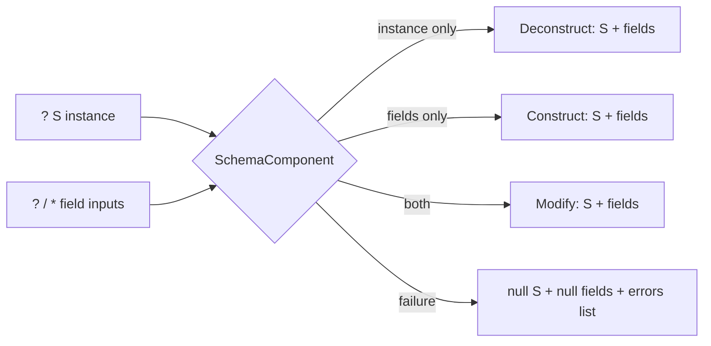

# Procedural Schema Component

Add a generic, schema-driven component that constructs, deconstructs, or modifies dictionaries of any schema in a single operator. Mode is inferred from inputs; on failure it emits explicit `null` on every data output (preserving declared cardinality) plus an `errors` text list.

## Behaviour (per schema `S` with module `M`, fields `f1..fn`)

Operator id `M.S` (e.g. `math.vector`, `math.point`, `brep.geometry`, `bim.wall`), name = schema name.

- Inputs
  - `? S` instance (cardinality `?`, operators `[S]`) — the existing dictionary.
  - one optional input per field: scalar field -> `?`, list field (`ValueType::List`) -> `*`; operators `[field.value.id()]`.
- Outputs
  - `S` instance (the built/modified dictionary).
  - one output per field with its natural cardinality (scalar -> `!`, list -> `*`).
  - `* errors` (text list).
- Modes
  - instance absent + >=1 field present -> construct (fields, falling back to schema field `default`).
  - instance present + no field inputs -> deconstruct (emit instance + each field).
  - instance present + >=1 field input -> modify (clone instance, override provided fields, emit instance + fields).
- On any validation failure: collect messages into `errors`, emit `Atom::Null` on `S` and every field output. Errors are caught inside the operator (returns `Ok`), so evaluation never aborts.

## 1. Explicit null in the engine — [neural/engine/lib.rs](neural/engine/lib.rs)

- Add `Null` to `Atom` (`#region 🔖Dictionary`, the `enum Atom`). It serializes to JSON `null` (untagged). Add `Atom::is_null()` and a `Value` null helper.
- Update `hash_atom` (new arm) and `ValueType::matches` (null matches nothing / is sentinel-only).
- In `validate_channel_value` (`~1295`) and `validate_homogeneous_list` (`~1276`): treat a value that is `Atom::Null` as satisfying ANY cardinality and skip it in homogeneity checks — this is how "null with the correct cardinality" is represented on every output port.
- Add a round-trip serde test in the engine test module.

## 2. Generic SchemaComponent — [neural/engine/lib.rs](neural/engine/lib.rs) (new `#region 🔖SchemaComponent`)

- `pub fn schema_component_info(schema: &Schema) -> OperatorInfo`: builds the input/output `ChannelSpec`s described above from `schema.fields`, using `derive_channel_names`. Instance port name = `schema.id`; field ports = field keys; `errors` output is `ChannelSpec::list_output("errors", vec![])`.
- `struct SchemaComponent { schema: Schema }` implementing `Operation`:
  - mode detection from presence of `schema.id` input and field keys.
  - `field_to_channel(value, &ValueType)` / `channel_to_field(value, &ValueType)` helpers that bridge raw schema-stored atoms and schema-tagged channel dictionaries: `Decimal/Integer -> {$schema:"number", value}`, `Text -> {$schema:"text"...}`, `Boolean -> {$schema:"boolean"...}`, `Schema(id)`/`List`/`Any` pass the dictionary through. This mirrors today's `read_channel_number` + `*_dictionary` helpers in [flow/module/math/lib.rs](flow/module/math/lib.rs).
  - build using `schema.default_dictionary()` as the construct baseline; validate each field via `ValueType::matches`; on error produce the null+errors output.

## 3. Auto-registration — [neural/engine/lib.rs](neural/engine/lib.rs) `Registry`

- In `Registry::finalize()` (`~721`), before marking finalized, iterate `self.schemas`; for each schema where `module != "core"`, fields non-empty, and id not in the collection set `{list, dictionary}`, register `schema_component_info(schema)` with a single `OperatorImpl { schemas: vec![], operation: Box::new(SchemaComponent{...}) }` and `produces = [schema.id]` — unless an operator with id `M.S` already exists.
- This runs in every module's `module_registry()` (so manifests/tests see their own components) and in the aggregate `flow_registry()` ([flow/core/lib.rs](flow/core/lib.rs) `~1066`). Core primitives (`number`/`text`/`boolean`/`image`) and the fixed-field-less `list`/`dictionary` keep their existing dedicated operators.

## 4. Replace per-schema construct/deconstruct operators

- [flow/module/math/lib.rs](flow/module/math/lib.rs): remove `ConstructVector`/`ConstructPoint` structs and their `math.constructVector`/`math.constructPoint` registrations (`~561`, `~667-678`); they are superseded by generated `math.vector` / `math.point`. Update the math test (`~726`, `~763`) to dispatch `math.vector`.
- [flow/module/brep/lib.rs](flow/module/brep/lib.rs) `~79`: change the `vector_channel` operators tag `"math.constructVector"` -> `"math.vector"`.
- [procedural/fixture/rectangle-extrude-volume.procedural.json](procedural/fixture/rectangle-extrude-volume.procedural.json) `~19` and [procedural/react/index.tsx](procedural/react/index.tsx) `~151`: `neuronKind` `"math.constructVector"` -> `"math.vector"` (ports `x`/`y`/`z` and output `vector` are unchanged).
- `dictionary.pack/unpack`, `list.pack/get` are collection (not schema-field) operations and stay as-is.

## 5. TS / UI — [flow/react/index.tsx](flow/react/index.tsx)

- Handle `null` channel values in the value JSON type and rendering (display as empty/"null"); render the `errors` output list. Cardinality symbols `! ? * +` are already supported by `flowCardinalityRange`/`flowChannelCompatible`, so generated ports need no new connection logic.

## 6. Tests (extend existing files only)

- Engine test module: null serde round-trip; `schema_component_info` shape; `SchemaComponent` construct/deconstruct/modify/error for a multi-field schema.
- [flow/module/math/lib.rs](flow/module/math/lib.rs), [flow/module/brep/lib.rs](flow/module/brep/lib.rs), [flow/module/bim/lib.rs](flow/module/bim/lib.rs) test modules: assert the generated `M.S` operator appears and round-trips construct->deconstruct.
- Run the flow/procedural Rust + vitest suites via the existing `nx`/`launch.json` targets to confirm fixtures still evaluate (validate runtime, no assumptions).

## Notes / decisions

- "All schemas" = every non-core, fixed-field schema; core scalar/media primitives and the fixed-field-less `list`/`dictionary` are intentionally excluded (single-`value` leaves already have source/emitter operations).
- Field inputs are all optional (`?`/`*`) by necessity so the one operator supports all three modes — the example's `+` markers describe the natural cardinality of the outputs, which is preserved on the output ports.
