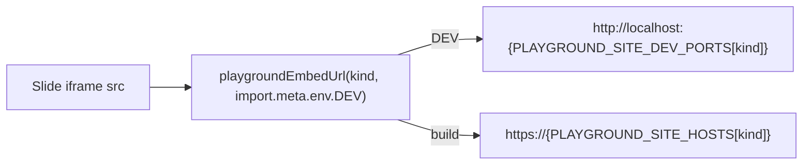

# 33.Projektage Reveal Presentation

## Goal
A new reveal.js deck at `mit-bestand/präsentation/33.projektage`, built like the current playground static sites (NOT like the outdated, gitignored `temp/eg-ice-25`). Uses `@ui/react` components + `@ui/styling` tokens, embeds the CAD/2D/3D/5D playgrounds as iframes, and switches iframe URLs between local dev servers (dev) and public links (build).

## Decisions (from clarifications)
- Content: fresh styled scaffold (title + a few example slides showing `@ui/react` components and live playground iframes).
- Embeds: CAD, Puzzle 2D, Puzzle 3D, Puzzle 5D (no sketchpad).
- Public CNAME: `33.projekttage.zukunft-bau.mit-bestand.de`.
- Package/nx name (ASCII to keep `bun install` safe): `@mit-bestand/praesentation/projektage`. Folder stays exactly `mit-bestand/präsentation/33.projektage` as requested. Dev port: `6050`.

## How dev vs build URLs work
Single source of truth lives next to the existing prod hosts in [`ui/styling/vite-elements-assets.ts`](ui/styling/vite-elements-assets.ts) (already exports `PLAYGROUND_SITE_HOSTS`).

Dev ports already defined in the repo: cad `6020`, 2d `6012`, 3d `6013`, 5d `6014`.

## New files (under `mit-bestand/präsentation/33.projektage/`)
- `package.json` — name `@mit-bestand/praesentation/projektage`, `bundleKind: "application"`, scripts call `bun nx run …:{dev,build}`, deps `reveal.js` + `@types/reveal.js`, workspace deps `@ui/react`, `@ui/styling`, `vite`. Mirrors [`puzzle/2d/play/package.json`](puzzle/2d/play/package.json).
- `project.json` — nx `dev`/`build` targets via `bun ./script.ts …`, `PRAESENTATION_PROJEKTAGE_PORT=6050`. Mirrors [`puzzle/2d/play/project.json`](puzzle/2d/play/project.json).
- `script.ts` — `ScriptRouter` with `DevScript` (`runViteBunxDev`, portEnv `PRAESENTATION_PROJEKTAGE_PORT`, default `6050`) and `BuildScript` (vite build), using helpers from [`repo/lib/js/src/index.ts`](repo/lib/js/src/index.ts). Mirrors [`puzzle/2d/play/script.ts`](puzzle/2d/play/script.ts).
- `vite.config.ts` — `defineConfig` reusing exports from [`ui/styling/vite-elements-assets.ts`](ui/styling/vite-elements-assets.ts): `base: "./"`, `elementsAssetsVitePlugin(ui/assets)`, `tailwindcss()`, `react()`, `playgroundIframeEmbedHeadersPlugin()`, `playgroundStaticSiteBuildOptions()`, alias `@ui/react` → `ui/react/index.tsx`. (Lighter than `createPlaygroundPlayViteConfig`, which carries puzzle/renderer-only aliases.)
- `index.html` — `<meta http-equiv="Content-Security-Policy" content="frame-ancestors *">`, `#root`, `<script type="module" src="./main.tsx">`. Mirrors [`cad/js/renderer/play/index.html`](cad/js/renderer/play/index.html).
- `main.tsx` — React entry that builds the `.reveal > .slides > section` DOM with JSX, calls `new Reveal(...).initialize()`, imports `reveal.js/dist/reveal.css` + `./globals.css`. Region-structured (`🔖Embeds`, `🔖Slides`, `🔖Boot`). Slides use `@ui/react` components and `<iframe src={playgroundEmbedUrl("2d", import.meta.env.DEV)} …>` for each embed. Includes inline `import.meta.vitest` smoke tests for `playgroundEmbedUrl` (dev→localhost, build→public host), per the repo's "extend, don't add test files" rule.
- `globals.css` — `@import "../../../ui/react/globals.css";` + `@source` lines + a small block mapping reveal CSS vars (`--r-background-color`, `--r-main-font`, `--r-main-color`, `--r-link-color`, …) to semio tokens. Mirrors [`cad/js/renderer/play/globals.css`](cad/js/renderer/play/globals.css).
- `public/CNAME` — `33.projekttage.zukunft-bau.mit-bestand.de`.
- `public/.nojekyll` — empty.

## Edits to existing files
- [`ui/styling/vite-elements-assets.ts`](ui/styling/vite-elements-assets.ts): inside `🔖ViteElementsAssets`, add `PLAYGROUND_SITE_DEV_PORTS` (`{ semio:4000, cad:6020, "2d":6012, "3d":6013, "5d":6014 }`) and `playgroundEmbedUrl(kind, isDev)` returning the dev `http://localhost:<port>` or `https://<PLAYGROUND_SITE_HOSTS[kind]>`. Keeps hosts + ports + URL logic in one place.
- [`package.json`](package.json) (root `workspaces`): add `"mit-bestand/präsentation/*"` so `bun install` and `@ui/*` resolution work.
- [`.github/workflows/play-sites.yml`](.github/workflows/play-sites.yml): add matrix entry `{ project: "@mit-bestand/praesentation/projektage", dist: "mit-bestand/präsentation/33.projektage/dist" }` (same `index.html`/`.nojekyll`/`CNAME` verification step applies).
- [`.vscode/launch.json`](.vscode/launch.json): add a `3_dev` entry `🛠️dev📽️projektage` (`bun nx run @mit-bestand/praesentation/projektage:dev`, `PRAESENTATION_PROJEKTAGE_PORT=6050`, `serverReadyAction` opening `http://localhost:6050`) and a `4_build` entry, following existing grouping/order.

## Repo process (per AGENTS.md/CLAUDE.md)
- Start execution by opening a ticket via repo MCP (`ticket_open`) associated with the most appropriate existing goal (read `repo://goals` first); keep any temp files inside the ticket folder; close with `ticket_close` and the file list when done.

## Verification
- `bun install` succeeds and resolves the new workspace.
- `bun nx run @mit-bestand/praesentation/projektage:dev` serves on `:6050`; deck renders with `@ui/react` styling; the 4 playground iframes load from `localhost` ports (confirm via console/network, not assumption).
- `bun nx run @mit-bestand/praesentation/projektage:build` produces `dist/` with `index.html`, `.nojekyll`, `CNAME`; built HTML references the public `play.*.semio-tech.com` iframe URLs.
- Inline vitest assertions for `playgroundEmbedUrl` pass.

## Out of scope
- Real slide content (scaffold only), actual DNS/Pages deployment wiring for the new CNAME, and initializing the `mit-bestand/recherche` submodule.