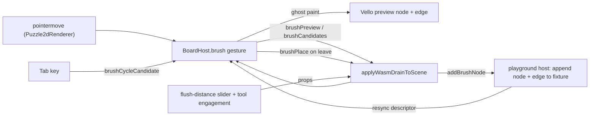

# Puzzle2d Brush Tool

## Behavior (confirmed)

- Paint-style: hovering a slot previews a node+edge; moving to another slot or out of range auto-flushes the previous preview into the fixture (commit-on-leave, like puzzle3d).
- When several node kinds are compatible, pick a random one initially; Tab / Shift+Tab cycles candidates.
- Flush distance is a per-window option (slider), default `2 x diameter` of the default node size (`PUZZLE_2D_PLAY_DEFAULT_NODE_SIZE_PX = 40` -> `80` world units).

## Geometry / definitions

- Slot = a free handle (visible, `!handle_has_incident_edge`).
- Slot hitbox = circle of radius = default node radius (`size/2 = 20`), centered at `handle_world_pos + outward_normal * flushDistance`, where `outward_normal = normalize(handle_world_pos - node_center)` (the "normal direction of the handle's parameter t"; in puzzle2d that parameter is the handle `angle`).
- Compatible node = a catalog node kind with >= 1 handle template link-compatible with the source handle (reuses the existing rule engine).
- Edge target = the compatible handle on the placed candidate node whose world position is closest to the source handle.

## Architecture decision

Implement the Brush in the Rust/WASM `BoardHost` (where selection, linking, dragging, hit-testing, handle geometry, and the compatibility engine already live), and render the ghost via the existing Vello paint pipeline. React/playground only forwards tool state + commits the placement to the fixture. The TS catalog serializer already sends node-kind `shape` + `handles` to WASM ([puzzle/2d/react/index.tsx](puzzle/2d/react/index.tsx) lines ~330-355); the Rust parser currently ignores them, so the core just needs to start reading fields the host already sends.

## 1. Rust WASM core — [puzzle/2d/rs/lib.rs](puzzle/2d/rs/lib.rs)

- Extend `NodeKindDef` (line ~2519) with `shape: NodeShape` and `handles: Vec<NodeKindHandleTemplate { handle_kind, angle, radius }>`; parse them in `set_board_kind_catalogs_from_json` nodeKinds loop (lines ~3277-3288).
- Add `enum ActiveTool { Select, Brush }` (default `Select`) on `BoardHost`; add `brush_flush_distance`, `brush_node_size` config fields.
- Add `struct BrushState { source_handle_id, candidate_node_kinds: Vec<String>, index, preview_node, preview_edge_target }`.
- Compatibility helper: add `link_kinds_compatible(src_node_kind, src_handle_kind, tgt_node_kind, tgt_handle_kind)` factored from `link_gesture_rule_applies` / `handles_link_compatible_for_drag` (lines ~3635-3685), resolving wire/edge kinds from a handle-kind string so it works for not-yet-existing candidate handles. Reuse `compat_pair_matches`.
- Brush gesture in the pointer-move path (gate `pointer_down/move/up` so Brush suppresses select/link/pan when active):
  - find nearest free handle whose offset hitbox contains the cursor (`handle_world_pos` line ~4163 + outward normal);
  - on slot change / out-of-range: emit `brushPlace` for the prior preview (paint commit), then recompute candidate node kinds (scan `node_kinds` with templates via `link_kinds_compatible`), random shuffle, index 0;
  - build preview: place node at hitbox center, synth handles from templates, choose closest compatible template as edge target;
  - emit `brushPreview` + `brushCandidates`, and paint a ghost node+edge in Vello (reuse node/edge paint with a reduced-alpha preview style).
- Add `brush_cycle_candidate(forward)`; rebuild preview, re-emit events.
- wasm-bindgen `BoardSession` API: `setActiveTool(label)`, `setBrushFlushDistance(world)`, `setBrushNodeSize(world)`, `brushCycleCandidate(forward)`.
- New events via `push_event`: `brushPreview` `{node, edge}`, `brushCandidates` `{sourceHandleId, candidates, index}`, `brushPlace` `{nodeKind, shape, x, y, radius/width/height, handles:[{angle,handleKind,radius}], sourceHandleId, targetHandleIndex}`.

## 2. React canvas — [puzzle/2d/react/index.tsx](puzzle/2d/react/index.tsx)

- Add `activeTool?: "select" | "brush"`, `brushFlushDistance?: number`, `brushNodeSize?: number`, `onBrushPlace?` to `Puzzle2dCanvasProps`; in `Puzzle2dRenderer` forward to `session.setActiveTool` / `setBrushFlushDistance` / `setBrushNodeSize`.
- Forward `Tab`/`Shift+Tab` keydown to `session.brushCycleCandidate` while brush active.
- Handle the three new events in `applyWasmDrainToScene` (switch ~~line 4449): `brushPreview`/`brushCandidates` -> emit to host; `brushPlace` -> call `onBrushPlace`. Add to `Puzzle2dEventMap` (~~line 779).
- Reuse `puzzle2dFixtureHandlesFromNodeKind` (line ~1753) when building the placement payload into fixture handles.

## 3. Playground host — [framework/product/playground/renderer/react/index.tsx](framework/product/playground/renderer/react/index.tsx)

- Add host state `puzzle2dActiveTool` + `puzzle2dBrushFlushDistance` (mirror `puzzle2dGridSnapEnabled`); pass `activeTool` / `brushFlushDistance` / `onBrushPlace` props to `<Puzzle2dCanvas>` (line ~2527).
- Extend `Puzzle2dPlayHostBridge.getToolbarState` + `runHostCommand` (line ~4065): `setActiveTool`, `setBrushFlushDistance`, and `addBrushNode` which `patchFixture` to append the node (with `puzzle2dFixtureHandlesFromNodeKind`) + the parent edge `{source, target}` (model on `appendCircle` line ~4093).
- Mirror brush candidates into the engagement possibles list when brush is active (like puzzle3d `brushPossibles`).

## 4. Play controller — [puzzle/2d/play/index.ts](puzzle/2d/play/index.ts)

- Add `Puzzle2dActiveTool = "select" | "brush"`; engagement possibles `puzzle2d.tool.brush` / `puzzle2d.tool.select` wired through `applyEngagementCommand` (line ~560) to `setActiveTool`.
- Add a flush-distance `WindowMeasure` slider (mirror puzzle3d `brushMeasures()`), id `${window}-brush-flush-distance`, `onChange -> setBrushFlushDistance`, included in `rebuildShellMode` (line ~615) alongside the existing LOD measure.

## 5. Window option default

Default flush distance `= 2 x PUZZLE_2D_PLAY_DEFAULT_NODE_SIZE_PX = 80`; slider range ~`[0, 4 x size]`. Hitbox radius defaults to the brush node radius (`size/2`).

## 6. Build, tests, validation

- Rebuild the puzzle2d wasm via the existing nx/launch task (no new script files; extend `script.ts` if a flag is needed).
- Extend existing tests only: Rust `#[cfg(test)]` in `lib.rs` (candidate compatibility, hitbox detection, closest-handle pick, `brushPlace` payload, tool gating); React/play tests in `puzzle/2d/react/index.tsx` and `puzzle/2d/play/index.ts` (tool toggle, flush-distance measure, `addBrushNode` fixture append). 
- Validate runtime with temporary `[DEBUG]` logs on `brushPreview`/`brushPlace` before removing them.

## Ticket

Open a repo ticket (`ticket_open`) associated with the most appropriate goal from `repo://goals`; keep all temp logs/scripts inside the ticket folder; close with `ticket_close` listing touched files.