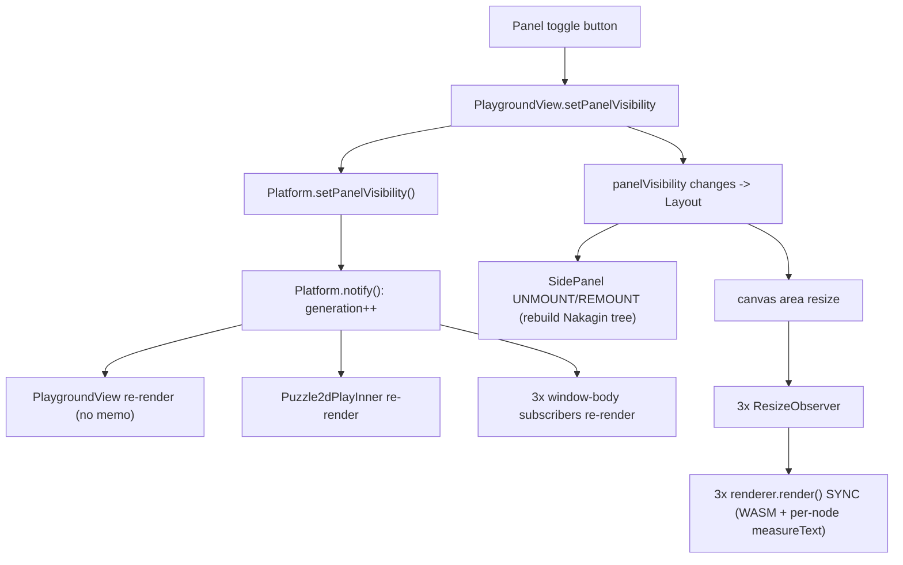

# Puzzle2d Performance Refactor

## Root cause (verified)

A pure UI panel toggle is wired to the global data-change channel, so it re-renders and redraws everything:

Single `generation` counter in [framework/core/index.ts](framework/core/index.ts) (`notify()` line 787, `setPanelVisibility` line 812) is shared by chrome, data, and every puzzle subscriber. A precedent ticket already split snapshot vs shell notify for selection; panel visibility was never migrated.

## Scope: full pass, multiple independent tickets

### Ticket 1 - `FRAMEWORK-SHELL-CHROME-NOTIFY-SPLIT` (framework/core)

Separate shell-chrome notifications from data notifications so chrome interactions never wake data subscribers.

- In [framework/core/index.ts](framework/core/index.ts) `Platform`: add a second channel `chromeGeneration` + `notifyChrome()` + `subscribeChrome()`, keeping `generation`/`notify()` for data/snapshot.
- Route chrome-only mutations through `notifyChrome()`: `setPanelVisibility` (line 812), `setActiveAppId` (807), active-mode changes, navigation/URI, panel sizes.
- Data subscribers (window bodies, puzzle canvases) keep subscribing to `generation`; the shell chrome subscribes to `chromeGeneration`.

### Ticket 2 - `PLAYGROUNDVIEW-RENDER-MEMOIZATION` (framework/product/playground/renderer/react)

Stop recomputing the world on every shell render in `PlaygroundView` ([framework/product/playground/renderer/react/index.tsx](framework/product/playground/renderer/react/index.tsx) lines 796-942).

- `useMemo` for `workbenchTabs`/`detailsTabs` (832-845), `mergedTools` (847), `footerItems` (861), `navbarItems` (869), `toolbarElement` (898).
- Stabilize the `PlaygroundContext.Provider` value (901-907) with `useMemo`.
- Fix `mergePanelTabs` (787-792) calling `resolveSidePanelTabSource` twice per tab; resolve once.
- Cache `sideTabsToPlaygroundPanelTabs` output (663-683) and the augment `resolveTab()` results.

### Ticket 3 - `SIDEPANEL-HIDE-WITHOUT-UNMOUNT` (ui/react)

Hide side panels via CSS instead of conditional unmount so heavy trees persist across toggles.

- In `Layout` ([ui/react/index.tsx](ui/react/index.tsx) ~2276-2282), render `SidePanel` always and toggle visibility with `hidden`/`display:none` instead of `visible && <SidePanel/>`.
- Verify `Tree`/document/inspector content (Nakagin tree) is no longer rebuilt on toggle.

### Ticket 4 - `PUZZLE2D-CANVAS-RESIZE-BATCH` (puzzle/2d/react)

Make canvas resize redraws async, coalesced, and skip-when-unchanged.

- In `Puzzle2dCanvas` `applySize`/`ResizeObserver` ([puzzle/2d/react/index.tsx](puzzle/2d/react/index.tsx) ~8529-8554): replace synchronous `renderer.render()` with `renderer.invalidate()` (rAF-coalesced), and early-return when width/height are unchanged.
- Reduce the `<html>` `MutationObserver` invalidation storm (~8448-8452) by filtering to relevant attribute changes.
- Cache `paintTextOverlays` font/measure results keyed by content+size (4288-4355) so resize doesn't re-measure every node.

### Ticket 5 - `PUZZLE-SCENE-SYNC-ALLOC` (puzzle/2d/react, with 3d/5d parallels)

Cut per-sync O(N) allocation and full `JSON.stringify` in the WASM bridge.

- In `syncPuzzle2dScene` (~7728-7844) and `descriptorJsonForWasmHost` (~3753-3857): diff and push only changed entities instead of rebuilding all nodes/handles/edges/wires + stringify every sync.

### Ticket 6 - `SHELL-PERF-PROPAGATION` (puzzle 3d/5d + platform)

Apply the chrome-split + memoization patterns beyond puzzle 2d.

- `Puzzle5dPlayChrome`/`usePuzzle5dPlaySnapshot` and `Puzzle2dPlayInner` (`shellGeneration`, line 2890) subscribe to `chromeGeneration` where appropriate.
- Mirror Ticket 2 memoization in `PlatformView` ([framework/product/platform/renderer/react/index.tsx](framework/product/platform/renderer/react/index.tsx) ~3073+) and confirm 3d/5d canvases use the Ticket 4 resize pattern.

## Validation

- Confirm runtime behavior with `[DEBUG]` logs counting renders/redraws per toggle (rules require runtime confirmation, not assumption).
- Extend existing vitest files in each touched package (no new test files) to cover: chrome notify does not bump data `generation`; `PlaygroundView` memo stability; `Layout` keeps panels mounted when hidden; resize coalescing.
- Manual: panel toggle should be visually instant; verify in the puzzle 2d play app.
