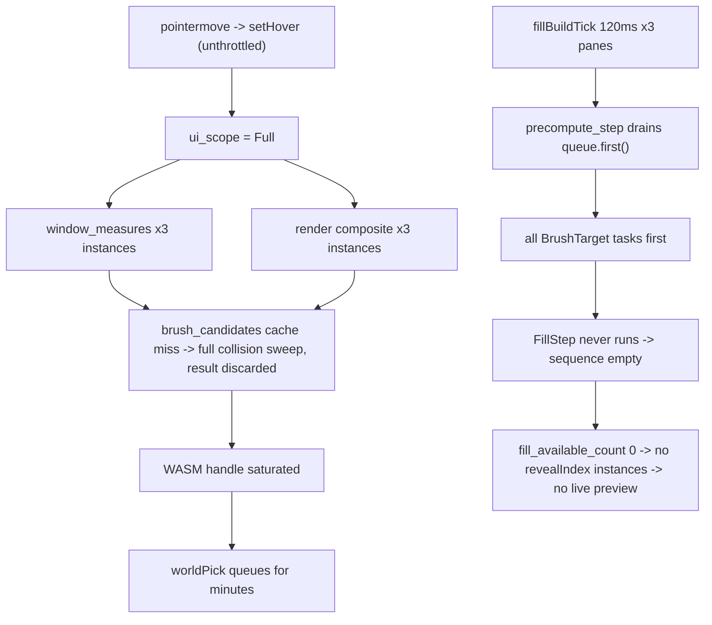

# Puzzle 3D: Fill Preview and Selection Latency

## Diagnosis

Both symptoms share one cause: an unbounded Monte-Carlo collision sweep (`compute_brush_cache_entry` -> `brush_collision_free`, 1024 samples per candidate/placed pair) is reachable from three places it must never be reachable from, and the fill lane is starved behind it.

Confirmed sites:

- Queue ordering: `rebuild_queue` (engine `lib.rs:1232`) pushes every `BrushTarget` before all 1000 `FillStep`s; `precompute_step` (engine `lib.rs:1487`) is strict FIFO.
- Unbounded single task: `PUZZLE3D_PRECOMPUTE_STEP_BUDGET_MS = 12.0` is only checked *between* tasks (`if steps_done > 0 && ...`), so one task is uncapped; `solid_overlap_volume` (engine `lib.rs:686`) is called with a hardcoded 1024 samples per candidate/placed pair with no broad phase beyond per-call `world_bounds`.
- Collision on the read path: `brush_candidates` (engine `lib.rs:1780`) and `brush_preview_json` (engine `lib.rs:1461`) fall back to `compute_brush_cache_entry` on a cache miss and discard the result.
- Unconditional call: `puzzle3d_brush_utility_options` (ui `lib.rs:3448`) reads candidates whatever the active utility; `puzzle3d_brush_target_vortex` (ui `lib.rs:2901`) resolves off `hovered_object_id`.
- Scope: `setHover`/`worldPick`/`worldSelect`/`worldVortexHover` all leave `ui_scope = UiDirtyScope::Full` (ui `lib.rs:3729`).
- Unthrottled hover: `handleInstancePointerMove` (react `index.tsx:15177`) dispatches per R3F pointermove with no dedupe.
- Plan destruction: `register_mesh` (engine `lib.rs:1336`) always `rebuild_queue()`s, replacing `self.fill` with a fresh `FillBuilder`; each of the three panes owns its own `registeredBrushMeshesRef`, so every GLB registers three times.
- Hot-path cloning: `fill_progress()` (engine `lib.rs:1202`) clones `sequence` + `appended_objects` + `appended_attractions` and serializes them, and `world_interaction_json` (ui `lib.rs:1091`) plus `puzzle3d_fill_count_measure` (ui `lib.rs:3363`) each call it per pane per render just to read four scalars.

## Changes

### 1. Engine: split the precompute queue into lanes

In [engine lib.rs](✏️s/🔌plugin/🧩puzzle/🎛️app/🧊3d/🔨module/⚙️engine/⚡️implementation/🦀rust/📦lib.rs), replace `queue: Vec<PrecomputeTask>` with explicit lanes (`brush_queue: VecDeque<String>`, `fill_pending: usize`) and give `precompute_step` a lane argument so `fillBuildTick` advances only fill and `suggestionsTick` advances only brush. Neither lane can starve the other.

### 2. Engine: make a single task respect the wall clock

Thread a deadline into `brush_collision_free` and `fill_step_one`. When it expires mid-candidate, persist a resume cursor on the cache entry, mark `unknown_pending: true`, and leave the target enqueued. Add a per-scene broad phase (world AABBs for `placed` computed once in `rebuild_queue`, not per pair inside `solid_overlap_volume`).

### 3. Engine: reads never compute

`brush_candidates` and `brush_preview_json` become pure cache reads returning a pending marker on a miss. Add `enqueue_brush_target(&mut self, ...)` for the tick path to schedule work explicitly.

### 4. Engine: mesh registration preserves the plan

`register_mesh` no longer calls `rebuild_queue()`. It replaces the body, re-enqueues affected brush targets, and calls `soft_replan_fill_tail()` so `applied_count` and the planned prefix survive. Track whether a url holds a fallback box or a real GLB so a repeat real registration is a no-op.

### 5. Engine: cheap progress readout

Split `fill_progress()` into a scalar `fill_progress_summary()` (`count`, `appliedCount`, `maxCount`, `done`) used by the hot path, keeping the full payload behind a separate accessor.

### 6. UI: gate brush options and narrow dirty scopes

In [puzzle3d ui lib.rs](✏️s/🔌plugin/🧩puzzle/🎛️app/🧊3d/🔨module/🖱️ui/⚡️implementation/🦀rust/📦lib.rs):

- `puzzle3d_brush_utility_options` only reads candidates when `envelope.active_utility == "brush"`, and only from cache.
- Add `puzzle3d_viewport_scope()` and `puzzle3d_selection_scope()` alongside the existing `puzzle3d_*_scope` helpers; use them for `setHover`, `worldPick`, `worldSelect`, `setSelection`, `clearSelection`, `selectAll`, `worldVortexHover`, `worldVortexSelect` instead of the default `Full`.
- `world_interaction_json` and `puzzle3d_fill_count_measure` switch to the scalar summary.
- Memoize `compose_fill_display` output per (plan revision, available_count) so three panes rendering the same frame do not each clone and serialize the whole fixture.

### 7. React host: coalesce hover

In [react renderer index.tsx](🧰framework/🛍️product/💻os/🔨module/📺renderer/🧑‍🎨engine/⚛️react/⚡️implementation/🟦typescript/📦index.tsx), add a latest-value coalescing dispatcher next to `createInFlightSkippingInterval` in the same region, and use it for `setHover` / `worldVortexHover`: drop a dispatch when the id is unchanged, and keep at most one in flight. Hoist `registeredBrushMeshesRef` to a module-level set so split panes do not re-register the same GLB.

## Verification

- Extend the existing `#[cfg(test)] mod tests` in both Rust files (no new test files): fill planning makes progress within N steps on a scene with many brush targets; `precompute_step` honours the budget for one heavy task; `register_mesh` preserves `applied_count` and the planned prefix; cold-cache `brush_candidates` returns pending without computing; `setHover`/`worldPick` emit a partial scope; the reveal-tagged fill tail appears in every window instance's composite body.
- Add coalescer tests beside the existing `createInFlightSkippingInterval` tests.
- Runtime confirmation with `[DEBUG]` logs: fill `count` climbing while the fill tool is active, `revealIndex` instances present in all three panes, and click-to-highlight latency.
