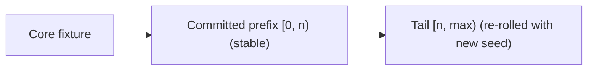

# Puzzle3d Fill Slider Re-roll

## Current behavior

- Entering Fill captures the current fixture as the core (`fillBaseCaptureRef`) and calls `preparePuzzle3dFillSession(base, ...)` in [puzzle/3d/play/index.ts](puzzle/3d/play/index.ts), which builds ONE deterministic stochastic `sequence` / `appendedObjects` / `appendedAttractions` from a single random `seed`.
- The slider routes through `onFillCount` in [framework/product/playground/renderer/react/index.tsx](framework/product/playground/renderer/react/index.tsx) -> controller `setFillCount` -> `applyPuzzle3dFillCount(n)`, which always returns `core + appendedObjects.slice(0, n)`.
- So sliding down already keeps the core and removes the tail, but sliding back up re-reveals the exact same pieces because the precomputed sequence is fixed.

## Desired behavior (confirmed)

- Sliding down: keep core + the still-shown prefix `[0, n)` stable; the removed tail `[n, prev)` is discarded.
- The removed tail is re-rolled with a NEW seed (built on top of the now-committed prefix so it still fits / respects collisions), so a subsequent up-slide shows different pieces drawn from the same weighted distribution.

## Design

Treat the prefix that stays visible as a "committed" segment, and only re-roll the part beyond it.

On every slider DECREASE to `n`:
1. Truncate the committed segment to length `n` (`appendedObjects/appendedAttractions/sequence` sliced to `n`).
2. Restart the chunked fill build from `buildBase = core + committed[0, n)` using a fresh seed, treating committed objects as seed objects so they are never moved.
3. Tail placements are appended after committed, so `appendedObjects = committed ++ freshTail` and `applyPuzzle3dFillCount(n)` keeps working unchanged.

Because builds are already chunked/cancellable, repeated decreases during a drag just keep lowering the committed floor and cheaply restarting the tail build.

## Changes

### 1. `puzzle/3d/play/index.ts` (fill session region ~lines 369-569)
- Refactor the body of `preparePuzzle3dFillSession` (line 433) into a shared internal starter, e.g. `startPuzzle3dFillBuild(core, committedSequence, committedObjects, committedAttractions, seed, kindCatalogs, kindCompatibility, overlapBudget)` that:
  - sets `puzzle3dFillSessionRef.current` immediately with `baseFixture = core` and the committed arrays (so the currently shown count stays valid synchronously),
  - initializes `puzzle3dFillBuildProgressRef.current.count = committed.length` (NOT 0) so the cap effect does not yank the slider below `n`,
  - builds `buildBase = applyBrushFillPlacementsToFixture(core, committedSequence, kindCatalogs)` and runs the existing worker / main-thread chunked stepper against `buildBase` with the new seed, prepending committed to each chunk's `appendedObjects/appendedAttractions/sequence`.
- `preparePuzzle3dFillSession` becomes `startPuzzle3dFillBuild(core, [], [], [], newSeed, ...)`.
- Add `export function rerollPuzzle3dFillTail(committedCount, kindCatalogs, kindCompatibility, overlapBudget)` that reads the current session, slices committed arrays to `committedCount`, generates a new seed, cancels any in-flight build (`cancelPuzzle3dFillBuild`), and calls `startPuzzle3dFillBuild` with the committed prefix.
- `applyPuzzle3dFillCount` (line 545) is unchanged (still prefix-slices `appendedObjects`).

### 2. `framework/product/playground/renderer/react/index.tsx` (`onFillCount` ~line 1671)
- Import `rerollPuzzle3dFillTail` alongside the existing fill-session imports (~line 1532).
- In `onFillCount`, capture `prev = fillCount` before updating; after dispatching `setFillCount`, if `n < prev`, call `rerollPuzzle3dFillTail(n, kindCatalogs, kindCompatibility, snap.brushPlacementOverlapBudget)` so the tail beyond the new floor is re-generated.
- Verify the cap effect (lines 1702-1718) and auto-start effect (lines 1683-1701) stay correct given progress.count is seeded to the committed length on re-roll (no spurious cap-down, and `fillAutoStartedRef` already true so count is not reset to 1).

### 3. Tests (extend existing `import.meta.vitest` blocks, no new files)
- In [puzzle/3d/play/index.ts](puzzle/3d/play/index.ts) fill tests: build a session to N, capture `appendedObjects`, call `rerollPuzzle3dFillTail(K)` for `K < N`, drive the build to done, then assert: committed prefix `appendedObjects.slice(0, K)` is byte-identical (origins/orientations/ids) and the regenerated tail differs from the original tail (new seed), and `applyPuzzle3dFillCount(K)` still yields exactly core + K.

## Notes
- Per repo rules: open a ticket via repo MCP (read `repo://goals` first), keep temp logs under the ticket folder with `[DEBUG]` prefixes, structure new code inside existing regions, and close the ticket when done.
- Only puzzle3d is in scope; the analogous puzzle2d fill path is left unchanged.